# Appendix A: Debugging PCIe Traffic with LeCroy Tools / 附录A：使用LeCroy工具调试PCIe流量

> **来源：** MindShare PCI Express Technology 3.0
> **PDF页码：** 976–992 (共17页)
> **格式：** 中英文段落对照 (Chinese-English Parallel)

---

## Overview / 概述

This appendix describes the use of LeCroy tools for debugging PCI Express traffic in both pre-silicon (simulation) and post-silicon (hardware) environments. The primary tool covered is the PETracer protocol analyzer application.

> 本附录描述使用LeCroy工具在流片前（仿真）和流片后（硬件）环境中调试PCI Express流量。主要工具为PETracer协议分析仪应用。

---

## Pre-silicon Debugging / 流片前调试

### RTL Simulation Perspective

In pre-silicon development, RTL simulations provide visibility into all internal signals. PCI Express RTL Bus Monitors can capture TLPs, DLLPs, and ordered sets for analysis. RTL vector export allows feeding simulation traces into the PETracer application for the same analysis environment used in post-silicon debug.

> 在流片前开发中，RTL仿真提供了对所有内部信号的可视性。PCI Express RTL Bus Monitor可捕获TLP、DLLP和有序集进行分析。RTL向量导出允许将仿真跟踪输入PETracer应用，使用与流片后调试相同的分析环境。

---

## Post-silicon Debug / 流片后调试

Three primary hardware debugging tools are discussed:

1. **Oscilloscope** — for analog signal integrity analysis (eye diagrams, jitter, amplitude)
2. **Protocol Analyzer** — for capturing and decoding PCIe traffic (TLPs, DLLPs, ordered sets)
3. **Logic Analyzer** — for digital signal analysis and multi-bus correlation

> 讨论了三种主要硬件调试工具：
> 1. **示波器** — 用于模拟信号完整性分析（眼图、抖动、幅度）
> 2. **协议分析仪** — 用于捕获和解码PCIe流量（TLP、DLLP、有序集）
> 3. **逻辑分析仪** — 用于数字信号分析和多总线关联

---

## Viewing Traffic Using the PETracer Application / 使用PETracer应用查看流量

### CATC Trace Viewer

The CATC Trace Viewer provides a hierarchical, color-coded display of captured PCIe transactions, showing TLPs, DLLPs, and ordered sets with timing information. Users can filter by transaction type, direction, or address.

> CATC Trace Viewer提供捕获PCIe事务的分层彩色显示，展示TLP、DLLP和有序集及时间信息。用户可按事务类型、方向或地址过滤。

### LTSSM Graphs

The LTSSM graph view displays the state machine transitions over time, allowing quick identification of training issues, unexpected state transitions, or excessive retraining events.

> LTSSM图形视图显示随时间变化的状态机转换，允许快速识别训练问题、意外状态转换或过度重训练事件。

### Flow Control Credit Tracking

FC credit tracking shows available credits for each VC and FC type over time, helping to identify flow control bottlenecks or credit leaks.

> FC信用追踪显示每个VC和FC类型随时间变化的可用信用量，帮助识别流量控制瓶颈或信用泄漏。

---

## Key Figures / 关键图示

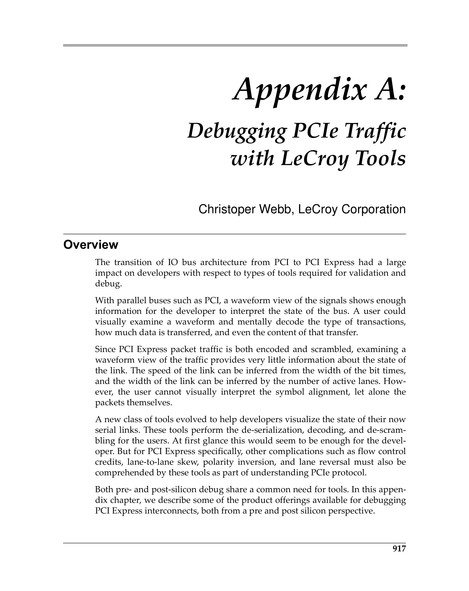
 <em>Figure from appA (p.976) / appA插图 (p.976)</em>

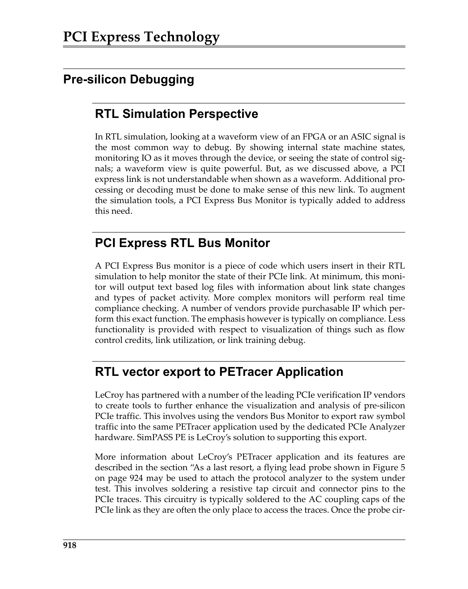
 <em>Figure from appA (p.977) / appA插图 (p.977)</em>

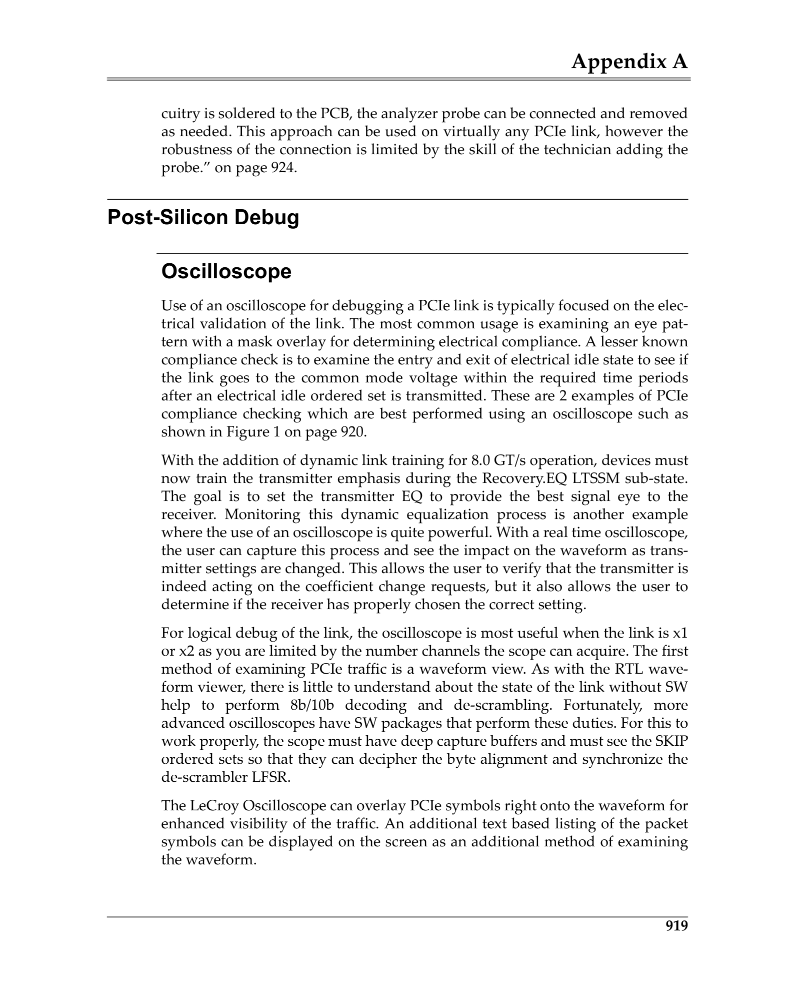
 <em>Figure from appA (p.978) / appA插图 (p.978)</em>

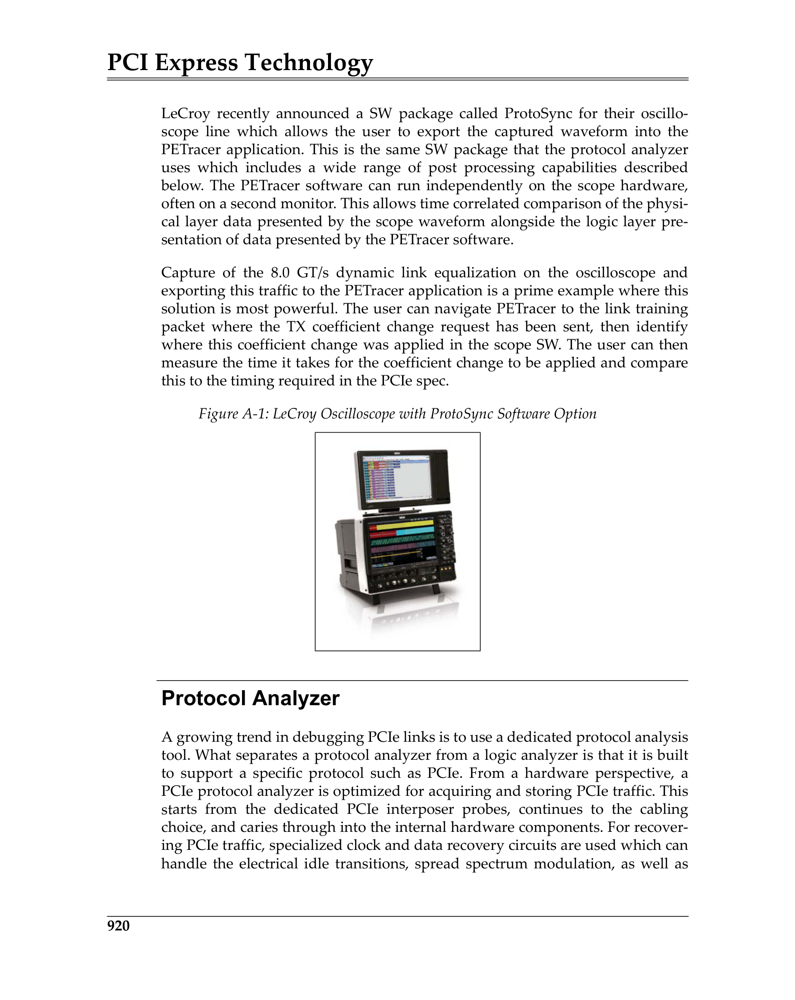
 <em>Figure from appA (p.979) / appA插图 (p.979)</em>

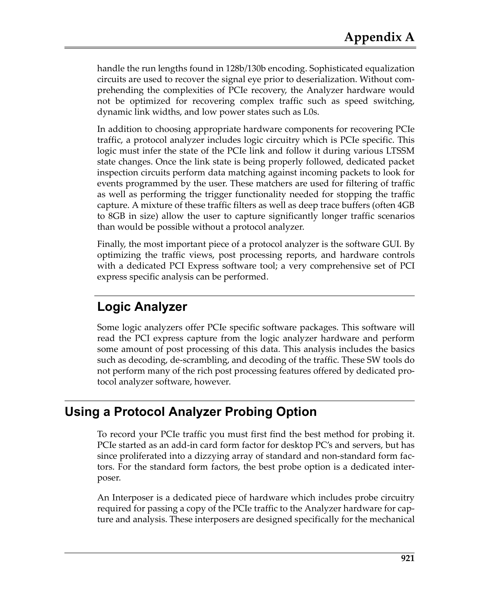
 <em>Figure from appA (p.980) / appA插图 (p.980)</em>

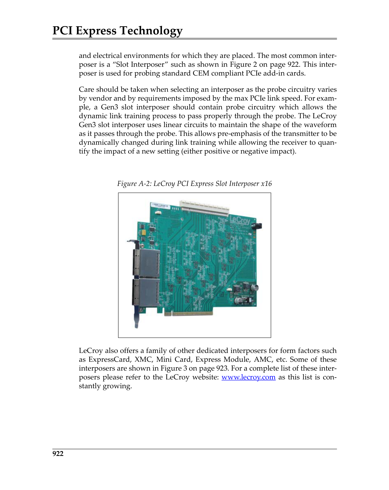
 <em>Figure from appA (p.981) / appA插图 (p.981)</em>

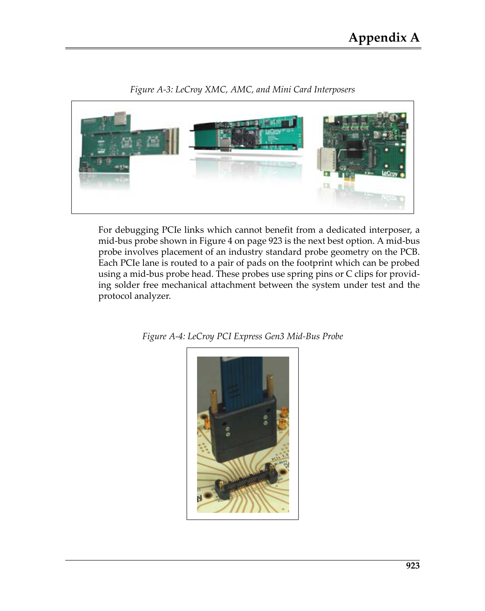
 <em>Figure from appA (p.982) / appA插图 (p.982)</em>

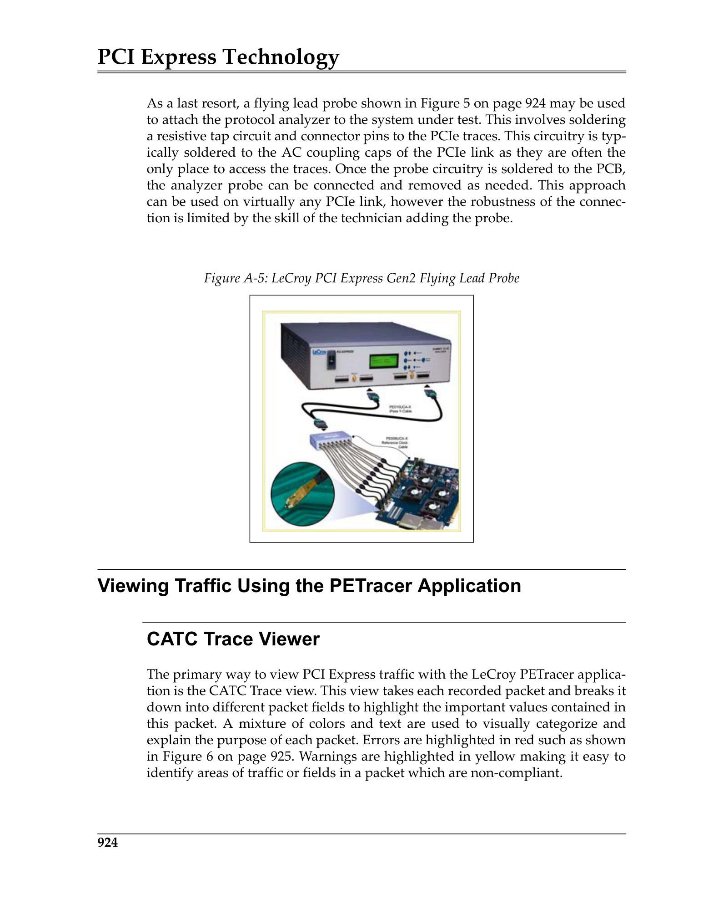
 <em>Figure from appA (p.983) / appA插图 (p.983)</em>

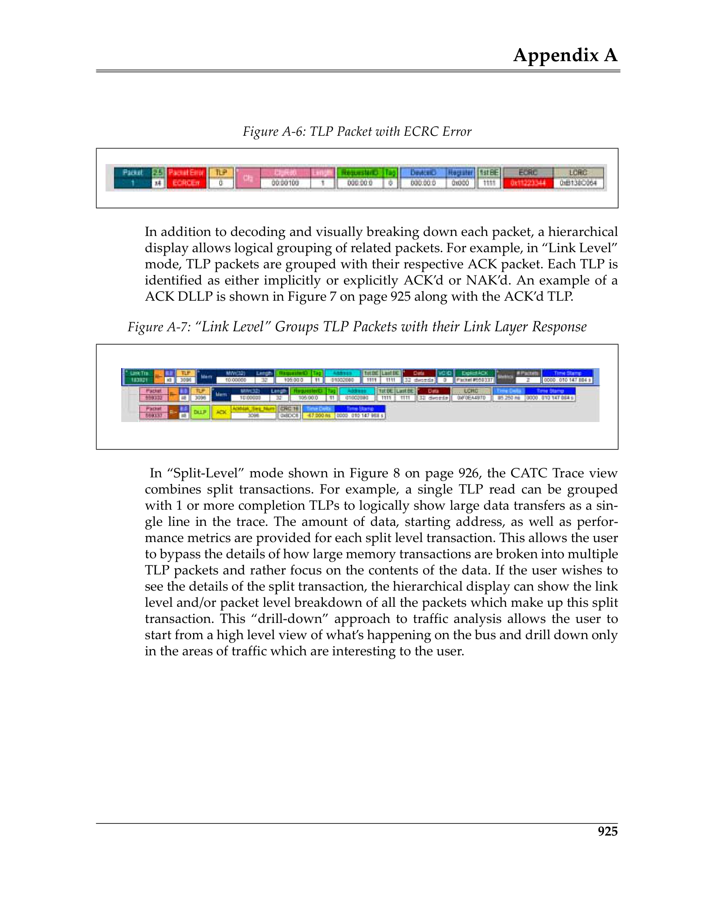
 <em>Figure from appA (p.984) / appA插图 (p.984)</em>

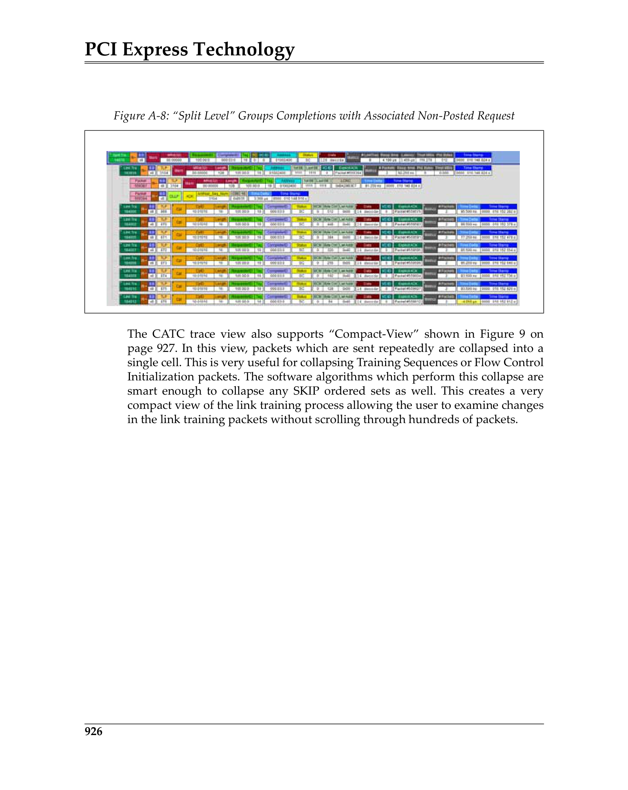
 <em>Figure from appA (p.985) / appA插图 (p.985)</em>

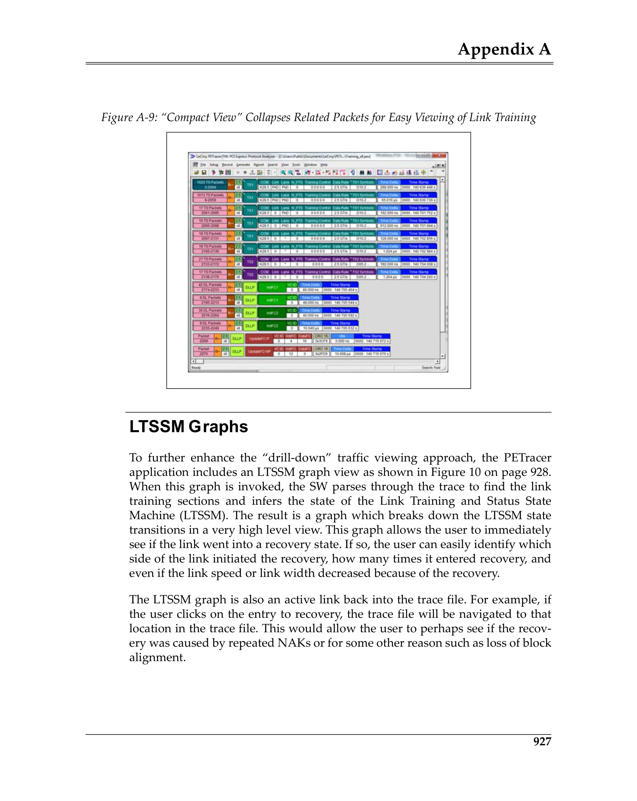
 <em>Figure from appA (p.986) / appA插图 (p.986)</em>

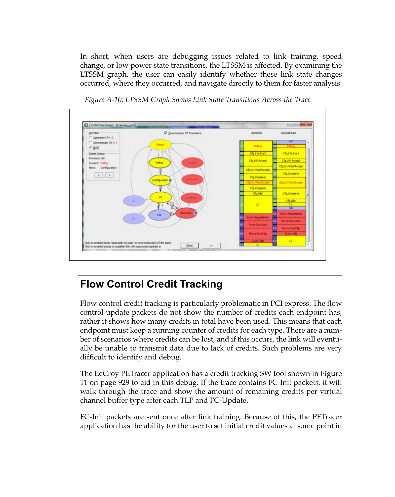
 <em>Figure from appA (p.987) / appA插图 (p.987)</em>

---

## Traffic Generation / 流量生成

**Pre-Silicon:** RTL testbenches with constrained-random or directed test generation.
**Post-Silicon:** Exerciser cards and PTC (Protocol Test Card) cards that generate programmable PCIe traffic patterns.

> **流片前：** 具有约束随机或定向测试生成的RTL测试台。
> **流片后：** Exerciser卡和PTC（Protocol Test Card）卡，生成可编程的PCIe流量模式。
