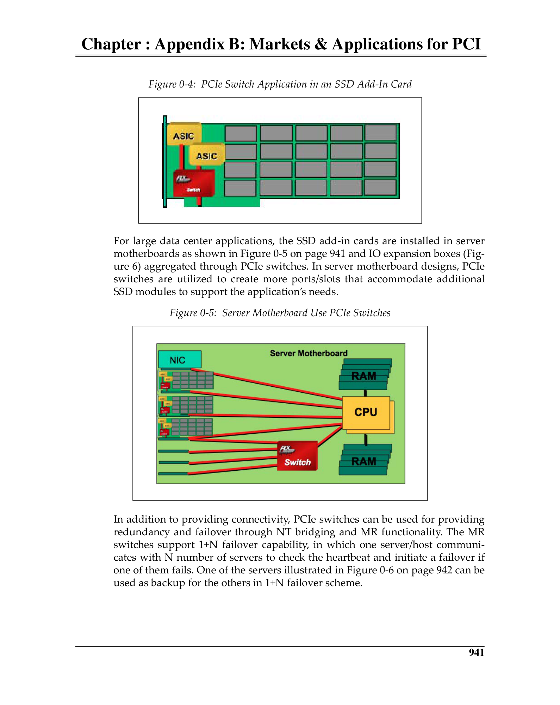
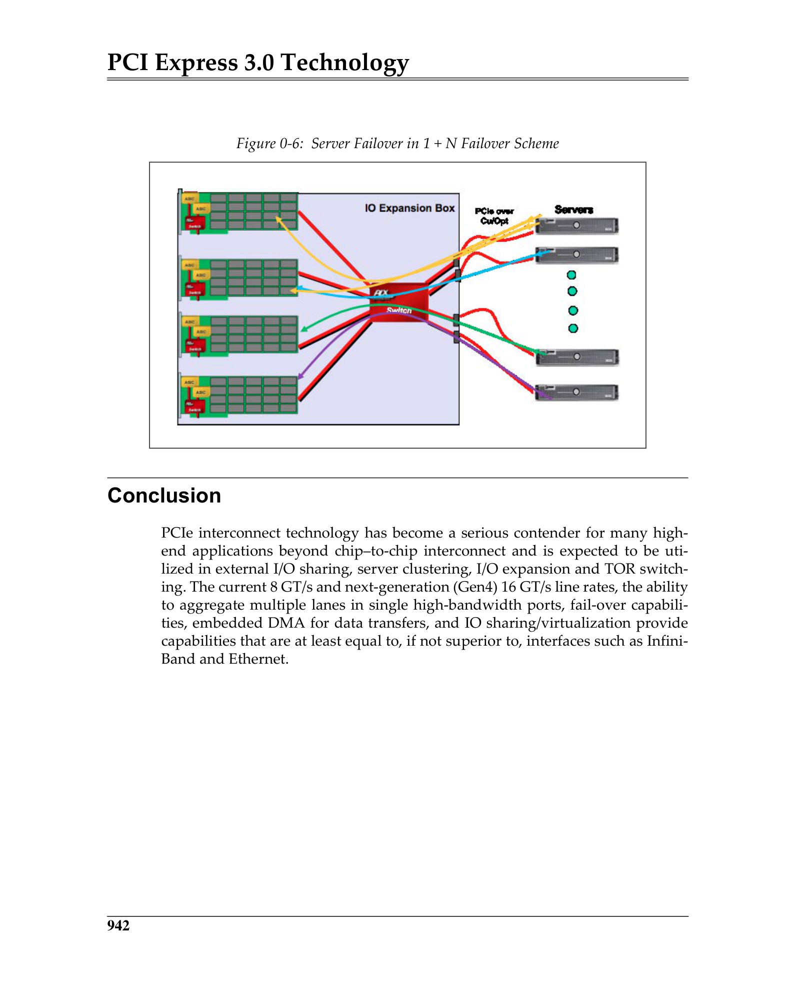
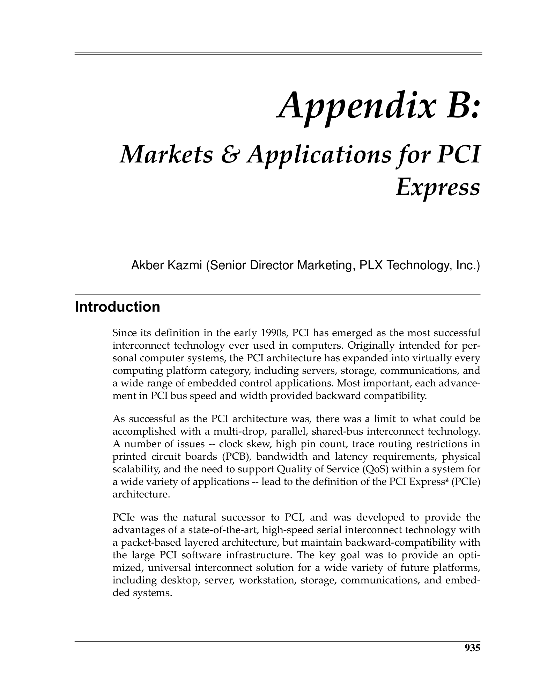
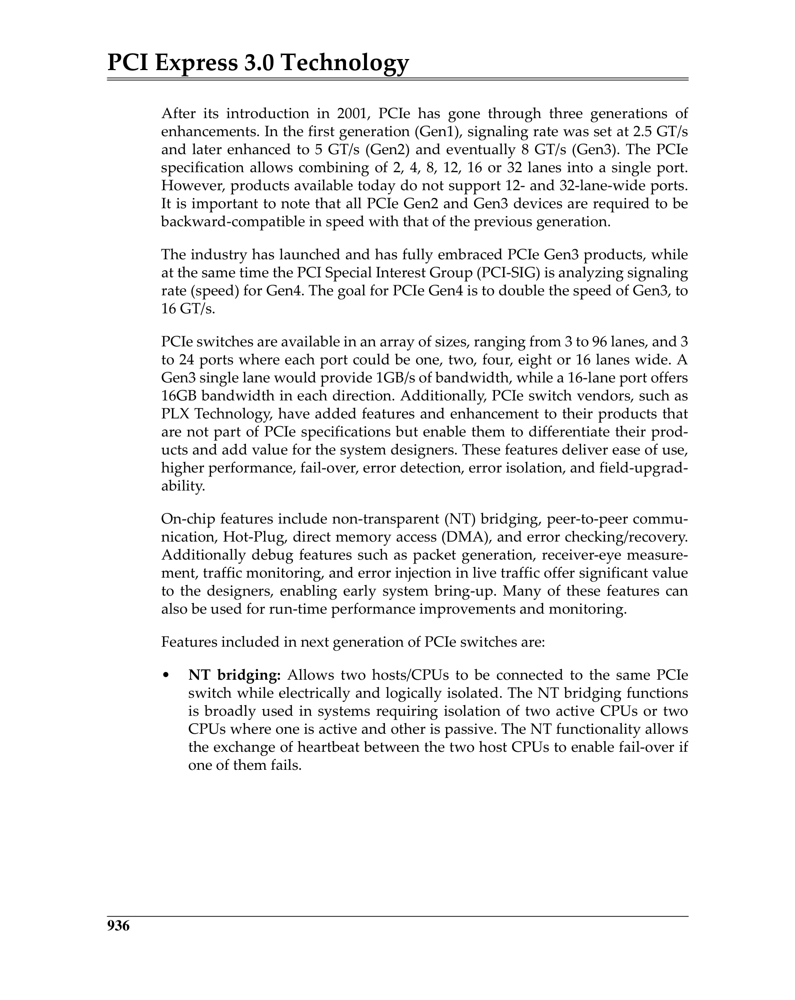
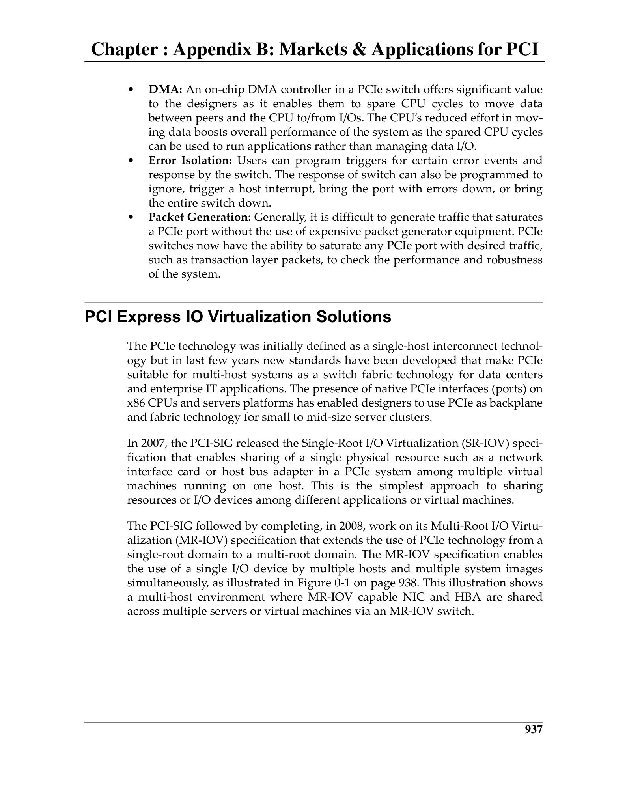
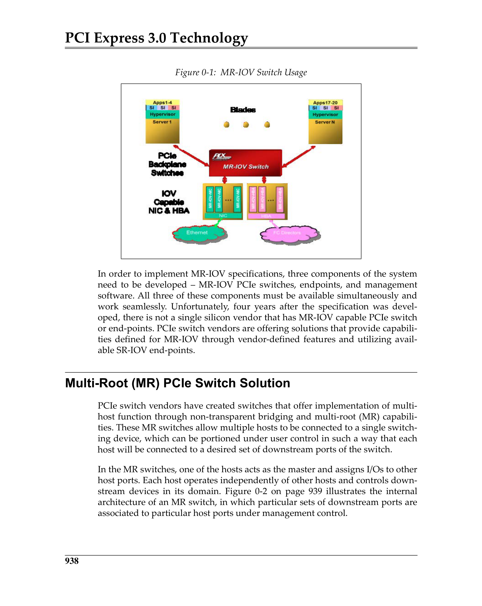
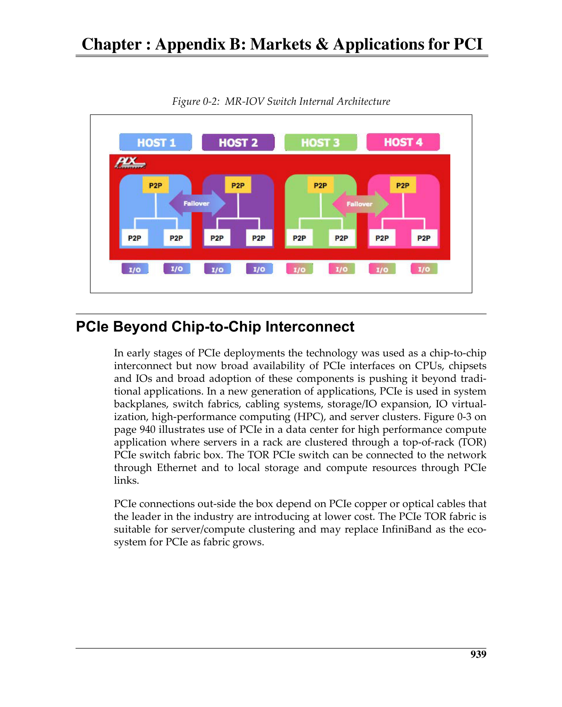
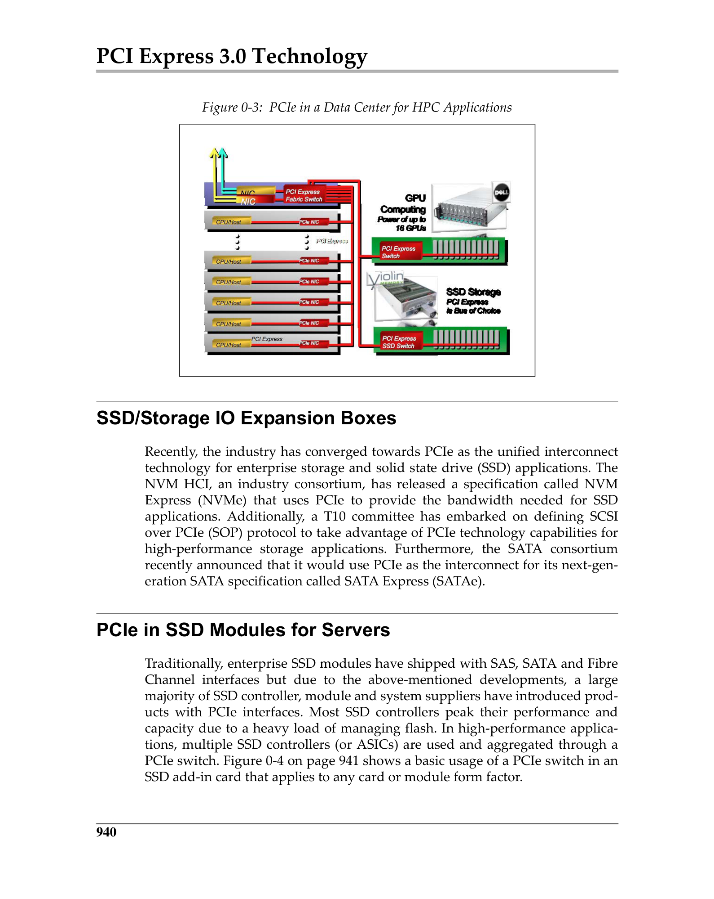

# Appendix B: Markets & Applications for PCI Express / 附录B：PCI Express的市场与应用

> **来源：** MindShare PCI Express Technology 3.0
> **PDF页码：** 994–1001 (共8页)
> **格式：** 中英文段落对照 (Chinese-English Parallel)

---

## Introduction / 引言

This appendix explores various market segments and applications for PCI Express beyond traditional desktop/server I/O. Key application areas include I/O virtualization, multi-root switching, chip-to-chip interconnects, and solid-state storage.

> 本附录探讨PCI Express在传统桌面/服务器I/O之外的各种市场细分和应用。关键应用领域包括I/O虚拟化、多根交换、芯片间互连和固态存储。

---

## PCI Express IO Virtualization Solutions / PCIe I/O虚拟化解决方案

I/O virtualization allows multiple operating systems (or virtual machines) to share a single physical PCIe device. Two main approaches:
- **SR-IOV (Single Root IOV)** — Provides native PCIe mechanisms for a single Physical Function (PF) to expose multiple lightweight Virtual Functions (VFs), each assigned to a different VM
- **MR-IOV (Multi-Root IOV)** — Extends SR-IOV across multiple Root Complexes, allowing multiple independent hosts to share a single PCIe device hierarchy

> I/O虚拟化允许多个操作系统（或虚拟机）共享单个物理PCIe设备。两种主要方法：
> - **SR-IOV（单根IOV）** — 为单个Physical Function (PF)提供原生PCIe机制，暴露多个轻量Virtual Function (VF)，各自分配给不同VM
> - **MR-IOV（多根IOV）** — 将SR-IOV扩展到多个Root Complex，允许多个独立主机共享单个PCIe设备层次结构

---

## Multi-Root (MR) PCIe Switch Solution / 多根PCIe交换解决方案

An MR-PCIe Switch contains multiple upstream ports, each connected to a different Root Complex. The switch partitions its downstream resources among the different hosts, providing hardware-enforced isolation between host domains.

> MR-PCIe Switch包含多个上游Port，每个连接到不同的Root Complex。Switch将其下游资源在不同主机间分区，提供硬件强制的主机域间隔离。

---

## PCIe Beyond Chip-to-Chip Interconnect / PCIe超越芯片间互连

PCIe is increasingly used as a fabric for system-level connectivity, including:
- **Cable-based PCIe** — Extending PCIe over cables for rack-level connectivity
- **PCIe as a backplane fabric** — Replacing proprietary interconnects in modular systems

> PCIe越来越多地用作系统级连接的结构，包括：
> - **基于线缆的PCIe** — 将PCIe通过线缆扩展用于机架级连接
> - **PCIe作为背板结构** — 在模块化系统中替代专有互连

---

## Key Figures / 关键图示

 <em>Figure from appB (p.1000) / appB插图 (p.1000)</em>

 <em>Figure from appB (p.1001) / appB插图 (p.1001)</em>

 <em>Figure from appB (p.994) / appB插图 (p.994)</em>

 <em>Figure from appB (p.995) / appB插图 (p.995)</em>

 <em>Figure from appB (p.996) / appB插图 (p.996)</em>

 <em>Figure from appB (p.997) / appB插图 (p.997)</em>

 <em>Figure from appB (p.998) / appB插图 (p.998)</em>

 <em>Figure from appB (p.999) / appB插图 (p.999)</em>

---

## SSD/Storage IO Expansion Boxes / SSD/存储I/O扩展盒

PCIe is the dominant interface for high-performance solid-state storage:
- **NVMe** (Non-Volatile Memory Express) runs over PCIe, enabling direct-attached SSDs with microsecond latencies
- **PCIe SSD modules** for servers (e.g., M.2, U.2, EDSFF form factors)

> PCIe是高性能固态存储的主要接口：
> - **NVMe**（非易失性内存Express）在PCIe上运行，实现微秒级延迟的直连SSD
> - 服务器的**PCIe SSD模块**（如M.2、U.2、EDSFF形态）
