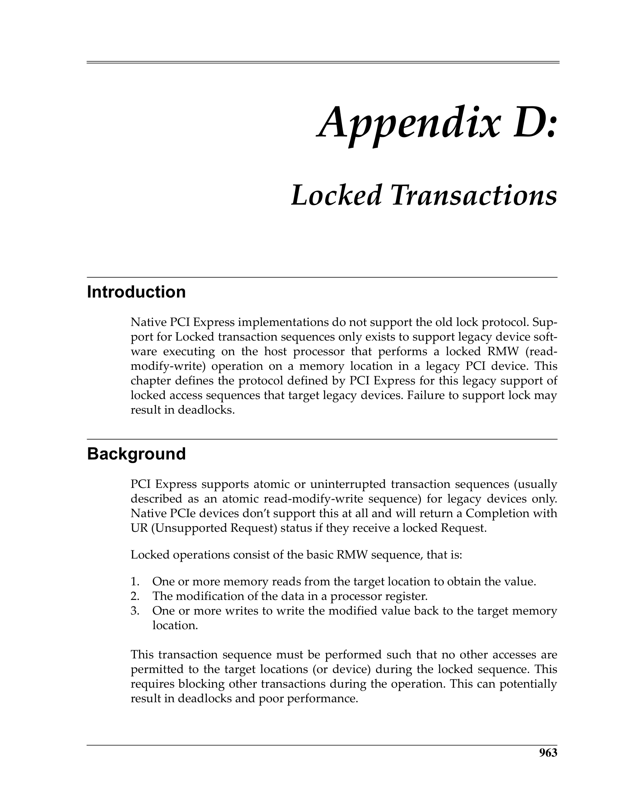
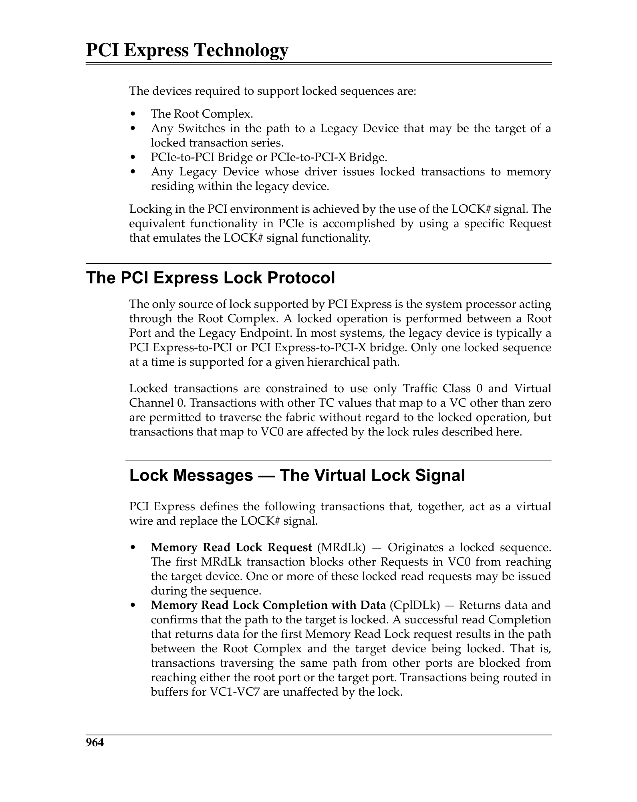
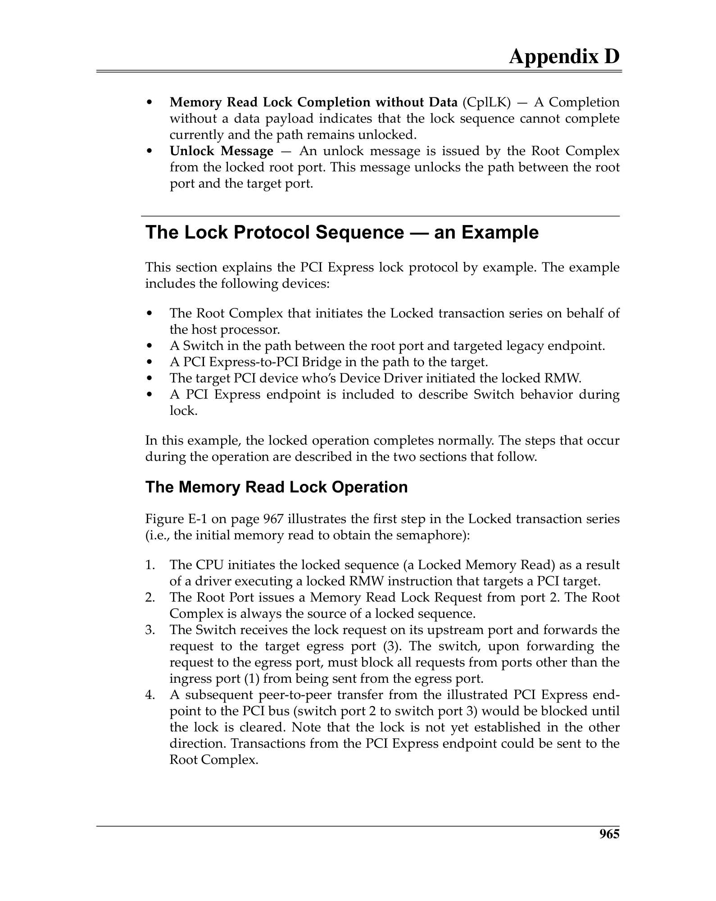
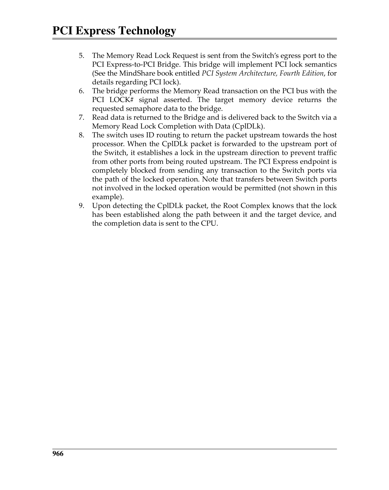
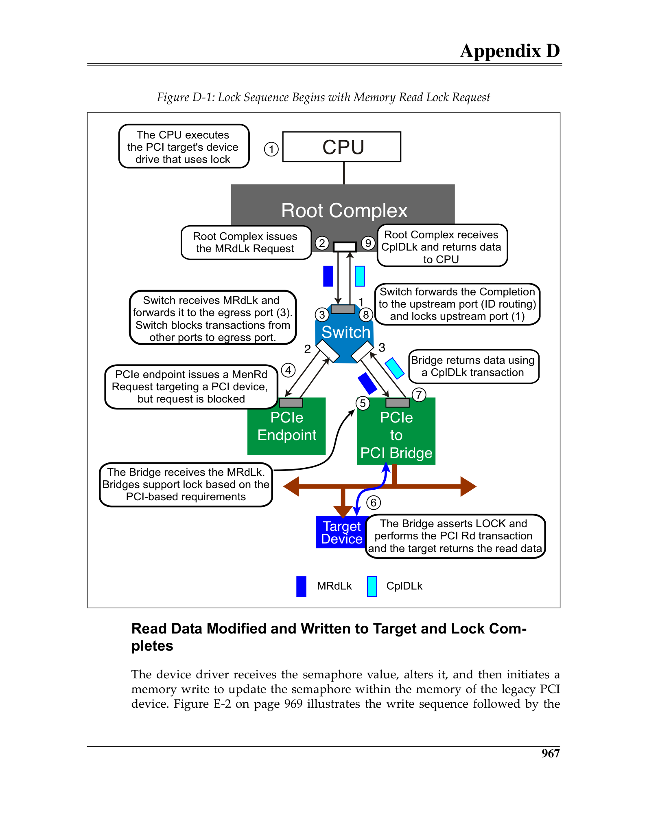
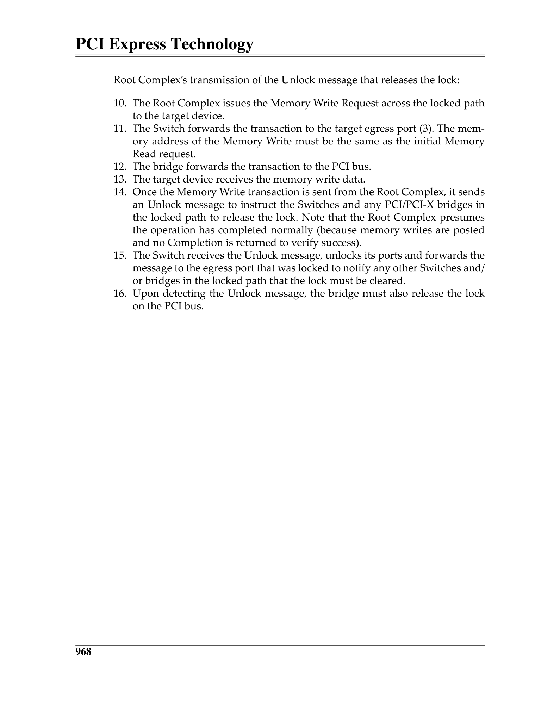
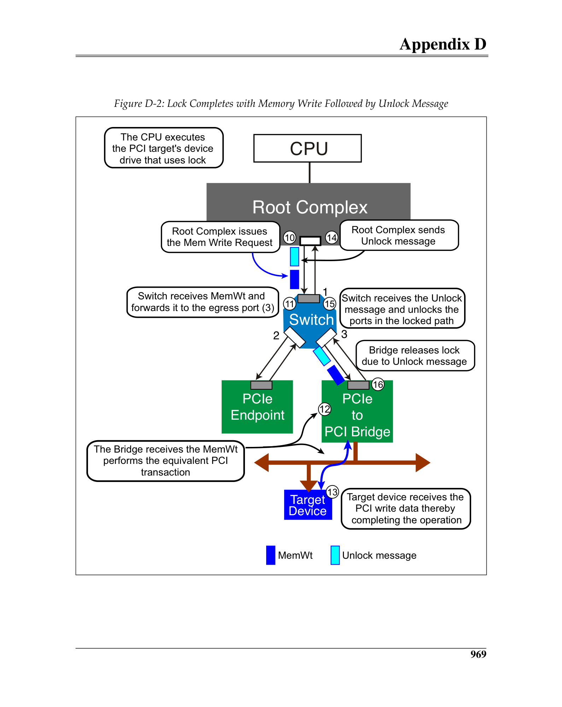
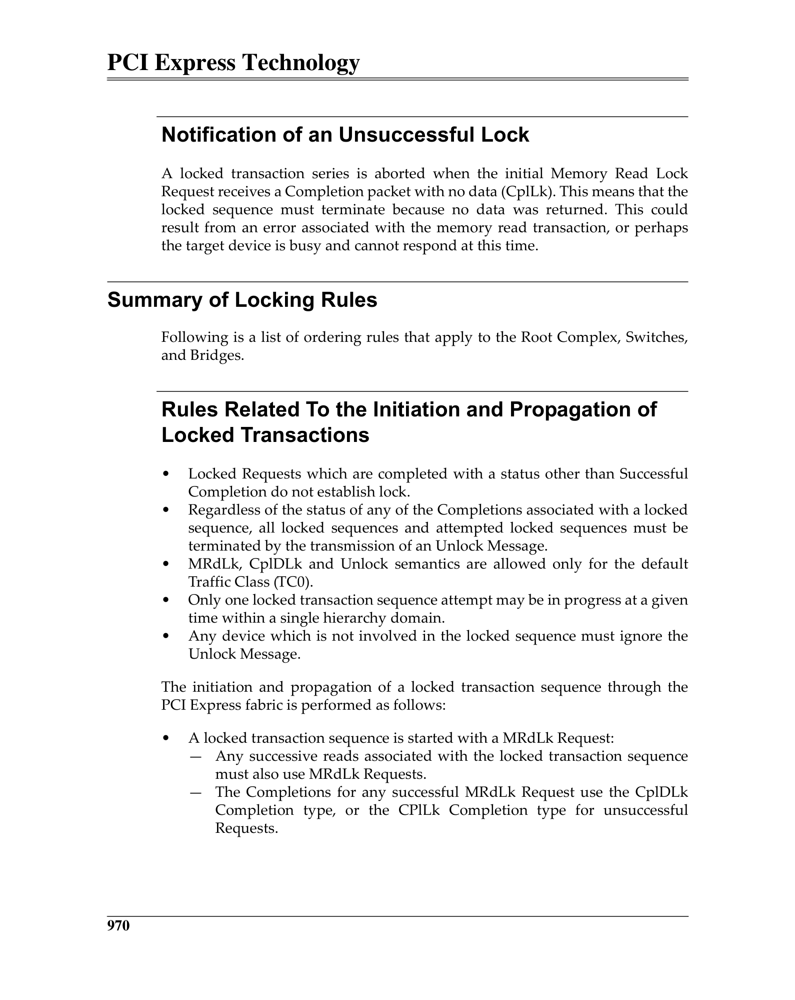
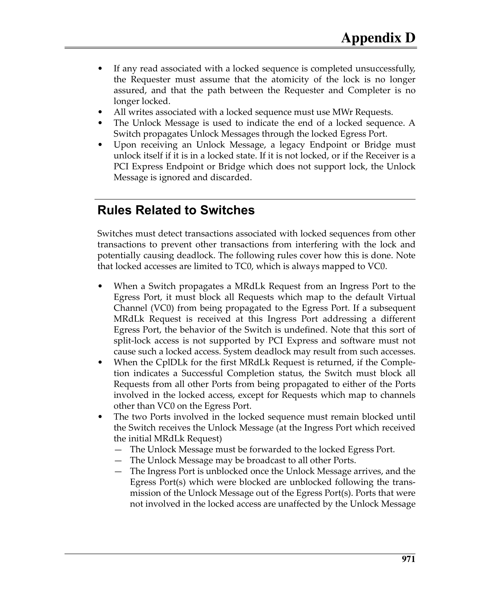
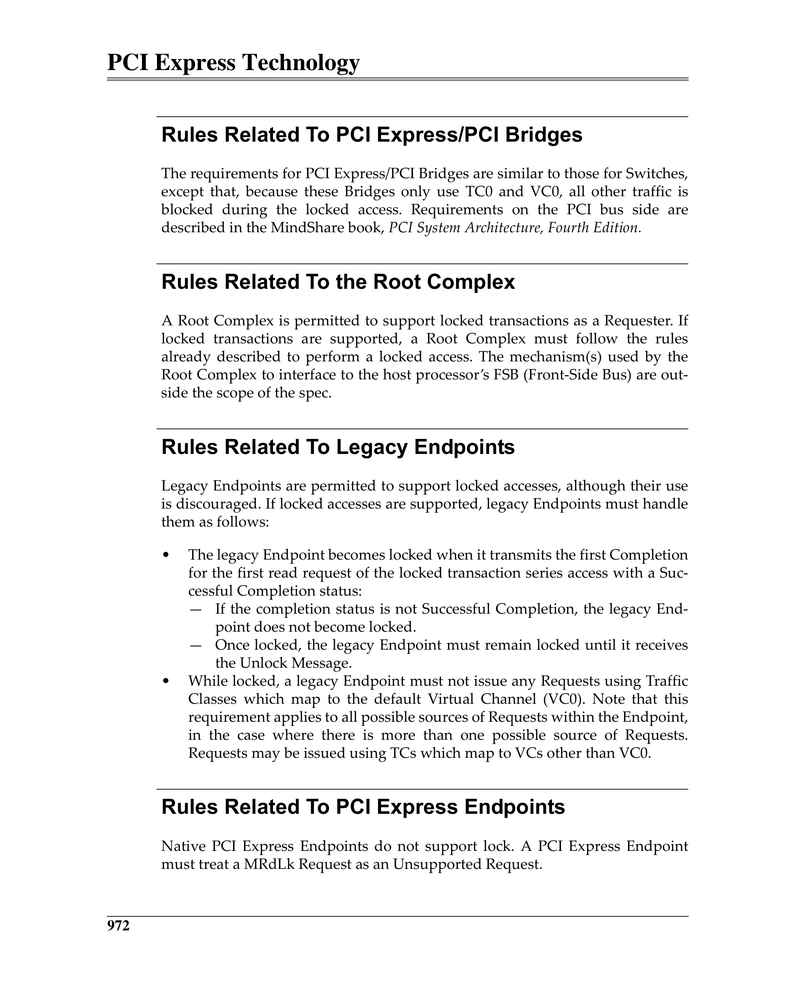

# Appendix D: Locked Transactions / 附录D：锁定事务

> **来源：** MindShare PCI Express Technology 3.0
> **PDF页码：** 1022–1031 (共10页)
> **格式：** 中英文段落对照 (Chinese-English Parallel)

---

## Introduction / 引言

Locked Transactions provide an atomic read-modify-write sequence over PCI Express, enabling legacy software that relies on PCI lock semantics to function correctly. The PCIe lock protocol uses **virtual lock signals** conveyed through Message TLPs rather than physical sideband signals.

> 锁定事务在PCI Express上提供原子读-改-写序列，使依赖PCI锁定语义的传统软件能正确运行。PCIe锁定协议使用通过Message TLP传递的**虚拟锁定信号**，而非物理边带信号。

---

## The PCI Express Lock Protocol / PCIe锁定协议

### Lock Messages — The Virtual Lock Signal

Two Message TLPs implement the lock protocol:
- **MEM_READ_LOCK (MRdLk)** — A Memory Read Request with the Lock bit set, signaling the start of a locked sequence
- **Unlock Message** — Sent to release the lock after the locked sequence completes

> 两个Message TLP实现锁定协议：
> - **MEM_READ_LOCK (MRdLk)** — Lock位置位的Memory Read Request，信号锁定序列的开始
> - **Unlock Message** — 在锁定序列完成后发送，释放锁定

### The Lock Protocol Sequence

1. Requester sends MRdLk targeting a locked address
2. Completer returns Completion with Data (CplD) — the address is now locked
3. Requester modifies the data and sends a Memory Write to the same address
4. Requester sends an Unlock Message to release the lock
5. If the lock cannot be acquired, the Completer returns a Completion with Unsupported Request (UR) status

> 1. 请求者发送MRdLk，目标为锁定地址
> 2. 完成者返回Completion with Data (CplD) — 地址现已被锁定
> 3. 请求者修改数据并发送Memory Write到同一地址
> 4. 请求者发送Unlock Message释放锁定
> 5. 若无法获取锁定，完成者返回Completion with Unsupported Request (UR)状态

---

## Key Figures / 关键图示

 <em>Figure from appD (p.1022) / appD插图 (p.1022)</em>

 <em>Figure from appD (p.1023) / appD插图 (p.1023)</em>

 <em>Figure from appD (p.1024) / appD插图 (p.1024)</em>

 <em>Figure from appD (p.1025) / appD插图 (p.1025)</em>

 <em>Figure from appD (p.1026) / appD插图 (p.1026)</em>

 <em>Figure from appD (p.1027) / appD插图 (p.1027)</em>

 <em>Figure from appD (p.1028) / appD插图 (p.1028)</em>

 <em>Figure from appD (p.1029) / appD插图 (p.1029)</em>

 <em>Figure from appD (p.1030) / appD插图 (p.1030)</em>

 <em>Figure from appD (p.1031) / appD插图 (p.1031)</em>

---

## Summary of Locking Rules / 锁定规则摘要

### Rules Related to the Initiation and Propagation of Locked Transactions

- Only a single outstanding MRdLk is permitted at any time per Hierarchy
- Locked transactions must not cross Switch boundaries that do not support lock
- Lock endpoints must complete the locked sequence within a bounded time to avoid deadlock

> - 每个Hierarchy中任何时候只允许一个未完成的MRdLk
> - 锁定事务不得跨越不支持锁定的Switch边界
> - 锁定端点必须在限定时间内完成锁定序列以避免死锁

### Rules Related to Switches

A Switch must track which Downstream Port has an active lock. While a lock is active on one Downstream Port, the Switch must block MRdLk requests to other Downstream Ports. Unlock Messages must be forwarded to the same port that received the MRdLk.

> Switch必须跟踪哪个Downstream Port有活跃锁定。当一个Downstream Port上有活跃锁定时，Switch必须阻止向其他Downstream Port的MRdLk请求。Unlock Message必须转发到接收MRdLk的同一Port。

### Rules Related to Legacy Endpoints and PCIe Endpoints

PCIe Endpoints that do not implement lock support must terminate MRdLk requests with Completion (UR) status. Legacy PCI Endpoints behind a PCIe-to-PCI bridge must support lock if they implement lockable resources.

> 未实现锁定支持的PCIe Endpoint必须以Completion (UR)状态终止MRdLk请求。PCIe-to-PCI桥后的传统PCI Endpoint若实现可锁定资源，则必须支持锁定。
