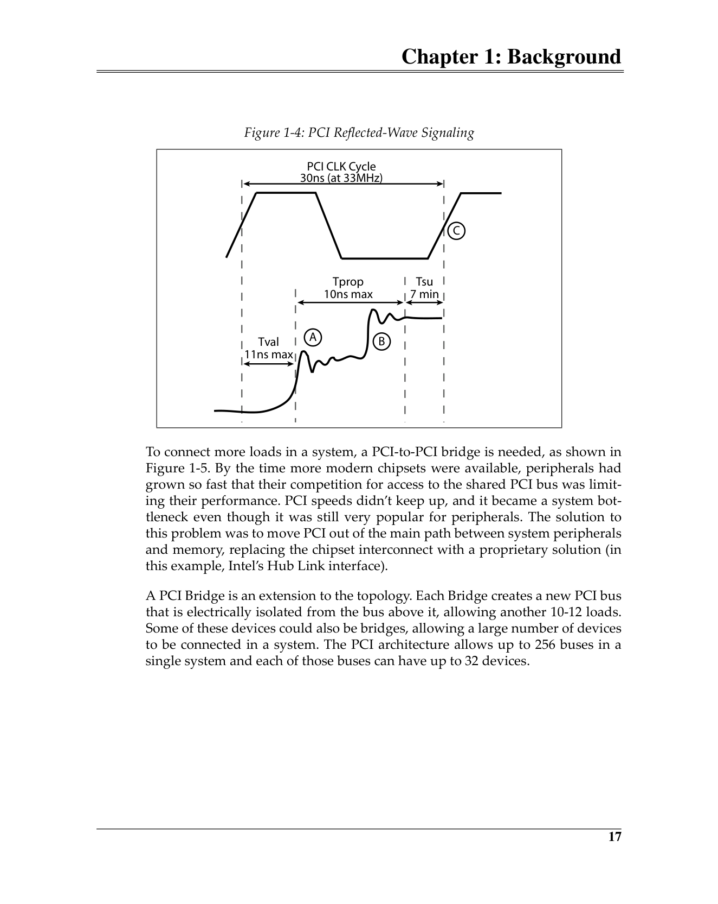
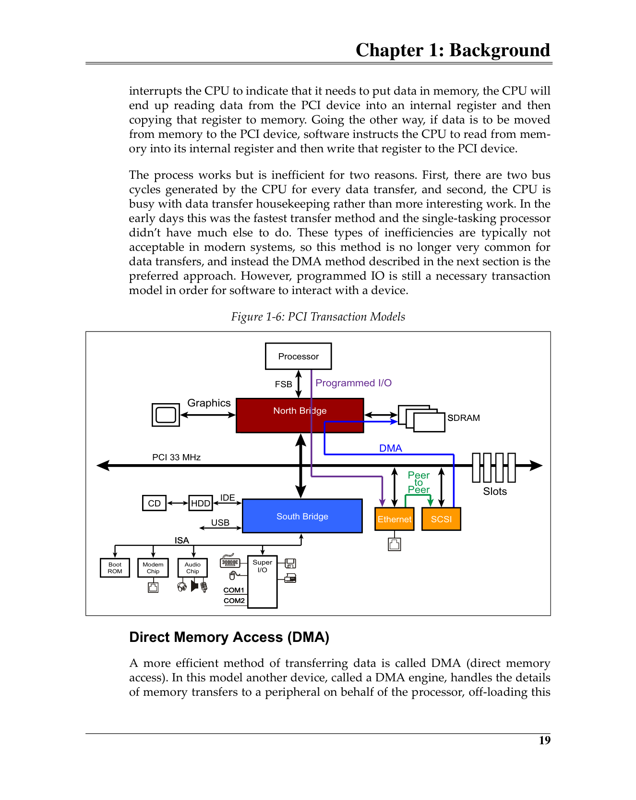

# Chapter 1: Background
# 第1章：背景知识

> 中英文对照翻译 | Chinese-English Parallel Translation
> Source: MindShare PCI Express Technology 3.0 — Comprehensive Guide to Generations 1.x, 2.x, 3.0
> Authors: Mike Jackson, Ravi Budruk | Pages: 68–97 (30 pages)
> 来源：MindShare PCI Express 技术 3.0 — 1.x、2.x、3.0代全面指南
> 作者：Mike Jackson, Ravi Budruk | 页码：68–97（共30页）

---

## 快速导航 | Quick Navigation

- [Introduction — 引言](#introduction)
- [PCI and PCI-X — PCI与PCI-X](#pci-and-pci-x)
- [PCI Basics — PCI基础](#pci-basics)
  - [Initiator and Target — 发起者与目标](#pci-bus-initiator-and-target)
  - [PCI Bus Cycle — PCI总线周期](#typical-pci-bus-cycle)
  - [Reflected-Wave Signaling — 反射波信令](#reflected-wave-signaling)
- [PCI Bus Architecture — PCI总线架构](#pci-bus-architecture-perspective)
  - [PIO / DMA / Peer-to-Peer](#pci-transaction-models)
  - [Bus Arbitration — 总线仲裁](#pci-bus-arbitration)
- [PCI Inefficiencies — PCI低效问题](#pci-inefficiencies)
  - [Retry Protocol — 重试协议](#pci-retry-protocol)
  - [Disconnect Protocol — 断开协议](#pci-disconnect-protocol)
- [Interrupt and Error Handling — 中断与错误处理](#pci-interrupt-handling)
- [Configuration Space — 配置空间](#pci-address-space-map)
- [Introducing PCI-X — PCI-X介绍](#introducing-pci-x)
- [术语附录 | Terminology Appendix](#术语附录-terminology-appendix)

---

## Introduction
## 引言

This chapter reviews the PCI (Peripheral Component Interface) bus models that preceded PCI Express (PCIe) as a way of building a foundation for understanding PCI Express architecture. PCI and PCI-X (PCI-eXtended) are introduced and their basic features and characteristics are described, followed by a discussion of the motivation for migrating from those earlier parallel bus models to the serial bus model used by PCIe.

> 本章回顾PCIe之前的PCI（外设组件互连）总线模型，为理解PCIe架构奠定基础。介绍PCI和PCI-X（PCI扩展）及其基本特性，然后讨论从早期并行总线模型迁移到PCIe所用串行总线模型的动机。

Establishing a solid foundation in the technologies on which PCIe is built is a helpful first step to understanding it. The software used for PCIe remains much the same as it was for PCI. Maintaining this backward compatibility encourages migration from the older designs to the new by making the software changes as simple and inexpensive as possible. As a result, older PCI software works unchanged in a PCIe system and new software will continue to use the same models of operation.

> 在PCIe所依赖的技术上打好坚实基础是理解它的有效第一步。PCIe使用的软件与PCI基本保持一致。保持这种向后兼容性，通过尽可能简单和廉价的软件变更，鼓励从旧设计迁移到新设计。因此，旧版PCI软件无需修改即可在PCIe系统中运行，而新软件将继续沿用相同的操作模型。

---

## PCI and PCI-X
## PCI与PCI-X

The PCI bus was developed in the early 1990's to address the shortcomings of the peripheral buses used in PCs at the time (ISA/AT bus). PCI was developed as an open standard by a consortium of major players in the PC market who formed the PCISIG (PCI Special Interest Group). The performance of the newly-developed bus architecture was much higher than ISA, and it also defined a new set of registers within each device referred to as **configuration space**. These registers allowed software to see the memory and IO resources a device needed and assign each device addresses that wouldn't conflict with others. These features — open design, high speed, and software visibility and control — helped PCI overcome the obstacles that had limited ISA and other buses.

> PCI总线于1990年代早期开发，旨在解决当时PC中外设总线的不足（ISA/AT总线）。PCI由PC市场主要厂商组成的联盟PCISIG（PCI特别兴趣组）作为开放标准开发。新总线架构的性能远高于ISA，还定义了每个设备内的一组新寄存器——**配置空间**。这些寄存器允许软件查看设备所需的内存和IO资源，并为每个设备分配不冲突的地址。开放设计、高速和软件可见性与控制——这些特性帮助PCI克服了限制ISA和其他总线发展的障碍。

A few years later, **PCI-X** (PCI-eXtended) was developed as a logical extension of the PCI architecture. A major design goal was maintaining compatibility with PCI devices, both in hardware and software. The PCI-X 2.0 revision added even higher speeds, achieving a raw data rate of up to 4 GB/s (QDR). Since PCI-X maintained hardware backward compatibility with PCI, it remained a parallel bus and inherited the problems associated with that model. Going to a higher data rate with PCI-X was explored but eventually abandoned by the PCISIG. That speed ceiling, along with a high pin count, motivated the transition from the parallel bus model to the serial bus model.

> 几年后，**PCI-X**（PCI扩展）作为PCI架构的逻辑延伸被开发出来。其主要设计目标是保持与PCI设备在硬件和软件上的兼容性。PCI-X 2.0修订版增加了更高速度，实现了高达4 GB/s（QDR）的原始数据速率。由于PCI-X保持了与PCI的硬件向后兼容性，它仍为并行总线，并继承了该模型的相关问题。PCISIG曾探索进一步提高PCI-X的数据速率，但最终放弃了。这一速度上限，加上高引脚数，推动了从并行总线模型向串行总线模型的转变。

**Table 1-1: Comparison of Bus Frequency, Bandwidth and Number of Slots | 表1-1：总线频率、带宽与插槽数对比**

| Bus Type | Clock | Peak Bandwidth (32/64-bit) | Slots per Bus |
|----------|-------|---------------------------|---------------|
| PCI | 33 MHz | 133–266 MB/s | 4–5 |
| PCI | 66 MHz | 266–533 MB/s | 1–2 |
| PCI-X 1.0 | 66 MHz | 266–533 MB/s | 4 |
| PCI-X 1.0 | 133 MHz | 533–1066 MB/s | 1–2 |
| PCI-X 2.0 (DDR) | 133 MHz | 1066–2132 MB/s | 1 (point-to-point) |
| PCI-X 2.0 (QDR) | 133 MHz | 2132–4262 MB/s | 1 (point-to-point) |

> 从表中可以看出两个关键趋势：(1) 随着时钟频率增加，共享总线上允许的设备数量减少；(2) 当PCI-X 2.0引入时，其高速率要求总线成为点对点互连。这预示着PCIe的全双工点对点串行互连架构的到来。

---

## PCI Basics
## PCI基础

### Basics of a PCI-Based System
### PCI系统基础

Figure 1-1 shows an older system based on a PCI bus. The system includes a **North Bridge** that interfaces between the processor and the PCI bus (processor bus, system memory bus, AGP graphics bus, and PCI). A **South Bridge** connects PCI to system peripherals (ISA bus, IDE, USB, etc.) and is typically the central resource for PCI that provides system signals like reset, reference clock, and error reporting.

> 图1-1展示了一个基于PCI总线的旧系统。系统包含**北桥**（North Bridge），它在处理器和PCI总线之间接口（处理器总线、系统内存总线、AGP图形总线和PCI）。**南桥**（South Bridge）将PCI连接到系统外设（ISA总线、IDE、USB等），通常是提供复位、参考时钟和错误报告等系统信号的PCI中心资源。

### PCI Bus Initiator and Target
### PCI总线发起者与目标

In a PCI hierarchy each device on the bus may contain up to eight functions (numbered 0–7). Every function is capable of acting as a target, and most will also be able to initiate transactions. Such an initiator — called a **Bus Master** — has a pair of pins (REQ# and GNT#) dedicated to arbitrating for use of the shared PCI bus. The arbiter decides which requester should be the next owner of the bus and asserts the Grant (GNT#) pin for that device.

> PCI层级中，总线上的每个设备最多可包含8个功能（编号0–7，单功能设备固定为功能0）。每个功能都能作为事务的目标，大多数还能发起事务。这种发起者——称为**总线主控（Bus Master）**——有一对引脚（REQ#和GNT#）专用于共享PCI总线的仲裁。仲裁器决定哪个请求者应成为总线的下一个拥有者，并为该设备断言Grant（GNT#）引脚。

### Typical PCI Bus Cycle
### 典型PCI总线周期

PCI is synchronous — events happen on clock edges. Key control signals:
- **FRAME#**: Driven by initiator to indicate a bus access is in progress / 由发起者驱动，指示总线访问正在进行
- **IRDY#** (Initiator Ready): Initiator is ready for data transfer / 发起者就绪
- **TRDY#** (Target Ready): Target is ready for data transfer / 目标就绪
- **DEVSEL#** (Device Select): Target claims the transaction / 目标声明本次事务
- **STOP#**: Target requests termination / 目标请求终止

> PCI是同步的——事件发生在时钟沿。关键控制信号如上（低电平有效，以#标示）。一次典型的PCI总线周期分为地址阶段（Address Phase）和多个数据阶段（Data Phase）。地址与数据信号是复用共享的（AD总线），命令与字节使能也是复用的（C/BE#总线）。当目标无法在规定时间内完成数据传输时，可插入**等待状态（Wait State）**——最多连续8个时钟延迟下一次数据传输。

 <em>Figure 1-3: Simple PCI Bus Transfer / 图1-3：简单的PCI总线传输</em>

### Reflected-Wave Signaling
### 反射波信令

PCI uses **reflected-wave signaling** to reduce power consumption. Devices implement weak transmit buffers that can only drive the signal to about half the voltage needed to switch the signal. The incident wave propagates down the transmission line, hits the unterminated end, reflects back, and the reflection additively increases the signal to full voltage. The total elapsed time (propagation + reflection + setup) must be less than the clock period.

> PCI使用**反射波信令（reflected-wave signaling）**降低功耗。设备实现弱发送缓冲器，只能将信号驱动到切换信号所需电压的一半左右。入射波沿传输线传播，到达未终结的末端后反射回来，反射波叠加使信号增加至全电压。总耗时（传播时间+反射延迟+建立时间）必须小于时钟周期。

As trace length and electrical loads increase, the round trip time increases. A 33 MHz PCI bus can only reliably operate with about 10–12 electrical loads (a populated connector slot counts as two loads). Thus a 33 MHz PCI bus supports at most 4–5 add-in card connectors. To connect more loads, a PCI-to-PCI Bridge is needed, creating a new PCI bus electrically isolated from the bus above it, allowing another 10–12 loads per bus (up to 256 buses in a single system).

> 随着走线长度和电气负载增加，往返时间增加。33 MHz PCI总线仅能在约10–12个电气负载下可靠运行（一个已安装连接器插槽计为两个负载）。因此33 MHz PCI总线最多支持4–5个插卡连接器。要连接更多负载，需使用PCI-to-PCI桥，创建与上方总线电气隔离的新PCI总线，每条总线可再支持10–12个负载（单系统最多256条总线）。

 <em>Figure 1-4: PCI Reflected-Wave Signaling / 图1-4：PCI反射波信令</em>

---

## PCI Bus Architecture Perspective
## PCI总线架构

### PCI Transaction Models
### PCI事务模型

**Programmed I/O (PIO):** The processor handles all data movement — reads data from the PCI device into an internal register, then writes that register to memory. Requires two bus cycles per data transfer and ties up the CPU. Still needed for software-to-device interaction.

**Direct Memory Access (DMA):** A DMA engine (or integrated Bus Master) handles the data transfer independently. The CPU only programs the starting address and byte count. Much more efficient — single bus cycle may move a block of data.

**Peer-to-Peer:** One PCI Bus Master initiates a transfer directly to another PCI device. The entire transaction remains local to PCI. Efficient in theory but rarely used in practice because the initiator and target seldom use the same data format unless both are from the same vendor.

> **编程IO（PIO）：** 处理器处理所有数据移动——从PCI设备读数据到内部寄存器，再将寄存器写入内存。每次数据传输需两个总线周期，且占用CPU。仍是软件与设备交互的必要模型。
>
> **直接内存访问（DMA）：** DMA引擎（或集成的总线主控）独立处理数据传输。CPU仅编程起始地址和字节数。高效——单次总线周期可移动一块数据。
>
> **对等传输（Peer-to-Peer）：** 一个PCI总线主控直接发起对另一个PCI设备的传输。整个事务保持在PCI本地。理论上高效但实践中很少用——发起者和目标通常不使用相同数据格式（除非同厂商）。

### PCI Bus Arbitration
### PCI总线仲裁

In a shared bus architecture, devices must take turns. A device wanting to initiate transactions must first request ownership from the bus arbiter via REQ#. The arbiter uses an implementation-specific (but "fair") algorithm to choose the next owner. The arbiter can grant ownership to the next requesting device while the previous Bus Master is still executing, so arbitration happens "behind the scenes" — **hidden bus arbitration**.

> 在共享总线架构中，设备必须轮流使用。想要发起事务的设备必须先通过REQ#向总线仲裁器请求总线所有权。仲裁器使用实现特定（但"公平"）的算法选择下一个拥有者。仲裁器可在前一个总线主控仍在执行时授予下一个请求设备所有权——因此仲裁"幕后"发生——**隐藏总线仲裁（hidden bus arbitration）**。

---

## PCI Inefficiencies
## PCI低效问题

### PCI Retry Protocol
### PCI重试协议

When a PCI master initiates a transaction and the target is not ready, the target signals a **retry** using STOP#. A retry tells the master to end the bus cycle prematurely without transferring data. This prevents the bus from being held for a long time in wait-states. The retried master waits a minimum of 2 clocks and must arbitrate again to re-initiate the identical bus cycle. Meanwhile, the arbiter can grant the bus to other requesting masters.

> 当PCI主控发起事务但目标未就绪时，目标使用STOP#信令**重试（retry）**。重试告诉主控提前结束总线周期而不传输数据，防止总线长时间处于等待状态。被重试的主控至少等待2个时钟，必须再次仲裁以重新发起相同总线周期。同时，仲裁器可将总线授予其他请求主控。

### PCI Disconnect Protocol
### PCI断开协议

If the target can transfer at least one doubleword but cannot complete the entire transfer, it **disconnects** the transaction using STOP#. A disconnect results in some data transferred (unlike retry). The disconnected master waits 2 clocks, re-arbitrates, and continues at the disconnected address.

> 如果目标至少能传输一个双字（DWORD）但无法完成全部传输，使用STOP#**断开（disconnect）**事务。断开导致部分数据传输（不同于重试）。被断开的主控等待2个时钟，重新仲裁后从断开地址继续。

---

## PCI Interrupt Handling
## PCI中断处理

PCI devices use one of four sideband interrupt signals (INTA#, INTB#, INTC#, or INTD#) to send interrupt requests. Single-CPU systems used an interrupt controller that asserted INTR to the CPU. Later multi-CPU designs adopted APIC (Advanced Programmable Interrupt Controller), sending a message to multiple CPUs instead. Regardless of the delivery model, an interrupted CPU must determine the interrupt source and service it — the legacy model required several bus cycles and wasn't very efficient.

> PCI设备使用四个边带中断信号（INTA#、INTB#、INTC#或INTD#）之一发送中断请求。单CPU系统使用中断控制器向CPU断言INTR。后来的多CPU设计采用APIC（高级可编程中断控制器），向多个CPU发送消息而非断言单线。无论哪种模型，被中断的CPU都必须确定中断源并服务它——传统模型需要多次总线周期，效率不高。

## PCI Error Handling
## PCI错误处理

PCI devices can optionally detect and report address and data phase parity errors during transactions using the PAR signal (even parity). If a device detects a data phase parity error, it asserts PERR#. This is potentially a recoverable error — for cases like a memory read, repeating the transaction may resolve the problem. PCI does not include automatic hardware-based recovery; error resolution is handled by software.

> PCI设备可选地检测和报告事务期间的地址和数据阶段奇偶校验错误，使用PAR信号（偶校验）。如果设备检测到数据阶段奇偶错误，它断言PERR#。这可能是可恢复的错误——对于内存读取等情况，重复事务可能解决问题。PCI不包含自动的基于硬件的恢复机制；错误解决由软件处理。

---

## PCI Address Space Map
## PCI地址空间映射

PCI defines three address spaces: **Memory**, **IO**, and **Configuration**. Memory space is the primary address space used by devices for data transfer. IO space is a legacy address space (x86 compatibility). Configuration space is the key innovation — a per-device register space that software uses for discovery and resource assignment.

> PCI定义了三种地址空间：**内存（Memory）**、**IO**和**配置（Configuration）**。内存空间是设备数据传输的主要地址空间。IO空间是传统地址空间（x86兼容）。配置空间是关键创新——每个设备专用的寄存器空间，软件用于发现和资源分配。

Each PCI function has 256 bytes of **PCI-compatible configuration space**. Configuration cycles are generated by the host using a two-register mechanism in the Host-to-PCI Bridge: **CONFIG_ADDRESS** (32-bit, specifies Bus/Device/Function/Register numbers) and **CONFIG_DATA** (32-bit data port).

> 每个PCI功能有256字节的**PCI兼容配置空间**。配置周期由主机通过Host-to-PCI桥中的双寄存器机制生成：**CONFIG_ADDRESS**（32位，指定总线/设备/功能/寄存器编号）和**CONFIG_DATA**（32位数据端口）。

---

## Introducing PCI-X
## PCI-X介绍

PCI-X was a logical extension of PCI, improving performance while maintaining hardware and software compatibility:

- **Higher bandwidth**: 66 MHz and 133 MHz vs. PCI's 33/66 MHz
- **Split-Transaction Model**: Decouples request and completion — the target can "split" (delay) a transaction and the initiator retries later. Frees the bus during target latency
- **Message Signaled Interrupts (MSI)**: In-band interrupt delivery via memory writes instead of sideband pins — more efficient, eliminates pin count limitations
- **Transaction Attributes**: No Snoop (NS) and Relaxed Ordering (RO) — hints to optimize cache coherency and transaction ordering
- **PCI-X 2.0**: Added DDR (Double Data Rate) and QDR (Quad Data Rate), achieving up to 4.2 GB/s with source-synchronous clocking

> PCI-X是PCI的逻辑扩展，在保持硬件和软件兼容性的同时提升了性能：
>
> - **更高带宽**：66 MHz和133 MHz，vs. PCI的33/66 MHz
> - **分裂事务模型（Split-Transaction）**：将请求和完成解耦——目标可以"分裂"（延迟）事务，发起者稍后重试。在目标延迟期间释放总线
> - **消息信号中断（MSI）**：通过内存写入进行带内中断传递，而非边带引脚——更高效，消除了引脚数量限制
> - **事务属性**：非窥探（No Snoop/NS）和宽松排序（Relaxed Ordering/RO）——优化缓存一致性和事务排序的提示
> - **PCI-X 2.0**：增加DDR（双倍数据速率）和QDR（四倍数据速率），利用源同步时钟实现高达4.2 GB/s

Despite these advances, PCI-X inherited the fundamental limitations of the parallel bus: signal timing problems at high frequencies, high pin count, and the practical ceiling on effective bandwidth. These limitations motivated the development of PCI Express, which replaced the shared parallel bus with a point-to-point serial interconnect using differential signaling.

> 尽管取得了这些进展，PCI-X继承了并行总线的根本局限：高频下的信号时序问题、高引脚数以及有效带宽的实际上限。这些局限推动了PCIe的发展，PCIe以使用差分信令的点对点串行互连取代了共享并行总线。

---

## 术语附录 | Terminology Appendix

| English | 中文 | Notes |
|---------|------|-------|
| APIC (Advanced Programmable Interrupt Controller) | 高级可编程中断控制器 | 多CPU中断 |
| Bus Master | 总线主控 | 可发起事务的设备 |
| CONFIG_ADDRESS / CONFIG_DATA | 配置地址/数据寄存器 | Host-to-PCI桥 |
| Configuration Space | 配置空间 | 每功能256B (PCI)/4KB (PCIe) |
| DEVSEL# (Device Select) | 设备选择 | 目标声明事务 |
| DMA (Direct Memory Access) | 直接内存访问 | 独立于CPU的数据传输 |
| FRAME# | 帧信号 | 指示总线访问进行中 |
| GNT# (Grant) | 授权 | 仲裁器授予总线所有权 |
| Hidden Bus Arbitration | 隐藏总线仲裁 | "幕后"仲裁 |
| INTA# – INTD# | 中断请求A–D | 边带中断引脚 |
| IRDY# (Initiator Ready) | 发起者就绪 | |
| ISA (Industry Standard Architecture) | 工业标准架构 | 传统总线 |
| MSI (Message Signaled Interrupts) | 消息信号中断 | 带内中断 |
| North Bridge / South Bridge | 北桥/南桥 | 芯片组架构 |
| PAR (Parity) | 奇偶校验 | 偶校验 |
| PCI (Peripheral Component Interface) | 外设组件互连 | |
| PCI-X (PCI-eXtended) | PCI扩展 | DDR/QDR |
| PCISIG | PCI特别兴趣组 | 标准化组织 |
| Peer-to-Peer | 对等传输 | 设备间直接传输 |
| PERR# (Parity Error) | 奇偶错误 | |
| PIO (Programmed I/O) | 编程IO | CPU处理数据移动 |
| Reflected-Wave Signaling | 反射波信令 | 低功耗信令模型 |
| REQ# (Request) | 请求 | 仲裁请求 |
| Retry | 重试 | STOP#，无数据传输 |
| Disconnect | 断开 | STOP#，部分数据传输 |
| Split-Transaction | 分裂事务 | PCI-X特性 |
| STOP# | 停止 | 请求终止事务 |
| TRDY# (Target Ready) | 目标就绪 | |
| Wait State | 等待状态 | ≤8连续时钟 |
