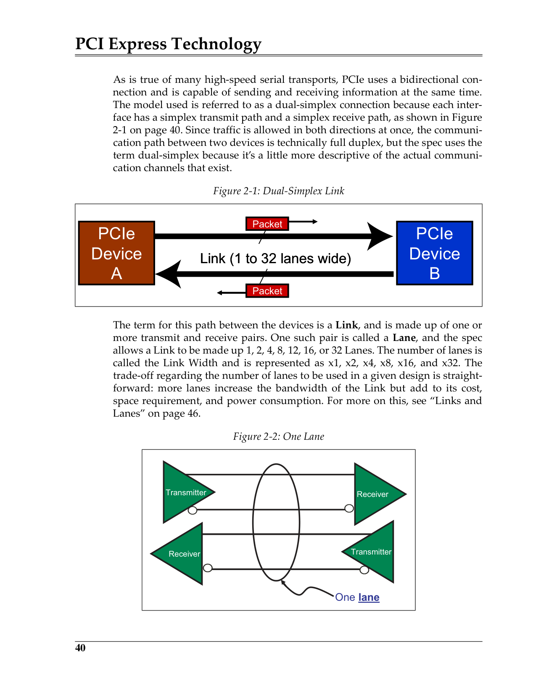
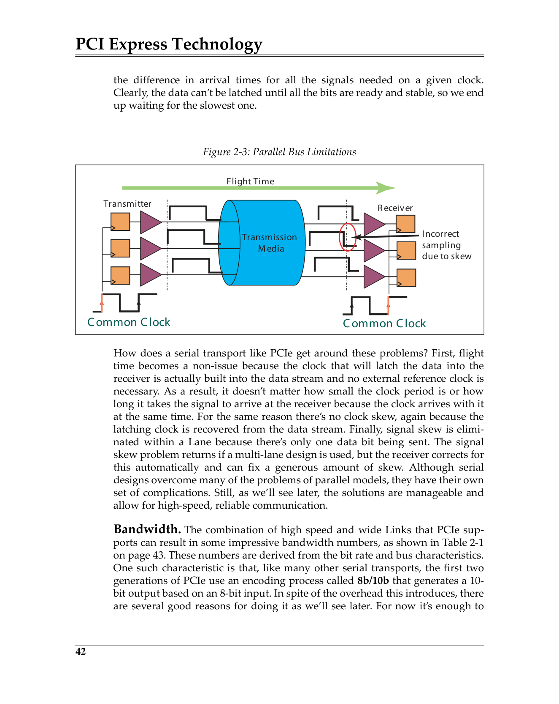
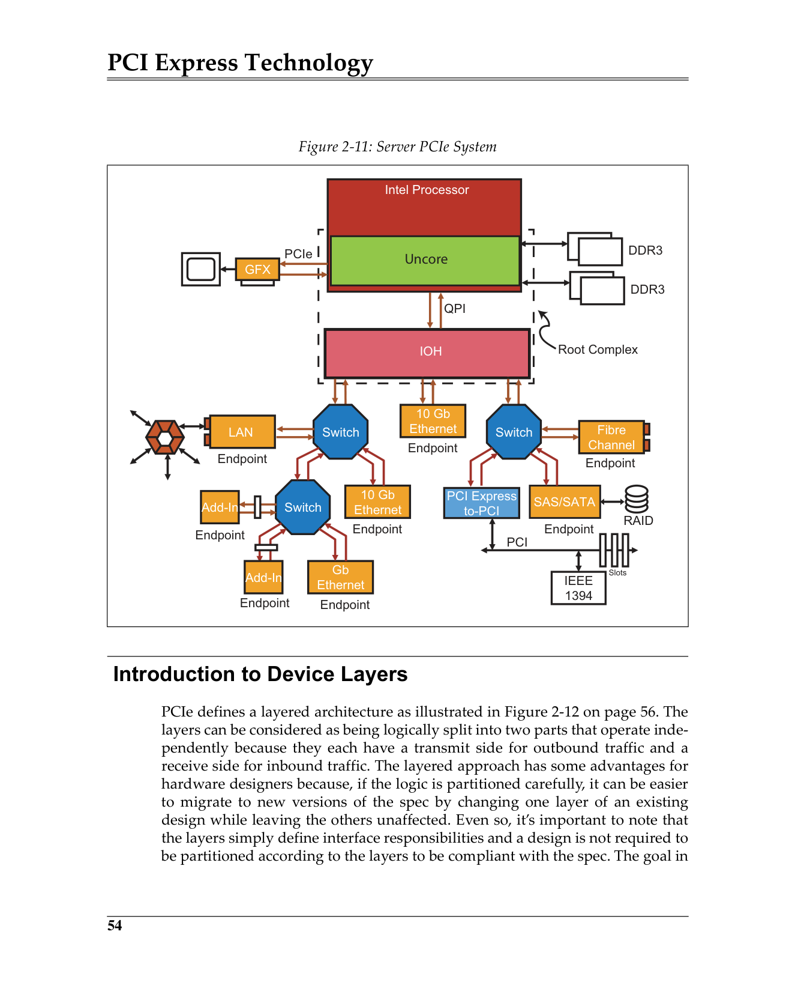
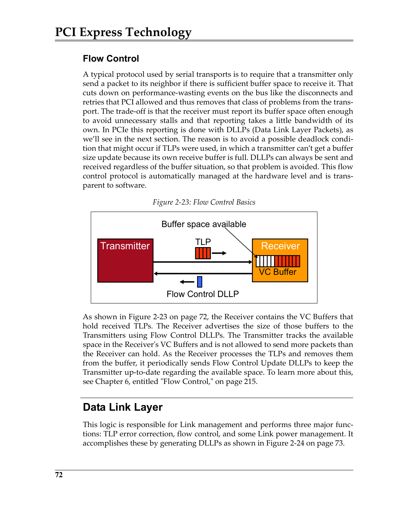

# Chapter 2: PCIe Architecture Overview
# 第2章：PCIe架构概述

> 中英文对照翻译 | Chinese-English Parallel Translation
> Source: MindShare PCI Express Technology 3.0 — Comprehensive Guide to Generations 1.x, 2.x, 3.0
> 来源：MindShare PCI Express 技术 3.0 | 页码：98–143（共46页）

---

## 快速导航 | Quick Navigation

- [Introduction to PCI Express — PCIe简介](#introduction-to-pci-express)
- [Serial Transport — 串行传输](#serial-transport)
- [Packet-based Protocol — 基于包的协议](#packet-based-protocol)
- [Links and Lanes — 链路与通道](#links-and-lanes)
- [Flexible Topology — 灵活拓扑](#flexible-topology-options)
- [Device Layers — 设备分层](#introduction-to-device-layers)
  - [Transaction Layer — 事务层](#transaction-layer)
  - [Data Link Layer — 数据链路层](#data-link-layer)
  - [Physical Layer — 物理层](#physical-layer)
- [Protocol Review — 协议示例](#protocol-review-example)
- [术语附录 | Terminology Appendix](#术语附录-terminology-appendix)

---

## Introduction to PCI Express
## PCI Express简介

PCI Express represents a major shift from the parallel bus model of its predecessors to a serial bus architecture. It remains fully backward compatible with PCI in software. PCIe uses a bidirectional connection capable of sending and receiving information at the same time — a **dual-simplex** connection: each interface has a simplex transmit path and a simplex receive path.

> PCI Express代表了从其前身并行总线模型向串行总线架构的重大转变。它在软件上保持与PCI的完全向后兼容。PCIe使用可同时收发信息的双向连接——**双单工（dual-simplex）**连接：每个接口有一个单工发送路径和一个单工接收路径。

 <em>Figure 2-1: Dual-Simplex Link / 图2-1：双单工链路</em>

---

## Software Backward Compatibility
## 软件向后兼容性

One of the most important design goals for PCIe was backward compatibility with PCI software. All the address spaces used for PCI are carried forward either unchanged or simply extended: Memory, IO, and Configuration spaces are still visible to software and programmed exactly the same way. Software written years ago for PCI (BIOS, device drivers) still works with PCIe devices. Configuration space has been extended dramatically to support new functionality, but the old registers remain accessible in the regular way.

> PCIe最重要的设计目标之一是与PCI软件的向后兼容性。所有PCI使用的地址空间要么保持不变，要么只是扩展：内存、IO和配置空间对软件仍然可见，且编程方式完全一致。多年前为PCI编写的软件（BIOS代码、设备驱动等）仍可在PCIe设备上工作。配置空间已大幅扩展以支持新功能，但旧寄存器仍以常规方式可访问。

---

## Serial Transport
## 串行传输

### The Need for Speed
### 速度之需

A serial model must run much faster than a parallel design to accomplish the same bandwidth. PCIe has worked reliably at 2.5 GT/s, 5.0 GT/s, and 8.0 GT/s. The serial model overcomes key parallel bus problems:

- **Flight Time**: In parallel buses, the signal propagation time must be less than the clock period. PCIe eliminates this by embedding the clock in the data stream — the clock arrives with the data simultaneously.
- **Clock Skew**: The difference in clock arrival time between sender and receiver. Eliminated in PCIe because the latching clock is recovered from the data stream itself.
- **Signal Skew**: The difference in arrival times for parallel signals. Within a single Lane, there's only one data bit being sent. For multi-lane Links, the receiver automatically deskews the lanes.

> 串行模型必须以比并行设计快得多的速度运行才能达到相同带宽。PCIe已在2.5 GT/s、5.0 GT/s和8.0 GT/s可靠运行。串行模型克服了关键的并行总线问题：
>
> - **飞行时间（Flight Time）**：并行总线中信号传播时间必须小于时钟周期。PCIe通过将时钟嵌入数据流消除了此问题——时钟与数据同时到达。
> - **时钟偏差（Clock Skew）**：发送端与接收端时钟到达时间的差异。PCIe中因锁存时钟从数据流本身恢复而消除。
> - **信号偏差（Signal Skew）**：并行信号到达时间的差异。单Lane内仅发送1位数据。多Lane链路中，接收端自动去偏移（de-skew）。

 <em>Figure 2-3: Parallel Bus Limitations / 图2-3：并行总线的局限性</em>

### Bandwidth
### 带宽

PCIe Gen1/Gen2 use **8b/10b encoding** — sending one byte of data requires transmitting 10 bits (25% overhead). Gen3 uses **128b/130b encoding**, reducing overhead to ~1.5% while increasing the data rate to 8.0 GT/s.

**Table 2-1: PCIe Aggregate Bandwidth (per direction) | 表2-1：PCIe总带宽（每方向）**

| Link Width | Gen1 (2.5 GT/s) | Gen2 (5.0 GT/s) | Gen3 (8.0 GT/s) |
|-----------|-----------------|-----------------|-----------------|
| x1 | 0.25 GB/s | 0.5 GB/s | ~1.0 GB/s |
| x2 | 0.5 GB/s | 1.0 GB/s | ~2.0 GB/s |
| x4 | 1.0 GB/s | 2.0 GB/s | ~4.0 GB/s |
| x8 | 2.0 GB/s | 4.0 GB/s | ~8.0 GB/s |
| x16 | 4.0 GB/s | 8.0 GB/s | ~16.0 GB/s |

> PCIe Gen1/Gen2使用**8b/10b编码**——发送1字节数据需传输10位（25%开销）。Gen3使用**128b/130b编码**，将开销降至~1.5%，同时将数据速率提升至8.0 GT/s。Gen1 x1单向0.25 GB/s；Gen2翻倍至0.5 GB/s；Gen3通过改变编码（而非翻倍频率）再翻倍至~1.0 GB/s/x1。x16链路在Gen3下每方向~16 GB/s，聚合约32 GB/s。

### Differential Signals
### 差分信号

PCIe uses differential signaling on each Lane — a pair of wires (D+ and D−) carrying opposite-polarity signals. Benefits: noise appears as common mode on both wires and is rejected by the receiver; lower voltage swings reduce power; reduced EMI.

> PCIe在每个Lane上使用差分信令——一对导线（D+和D−）承载相反极性的信号。优点：噪声以共模形式出现在两条线上，被接收端抑制；较低的电压摆幅降低功耗；减少EMI。

### No Common Clock
### 无公共时钟

Unlike PCI's common clock approach, PCIe embeds the clock in the data stream using 8b/10b (or 128b/130b) encoding. The Receiver recovers the clock using a PLL-based CDR (Clock Data Recovery) circuit. This eliminates clock skew and flight time constraints, enabling much higher data rates.

> 不同于PCI的公共时钟方式，PCIe使用8b/10b（或128b/130b）编码将时钟嵌入数据流。接收端利用基于PLL的CDR（时钟数据恢复）电路恢复时钟。这消除了时钟偏差和飞行时间约束，使更高的数据速率成为可能。

---

## Packet-based Protocol
## 基于包的协议

PCIe information is transferred using packets — a structured format delivering information between layers. Each packet has a well-defined format with a header, optional data payload, and optional digest. Framing symbols define the boundaries of each packet and CRC protects the integrity of the entire packet.

> PCIe信息使用包（packet）传输——一种在层间传递信息的结构化格式。每个包具有明确定义的格式，包含头部、可选数据载荷和可选摘要。成帧符号（framing symbol）定义每个包的边界，CRC保护整个包的完整性。

---

## Links and Lanes
## 链路与通道

A **Link** is the communication path between two PCIe devices. It is made up of one or more transmit/receive pairs. One such pair is called a **Lane**. The spec allows Links of 1, 2, 4, 8, 12, 16, or 32 Lanes. The Link Width is represented as x1, x2, x4, x8, x16, or x32. **More lanes = higher bandwidth but increased cost, space, and power.**

> **链路（Link）**是两个PCIe设备之间的通信路径，由一个或多个发送/接收对组成。每个发送/接收对称为一个**通道（Lane）**。规范允许1、2、4、8、12、16或32个Lane。链路宽度（Link Width）表示为x1、x2、x4、x8、x16或x32。**更多Lane = 更高带宽但成本、空间和功耗增加。**

### Scalable Performance
### 可扩展性能

A device with an x4 connector may plug into an x8 slot and negotiate down to x4. Similarly, an x8 card in an x4 physical slot may operate at x4 if the connector permits insertion. The Link width is negotiated during Link training.

> x4连接器的设备可插入x8插槽并协商降为x4。同样，x8卡插入x4物理插槽时，如果连接器允许，可运行于x4。链路宽度在链路训练期间协商。

---

## Flexible Topology Options
## 灵活拓扑选项

### Key Components / 关键组件

- **Root Complex (RC)** — The bridge between the CPU/memory subsystem and the PCIe fabric. Contains one or more Root Ports. / CPU/内存子系统与PCIe fabric之间的桥。包含一个或多个根端口。
- **Switches** — Provide fan-out capability. A Switch has one Upstream Port and multiple Downstream Ports. / 提供扇出能力。一个Switch有一个上行端口和多个下行端口。
- **Bridges** — PCIe-to-PCI/PCI-X bridges provide backward compatibility with legacy devices. / PCIe到PCI/PCI-X桥提供与传统设备的向后兼容。
- **Endpoints** — Native PCIe Endpoints and Legacy PCIe Endpoints. Endpoints are the consumers/initiators of transactions. / 原生PCIe端点和传统PCIe端点。端点是事务的消费者/发起者。

### Some Definitions / 一些定义

- **Upstream**: Toward the Root Complex / 朝向根联合体
- **Downstream**: Away from the Root Complex / 远离根联合体
- **Primary Interface**: The Upstream-facing interface of a Bridge/Switch / 桥/Switch面向上游的接口
- **Secondary Interface**: The Downstream-facing interface of a Bridge/Switch / 桥/Switch面向下游的接口

---

## Introduction to Device Layers
## 设备分层介绍

PCIe defines a three-layer architecture:

| Layer | 层 | Primary Responsibility | 主要职责 |
|-------|-----|----------------------|----------|
| **Transaction Layer** | 事务层 | Assemble/disassemble TLPs; manage transaction ordering | 组装/拆解TLP；管理事务排序 |
| **Data Link Layer** | 数据链路层 | Reliable TLP delivery; error detection & retry (Ack/Nak); flow control; power management DLLPs | 可靠TLP交付；错误检测与重试；流控 |
| **Physical Layer** | 物理层 | Interface to the electrical signaling; link training; encoding/scrambling | 电气信令接口；链路训练；编码/加扰 |

 <em>Figure 2-9: PCIe Device Layers / 图2-9：PCIe设备分层</em>

### Transaction Layer
### 事务层

The Transaction Layer assembles and disassembles **TLPs** (Transaction Layer Packets). It manages the four PCIe transaction types:
- **Memory** — Read/Write to memory space
- **IO** — Read/Write to IO space (legacy)
- **Configuration** — Read/Write to configuration space
- **Messages** — In-band sideband signals (interrupts, errors, power management)

> 事务层组装和拆解**TLP**（事务层包）。管理四种PCIe事务类型：内存（Memory）、IO、配置（Configuration）和消息（Messages）。消息替代了传统PCI中的边带信号（中断、错误、电源管理等）。

TLPs are either **Posted** (no Completion required — Memory Writes, Messages) or **Non-Posted** (Completions required — Reads, IO/Config Writes). Posted transactions are more efficient; Non-Posted transactions allow the requester to know when the transaction has completed on the target side.

> TLP分为**Posted（已发布）**（不需要完成——内存写入、消息）和**Non-Posted（非发布）**（需要完成——读取、IO/配置写入）。Posted事务更高效；Non-Posted事务允许请求方知道事务何时在目标端完成。

**Transaction Ordering** rules ensure deadlock-free operation and manage the relationship between Posted and Non-Posted traffic. The general rule: Posted requests can pass Non-Posted requests and Completions, but Completions cannot pass Posted requests (to prevent deadlocks).

> **事务排序（Transaction Ordering）**规则确保无死锁运行，并管理Posted和Non-Posted流量之间的关系。一般规则：Posted请求可超越Non-Posted请求和完成，但完成不能超越Posted请求（防止死锁）。

### Data Link Layer
### 数据链路层

The Data Link Layer (DLL) ensures reliable data exchange across the Link:
- **DLLPs** (Data Link Layer Packets): Ack/Nak for TLP delivery confirmations; Flow Control packets; Power Management
- **Flow Control**: Credit-based mechanism prevents receiver buffer overflow; credits are advertised per VC (Virtual Channel) and per traffic type (Posted/Non-Posted/Completion)
- **Ack/Nak Protocol**: The transmitter retains a copy of each TLP until acknowledged. Positive Ack → purge copy; Nak → replay all unacknowledged TLPs; REPLAY_TIMER → replay if no Ack within timeout

> 数据链路层确保跨链路的可靠数据交换：
> - **DLLP**（数据链路层包）：确认/否定确认(Ack/Nak)；流控包；电源管理
> - **流控（Flow Control）**：基于信用(credit)的机制，防止接收端缓冲区溢出；信用按VC（虚拟通道）和流量类型（Posted/Non-Posted/Completion）每类公布
> - **Ack/Nak协议**：发送端保留每个TLP的副本直到被确认。正确认(Ack) → 清除副本；负确认(Nak) → 重放所有未确认TLP；REPLAY_TIMER → 超时后重放

 <em>Figure 2-16: Data Link Layer Ack/Nak Mechanism / 图2-16：数据链路层Ack/Nak机制</em>

### Physical Layer
### 物理层

The Physical Layer is split into two sub-blocks:
- **Logical PHY**: Encoding (8b/10b, 128b/130b), scrambling, framing, ordered sets (TS1/TS2, SKP, EIOS), Link training (LTSSM)
- **Electrical PHY**: Differential drivers/receivers, AC coupling, receiver detection, electrical idle

> 物理层分为两个子层：
> - **逻辑PHY（Logical PHY）**：编码（8b/10b、128b/130b）、加扰、成帧、有序集（TS1/TS2、SKP、EIOS）、链路训练（LTSSM）
> - **电气PHY（Electrical PHY）**：差分驱动器/接收器、AC耦合、接收端检测、电气空闲

**Ordered Sets** are special sequences used for Link management: TS1/TS2 (Training Sequences for Link initialization), SKP (Skip — clock compensation), EIOS (Electrical Idle Ordered Set), FTS (Fast Training Sequence for L0s exit).

> **有序集（Ordered Set）**是用于链路管理的特殊序列：TS1/TS2（链路初始化训练序列）、SKP（跳过—时钟补偿）、EIOS（电气空闲有序集）、FTS（L0s退出的快速训练序列）。

---

## Protocol Review Example
## 协议示例回顾

### Memory Read Request
### 内存读取请求

1. Software (or a device driver) programs the device to read a block of data from memory
2. The device's Transaction Layer creates a Memory Read Request TLP with the address, requester ID, and other required fields
3. The DLL applies a sequence number and passes it to the Physical Layer
4. The Physical Layer frames, scrambles, encodes, and serializes the TLP across the Link
5. The Root Complex (or Switch) Physical Layer deserializes, decodes, and checks the data
6. The DLL checks the TLP for integrity (LCRC, sequence number) and acknowledges with an Ack DLLP if error-free
7. The RC Transaction Layer processes the read request, generates a Completion with Data TLP(s), and sends them back to the requester
8. The requester's Transaction Layer receives the Completion(s) and delivers the data to the device

> 1. 软件/驱动编程设备从内存读取一块数据
> 2. 设备事务层创建包含地址、请求者ID等字段的内存读请求TLP
> 3. DLL附加序列号后传递给物理层
> 4. 物理层成帧、加扰、编码、串行化TLP跨链路传输
> 5. RC/Switch物理层反串行化、解码、检查数据
> 6. DLL检查TLP完整性（LCRC、序列号），如无错误则用Ack DLLP确认
> 7. RC事务层处理读请求，生成带数据的Completion TLP并返回给请求者
> 8. 请求者的事务层接收Completion并将数据交付给设备

---

## 术语附录 | Terminology Appendix

| English | 中文 | Notes |
|---------|------|-------|
| 8b/10b Encoding | 8b/10b编码 | Gen1/Gen2, 25% overhead |
| 128b/130b Encoding | 128b/130b编码 | Gen3, ~1.5% overhead |
| CDR (Clock Data Recovery) | 时钟数据恢复 | 从数据流恢复时钟 |
| Completion | 完成 | Non-Posted事务的响应TLP |
| Configuration Space | 配置空间 | 设备寄存器空间 |
| DLL (Data Link Layer) | 数据链路层 | |
| DLLP (Data Link Layer Packet) | 数据链路层包 | |
| Dual-Simplex | 双单工 | 同时收发的连接 |
| Endpoint | 端点 | 事务的发起者/消费者 |
| Flow Control | 流控 | 基于信用的缓冲区管理 |
| Lane | 通道 | 一发一收的差分对 |
| Link | 链路 | Lane的集合 |
| LTSSM | 链路训练与状态机 | |
| Non-Posted | 非发布 | 需要Completion的事务 |
| Ordered Set | 有序集 | TS1/TS2/SKP/EIOS/FTS/SDS |
| Posted | 已发布 | 不需要Completion的事务 |
| RC (Root Complex) | 根联合体 | CPU/内存到PCIe的桥 |
| Switch | 交换开关 | 提供扇出能力 |
| TLP (Transaction Layer Packet) | 事务层包 | |
