# Chapter 3: Configuration Overview
# 第3章：配置概述

> 中英文对照翻译 | Chinese-English Parallel Translation
> Source: MindShare PCI Express Technology 3.0 | Pages: 144–179 (36 pages)
> 来源：MindShare PCI Express 技术 3.0 | 页码：144–179（共36页）

---

## 快速导航 | Quick Navigation

- [Bus, Device, Function (BDF) — 总线、设备、功能](#definition-of-bus-device-and-function)
- [Configuration Address Space — 配置地址空间](#configuration-address-space)
- [Generating Configuration Transactions — 生成配置事务](#generating-configuration-transactions)
- [Configuration Requests — 配置请求](#configuration-requests)
- [Enumeration — 枚举与拓扑发现](#enumeration---discovering-the-topology)
- [Hot-Plug — 热插拔](#hot-plug-considerations)
- [术语附录 | Terminology Appendix](#术语附录-terminology-appendix)

---

## Definition of Bus, Device and Function
## 总线、设备与功能 (BDF)

Every PCIe Function is uniquely identified by the Device it resides within and the Bus to which the Device connects. This unique identifier is commonly referred to as a **BDF** (Bus/Device/Function). Configuration software is responsible for detecting every BDF within a given topology.

> 每个PCIe功能由其所在的设备和该设备连接的总线唯一标识。这个唯一标识符常被称为**BDF**（总线/设备/功能）。配置软件负责检测给定拓扑中的每个BDF。

### PCIe Buses
### PCIe总线

Up to 256 Bus Numbers can be assigned by configuration software. Bus 0 is typically assigned by hardware to the Root Complex. Bus 0 consists of a Virtual PCI bus with integrated endpoints and Virtual PCI-to-PCI Bridges (P2P) hard-coded with Device/Function numbers. Each P2P bridge creates a new bus. Software performs a **depth-first search**: starting at Bus 0, when a bridge is found, the new bus is assigned a unique, higher bus number, and software searches that new bus for more bridges before continuing on the current bus.

> 最多可分配256个总线编号。Bus 0通常由硬件指定给根联合体（Root Complex）。Bus 0包含一个带有集成端点和虚拟PCI-to-PCI桥（P2P）的虚拟PCI总线。每个P2P桥创建一个新总线。软件执行**深度优先搜索**：从Bus 0开始，发现桥时为新总线分配唯一且更大的编号，然后先搜索新总线上的桥，再继续搜索当前总线。

### PCIe Devices
### PCIe设备

PCIe permits up to 32 device attachments on a single PCI bus. However, the point-to-point nature of PCIe means only a single device attaches directly to a PCIe link — always Device 0. Root Complexes and Switches have Virtual PCI buses allowing multiple Devices. Each Device must implement Function 0 and may contain up to eight Functions (multi-function device).

> PCIe允许单PCI总线上最多32个设备。但PCIe的点对点特性意味着仅单个设备直接连接到PCIe链路——始终为Device 0。根联合体和Switch具有虚拟PCI总线，允许多个设备。每个设备必须实现功能0，最多可包含8个功能（多功能设备）。

### PCIe Functions
### PCIe功能

Functions within a multi-function device need not be implemented sequentially (e.g., Functions 0, 2, and 7). Configuration software must check each possible Function to learn which are present. Each Function has its own configuration address space for resource setup.

> 多功能设备中的功能无需按顺序实现（例如功能0、2和7）。配置软件必须检查每个可能的功能以确定哪些存在。每个功能有自己的配置地址空间用于资源设置。

---

## Configuration Address Space
## 配置地址空间

### PCI-Compatible Space
### PCI兼容空间

Each PCIe Function implements 256 bytes of **PCI-compatible configuration space** (bytes 00h–FFh). This space is also called the Type 0 (for Endpoints) or Type 1 (for Bridges) header area. It contains:
- **Header Type** register (offset 0Eh): Identifies whether the Function is an Endpoint (Type 0) or a Bridge (Type 1)
- **Vendor ID / Device ID** (offsets 00h–03h): Identifies the manufacturer and device
- **Command / Status registers**: Control and status bits for the Function
- **Base Address Registers (BARs)**: Request memory/IO address space
- For Bridges: **Bus/Primary/Secondary/Subordinate numbers** and **Base/Limit registers**

> 每个PCIe功能实现256字节的**PCI兼容配置空间**（字节00h–FFh）。该空间也称为Type 0（端点）或Type 1（桥）头部区域。包含：Header Type寄存器（识别端点/桥）、Vendor ID/Device ID、Command/Status寄存器、BAR（基地址寄存器）以及桥的总线编号和Base/Limit寄存器。

### Extended Configuration Space
### 扩展配置空间

PCIe extends configuration space from 256 bytes to **4096 bytes (4KB)** per Function. Bytes 100h–FFFh form the **PCIe Extended Configuration Space**, accessed via the Enhanced Configuration Access Mechanism (ECAM). This extended space houses PCI Express Extended Capability structures (AER, ATS, SR-IOV, etc.).

> PCIe将配置空间从256字节扩展到每功能**4096字节（4KB）**。字节100h–FFFh构成**PCIe扩展配置空间**，通过增强配置访问机制（ECAM）访问。该扩展空间容纳PCIe扩展能力结构（AER、ATS、SR-IOV等）。

---

## Generating Configuration Transactions
## 生成配置事务

### Legacy PCI Mechanism
### 传统PCI机制

The legacy method (for backwards compatibility) uses two 32-bit IO registers in the Host-to-PCI Bridge:
- **CONFIG_ADDRESS** (CF8h): Specifies Bus[23:16], Device[15:11], Function[10:8], and Register[7:0] numbers
- **CONFIG_DATA** (CFCh): 32-bit data port — read/write this address to access the configuration register specified in CONFIG_ADDRESS

> 传统方法（向后兼容）使用Host-to-PCI桥中的两个32位IO寄存器：CONFIG_ADDRESS（CF8h）指定总线/设备/功能/寄存器编号；CONFIG_DATA（CFCh）为32位数据端口——读写此地址即访问CONFIG_ADDRESS指定的配置寄存器。

### Enhanced Configuration Access Mechanism (ECAM)
### 增强配置访问机制 (ECAM)

ECAM maps each Function's 4KB configuration space into memory-mapped IO. The base address of the ECAM region is programmed in the ACPI MCFG table. Software calculates a memory address from Bus/Device/Function numbers and accesses configuration registers via standard memory reads/writes — much more efficient than the legacy IO-based mechanism.

> ECAM将每个功能的4KB配置空间映射到内存映射IO。ECAM区域的基地址在ACPI MCFG表中编程。软件根据总线/设备/功能编号计算内存地址，通过标准内存读写访问配置寄存器——比基于IO的传统机制高效得多。

---

## Configuration Requests
## 配置请求

Two types of Configuration Request TLPs are used:

**Type 0 Configuration Request**: Targets a Function on the same bus segment. The Device Number in the header selects one of up to 32 devices. Used for Endpoints (and Switch internal Functions).

**Type 1 Configuration Request**: Targets a Function on a downstream bus segment. A Bridge receiving a Type 1 request checks its Bus Number registers. If the target bus is downstream from this bridge, the bridge either converts it to a Type 0 (if the target bus is immediately below) or forwards it unchanged (if the target bus is further downstream).

> 使用两种配置请求TLP：
>
> **Type 0配置请求**：目标是同一总线段的某个功能。Header中的Device Number选择最多32个设备之一。用于端点（和Switch内部功能）。
>
> **Type 1配置请求**：目标是下游总线段的功能。接收Type 1请求的桥检查其总线编号寄存器。若目标总线在该桥下游，桥要么将其转换为Type 0（目标总线紧邻下方），要么原样转发（目标总线在更下方）。

---

## Enumeration - Discovering the Topology
## 枚举 — 发现拓扑

Enumeration is the process by which system software discovers the PCIe topology:
1. Start at Bus 0, Device 0, Function 0
2. Read Vendor ID — if FFFFh, no device present; otherwise, device exists
3. If Header Type indicates a Bridge (Type 1): assign Primary/Secondary/Subordinate bus numbers; begin scanning the new Secondary bus
4. If Header Type indicates Multi-Function (bit 7 set): scan all 8 Functions
5. For each discovered Function, read BARs to determine memory/IO requirements and program them with unique addresses
6. Continue depth-first — fully explore each new bus before returning to scan for more bridges on the current bus

> 枚举是系统软件发现PCIe拓扑的过程：
> 1. 从Bus 0, Device 0, Function 0开始
> 2. 读Vendor ID — FFFFh = 无设备；否则设备存在
> 3. 若Header Type指示为桥(Type 1)：分配Primary/Secondary/Subordinate总线编号；开始扫描新Secondary总线
> 4. 若Header Type指示多功能(位7=1)：扫描全部8个功能
> 5. 对发现的每个功能，读取BAR确定内存/IO需求，分配不冲突的地址
> 6. 继续深度优先——充分探索每条新总线后返回扫描当前总线上的更多桥

---

## Hot-Plug Considerations
## 热插拔考量

PCIe supports hot-plug (adding/removing devices while the system is running). When a hot-plug event occurs, the system re-enumerates the affected bus segment. The hot-plug controller (in a Switch Downstream Port or Root Port) detects presence changes and notifies system software via interrupts or attention indicators.

> PCIe支持热插拔（系统运行中增删设备）。热插拔事件发生时，系统重新枚举受影响的总线段。热插拔控制器（在Switch下行端口或Root Port中）检测存在性变化，并通过中断或注意指示器通知系统软件。

---

## Key Figures / 关键图示

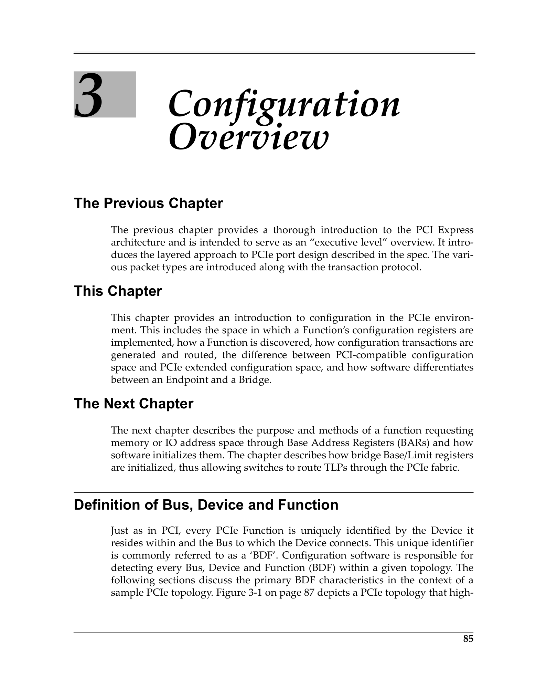
 <em>Figure from ch03 (p.144) / ch03插图 (p.144)</em>

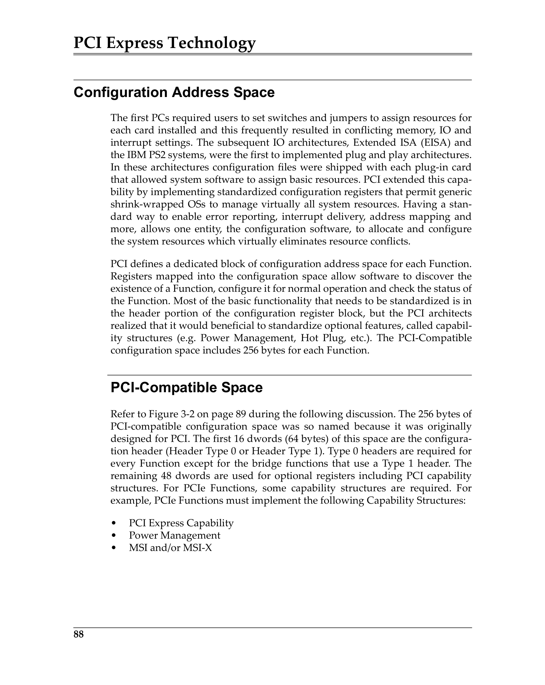
 <em>Figure from ch03 (p.147) / ch03插图 (p.147)</em>

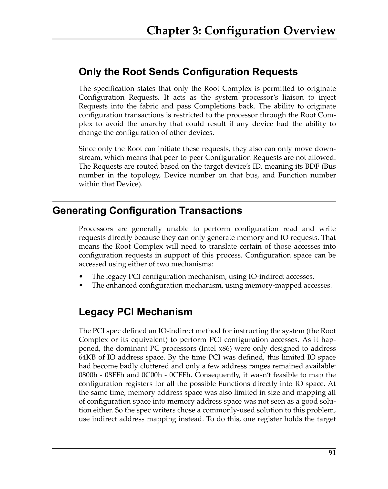
 <em>Figure from ch03 (p.150) / ch03插图 (p.150)</em>

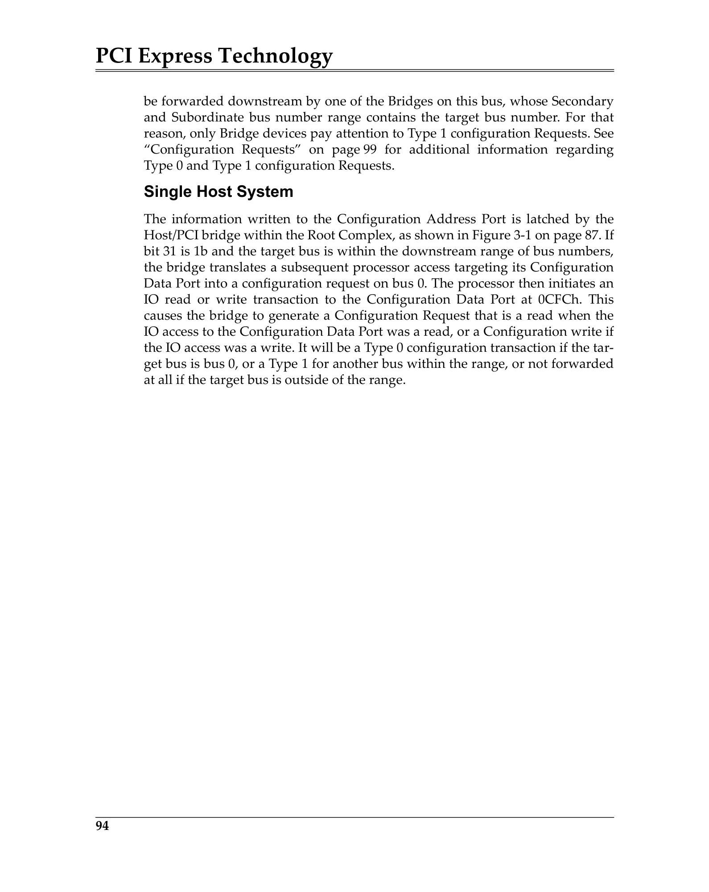
 <em>Figure from ch03 (p.153) / ch03插图 (p.153)</em>

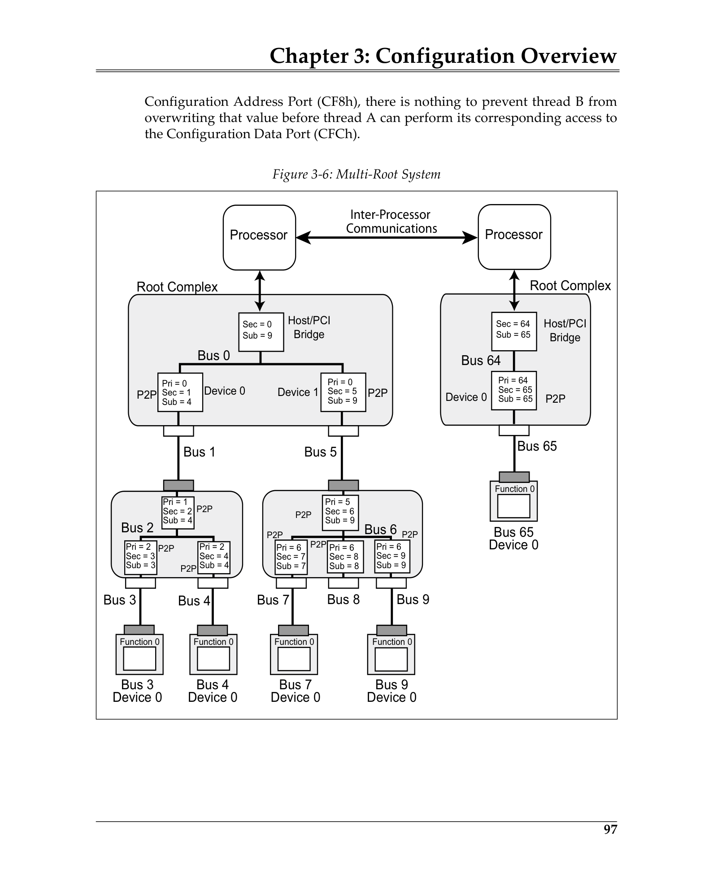
 <em>Figure from ch03 (p.156) / ch03插图 (p.156)</em>

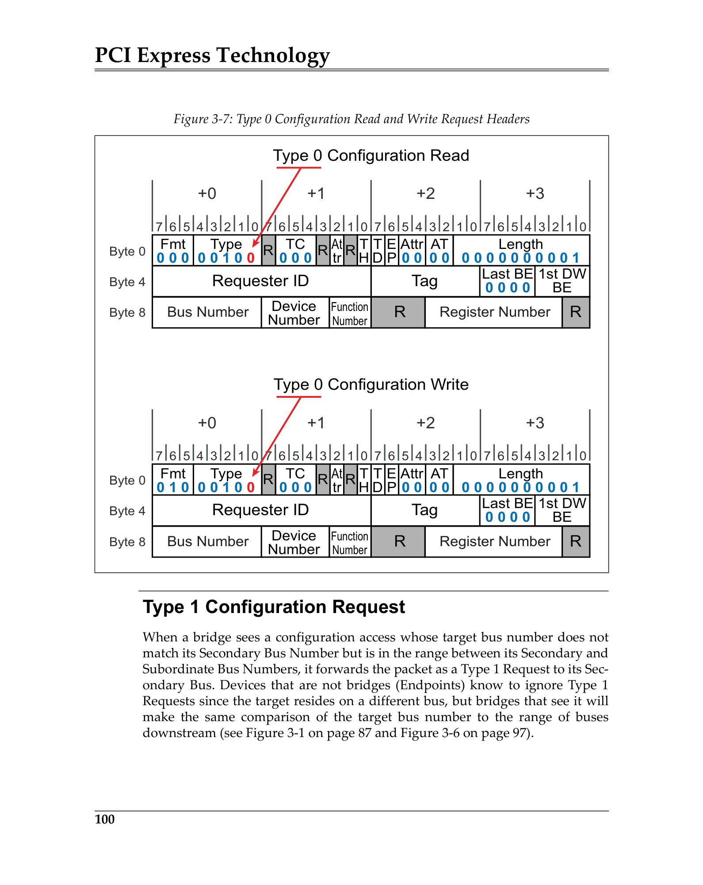
 <em>Figure from ch03 (p.159) / ch03插图 (p.159)</em>

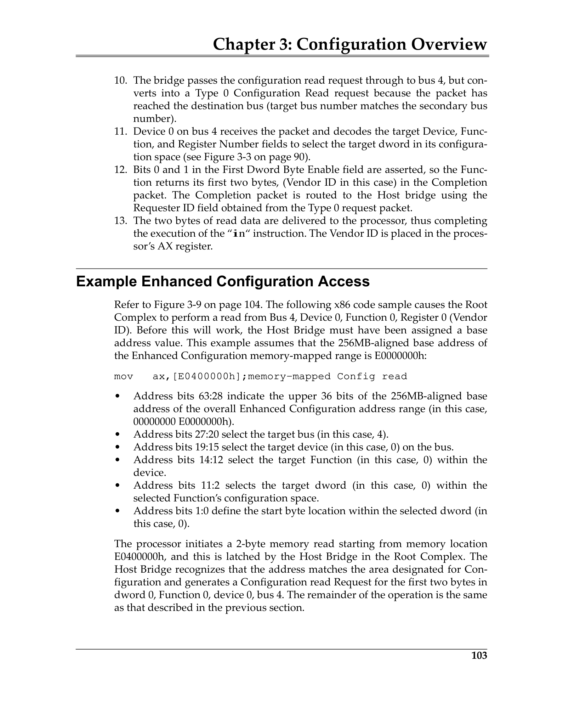
 <em>Figure from ch03 (p.162) / ch03插图 (p.162)</em>

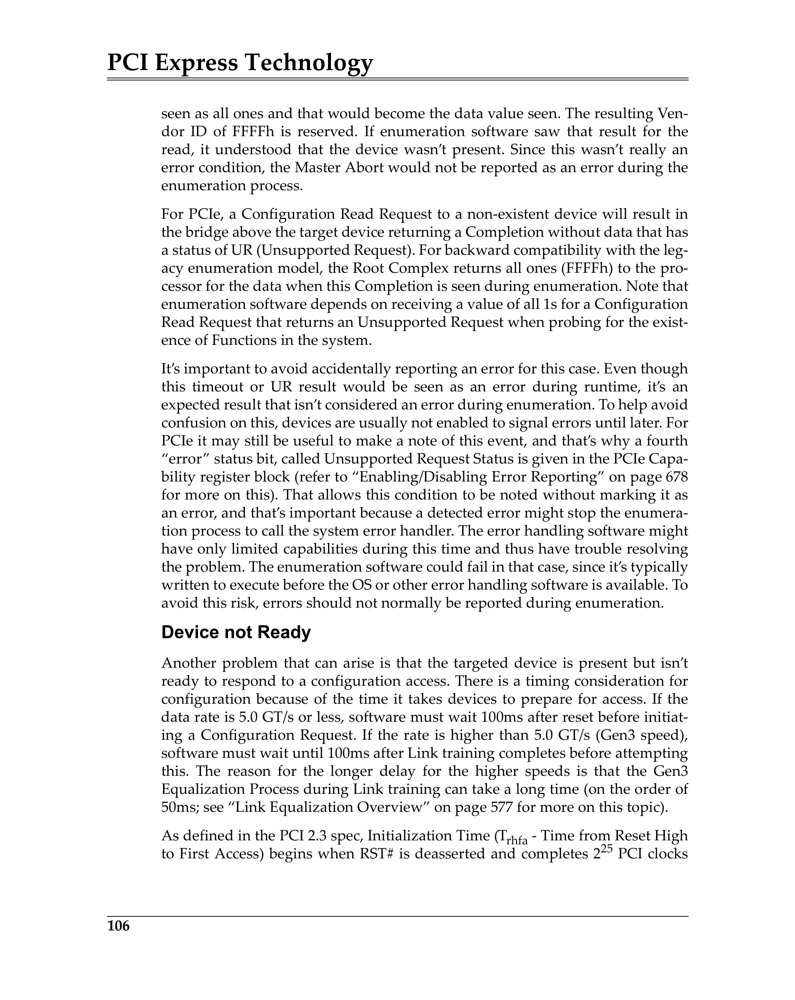
 <em>Figure from ch03 (p.165) / ch03插图 (p.165)</em>

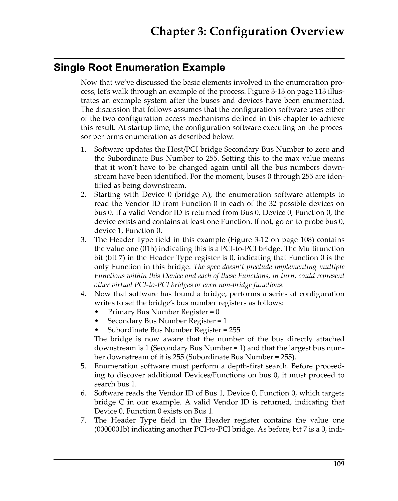
 <em>Figure from ch03 (p.168) / ch03插图 (p.168)</em>

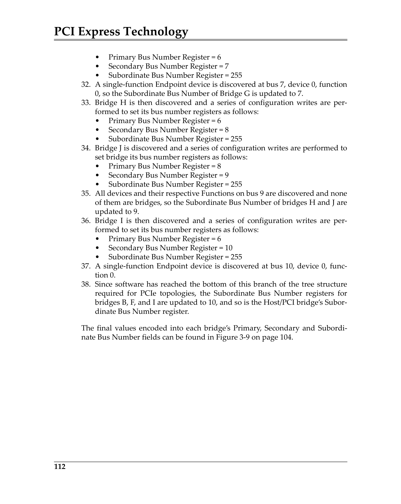
 <em>Figure from ch03 (p.171) / ch03插图 (p.171)</em>

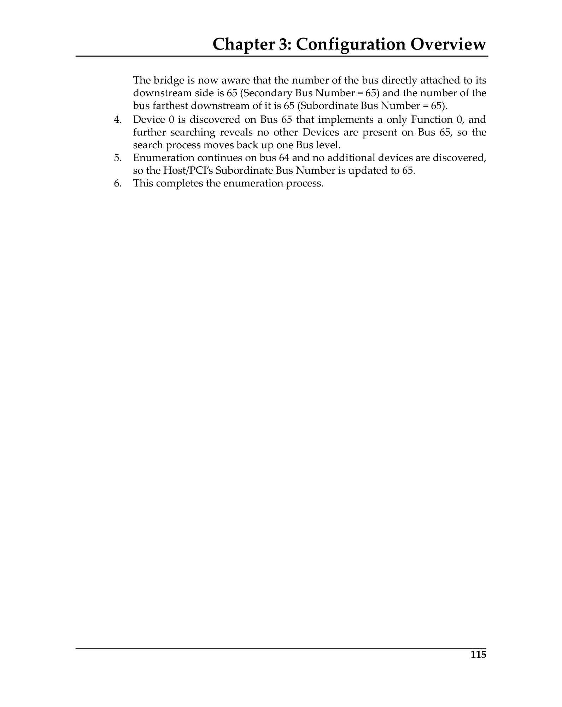
 <em>Figure from ch03 (p.174) / ch03插图 (p.174)</em>

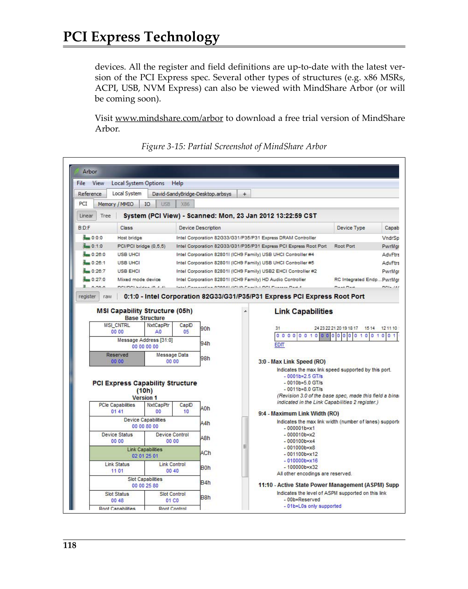
 <em>Figure from ch03 (p.177) / ch03插图 (p.177)</em>

---

## 术语附录 | Terminology Appendix

| English | 中文 | Notes |
|---------|------|-------|
| BAR (Base Address Register) | 基地址寄存器 | 申请地址空间 |
| BDF (Bus/Device/Function) | 总线/设备/功能 | 唯一标识符 |
| CONFIG_ADDRESS / CONFIG_DATA | 配置地址/数据寄存器 | 传统IO机制 |
| Depth-First Search | 深度优先搜索 | 枚举算法 |
| Device ID | 设备ID | 标识设备 |
| ECAM (Enhanced Configuration Access Mechanism) | 增强配置访问机制 | 内存映射配置 |
| Enumeration | 枚举 | 发现总线拓扑 |
| Extended Configuration Space | 扩展配置空间 | 256B–4KB |
| Header Type | 头部类型 | Type 0=端点, Type 1=桥 |
| MCFG Table | MCFG表 | ACPI ECAM基地址 |
| Multi-Function Device | 多功能设备 | ≤8个功能 |
| PCI-Compatible Space | PCI兼容空间 | 256B |
| P2P (PCI-to-PCI Bridge) | PCI-to-PCI桥 | 创建新总线 |
| Root Complex | 根联合体 | CPU/内存到PCIe |
| Type 0 / Type 1 Request | Type 0/1请求 | 配置TLP类型 |
| Vendor ID | 厂商ID | 标识制造商 |
