# Chapter 6: Flow Control

> Source: MindShare PCI Express Technology 3.0 — Comprehensive Guide to Generations 1.x, 2.x, 3.0
> Authors: Mike Jackson, Ravi Budruk | Pages: 274–303 (30 pages)

---

## Quick Navigation

- [The Previous Chapter](#the-previous-chapter)
- [This Chapter](#this-chapter)
- [The Next Chapter](#the-next-chapter)
- [Flow Control Concept](#flow-control-concept)
- [Flow Control Buffers and Credits](#flow-control-buffers-and-credits)
  - [VC Flow Control Buffer Organization](#vc-flow-control-buffer-organization)
- [Flow Control Credits](#flow-control-credits)
  - [Initial Flow Control Advertisement](#initial-flow-control-advertisement)
  - [Minimum and Maximum Flow Control Advertisement](#minimum-and-maximum-flow-control-advertisement)
  - [Infinite Credits](#infinite-credits)
- [Flow Control Initialization](#flow-control-initialization)
  - [General](#general)
  - [The FC Initialization Sequence](#the-fc-initialization-sequence)
  - [FC_Init1 Details](#fc_init1-details)
  - [FC_Init2 Details](#fc_init2-details)
  - [Rate of FC_INIT1 and FC_INIT2 Transmission](#rate-of-fc_init1-and-fc_init2-transmission)
  - [Violations of the Flow Control Initialization Protocol](#violations-of-the-flow-control-initialization-protocol)
- [Introduction to the Flow Control Mechanism](#introduction-to-the-flow-control-mechanism)
  - [The Flow Control Elements](#the-flow-control-elements)
  - [Transmitter Elements](#transmitter-elements)
  - [Receiver Elements](#receiver-elements)
- [Flow Control Example](#flow-control-example)
  - [Stage 1 — Flow Control Following Initialization](#stage-1--flow-control-following-initialization)
  - [Stage 2 — Flow Control Buffer Fills Up](#stage-2--flow-control-buffer-fills-up)
  - [Stage 3 — Counters Roll Over](#stage-3--counters-roll-over)
  - [Stage 4 — FC Buffer Overflow Error Check](#stage-4--fc-buffer-overflow-error-check)
- [Flow Control Updates](#flow-control-updates)
  - [FC_Update DLLP Format and Content](#fc_update-dllp-format-and-content)
- [Flow Control Update Frequency](#flow-control-update-frequency)
  - [Immediate Notification of Credits Allocated](#immediate-notification-of-credits-allocated)
  - [Maximum Latency Between Update Flow Control DLLPs](#maximum-latency-between-update-flow-control-dllps)
  - [Calculating Update Frequency Based on Payload Size and Link Width](#calculating-update-frequency-based-on-payload-size-and-link-width)
- [Error Detection Timer — A Pseudo Requirement](#error-detection-timer--a-pseudo-requirement)

---

## The Previous Chapter

The previous chapter discusses the three major classes of packets: Transaction Layer Packets (TLPs), Data Link Layer Packets (DLLPs) and Ordered Sets. This chapter describes the use, format, and definition of the variety of TLPs and the details of their related fields. DLLPs are described separately in Chapter 9, entitled "DLLP Elements," on page 307.

## This Chapter

This chapter discusses the purposes and detailed operation of the Flow Control Protocol. Flow control is designed to ensure that transmitters never send Transaction Layer Packets (TLPs) that a receiver can't accept. This prevents receive buffer over-runs and eliminates the need for PCI-style inefficiencies like disconnects, retries, and wait-states.

## The Next Chapter

The next chapter discusses the mechanisms that support Quality of Service and describes the means of controlling the timing and bandwidth of different packets traversing the fabric. These mechanisms include application-specific software that assigns a priority value to every packet, and optional hardware that must be built into each device to enable managing transaction priority.

---

## Flow Control Concept

Ports at each end of every PCIe Link must implement Flow Control. Before a packet can be transmitted, flow control checks must verify that the receiving port has sufficient buffer space to accept it. In parallel bus architectures like PCI, transactions are attempted without knowing whether the target is prepared to handle the data. If the request is rejected due to insufficient buffer space, the transaction is repeated (retried) until it completes. This is the "Delayed Transaction Model" of PCI and while it works the efficiency is poor.

Flow Control mechanisms can improve transmission efficiency if multiple Virtual Channels (VCs) are used. Each Virtual Channel carries transactions that are independent from the traffic flowing in other VCs because flow-control buffers are maintained separately. Therefore, a full Flow Control buffer in one VC will not block access to other VC buffers. PCIe supports up to 8 Virtual Channels.

The Flow Control mechanism uses a credit-based mechanism that allows the transmitting port to be aware of buffer space available at the receiving port. As part of its initialization, each receiver reports the size of its buffers to the transmitter on the other end of the Link, and then during run-time it regularly updates the number of credits available using Flow Control DLLPs. Technically, of course, DLLPs are overhead because they don't convey any data payload, but they are kept small (always 8 symbols in size) to minimize their impact on performance.

Flow control logic is actually a shared responsibility between two layers: the Transaction Layer contains the counters, but the Link Layer sends and receives the DLLPs that convey the information. Figure 6-1 illustrates that shared responsibility. In the process of making flow control work:

- **Devices Report Available Buffer Space** — The receiver of each port reports the size of its Flow Control buffers in units called credits. The number of credits within a buffer is sent from the receive-side transaction layer to the transmit-side of the Link Layer. At the appropriate times, the Link Layer creates a Flow Control DLLP to forward this credit information to the receiver at the other end of the Link for each Flow Control Buffer.

- **Receivers Register Credits** — The receiver gets Flow Control DLLPs and transfers the credit values to the transmit-side of the transaction layer. This completes the transfer of credits from one link partner to the other. These actions are performed in both directions until all flow control information has been exchanged.

- **Transmitters Check Credits** — Before it can send a TLP, a transmitter checks the Flow Control Counters to learn whether sufficient credits are available. If so, the TLP is forwarded to the Link Layer but, if not, the transaction is blocked until more Flow Control credits are reported.

---

## Flow Control Buffers and Credits

Flow control buffers are implemented for each VC resource supported by a port. Recall that ports at each end of the Link may not support the same number of VCs, therefore the maximum number of VCs configured and enabled by software is the highest common number between the two ports.

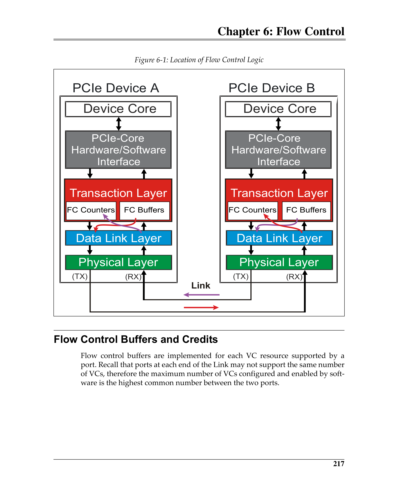

*Figure 6-1: Location of Flow Control Logic — FC is a shared responsibility between the Transaction Layer (counters) and Data Link Layer (DLLPs).*

### VC Flow Control Buffer Organization

Each VC Flow Control buffer at the receiver is managed for each category of transaction flowing through the virtual channel. These categories are:

- **Posted Transactions** — Memory Writes and Messages
- **Non-Posted Transactions** — Memory Reads, Configuration Reads and Writes, and I/O Reads and Writes
- **Completions** — Read and Write Completions

In addition, each of these categories is separated into header and data portions for transactions that have both header and data. This yields six different buffers each of which implements its own flow control (see Figure 6-2). Some transactions, like read requests, consist of a header only while others, like write requests, have both a header and data. The transmitter must ensure that both header and data buffer space is available as needed for a transaction before it can be sent. Note that transaction ordering must be maintained within a VC Flow Control buffer when the transactions are forwarded to software or to an egress port in the case of a switch. Consequently, the receiver must also track the order of header and data components within the buffer.

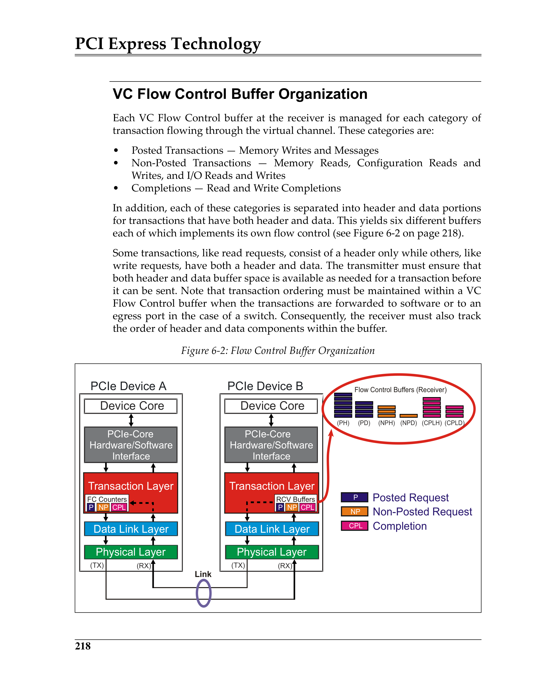

*Figure 6-2: Flow Control Buffer Organization — Six independent credit pools: PH, PD, NPH, NPD, CPLH, CPLD.*

---

## Flow Control Credits

Buffer space is reported by the receiver in units called Flow Control credits. The unit value of Flow Control Credits (FCCs) for header and data buffers are:

- **Header credits** — maximum header size + digest
  - 4 DWs for completions
  - 5 DWs for requests
- **Data credits** — 4 DWs (aligned 16 bytes)

Flow Control DLLPs communicate this information, and do not require Flow Control credits themselves. That's because they originate and terminate at the Link Layer and don't use the Transaction Layer buffers.

### Initial Flow Control Advertisement

During Flow Control initialization, PCIe devices communicate their buffer sizes by "advertising" their buffer space via flow control credits. PCIe also defines an infinite Flow Control credit value that is required for some buffers. A receiver that advertises infinite buffer space is effectively guaranteeing that its buffer space will never overflow.

### Minimum and Maximum Flow Control Advertisement

The specification defines the minimum number of credits that can be reported for the different Flow Control buffer types as listed in Table 6-1. However, devices normally advertise considerably more credits than the minimum. Table 6-2 lists the maximum advertisement allowed by the specification.

**Table 6-1: Required Minimum Flow Control Advertisements**

| Credit Type | Minimum Advertisement |
|-------------|----------------------|
| Posted Request Header (PH) | 1 unit. Credit Value = one 4DW HDR + Digest = 5DW. |
| Posted Request Data (PD) | Largest possible setting of the Max_Payload_Size in credits. Example: If the largest Max_Payload_Size value supported is 1024 bytes, the smallest permitted initial credit value would be 040h. |
| Non-Posted Request HDR (NPH) | 1 unit. Credit Value = one 4DW HDR + Digest = 5DW. |
| Non-Posted Request Data (NPD) | 1 unit. Credit Value = 4DW. 2 units for receivers supporting AtomicOp routing or AtomicOp Completer capability (credit value of 02h). |
| Completion HDR (CPLH) | 1 unit. Credit Value = one 3DW HDR + Digest = 4DW; for Root Complex with peer-to-peer support and Switches. **Infinite** units (Initial Credit Value = all 0's) for Root Complex with no peer-to-peer support and Endpoints. |
| Completion Data (CPLD) | n units. Value of largest possible setting of Max_Payload_Size or size of largest Read Request (whichever is smaller) divided by FC Unit Size (4DW); for Root Complex with peer-to-peer support and Switches. **Infinite** units (Initial Credit Value = all 0's) for Root Complex with no peer-to-peer support and Endpoints. |

**Table 6-2: Maximum Flow Control Advertisements**

| Credit Type | Maximum Advertisement |
|-------------|----------------------|
| Posted Request Header (PH) | 128 units. 128 credits @ 5 DWs = 2,560 bytes. |
| Posted Request Data (PD) | 2048 units. Value of the Max_Payload_Size (4096 bytes) including all functions supported by device (8) divided by the credit size (4 DWs) = 32,768 bytes. 2048 credits @ 4 DWs = 32,768 bytes. |
| Non-Posted Request HDR (NPH) | 128 units. 128 credits @ 5 DWs = 2,560 bytes. |
| Non-Posted Request Data (NPD) | The authors could not find a precise value. The maximum number of credits listed for Data is 2048. However, a more reasonable approach might use the Non-Posted header limit of 128 credits, because Non-Posted Data is always associated with Non-Posted Headers. |
| Completion HDR (CPLH) | 128 units. 128 credits @ 5 DWs = 2,560 bytes. This is the limit for ports that do not originate transactions (e.g., Root Complex with peer-to-peer support and Switches). **Infinite** units (Initial Credit Value = all 0's) for ports that originate transactions (e.g., Root Complex with no peer-to-peer support and Endpoints). |
| Completion Data (CPLD) | 2048 units. Value of the Max_Payload_Size (4096 bytes) including all functions supported by a device (8) divided by the credit size (4 DWs) = 32,768 bytes. 2048 credits @ 4 DWs = 32,768 bytes. **Infinite** units (Initial Credit Value = all 0's) for ports that originate transactions (e.g., Root Complex with no peer-to-peer support and Endpoints). |

### Infinite Credits

Note that a flow control value of 00h will be understood to mean infinite credits during initialization. Following Flow-Control initialization no further advertisements are made. Devices that originate transactions must reserve buffer space for the data or status information that will return during split transactions. These transaction combinations include:

- Non-posted Read requests and return of Completion Data
- Non-posted Read requests and return of Completion Status
- Non-posted Write requests and return of Completion Status

**Special Use for Infinite Credit Advertisements.** The specification points out a special consideration for devices that implement only VC0. For example, the only Non-Posted writes are I/O Writes and Configuration Writes both of which are permitted only on VC0. Thus, Non-Posted data buffers are not used for VC1 – VC7 and an infinite value can be advertised for those values. However, the Non-Posted Header must still operate and header credits must still need to be updated.

---

## Flow Control Initialization

### General

Prior to sending any transactions, flow control initialization is needed. In fact, TLPs cannot be sent across the Link until Flow Control Initialization is performed successfully. Initialization occurs on every Link in the system and involves a handshake between the devices at each end of a link. This process begins as soon as the Physical Layer link training has completed. The Link Layer knows the Physical Layer is ready when it observes the LinkUp signal is active, as illustrated in Figure 6-3.

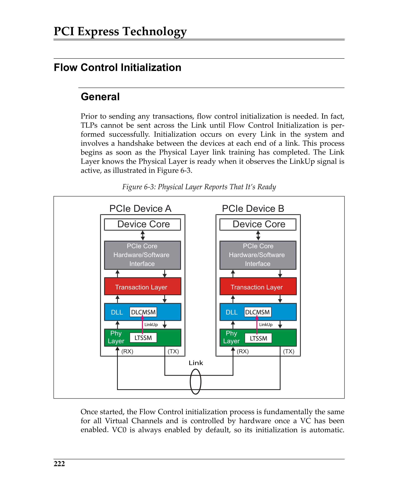

*Figure 6-3: Physical Layer Reports That It's Ready — The LTSSM asserts LinkUp to the DLCMSM.*

Once started, the Flow Control initialization process is fundamentally the same for all Virtual Channels and is controlled by hardware once a VC has been enabled. VC0 is always enabled by default, so its initialization is automatic. That allows configuration transactions to traverse the topology and carry out the enumeration process. Other VCs only initialize when configuration software has set up and enabled them at both ends of the Link.

### The FC Initialization Sequence

The flow control initialization process involves the Link Layer's DLCMSM (Data Link Control and Management State Machine). As shown in Figure 6-4, a reset puts the state machine into the DL_Inactive state. While in the DL_Inactive state, DL_Down is signaled to both the Link and Transaction Layers. Meanwhile, it waits to see LinkUp from the Physical Layer to indicate that the LTSSM has finished its work and the Physical Layer is ready. That causes a transition to the DL_Init sub-state, which contains two stages that handle flow control initialization: FC_INIT1 and FC_INIT2.

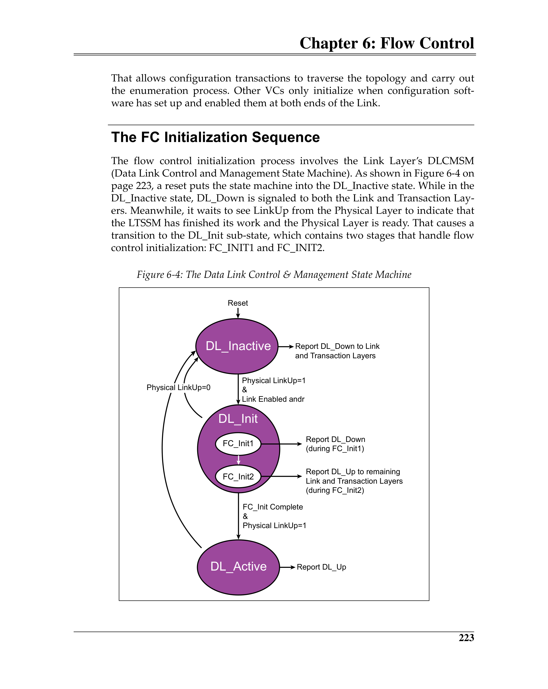

*Figure 6-4: The DLCMSM — DL_Inactive → DL_Init (FC_Init1 → FC_Init2) → DL_Active.*

### FC_Init1 Details

During the FC_INIT1 state, devices continuously send a sequence of 3 InitFC1 Flow Control DLLPs advertising their receiver buffer sizes (see Figure 6-5). According to the spec, the packets must be sent in this order: Posted, Non-posted, and Completions as illustrated in Figure 6-6. The specification strongly encourages that these be repeated frequently to make it easier for the receiving device to see them, especially if there are no TLPs or DLLPs to send. Each device should also receive this sequence from its neighbor so it can register the buffer sizes. Once a device has sent its own values and received the complete sequence enough times to be confident that the values were seen correctly, it's ready to exit FC_INIT1. To do that, it records the received values in its transmit counters, sets an internal flag (FL1), and changes to the FC_INIT2 state to begin the second initialization step.

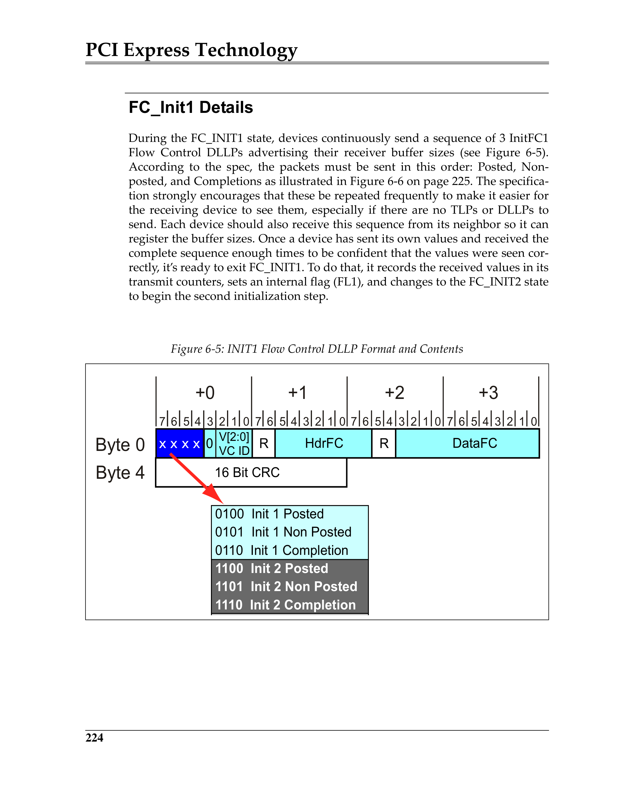

*Figure 6-5: InitFC1 DLLP Format — DLLP Type encodings: 0100 (Init1 Posted), 0101 (Init1 Non-Posted), 0110 (Init1 Completion).*

### FC_Init2 Details

In this state a device continuously sends InitFC2 DLLPs. These are sent in the same sequence as the InitFC1s and contain the same credit information, but they also confirm that FC initialization has succeeded at the sender. Since the device has already registered the values from the neighbor it doesn't need any more credit information and will ignore any incoming InitFC1s while it waits to see InitFC2s. It can even send TLPs at this point, even though initialization hasn't completed for the other side of the Link, and this is indicated to the Transaction Layer by the DL_Up signal (See Figure 6-7).

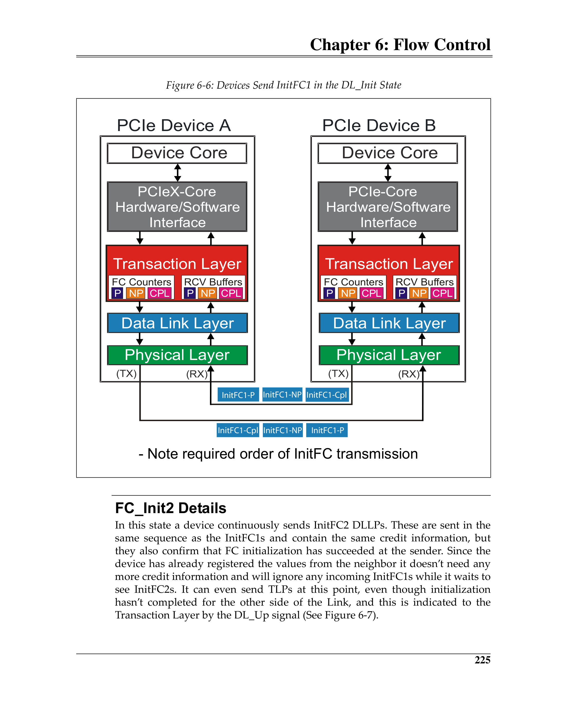

*Figure 6-6: Devices Send InitFC1 in the DL_Init State — Required order: InitFC1-P → InitFC1-NP → InitFC1-Cpl.*

**Why is this second initialization step needed?** The simple answer is that neighboring devices may finish FC initialization at different times and this method ensures that the late one will continue to receive the FC information it needs even if the neighbor finishes early. Once a device receives an FC_INIT2 packet for any buffer type, it sets an internal flag (FL2). (It doesn't wait to receive an FC_Init2 for each type.) Note that FL2 is also set upon receipt of an UpdateFC packet or TLP. When both sides are done and have sent InitFC2s, the DLCMSM transitions to the DL_Active state and the Link Layer is ready for normal operation.

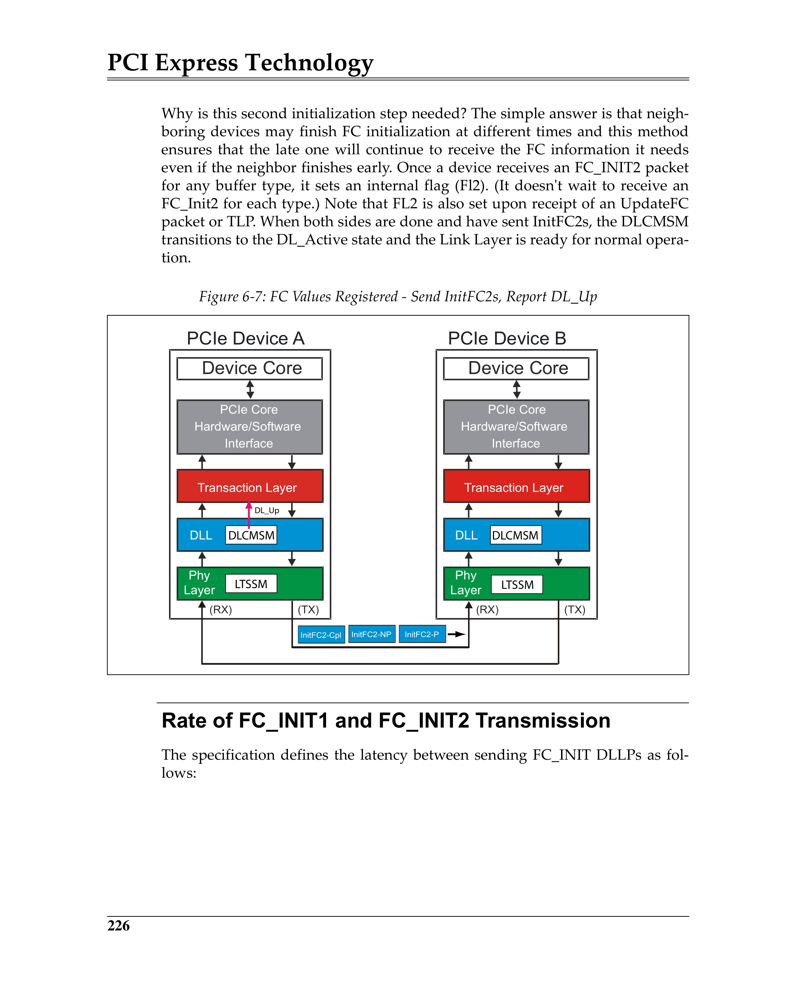

*Figure 6-7: FC Values Registered — Send InitFC2s, Report DL_Up to Transaction Layer.*

### Rate of FC_INIT1 and FC_INIT2 Transmission

The specification defines the latency between sending FC_INIT DLLPs as follows:

- **VC0.** Hardware-initiated flow control of VC0 requires that FC_INIT1 and FC_INIT2 packets be transmitted "continuously at the maximum rate possible." That is, the resend timer is set to a value of zero.

- **VC1–VC7.** When software initiates flow control initialization for other VCs, the FC_INIT sequence is repeated "when no other TLPs or DLLPs are available for transmission." However, the latency between the beginning of one sequence to the next can be no greater than 17 μs.

### Violations of the Flow Control Initialization Protocol

A violation of the flow control initialization protocol can be optionally checked by a device. An error detected can be reported as a Data Link Layer protocol error.

---

## Introduction to the Flow Control Mechanism

### General

The specification defines the requirements of the Flow Control mechanism using registers, counters, and mechanisms for reporting, tracking, and calculating whether a transaction can be sent. These elements are not required and the actual implementation is left to the device designer. This section introduces the specification model and serves to explain the concepts and to define the requirements.

### The Flow Control Elements

Figure 6-8 illustrates the elements used for managing flow control. The diagram shows transactions flowing in a single direction across a Link, and another set of these elements supports transfers in the opposite direction. The primary function of each element is listed below. While these Flow Control elements are duplicated for all six receive buffers, for simplicity this example only deals with non-posted header flow control.

One final element associated with managing flow control is the Flow Control Update DLLP. This is the only Flow Control packet that is used during normal transmission. The format of the FC Update packet is illustrated in Figure 6-9.

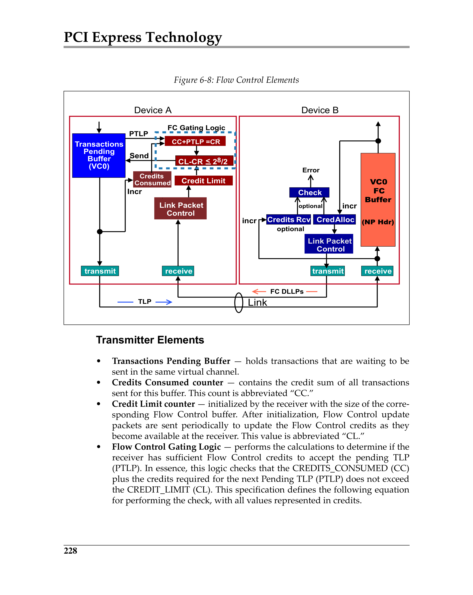

*Figure 6-8: Flow Control Elements — Transmitter side: Transactions Pending Buffer, Credits Consumed (CC), Credit Limit (CL), FC Gating Logic. Receiver side: FC Buffer, Credits Allocated (CrAl), Credits Received (CrRcv, optional).*

### Transmitter Elements

- **Transactions Pending Buffer** — holds transactions that are waiting to be sent in the same virtual channel.

- **Credits Consumed counter** — contains the credit sum of all transactions sent for this buffer. This count is abbreviated "CC."

- **Credit Limit counter** — initialized by the receiver with the size of the corresponding Flow Control buffer. After initialization, Flow Control update packets are sent periodically to update the Flow Control credits as they become available at the receiver. This value is abbreviated "CL."

- **Flow Control Gating Logic** — performs the calculations to determine if the receiver has sufficient Flow Control credits to accept the pending TLP (PTLP). In essence, this logic checks that the CREDITS_CONSUMED (CC) plus the credits required for the next Pending TLP (PTLP) does not exceed the CREDIT_LIMIT (CL). This specification defines the following equation for performing the check, with all values represented in credits:

```
(CL - (CC + PTLP)) mod 2^FieldSize ≤ 2^(FieldSize/2)
```

### Receiver Elements

- **Flow Control Buffer** — stores incoming headers or data.

- **Credit Allocated** — tracks the total Flow Control credits that have been allocated (made available). It's initialized by hardware to reflect the size of the associated Flow Control buffer. The buffer fills as transactions arrive but then they are eventually removed from the buffer by the core logic at the receiver. When they are removed, the number of Flow Control credits is added to the CREDIT_ALLOCATED counter. Thus the counter tracks the number of credits currently available.

- **Credits Received counter (optional)** — tracks the total credits of all TLPs received into the Flow Control buffer. When flow control is functioning properly, the CREDITS_RECEIVED count should be equal to or less than the CREDIT_ALLOCATED count. If this test ever becomes false, a flow control buffer overflow has occurred and an error is detected. The spec recommends that this optional mechanism be implemented and notes that a failure here will be considered a fatal error.

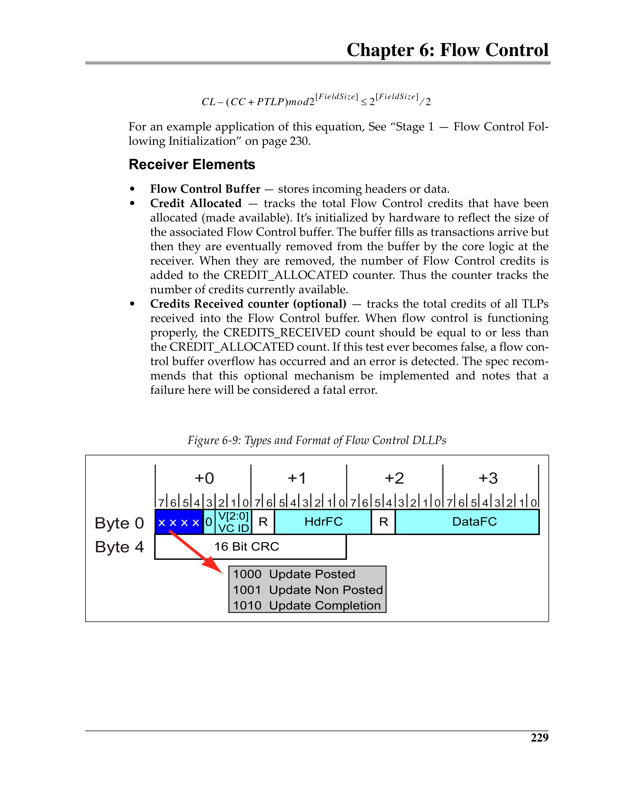

*Figure 6-9: Types and Format of Flow Control DLLPs — DLLP Type encodings: 1000 (Update Posted), 1001 (Update Non-Posted), 1010 (Update Completion).*

---

## Flow Control Example

The following example describes the non-posted header Flow Control buffer, and attempts to capture the nuances of the flow control implementation in several situations. The discussion of Flow Control is described with a series of basic stages as follows:

- **Stage One** — Immediately following initialization a transaction is transmitted and tracked to explain the basic operation of the counters and registers.
- **Stage Two** — The transmitter sends transactions faster than the receiver can process them and the buffer becomes full.
- **Stage Three** — When counters roll over to zero, the mechanism still works but there are a couple of issues to consider.
- **Stage Four** — The optional receiver error check for a buffer overflow.

### Stage 1 — Flow Control Following Initialization

Once flow control initialization has completed, the devices are ready for normal operation. The Flow Control buffer in our example is 2KB in size. We're describing the non-posted header buffer, and each credit is 5 dwords in size or 20 bytes. That means 102d (66h) Flow Control units are available. Figure 6-10 illustrates the elements involved, including the values that would be in each counter and register following flow control initialization.

When the transmitter is ready to send a TLP, it must first check Flow Control credits. Our example is simple because a non-posted header is the only packet being sent and it always requires just one Flow Control credit, and we are also assuming that no data is included in the transaction.

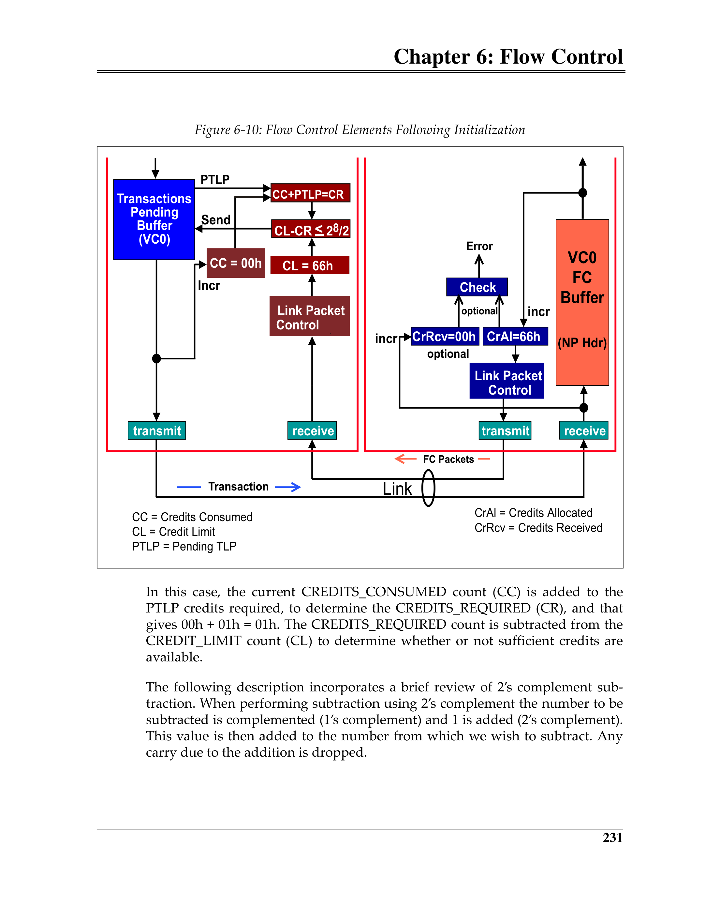

*Figure 6-10: Flow Control Elements Following Initialization — CL = 66h, CC = 00h, CrAl = 66h, CrRcv = 00h.*

The header credit check is made using unsigned arithmetic (2's complement), and must satisfy the following formula:

```
(CL - (CC + PTLP)) mod 2^FieldSize ≤ 2^(FieldSize/2)
```

Substituting values from Figure 6-10 yields:

```
(66h - (00h + 01h)) mod 256 ≤ 80h
(66h - 01h) mod 256 ≤ 80h
65h ≤ 80h → Yes, sufficient credits!
```

In this case, the current CREDITS_CONSUMED count (CC) is added to the PTLP credits required, to determine the CREDITS_REQUIRED (CR), and that gives 00h + 01h = 01h. The CREDITS_REQUIRED count is subtracted from the CREDIT_LIMIT count (CL) to determine whether or not sufficient credits are available.

**Credit Check (2's complement subtraction detail):**

```
CL  01100110b (66h)
CR  00000001b (01h)

CR inverted:     11111110b
+ 1:             11111111b (2's complement of CR)

CL                01100110b
2's comp of CR  + 11111111b
                 -----------
Result:          01100101b = 65h (carry bit is dropped)

Is 65h ≤ 80h? Yes → Send TLP
```

If the subtraction result is equal to or less than half the max value, which is tracked with a modulo 256 counter (128), then we know there is sufficient space in the receiver buffer and this packet can be sent. The decision to use only half the counter value avoids a potential count alias problem (see Stage 3).

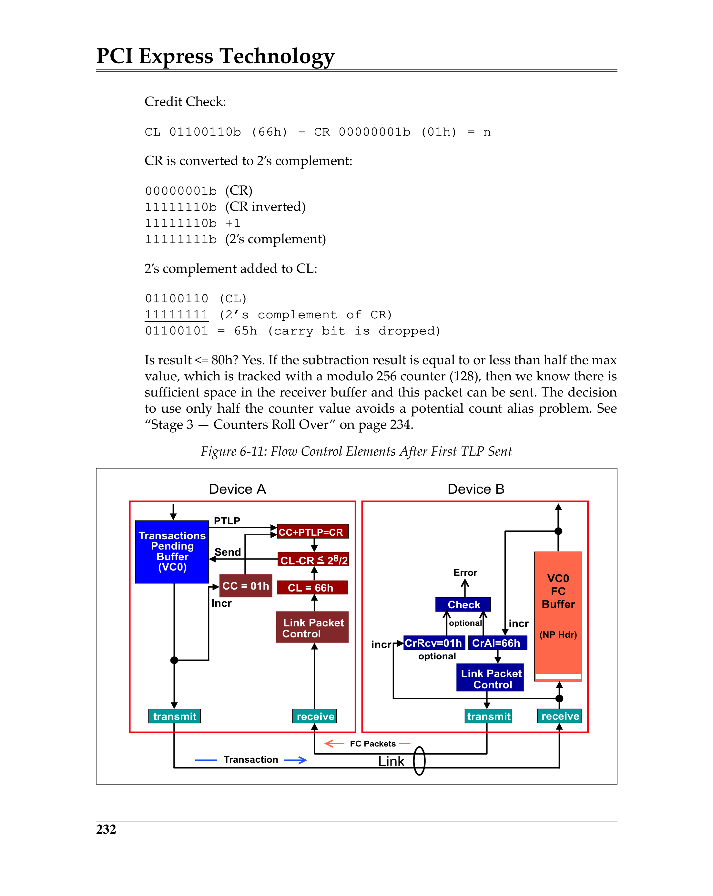

*Figure 6-11: Flow Control Elements After First TLP Sent — CC increments from 00h → 01h, CrRcv increments from 00h → 01h.*

### Stage 2 — Flow Control Buffer Fills Up

Assume now that the receiver has been unable to remove transactions from the Flow Control buffer for some time. Perhaps the device core logic was temporarily busy and unable to process transactions. Eventually, the Flow Control buffer becomes completely full, as shown in Figure 6-12.

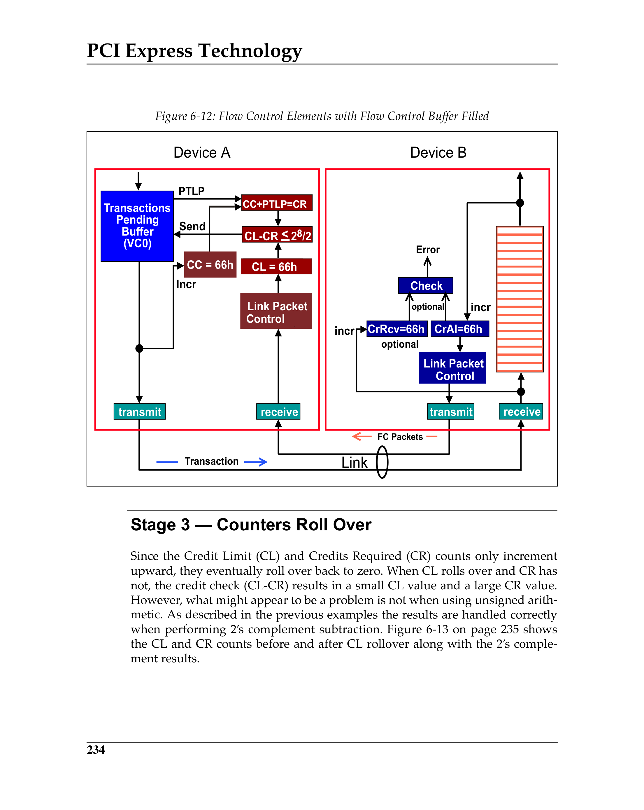

*Figure 6-12: Flow Control Elements with Flow Control Buffer Filled — CL = 66h, CC = 66h, buffer exhausted.*

If the transmitter wishes to send another TLP and checks the Flow Control credits:

```
Credit Limit (CL)   = 66h
Credits Required (CR) = 67h

CL  01100110b (66h)
CR  10011001b (2's complement of 67h)
    ----------
    11111111b = FFh

Is FFh ≤ 80h? No → Don't send packet — BLOCKED
```

This channel is blocked until an Update Flow Control DLLP is received with a new CREDIT_LIMIT value of 67h or greater. When the new value is loaded into the CL register the transmitter credit check will pass the test and a TLP can be sent:

```
CL  01100111b (67h)
CR  10011001b (2's complement of 67h)
    ----------
    00000000b = 00h

Is 00h ≤ 80h? Yes → Send transaction
```

### Stage 3 — Counters Roll Over

Since the Credit Limit (CL) and Credits Required (CR) counts only increment upward, they eventually roll over back to zero. When CL rolls over and CR has not, the credit check (CL − CR) results in a small CL value and a large CR value. However, what might appear to be a problem is not when using unsigned arithmetic. As described in the previous examples the results are handled correctly when performing 2's complement subtraction. Figure 6-13 shows the CL and CR counts before and after CL rollover along with the 2's complement results.

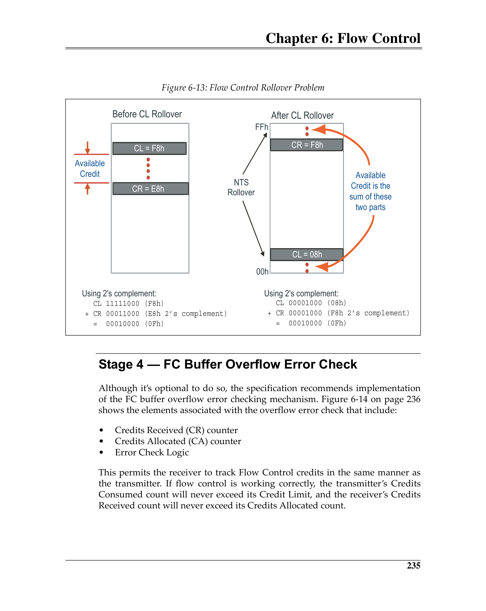

*Figure 6-13: Flow Control Rollover Problem — 2's complement arithmetic handles counter rollover correctly.*

**Before CL Rollover:**
```
CL = F8h, CR = E8h
CL  11111000b (F8h)
CR  00011000b (E8h 2's complement)
    ----------
    00010000b = 10h (Available credit)
```

**After CL Rollover:**
```
CL = 08h, CR = F8h
CL  00001000b (08h)
CR  00001000b (F8h 2's complement)
    ----------
    00010000b = 10h (Same available credit!)
```

The result is the same — 2's complement subtraction handles the rollover transparently.

### Stage 4 — FC Buffer Overflow Error Check

Although it's optional to do so, the specification recommends implementation of the FC buffer overflow error checking mechanism. Figure 6-14 shows the elements associated with the overflow error check that include:

- Credits Received (CR) counter
- Credits Allocated (CA) counter
- Error Check Logic

This permits the receiver to track Flow Control credits in the same manner as the transmitter. If flow control is working correctly, the transmitter's Credits Consumed count will never exceed its Credit Limit, and the receiver's Credits Received count will never exceed its Credits Allocated count.

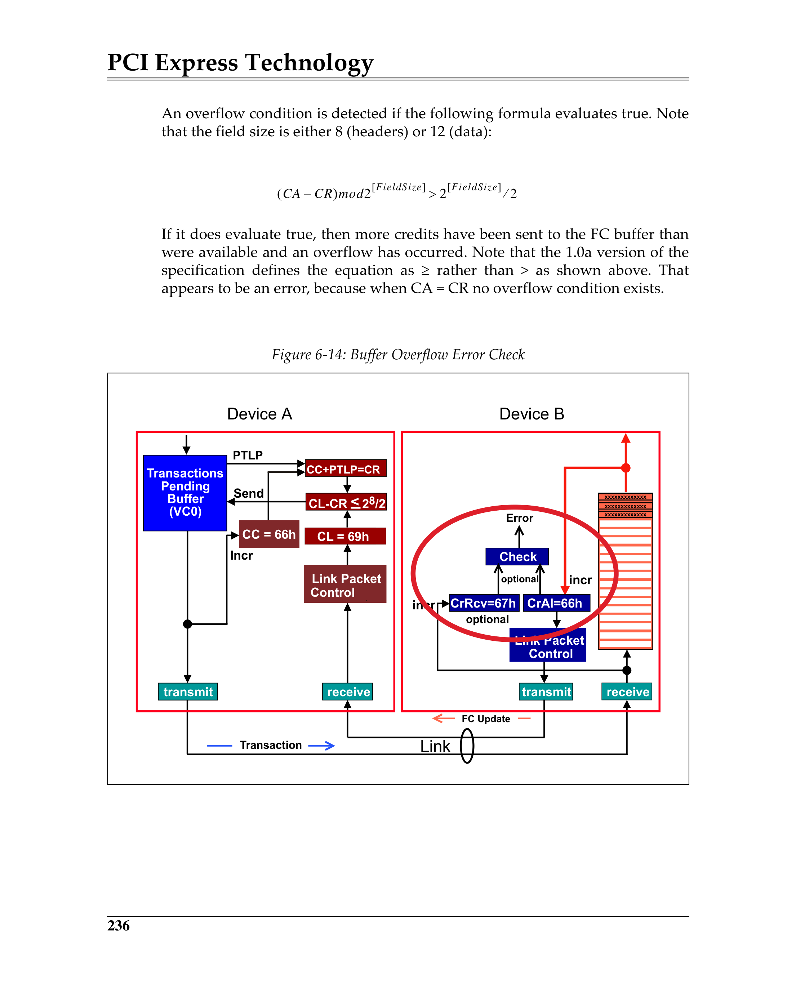

*Figure 6-14: Buffer Overflow Error Check — CL = 69h, CC = 66h, CrAl = 66h. CrRcv = 67h indicates overflow (67h > 66h).*

An overflow condition is detected if the following formula evaluates true (Field Size is either 8 for headers or 12 for data):

```
(CA - CR) mod 2^FieldSize > 2^(FieldSize/2)
```

If it does evaluate true, then more credits have been sent to the FC buffer than were available and an overflow has occurred. Note that the 1.0a version of the specification defines the equation as ≥ rather than > as shown above. That appears to be an error, because when CA = CR no overflow condition exists.

---

## Flow Control Updates

The receiver must regularly update its neighboring device with Flow Control credits that become available when transactions are removed from the buffer. Figure 6-15 illustrates an example where the transmitter was previously blocked from sending header transactions because the buffer was full.

In the illustration, the receiver has just removed three headers from the Flow Control buffer. More space is now available, but the neighboring device is unaware of this. As headers are removed from the buffer, the CREDITS_ALLOCATED count increments from 66h to 69h. This new count is reported to the CREDIT_LIMIT register of the neighboring device using a Flow Control update packet. Once the credit limit has been updated, transmission of additional TLPs can proceed.

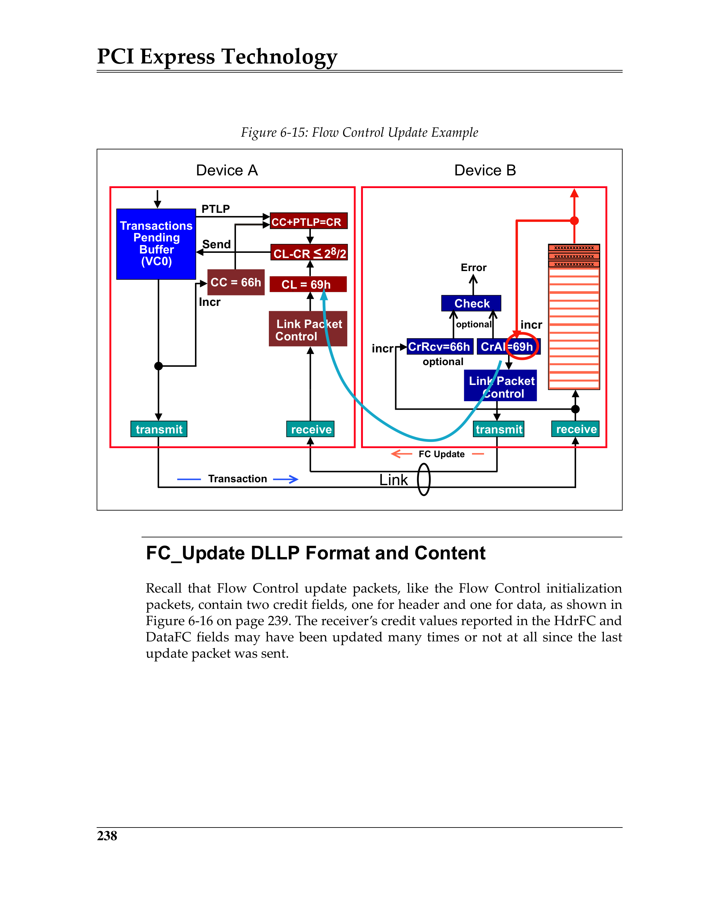

*Figure 6-15: Flow Control Update Example — CrAl increments from 66h → 69h as 3 headers are removed.*

**Why report the absolute value and not the delta?** An interesting note here is that the update reports the actual value of the Credits Allocated register. It would have worked to report just the change in the register, as perhaps "+3 credits on NP Headers" for example, but that represents a potential problem. To understand the risk, consider what would happen if the DLLP containing that increment information was lost for some reason. There is no replay mechanism for DLLPs; if an error occurs the packet is simply dropped. In this case, the increment information would be lost without a means of recovering it.

If, on the other hand, the actual value of the register is reported instead and the DLLP fails, the next DLLP that succeeds will get the counters back in synchronization. In that case some time might be wasted if the transmitter is waiting on the FC credits before it can send the next TLP, but no information is lost.

### FC_Update DLLP Format and Content

Recall that Flow Control update packets, like the Flow Control initialization packets, contain two credit fields, one for header and one for data, as shown in Figure 6-16. The receiver's credit values reported in the HdrFC and DataFC fields may have been updated many times or not at all since the last update packet was sent.

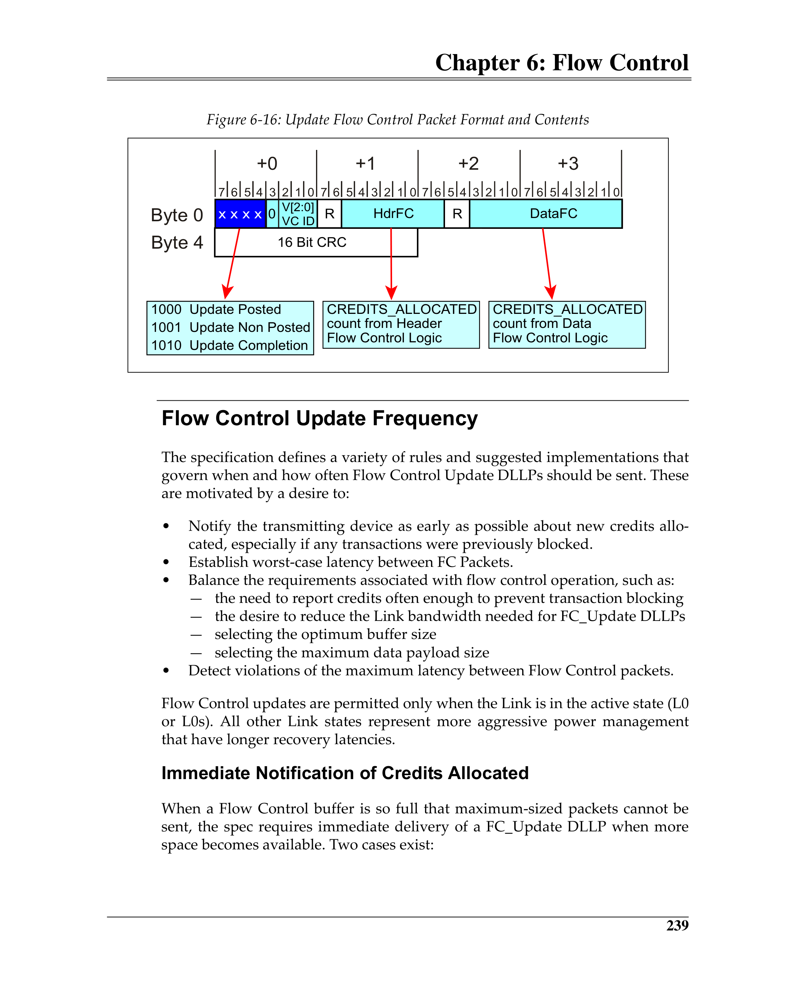

*Figure 6-16: UpdateFC DLLP Format — HdrFC and DataFC fields carry the CREDITS_ALLOCATED count. DLLP Type encodings: 1000 (Update Posted), 1001 (Update Non-Posted), 1010 (Update Completion).*

---

## Flow Control Update Frequency

The specification defines a variety of rules and suggested implementations that govern when and how often Flow Control Update DLLPs should be sent. These are motivated by a desire to:

- Notify the transmitting device as early as possible about new credits allocated, especially if any transactions were previously blocked.
- Establish worst-case latency between FC Packets.
- Balance the requirements associated with flow control operation, such as:
  - the need to report credits often enough to prevent transaction blocking
  - the desire to reduce the Link bandwidth needed for FC_Update DLLPs
  - selecting the optimum buffer size
  - selecting the maximum data payload size
- Detect violations of the maximum latency between Flow Control packets.

Flow Control updates are permitted only when the Link is in the active state (L0 or L0s). All other Link states represent more aggressive power management that have longer recovery latencies.

### Immediate Notification of Credits Allocated

When a Flow Control buffer is so full that maximum-sized packets cannot be sent, the spec requires immediate delivery of a FC_Update DLLP when more space becomes available. Two cases exist:

- **Maximum Packet Size = 1 Credit.** When packet transmission is blocked due to a buffer full condition for non-infinite NPH, NPD, PH, and CPLH buffer types, an UpdateFC packet must be scheduled for transmission when one or more credits are made available (allocated) for that buffer type.

- **Maximum Packet Size = Max_Payload_Size.** Flow Control buffer space may decrease to the extent that a maximum-sized packet cannot be sent for non-infinite PD and CPLD credit types. In this case, when one or more additional credits are allocated, an Update FCP must be scheduled for transmission.

### Maximum Latency Between Update Flow Control DLLPs

The transmission frequency of Update FCPs for each FC credit type (non-infinite) must be scheduled for transmission at least once every 30 μs (−0%/+50%). If the Extended Sync bit within the Control Link register is set, updates must be scheduled no later than every 120 μs (−0%/+50%). Note that Update FCPs may be scheduled for transmission more frequently than is required.

### Calculating Update Frequency Based on Payload Size and Link Width

The specification offers a formula for calculating the frequency at which update packets need to be sent for maximum data payload sizes and Link widths. The formula, shown below, defines FC Update delivery intervals in symbol times. For reference, a symbol time is defined as the time it takes to deliver one symbol: 4ns for Gen1, 2ns for Gen2, 1ns for Gen3.

```
(MaxPayloadSize + TLPOverhead) × UpdateFactor
───────────────────────────────────────────────  +  InternalDelay
                  LinkWidth
```

Where:

- **MaxPayloadSize** = The value in the Max_Payload_Size field of the Device Control register
- **TLPOverhead** = the constant value (28 symbols) representing the additional TLP components that consume Link bandwidth (TLP Prefix, Sequence Number, Packet Header, LCRC, Framing Symbols)
- **UpdateFactor** = the number of maximum size TLPs sent during the interval between UpdateFC Packets received. This number is intended to balance Link bandwidth efficiency and receive buffer sizes – the value varies with Max_Payload_Size and Link width
- **LinkWidth** = The number of Lanes the Link is using
- **InternalDelay** = a constant value of 19 symbol times that represents the internal processing delays for received TLPs and transmitted DLLPs

The relationship defined by the formula shows that the frequency of update packet delivery decreases as the Link width increases and suggests a timer that triggers scheduling of update packets. Note that this formula does not account for delays associated with the receiver or transmitter being in the L0s power management state.

**Table 6-3: Gen1 Unadjusted FC Update LATENCY TIMER Values (Symbol Times)**

| Max Payload | ×1 Link | ×2 Link | ×4 Link | ×8 Link | ×12 Link | ×16 Link | ×32 Link |
|-------------|---------|---------|---------|---------|----------|----------|----------|
| 128 Bytes | 237 (UF=1.4) | 128 (UF=1.4) | 73 (UF=1.4) | 67 (UF=2.5) | 58 (UF=3.0) | 48 (UF=3.0) | 33 (UF=3.0) |
| 256 Bytes | 416 (UF=1.4) | 217 (UF=1.4) | 118 (UF=1.4) | 107 (UF=2.5) | 90 (UF=3.0) | 72 (UF=3.0) | 45 (UF=3.0) |
| 512 Bytes | 559 (UF=1.0) | 289 (UF=1.0) | 154 (UF=1.0) | 86 (UF=1.0) | 109 (UF=2.0) | 86 (UF=2.0) | 52 (UF=2.0) |
| 1024 Bytes | 1071 (UF=1.0) | 545 (UF=1.0) | 282 (UF=1.0) | 150 (UF=1.0) | 194 (UF=2.0) | 150 (UF=2.0) | 84 (UF=2.0) |
| 2048 Bytes | 2095 (UF=1.0) | 1057 (UF=1.0) | 538 (UF=1.0) | 278 (UF=1.0) | 365 (UF=2.0) | 278 (UF=2.0) | 148 (UF=2.0) |
| 4096 Bytes | 4143 (UF=1.0) | 2081 (UF=1.0) | 1050 (UF=1.0) | 534 (UF=1.0) | 706 (UF=2.0) | 534 (UF=2.0) | 276 (UF=2.0) |

**Table 6-4: Gen2 Unadjusted FC Update LATENCY TIMER Values (Symbol Times)**

| Max Payload | ×1 Link | ×2 Link | ×4 Link | ×8 Link | ×12 Link | ×16 Link | ×32 Link |
|-------------|---------|---------|---------|---------|----------|----------|----------|
| 128 Bytes | 288 (UF=1.4) | 179 (UF=1.4) | 124 (UF=1.4) | 118 (UF=2.5) | 109 (UF=3.0) | 99 (UF=3.0) | 84 (UF=3.0) |
| 256 Bytes | 467 (UF=1.4) | 268 (UF=1.4) | 169 (UF=1.4) | 158 (UF=2.5) | 141 (UF=3.0) | 123 (UF=3.0) | 96 (UF=3.0) |
| 512 Bytes | 610 (UF=1.0) | 340 (UF=1.0) | 205 (UF=1.0) | 137 (UF=1.0) | 160 (UF=2.0) | 137 (UF=2.0) | 103 (UF=2.0) |
| 1024 Bytes | 1122 (UF=1.0) | 596 (UF=1.0) | 333 (UF=1.0) | 201 (UF=1.0) | 245 (UF=2.0) | 201 (UF=2.0) | 135 (UF=2.0) |
| 2048 Bytes | 2146 (UF=1.0) | 1108 (UF=1.0) | 589 (UF=1.0) | 329 (UF=1.0) | 416 (UF=2.0) | 329 (UF=2.0) | 199 (UF=2.0) |
| 4096 Bytes | 4194 (UF=1.0) | 2132 (UF=1.0) | 1101 (UF=1.0) | 585 (UF=1.0) | 757 (UF=2.0) | 585 (UF=2.0) | 327 (UF=2.0) |

**Table 6-5: Gen3 Unadjusted FC Update LATENCY TIMER Values (Symbol Times)**

| Max Payload | ×1 Link | ×2 Link | ×4 Link | ×8 Link | ×12 Link | ×16 Link | ×32 Link |
|-------------|---------|---------|---------|---------|----------|----------|----------|
| 128 Bytes | 333 (UF=1.4) | 224 (UF=1.4) | 169 (UF=1.4) | 163 (UF=2.5) | 154 (UF=3.0) | 144 (UF=3.0) | 129 (UF=3.0) |
| 256 Bytes | 512 (UF=1.4) | 313 (UF=1.4) | 214 (UF=1.4) | 203 (UF=2.5) | 186 (UF=3.0) | 168 (UF=3.0) | 141 (UF=3.0) |
| 512 Bytes | 655 (UF=1.0) | 385 (UF=1.0) | 250 (UF=1.0) | 182 (UF=1.0) | 205 (UF=2.0) | 182 (UF=2.0) | 148 (UF=2.0) |
| 1024 Bytes | 1167 (UF=1.0) | 641 (UF=1.0) | 378 (UF=1.0) | 246 (UF=1.0) | 290 (UF=2.0) | 246 (UF=2.0) | 180 (UF=2.0) |
| 2048 Bytes | 2191 (UF=1.0) | 1153 (UF=1.0) | 643 (UF=1.0) | 374 (UF=1.0) | 461 (UF=2.0) | 374 (UF=2.0) | 244 (UF=2.0) |
| 4096 Bytes | 4239 (UF=1.0) | 2177 (UF=1.0) | 1146 (UF=1.0) | 630 (UF=1.0) | 802 (UF=2.0) | 630 (UF=2.0) | 372 (UF=2.0) |

*UF = UpdateFactor*

The specification recognizes that the formula will be inadequate for many applications such as those that stream large blocks of data. These applications may require buffer sizes larger than the minimum specified, as well as a more sophisticated update policy in order to optimize performance and reduce power consumption. Because a given solution is dependent on the particular requirements of an application, no definition for such policies is provided.

---

## Error Detection Timer — A Pseudo Requirement

The specification defines an optional time-out mechanism for Flow Control packets that is highly recommended and may become a requirement in future versions of the specification. The maximum latency between FC packets for a given credit type is 120 μs, and this timeout has a maximum limit of 200 μs. A separate timer is implemented for each FC credit type (P, NP, Cpl), and each timer is reset when a FC Update DLLP of the corresponding type is received. Note that a timer associated with infinite FC credit values must not report an error.

Apart from the infinite case, a timeout implies a serious problem with the Link. If it occurs, the Physical Layer is signaled to go into the Recovery state and retrain the Link in hopes of clearing the error condition. Timer characteristics include:

- Operates only when the Link is in an active state (L0 or L0s).
- Max time limited to 200 μs (−0%/+50%).
- Timer is reset when any Init or Update FCP is received, or optionally by receipt of any DLLP.
- Timeout forces the Physical Layer to enter Link Training and Status State Machine (LTSSM) Recovery state.

---

## Figures Reference

| Figure | Description | Page |
|--------|-------------|------|
| 6-1 | Location of Flow Control Logic | 276 |
| 6-2 | Flow Control Buffer Organization (6 credit pools) | 277 |
| 6-3 | Physical Layer Reports That It's Ready (LinkUp) | 281 |
| 6-4 | Data Link Control & Management State Machine (DLCMSM) | 282 |
| 6-5 | InitFC1 Flow Control DLLP Format and Contents | 283 |
| 6-6 | Devices Send InitFC1 in the DL_Init State | 284 |
| 6-7 | FC Values Registered — Send InitFC2s, Report DL_Up | 285 |
| 6-8 | Flow Control Elements (Transmitter + Receiver) | 287 |
| 6-9 | Types and Format of Flow Control DLLPs (Init vs Update) | 288 |
| 6-10 | Flow Control Elements Following Initialization | 290 |
| 6-11 | Flow Control Elements After First TLP Sent | 291 |
| 6-12 | Flow Control Elements with Flow Control Buffer Filled | 293 |
| 6-13 | Flow Control Rollover Problem (2's complement) | 294 |
| 6-14 | Buffer Overflow Error Check | 295 |
| 6-15 | Flow Control Update Example | 297 |
| 6-16 | Update Flow Control Packet Format and Contents | 298 |

## Tables Reference

| Table | Description | Page |
|-------|-------------|------|
| 6-1 | Required Minimum Flow Control Advertisements | 278–279 |
| 6-2 | Maximum Flow Control Advertisements | 279–280 |
| 6-3 | Gen1 Unadjusted FC Update LATENCY TIMER Values | 300 |
| 6-4 | Gen2 Unadjusted FC Update LATENCY TIMER Values | 300–301 |
| 6-5 | Gen3 Unadjusted FC Update LATENCY TIMER Values | 301–302 |
