# Chapter 7: Quality of Service
# 第7章：服务质量 (QoS)

> 中英文对照翻译 | Chinese-English Parallel Translation
> Source: MindShare PCI Express Technology 3.0 — Pages: 304–344 (41 pages)

---

## QoS Overview / 服务质量概述

Quality of Service (QoS) in PCIe provides differentiated treatment of traffic flows, ensuring high-priority traffic is not blocked or excessively delayed by lower-priority traffic. Without QoS, all TLPs share the same queues and a single congested flow can degrade performance for all traffic on the Link.

> PCIe中的服务质量提供差异化流量处理，确保高优先级流量不被低优先级流量阻塞或过度延迟。无QoS时所有TLP共享相同队列，单个拥塞流可降低所有流量性能。

QoS is implemented through two orthogonal mechanisms: **Traffic Classes (TC)** — labels on TLPs identifying QoS requirements — and **Virtual Channels (VC)** — independent buffer and flow control resources providing physical separation.

> QoS通过两个正交机制实现：流量类别(TC)——TLP上标识QoS需求的标签；虚拟通道(VC)——独立缓冲和流控资源提供物理分离。

---

## Traffic Classes (TC0-TC7) / 流量类别

Each TLP carries a 3-bit TC field in its header (offset within the TLP header), allowing assignment of one of eight priority levels. **TC0 is the default** — all TLPs must use TC0 unless TC/VC mapping is configured. The TC label travels with the TLP through the entire PCIe fabric — every Switch and the Root Complex respect the assigned TC.

> 每个TLP头部携带3位TC字段，可分配8个优先级之一。TC0为默认——除非配了TC/VC映射，所有TLP必须使用TC0。TC标签随TLP穿越整个PCIe结构。

TC assignment is determined by device driver or hardware based on transaction nature. A typical assignment might be: TC0 for bulk data, TC1 for control, TC2 for isochronous streaming. However, PCIe does NOT specify which TC maps to which purpose — that is defined by system software or device-specific usage models. This flexibility allows different system designs to optimize TC assignments for their specific workloads.

> TC分配由设备驱动或硬件根据事务性质决定。PCIe不规定哪种TC用于哪种目的——由系统软件或设备特定使用模型定义。这种灵活性允许不同系统设计针对其特定工作负载优化TC分配。

---

## Virtual Channels (VC0-VC7) / 虚拟通道

Each Virtual Channel provides an independent set of FC buffers (for all six credit types), independent ordering queues, and independent arbitration logic. **VC0 is the mandatory default** — it must always be present. VC0 carries all traffic before VC configuration and any traffic whose TC is not explicitly mapped to another VC.

> 每个虚拟通道提供独立的FC缓冲(全部六种信用类型)、独立排序列和独立仲裁逻辑。VC0是强制默认——VC配置前承载所有流量，未显式映射到其他VC的TC流量也走VC0。

The VC mechanism provides **physical separation**: a TLP on VC1 consumes VC1's flow control credits, not VC0's. A blocked VC (full receiver buffer) does NOT affect traffic on other VCs. This is the fundamental value of VCs — head-of-line blocking elimination. If VC1's buffer is full (waiting for the application to consume Completions), VC0 traffic continues unimpeded.

> VC机制提供物理分离：VC1上的TLP消耗VC1的流控信用，不消耗VC0。被阻塞的VC不影响其他VC流量——消除头阻塞的根本价值。若VC1缓冲满，VC0流量不受影响。

The number of VCs a device supports is reported through the VC Extended Capability structure (ECAP ID 0002h or 0009h). Software enables only the intersection of VCs supported by both Link partners.

---

## TC/VC Mapping / TC到VC映射

Software configures TC/VC mapping through the VC Extended Capability registers. The mapping assigns each TC to one VC. Multiple TCs can map to the same VC (consolidation for similar-priority traffic) or each TC can map to its own VC (separation for strict QoS). Unmapped TCs default to VC0.

> 软件通过VC Extended Capability寄存器配置TC/VC映射。多个TC可合并到同一VC或每个TC映射到自己的VC。未映射TC默认到VC0。

Example: TC0→VC0 (default bulk), TC1-3→VC0 (consolidated), TC4→VC1 (isochronous), TC5-6→VC2 (control), TC7→VC3 (management). The optimal mapping depends on traffic mix, available VCs, and performance requirements.

> 映射示例：TC0-3→VC0合并，TC4→VC1等时，TC5-6→VC2控制，TC7→VC3管理。最佳映射取决于流量组合、可用VC和性能需求。

---

## VC Arbitration / VC仲裁

When multiple VCs have packets ready, the port must decide which VC transmits next. Two arbitration schemes are defined:

**Strict Priority Arbitration:** Each VC assigned a priority level (0-7, 7=highest). Higher-priority VC always wins. Provides strong QoS guarantees but can starve lower-priority VCs if higher-priority traffic is continuous. Best for isochronous traffic that requires guaranteed bounded latency.

**Round-Robin Arbitration (RR) / Weighted Round-Robin (WRR):** VCs serviced in cyclic order. WRR adds programmable weights allocating proportional bandwidth (e.g., VC0: 50%, VC1: 30%, VC2: 20%). Prevents starvation. Best for fair sharing among multiple data flows.

> 严格优先级——高优先级VC总是获胜，提供强QoS保证但可能饿死低优先级。轮询/加权轮询——VC按循环顺序服务，加权分配比例带宽(如50%/30%/20%)，防止饥饿。

Arbitration is configured per VC through the **VC Resource Control Register** and the **Port Arbitration Table**. The table specifies the arbitration scheme and the weights/priority for each VC phase. Arbitration runs at the Physical Layer — as symbols/blocks are serialized onto the Link, the arbitration logic selects which VC's next chunk is transmitted.

> 仲裁通过VC Resource Control Register和Port Arbitration Table按VC配置。表指定仲裁方案和每VC阶段的权重/优先级。仲裁在物理层运行。

---

## Isochronous Support / 等时支持

Isochronous traffic requires guaranteed bandwidth and bounded latency — essential for audio/video streaming, real-time control, and sensor data. PCIe supports isochronous contracts through:

1. **Isolation:** Isochronous traffic on a dedicated VC with strict priority arbitration
2. **Bandwidth Reservation:** The Isochronous Virtual Channel Extended Capability to negotiate and enforce bandwidth contracts
3. **Bounded Latency:** Strict priority ensures isochronous packets bypass lower-priority bulk traffic

The Isochronous VC capability is typically used in embedded and consumer electronics applications (set-top boxes, automotive, medical imaging) where deterministic latency is critical.

> 等时流量需保证带宽和有界延迟——对音频/视频流、实时控制、传感器数据至关重要。PCIe通过隔离到专用VC+严格优先级仲裁、带宽预留的Isochronous VC Extended Capability以及严格优先级确保等时包超越低优先级批量流量来支持。

---

## Key Figures / 关键图示

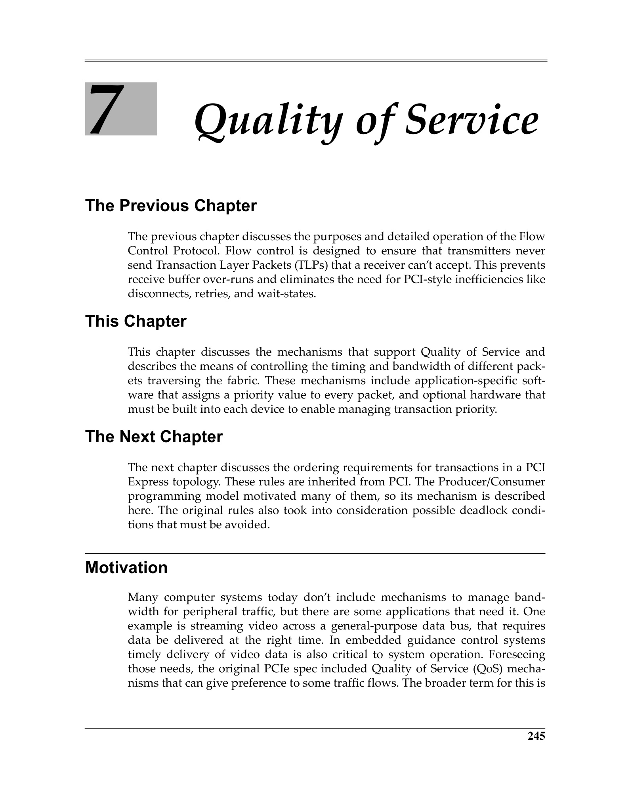
 <em>Figure from ch07 (p.304) / ch07插图 (p.304)</em>

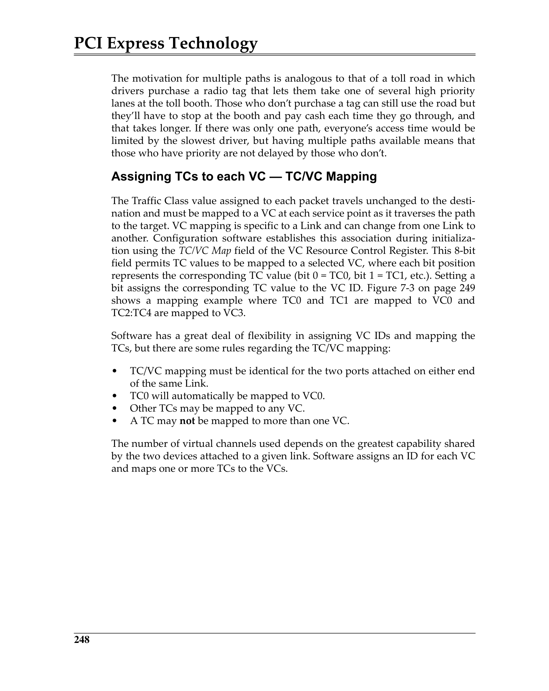
 <em>Figure from ch07 (p.307) / ch07插图 (p.307)</em>

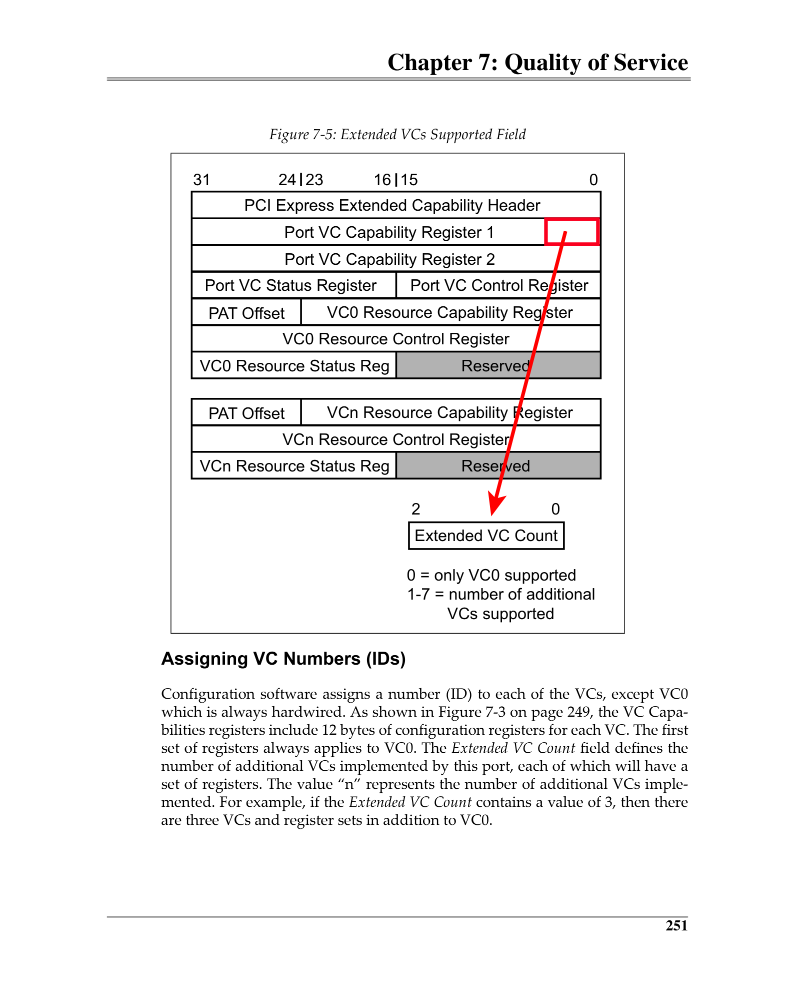
 <em>Figure from ch07 (p.310) / ch07插图 (p.310)</em>

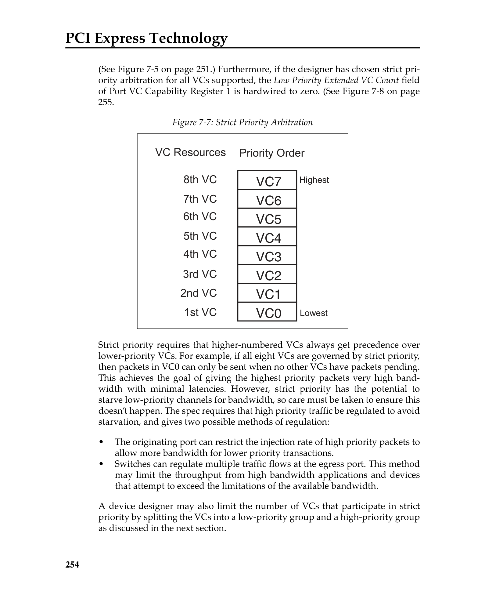
 <em>Figure from ch07 (p.313) / ch07插图 (p.313)</em>

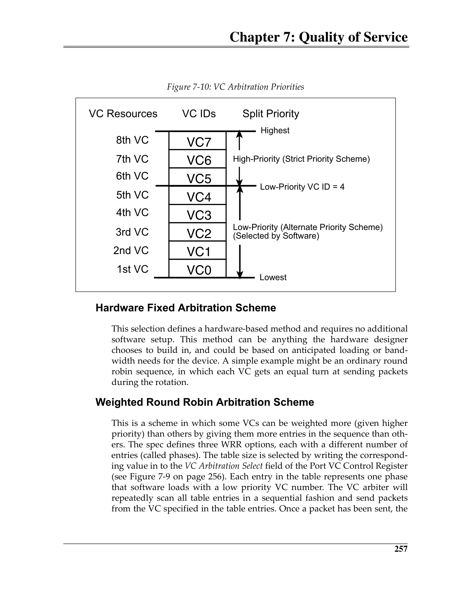
 <em>Figure from ch07 (p.316) / ch07插图 (p.316)</em>

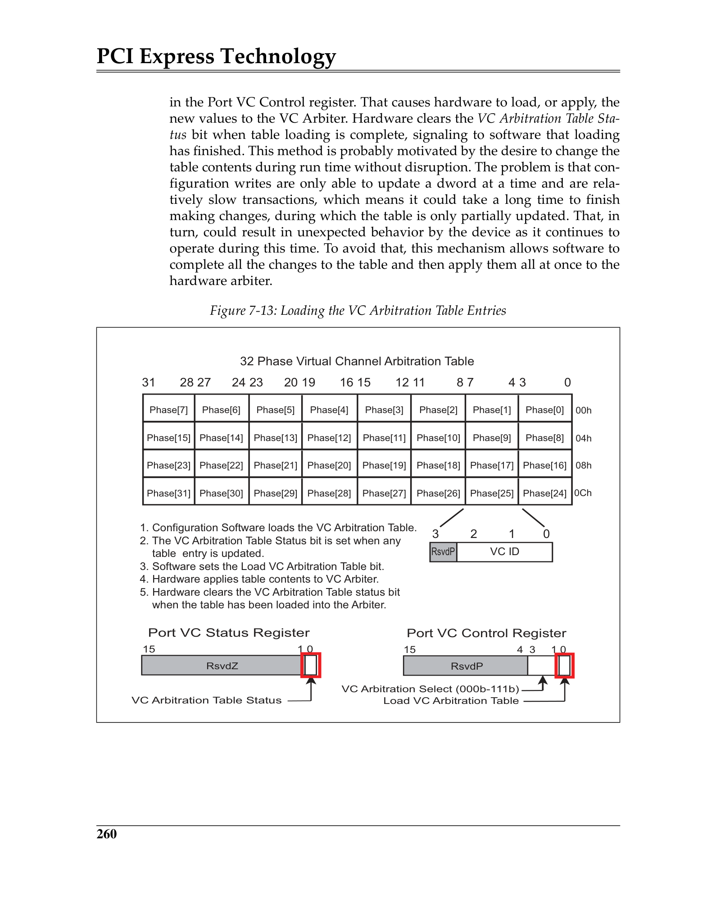
 <em>Figure from ch07 (p.319) / ch07插图 (p.319)</em>

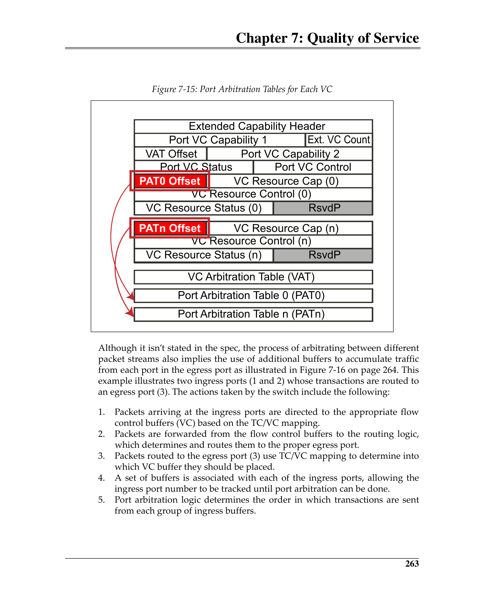
 <em>Figure from ch07 (p.322) / ch07插图 (p.322)</em>

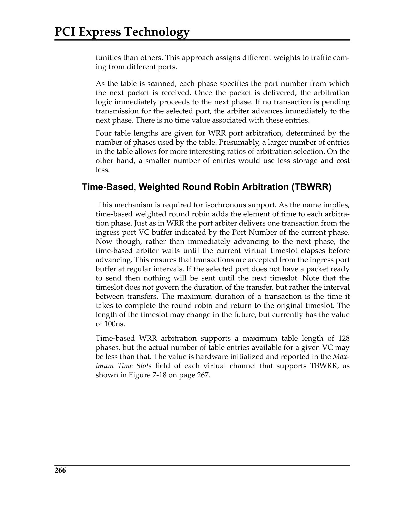
 <em>Figure from ch07 (p.325) / ch07插图 (p.325)</em>

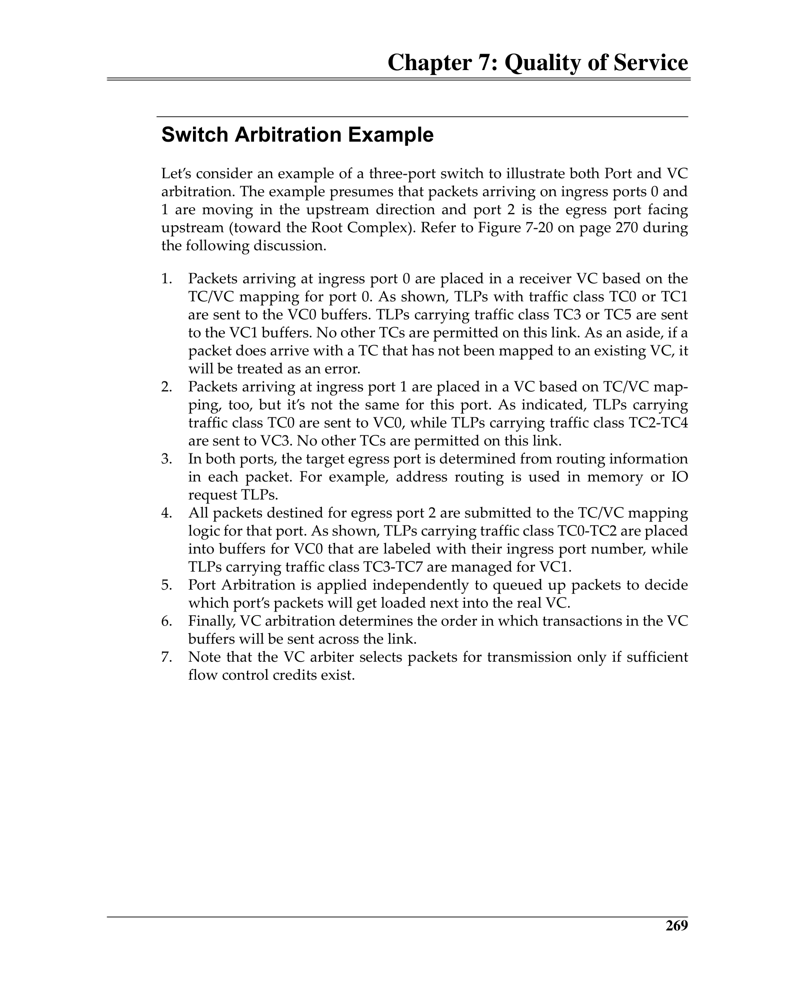
 <em>Figure from ch07 (p.328) / ch07插图 (p.328)</em>

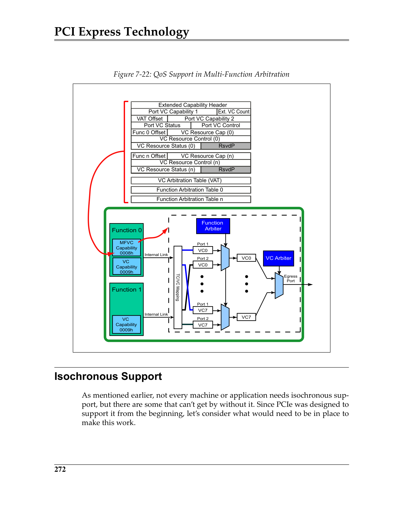
 <em>Figure from ch07 (p.331) / ch07插图 (p.331)</em>

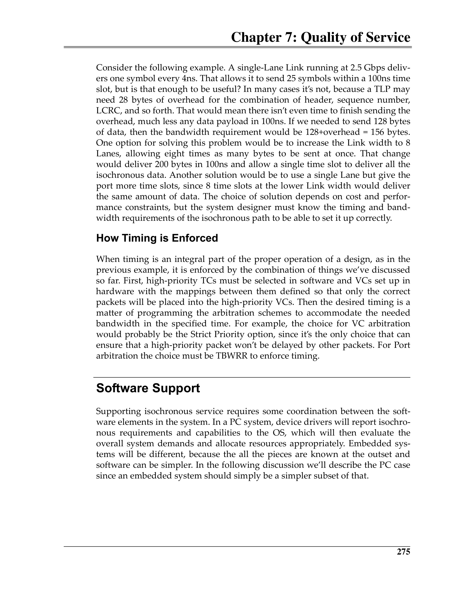
 <em>Figure from ch07 (p.334) / ch07插图 (p.334)</em>

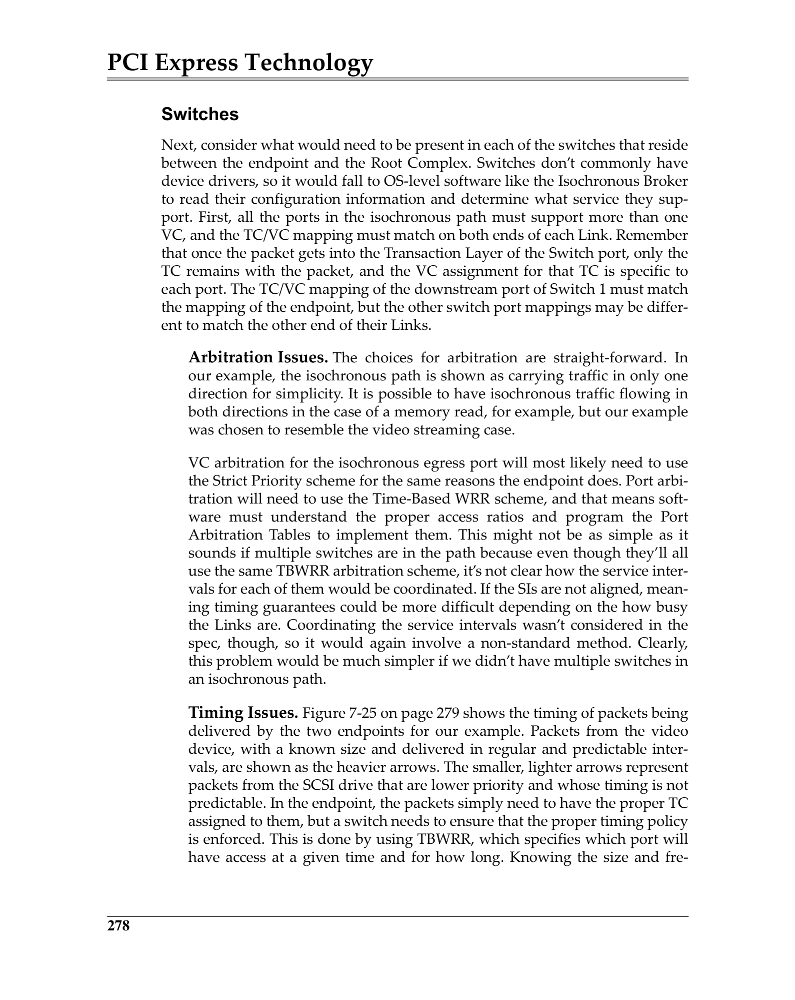
 <em>Figure from ch07 (p.337) / ch07插图 (p.337)</em>

---

## QoS and Flow Control Interaction / QoS与流控交互

Since each VC has independent FC buffers, credit starvation on one VC cannot block traffic on other VCs. However, total Link bandwidth is shared — arbitration determines each VC's share, and sustained high utilization on one VC can reduce available bandwidth for others. This interplay between FC (buffer management per VC) and arbitration (bandwidth allocation per VC) is the core of PCIe QoS design.

> 每VC独立FC缓冲——一个VC信用饥饿不阻塞其他VC。但总链路带宽共享——仲裁决定每VC份额，一个VC持续高利用率可减少其他VC的可用带宽。FC(每VC缓冲管理)与仲裁(每VC带宽分配)的相互作用是PCIe QoS设计的核心。
