# Chapter 8: Transaction Ordering
# 第8章：事务排序

> 中英文对照翻译 | Chinese-English Parallel Translation
> Source: MindShare PCI Express Technology 3.0 | Pages: 344–363 (20 pages)

---

## Transaction Ordering Concept / 事务排序概念

Transaction ordering rules define the relative sequence in which TLPs of different types can pass each other in PCIe fabric queues. These rules are essential for maintaining the **Producer-Consumer model** — where one entity (the producer) writes data to memory and then updates a flag, and another entity (the consumer) polls the flag and reads the data when the flag is set.

> 事务排序规则定义了不同类型TLP在PCIe结构队列中可相互超越的相对顺序。这些规则对维护生产者-消费者模型至关重要——一个实体(生产者)写数据到内存然后更新标志，另一个实体(消费者)轮询标志并在标志置位时读数据。

Without proper ordering, the consumer could see the flag update before the data arrives (because the flag write bypassed the data write in a queue), leading to the consumer reading stale data.

> 若无正确排序，消费者可在数据到达前看到标志更新（因为标志写在队列中超越了数据写），导致消费者读到过期数据。

---

## Transaction Types and Their Ordering Characteristics / 事务类型及其排序特性

PCIe defines three fundamental transaction ordering categories:

**Posted (P):** Memory Write Requests, Message Requests. Posted transactions are fire-and-forget — no Completion is expected. They can be reordered more freely.

**Non-Posted (NP):** Memory Read Requests, Configuration Read/Write Requests, I/O Read/Write Requests. Non-Posted requests expect a Completion in response. They have stricter ordering constraints.

**Completions (Cpl):** Completion with/without Data. Completions carry responses for Non-Posted requests. They must follow the ordering rules that ensure the producer-consumer model is maintained.

> PCIe定义了三种基本事务排序类别：Posted(P)——Memory Write和Message，无Completion，可更自由重排；Non-Posted(NP)——Memory Read和Config/IO，期望Completion响应，有更严格的排序约束；Completion(Cpl)——携带Non-Posted请求的响应，必须遵循维护生产者-消费者模型的排序规则。

---

## The PCIe Ordering Table / PCIe排序表

The ordering rules are captured in a **6-row × 6-column table**. The rows represent a previously queued TLP, and the columns represent a newly arriving TLP that may or may not be allowed to pass the previously queued one.

| Row (Queued) \ Col (New) | Posted Req | NP Read | NP Write | Cpl | Posted Req (RO) | Cpl (RO) |
|---------------------------|:----------:|:-------:|:--------:|:---:|:---------------:|:--------:|
| **Posted Request** | a) Yes/No | Yes | Yes | Yes | Yes | Yes |
| **NP Read Request** | b) No | Yes/No | Yes/No | Yes/No | — | — |
| **NP Write Request** | No | Yes/No | Yes/No | Yes/No | — | — |
| **Completion** | c) Yes/No | No | Yes/No | Yes/No | — | — |
| **Posted Req (RO)** | Yes/No | No | No | Yes | Yes | Yes |
| **Completion (RO)** | Yes/No | Yes | Yes/No | Yes/No | — | — |

Key:
- **Yes** = New TLP may pass the queued TLP
- **No** = New TLP must NOT pass the queued TLP (ordering is enforced)
- **Yes/No** = Implementation choice
- **RO** = Relaxed Ordering attribute set
- Critical entries: a) Posted must pass Posted (for deadlock avoidance), b) NP Read must NOT pass Posted (producer-consumer rule), c) Completion may or may not pass Posted depending on implementation

> PCIe排序规则由一个6×6表捕获。行代表之前排队的TLP，列代表新到达的TLP是否可超越之前排队的TLP。关键条目：a)Posted必须超越Posted(死锁避免)；b)NP Read不得超越Posted(生产者-消费者规则)；c)Completion可或不可超越Posted取决于实现。

---

## Producer-Consumer Model / 生产者-消费者模型

The fundamental ordering guarantee: **A Non-Posted Read Request cannot pass a previously posted Memory Write.** This ensures the classic scenario works correctly:
1. Producer writes data (Memory Write TLP — Posted)
2. Producer writes flag (Memory Write TLP — Posted)
3. Consumer reads flag (Memory Read TLP — Non-Posted)
4. Consumer reads data (Memory Read TLP — Non-Posted)

Because NP reads cannot pass prior Posted writes, the consumer's flag read (step 3) is guaranteed to see all prior writes (steps 1, 2). When the flag indicates "data ready," the consumer's data read (step 4) sees the correct data.

> 基本排序保证：Non-Posted读请求不能超越之前已Posted的Memory Write。这确保经典场景正确运行：生产者写数据→生产者写标志→消费者读标志→消费者读数据。NP读不能超越先前的Posted写，因此消费者的标志读(步骤3)保证看到所有先前写(步骤1,2)。当标志指示"数据就绪"时消费者数据读(步骤4)看到正确数据。

---

## Relaxed Ordering (RO) / 宽松排序

The Relaxed Ordering (RO) bit in the TLP header allows some of the strict ordering rules to be relaxed for TLPs that do not require strong ordering guarantees. When RO is set:
- A Posted Write with RO may pass another Posted Write (normally allowed anyway)
- A Completion with RO may pass a Posted Write (implementation-dependent without RO)

Use cases: GPU frame buffer writes (where individual pixel writes are independent), bulk data transfers with separate doorbell mechanisms, and traffic between independent device functions.

> 宽松排序(RO)位在TLP头中允许对不需要强排序保证的TLP放宽某些严格排序规则。当RO置位时：RO的Posted Write可超越另一个Posted Write；RO的Completion可超越Posted Write(无RO时依赖实现)。使用场景：GPU帧缓冲写(单个像素写独立)、带独立门铃机制的批量数据传输、独立设备Function间流量。

---

## ID-Based Ordering (IDO) / 基于ID的排序

IDO is a PCIe 2.1 enhancement that allows TLPs with different Requester IDs to bypass each other even when the strict ordering rules would normally prevent it. The rationale: TLPs from different Requesters are logically independent, so reordering them cannot break the producer-consumer model for either Requester.

IDO is enabled through the Device Control 2 Register and requires both the Requester and all intermediate components (Switches, Root Complex) to support it.

> IDO是PCIe 2.1增强，允许具有不同Requester ID的TLP相互超越，即使严格排序规则通常禁止。理由：来自不同请求者的TLP逻辑上独立，对其重新排序不会破坏任一请求者的生产者-消费者模型。IDO通过Device Control 2 Register启用，要求请求者和所有中间组件(Switch、Root Complex)支持。

---

## Deadlock Avoidance / 死锁避免

A critical ordering rule: **Posted requests must be able to pass other Posted requests and Completions.** This prevents a scenario where a Completion (carrying read data) is blocked behind a Posted Write that is waiting for credits that can only be released by the Completion — a classic deadlock cycle. By allowing Posted to pass other transactions, the Posted request can always make forward progress and release credits.

> 关键排序规则：Posted请求必须能超越其他Posted请求和Completion。这防止Completion(携带读数据)阻塞在等待只有Completion才能释放信用的Posted Write之后的死锁循环。通过允许Posted超越其他事务，Posted请求总能前向推进并释放信用。

---

## Key Figures / 关键图示

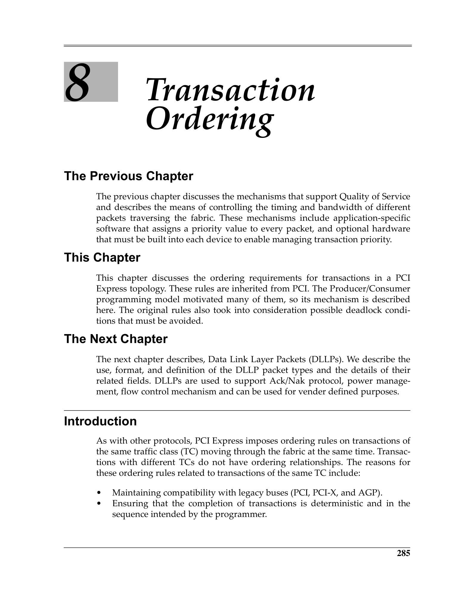
 <em>Figure from ch08 (p.344) / ch08插图 (p.344)</em>

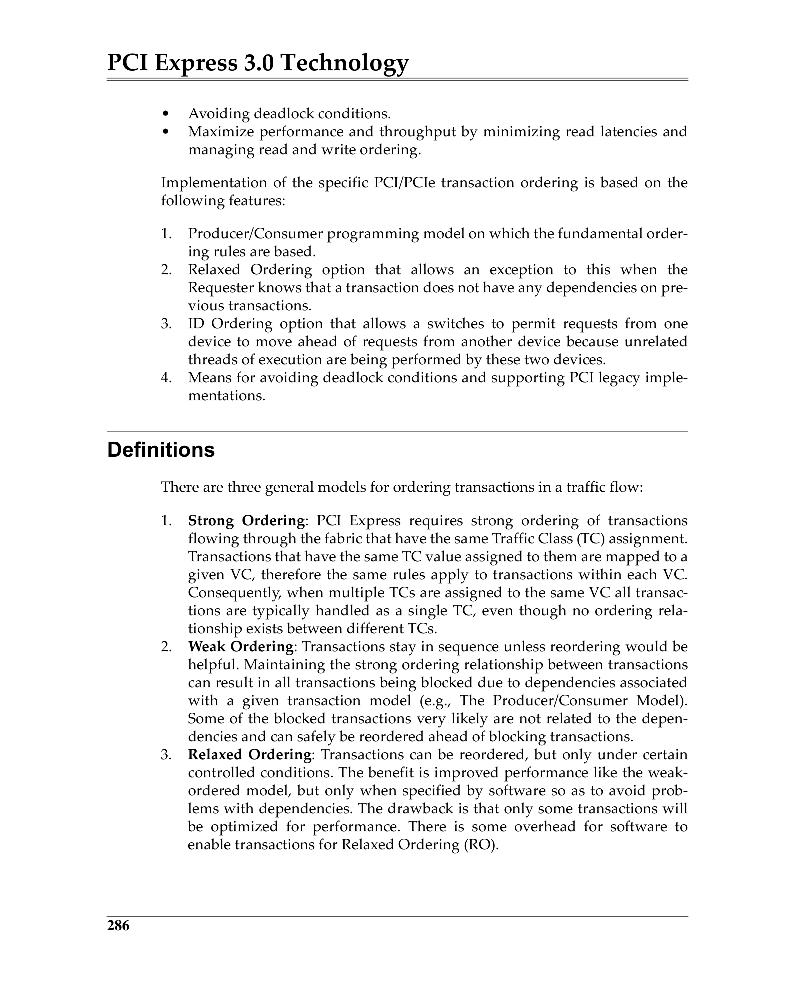
 <em>Figure from ch08 (p.345) / ch08插图 (p.345)</em>

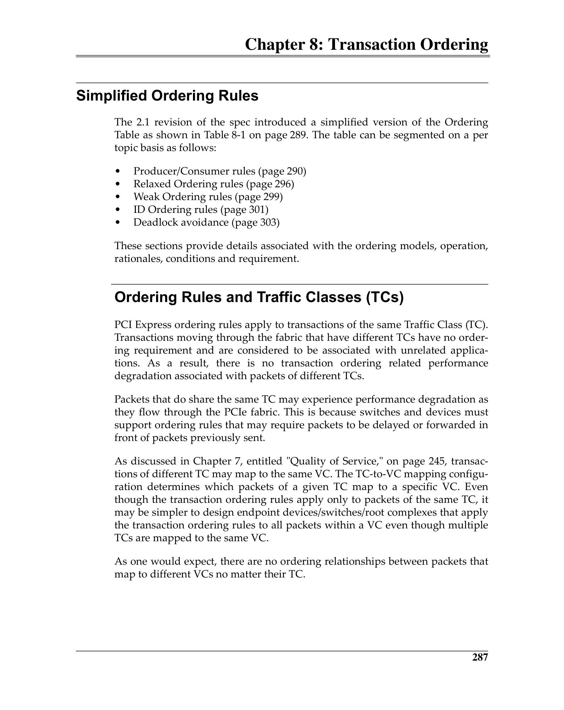
 <em>Figure from ch08 (p.346) / ch08插图 (p.346)</em>

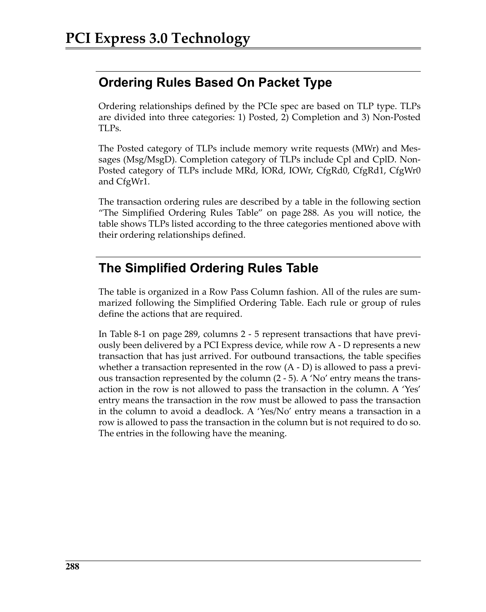
 <em>Figure from ch08 (p.347) / ch08插图 (p.347)</em>

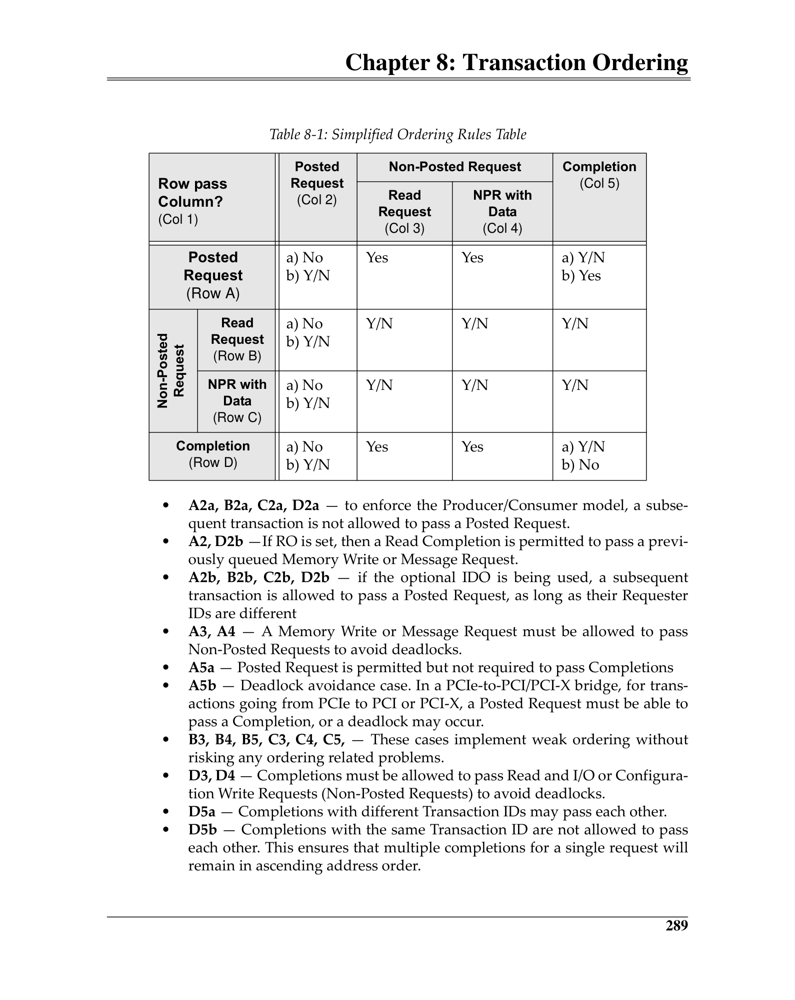
 <em>Figure from ch08 (p.348) / ch08插图 (p.348)</em>

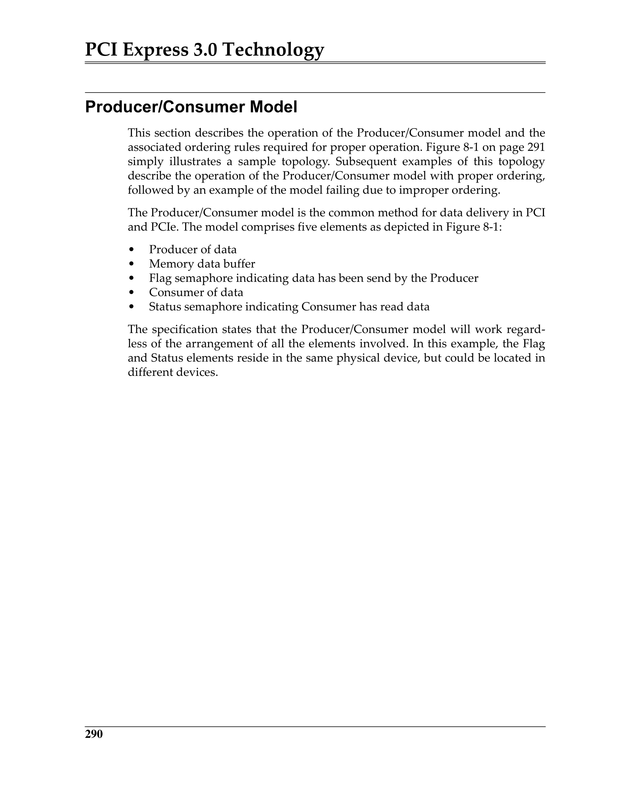
 <em>Figure from ch08 (p.349) / ch08插图 (p.349)</em>

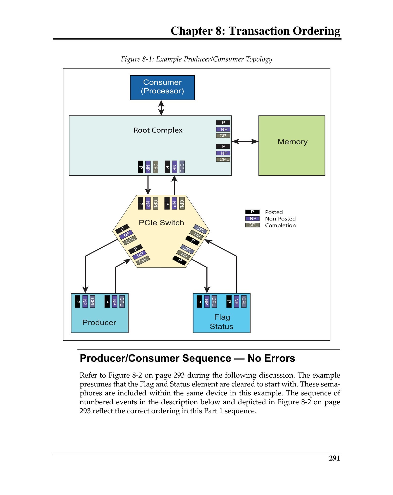
 <em>Figure from ch08 (p.350) / ch08插图 (p.350)</em>

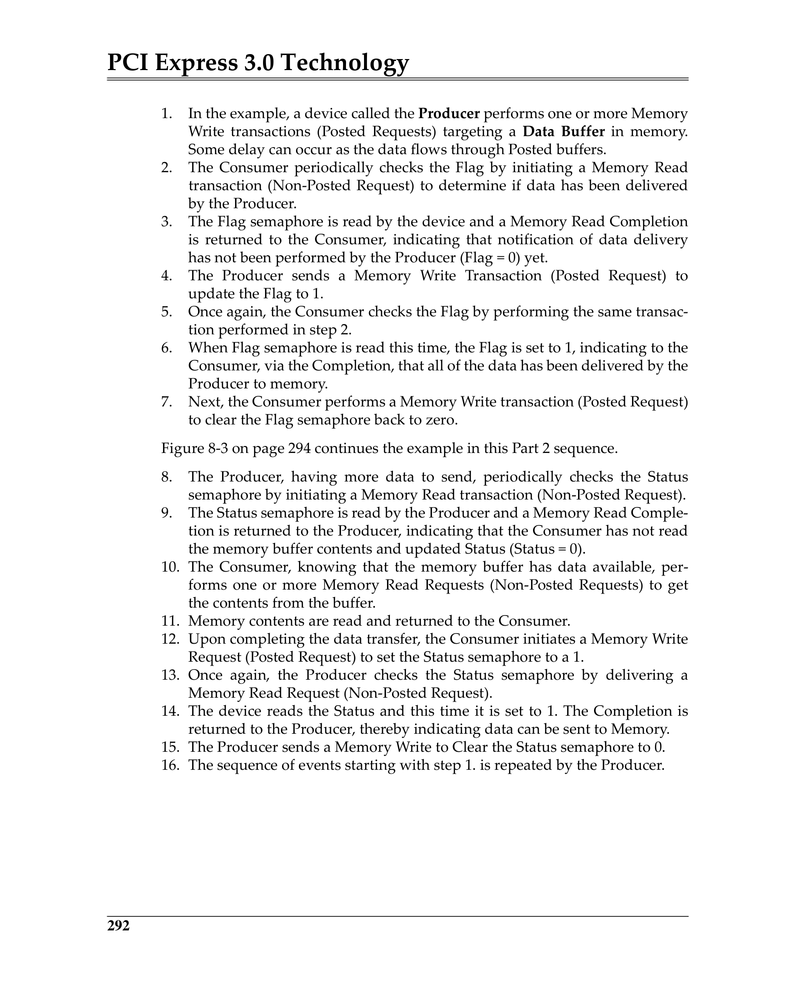
 <em>Figure from ch08 (p.351) / ch08插图 (p.351)</em>

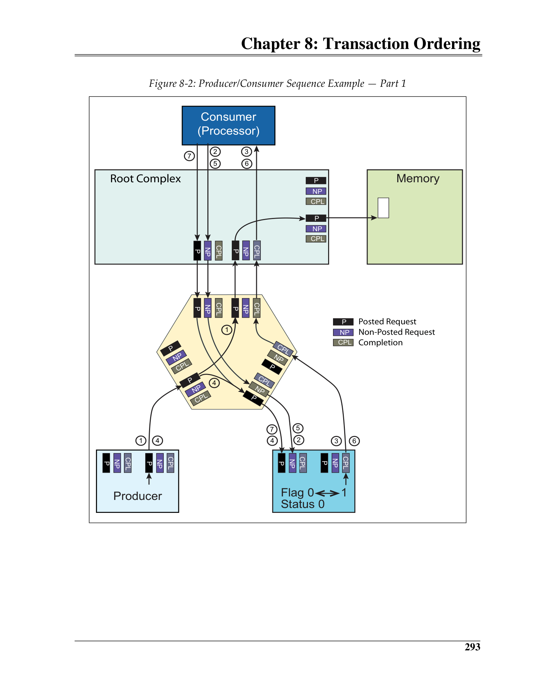
 <em>Figure from ch08 (p.352) / ch08插图 (p.352)</em>

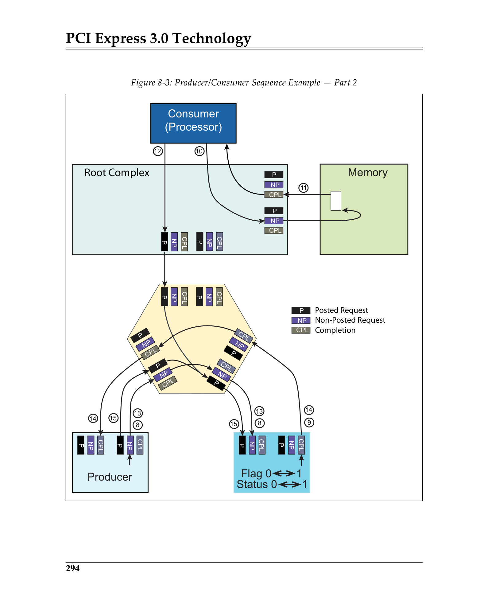
 <em>Figure from ch08 (p.353) / ch08插图 (p.353)</em>

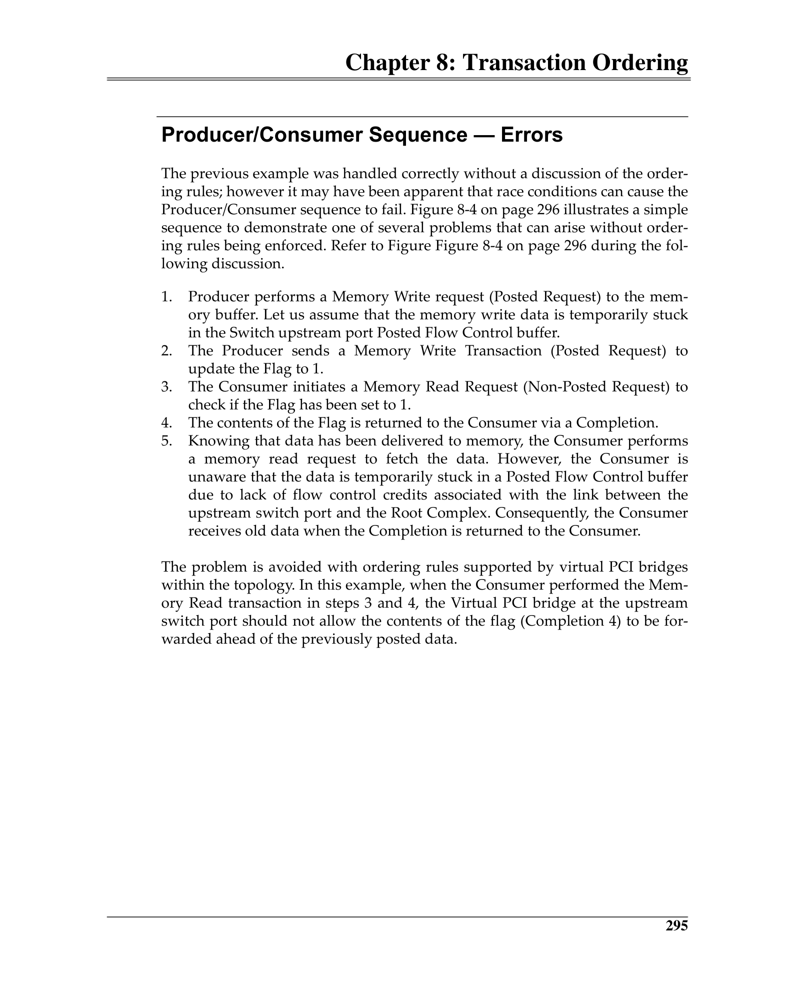
 <em>Figure from ch08 (p.354) / ch08插图 (p.354)</em>

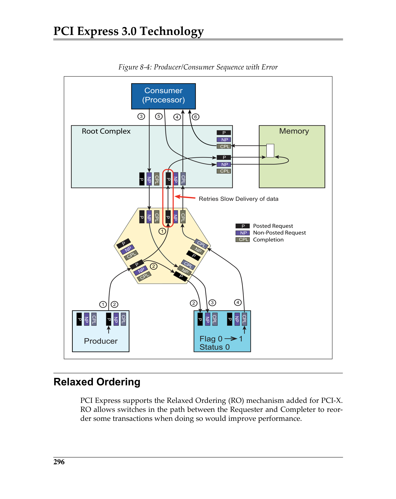
 <em>Figure from ch08 (p.355) / ch08插图 (p.355)</em>

---

## Ordering Across Virtual Channels / 跨虚拟通道排序

Ordering rules apply **only within the same Virtual Channel**. TLPs in different VCs have NO ordering relationship with each other. This independence is by design — it allows different traffic types (e.g., bulk data on VC0, isochronous streaming on VC1) to flow without ordering constraints from the other VC.

> 排序规则仅在同一虚拟通道内适用。不同VC中的TLP彼此无排序关系。这种独立性是设计使然——允许不同流量类型(如VC0上的批量数据、VC1上的等时流)自由流动，不受其他VC的排序约束。
