# Chapter 11: Physical Layer — Logical (Gen1 and Gen2)
# 第11章：物理层——逻辑子层（Gen1与Gen2）

> 中英文对照翻译 | Chinese-English Parallel Translation
> Source: MindShare PCI Express Technology 3.0 — Pages: 420–466 (47 pages)

---

## Physical Layer Overview / 物理层概述

The Physical Layer is the lowest layer in the PCIe protocol stack, residing between the external physical Link and the Data Link Layer. It converts outbound packets from the Data Link Layer into a serialized differential bit stream, and recovers the bit stream from all Lanes at the receiver. The receive logic de-serializes bits back into Symbols, re-assembles packets, and forwards TLPs/DLLPs upward.

> 物理层是PCIe协议栈最底层，将数据链路层输出包转换为串行差分位流，并在接收端恢复位流。接收逻辑将位反序列化为Symbol，重新组装包并向上转发。

For Gen1 (2.5 GT/s) and Gen2 (5.0 GT/s), the Physical Layer uses **8b/10b encoding**. Each 8-bit byte is encoded into a 10-bit Symbol. The encoding guarantees: sufficient transitions for receiver clock recovery, DC balance (equal 1s/0s tracked by Running Disparity), and special K-codes for protocol control.

> Gen1/Gen2使用8b/10b编码，每8位字节编码为10位Symbol。编码保证：足够的跳变供接收端恢复时钟、DC平衡(通过Running Disparity跟踪)、特殊K码用于协议控制。

---

## 8b/10b Encoding / 8b/10b编码详解

The 8b/10b encoder maps 8-bit bytes to 10-bit Symbols from a table of 256 Data (D) codes. The encoder maintains a **Running Disparity** (RD) counter. For each byte, it selects either the positive-disparity or negative-disparity version of the Symbol to drive RD toward zero. The RD alternates between RD− (negative) and RD+ (positive). Neutral Symbols (equal numbers of 1s and 0s) do not change RD.

> 8b/10b编码器将8位字节映射到256个D码的10位Symbol，维护Running Disparity计数器。为每字节选择正向或负向差异版本将RD驱向零。RD在RD−和RD+间切换。中性Symbol不改变RD。

**12 Special K-Codes and Their PCIe Uses:**

| K-Code | Symbol | PCIe Function |
|--------|--------|---------------|
| K28.5 | COM | First character of ALL Ordered Sets; Symbol Lock acquisition; Lane de-skew reference |
| K28.3 | IDL | Logical idle — transmitted continuously during L0 when no packets pending |
| K28.7 | EIE | Electrical Idle Exit — signals end of Electrical Idle condition |
| K28.1 | FTS | Fast Training Sequence — character for L0s exit |
| K28.0, K28.2 | SKP | Skip Ordered Set components — clock tolerance compensation |
| K28.4, K28.6 | — | Training sequence components |
| K23.7 | PAD | Pad/fill character |
| K27.7 | STP | Start of TLP marker |
| K29.7 | END | End of good packet marker |
| K30.7 | EDB | End of bad packet marker (LCRC failed) |
| K28.5 variants | SDP | Start of DLLP marker |

These K-codes are never used for data — their unique bit patterns guarantee unambiguous identification even with bit errors.

> 这12个K码从不用作数据字节——它们的唯一位模式确保即使在位错误下也能被无误识别。

---

## Symbol Time and Bandwidth / 符号时间与带宽

- Gen1 (2.5 GT/s): 1 Symbol = 10 bits / 2.5 GT/s = 4 ns. Effective bandwidth = 2.5 × 8/10 = 2.0 Gbps per Lane.
- Gen2 (5.0 GT/s): 1 Symbol = 10 bits / 5.0 GT/s = 2 ns. Effective bandwidth = 5.0 × 8/10 = 4.0 Gbps per Lane.
- 20% overhead from 8b/10b encoding. Additional overhead from packet framing, DLLPs, and SKP Ordered Sets reduces actual data throughput.

> Gen1 2.5 GT/s每Symbol 4ns/2.0 Gbps每通道。Gen2 5.0 GT/s每Symbol 2ns/4.0 Gbps每通道。8b/10b编码20%开销，加上定帧、DLLP和SKP的额外开销。

---

## Packet Framing / 包定帧

The Physical Layer wraps TLPs and DLLPs with framing Symbols:
- **TLP:** STP Symbol → TLP data (with LCRC appended by DLL) → END (good CRC) or EDB (failed CRC)
- **DLLP:** SDP Symbol → 6-byte DLLP data → END. DLLPs are always 8 Symbols total (SDP + 6 data + END).

The framing Symbols enable the receiver to locate packet boundaries within the continuous serial stream, even after scrambling.

> 物理层用定帧Symbol包裹TLP和DLLP：TLP使用STP起始→数据→END(好)或EDB(坏)；DLLP使用SDP起始→6字节数据→END，DLLP始终8个Symbol(SDP+6数据+END)。定帧Symbol使接收端可在扰码后的连续串行流中定位包边界。

---

## Ordered Sets / 有序集

Ordered Sets begin with COM (K28.5) and serve Link management functions. Key Ordered Sets:

**TS1 and TS2:** 16-Symbol training sequences exchanged during LTSSM training (Ch14). Carries Link#, Lane#, N_FTS, Rate ID, Training Control.

**SKP (Skip):** For clock tolerance compensation (±300 ppm). Sent at fixed intervals: every 1180 Symbol Times (Gen1), every 590 (Gen2). Receiver adds/drops SKP symbols to prevent elastic buffer overflow/underflow.

**EIOS (Electrical Idle Ordered Set):** Warns receiver that transmitter is about to enter Electrical Idle.

**FTS (Fast Training Sequence):** K28.1 + three D symbols. Sent when exiting L0s for fast lock re-acquisition.

> 有序集以COM(K28.5)开头服务于链路管理。TS1/TS2是16-Symbol训练序列在LTSSM训练期间交换(Ch14)，携带Link#、Lane#、N_FTS、Rate ID、Training Control。SKP用于时钟容差补偿(±300 ppm)，Gen1每1180 Symbol Time发送一次、Gen2每590。EIOS警告接收端发送端即将进入电气空闲。FTS为K28.1+三个D符号，用于L0s退出时快速重新获取锁定。

---

## Scrambling / 扰码

All TLP/DLLP data and logical idle are scrambled using a 16-bit LFSR (polynomial X^16+X^5+X^4+X^3+1). Initialized to FFFFh at start of transmission and advanced once per Symbol (except during Ordered Sets, which bypass scrambling). > 所有TLP/DLLP数据和逻辑空闲使用16位LFSR(多项式X^16+X^5+X^4+X^3+1)进行扰码。传输开始时初始化为FFFFh，每Symbol前进一次(有序集不扰码)。防止重复模式产生EMI和时钟恢复问题。

---

## Byte Striping Across Lanes / 跨通道字节条带化

In multi-Lane Links, data bytes are distributed round-robin. For x4: byte N → Lane (N mod 4). This multiplies bandwidth by Lane count.

---

## Key Figures / 关键图示

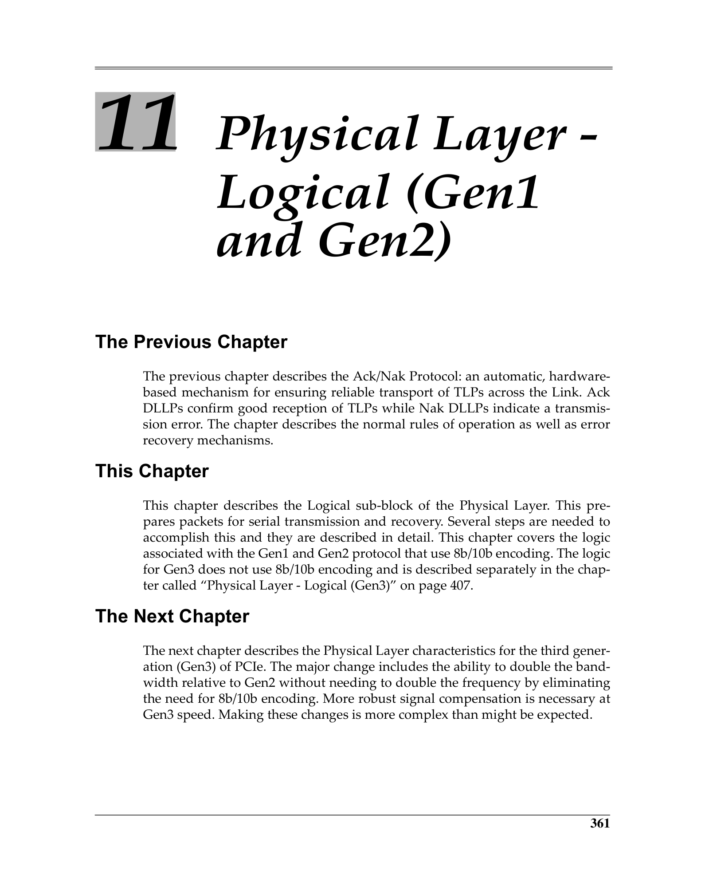
 <em>Figure from ch11 (p.420) / ch11插图 (p.420)</em>

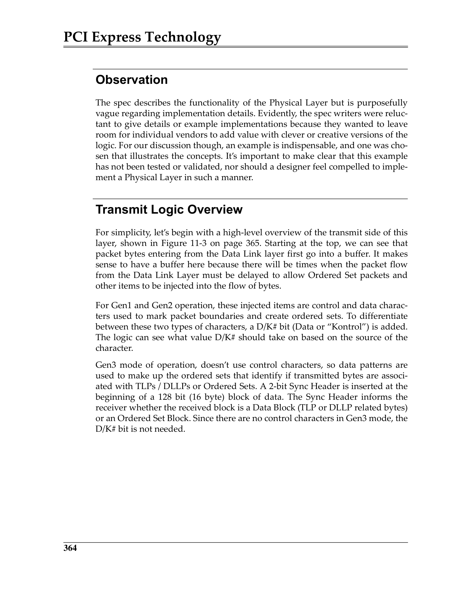
 <em>Figure from ch11 (p.423) / ch11插图 (p.423)</em>

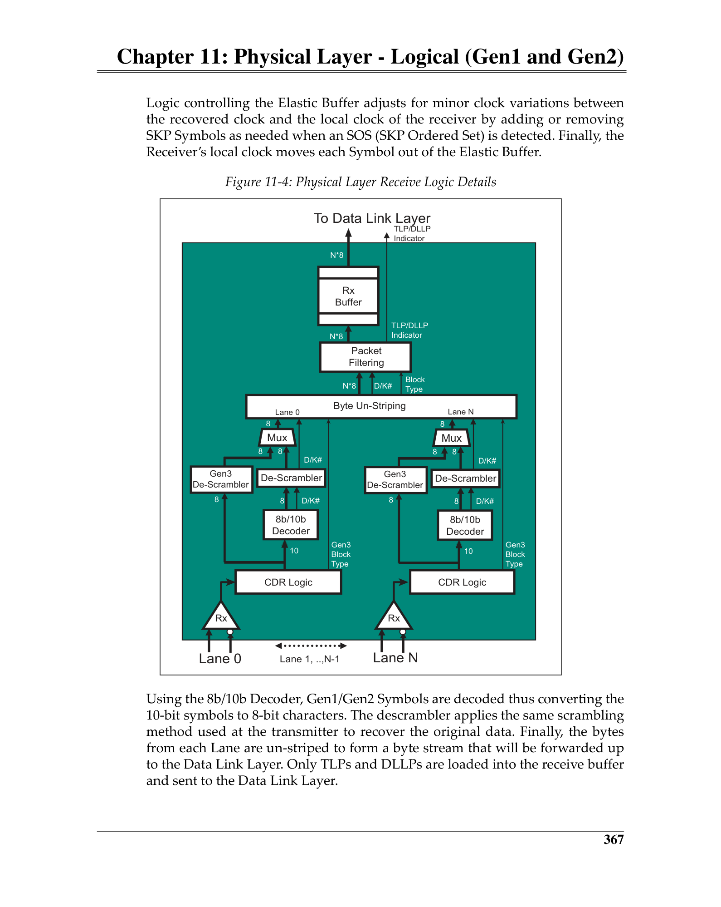
 <em>Figure from ch11 (p.426) / ch11插图 (p.426)</em>

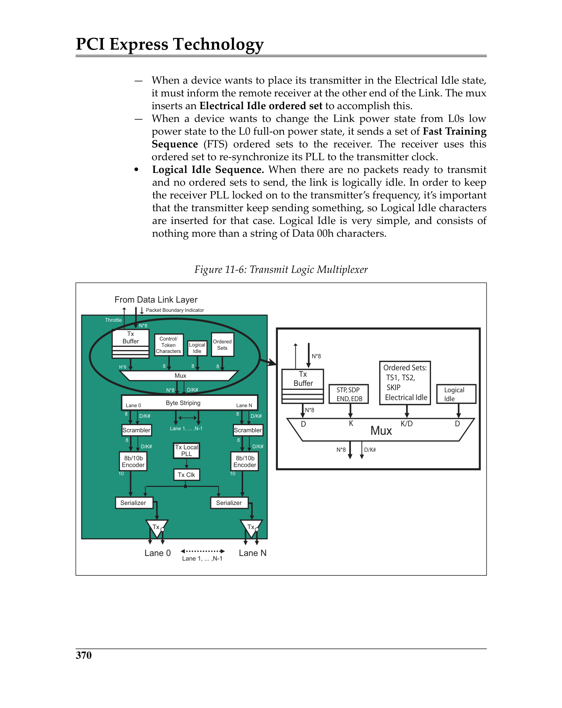
 <em>Figure from ch11 (p.429) / ch11插图 (p.429)</em>

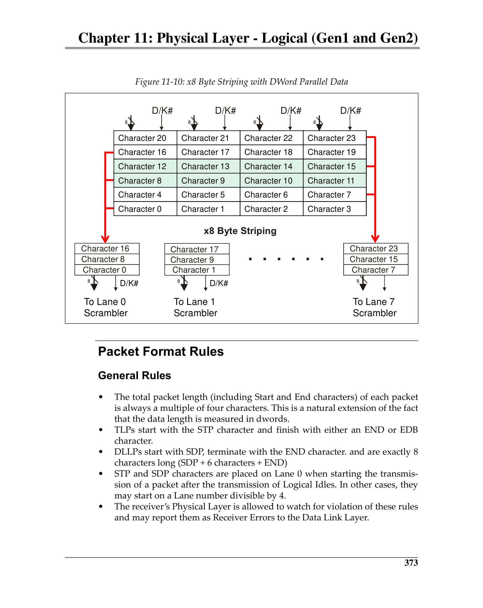
 <em>Figure from ch11 (p.432) / ch11插图 (p.432)</em>

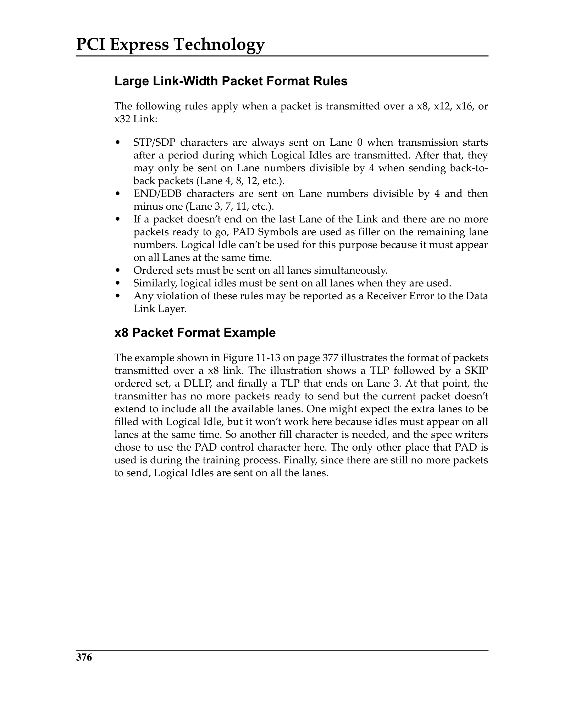
 <em>Figure from ch11 (p.435) / ch11插图 (p.435)</em>

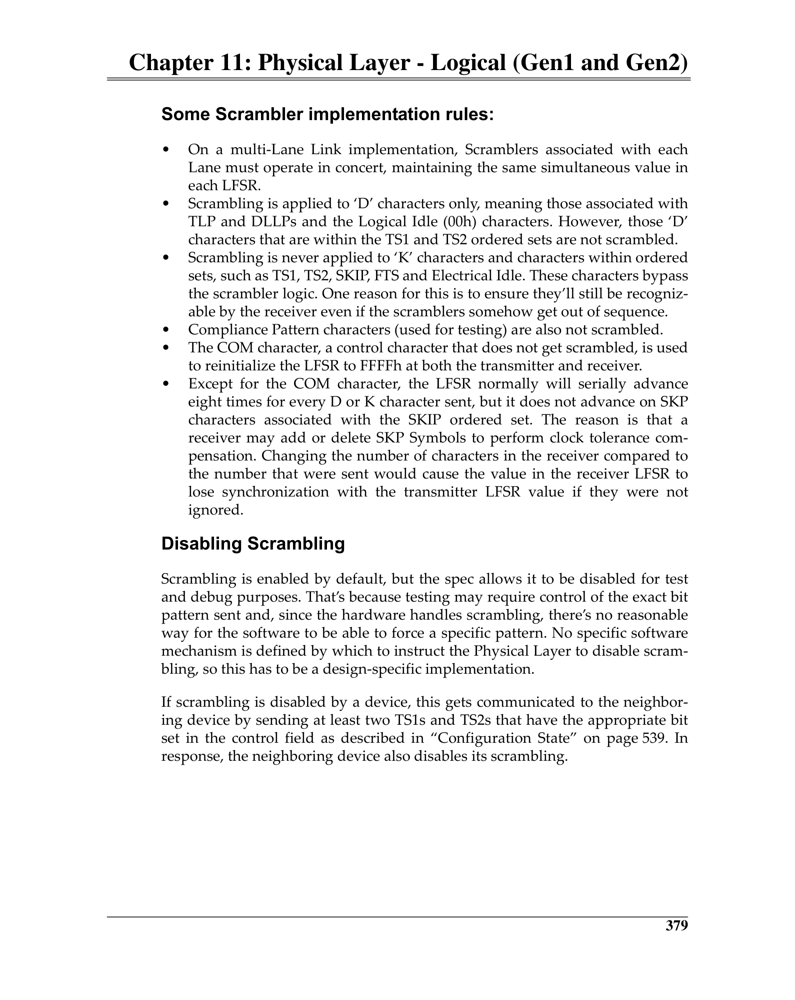
 <em>Figure from ch11 (p.438) / ch11插图 (p.438)</em>

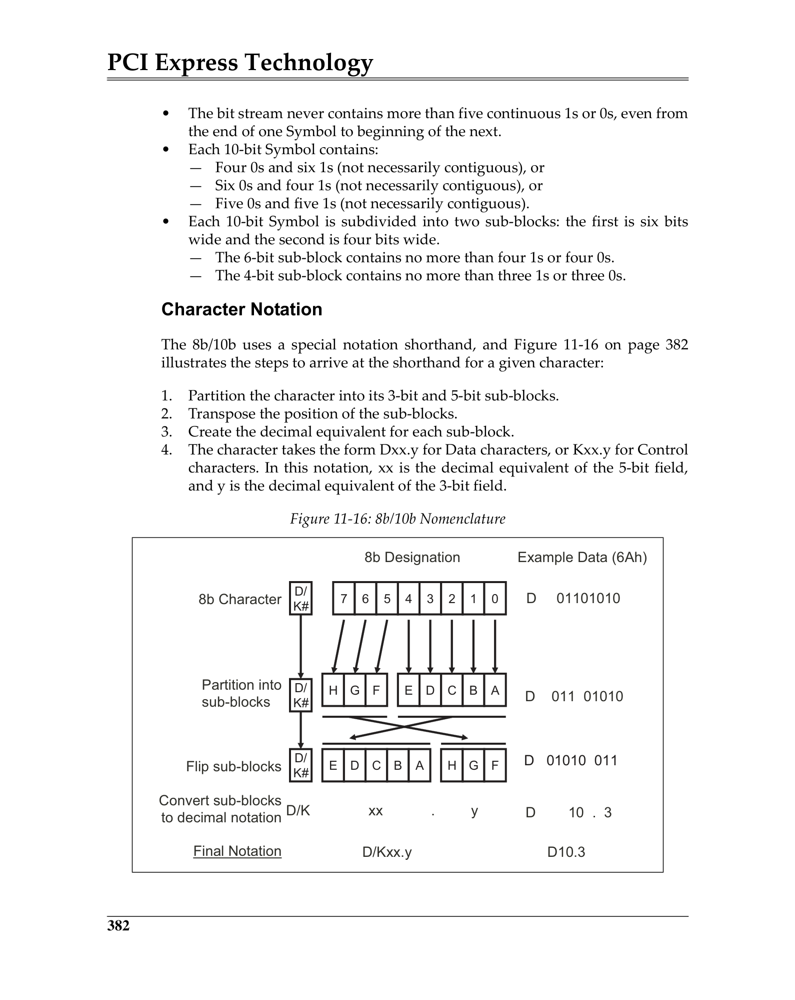
 <em>Figure from ch11 (p.441) / ch11插图 (p.441)</em>

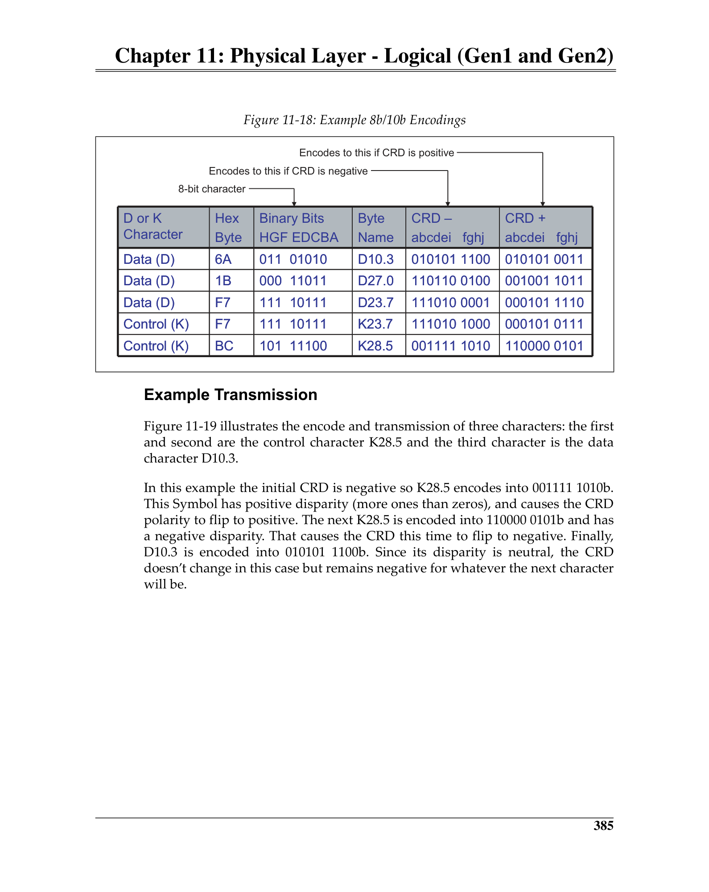
 <em>Figure from ch11 (p.444) / ch11插图 (p.444)</em>

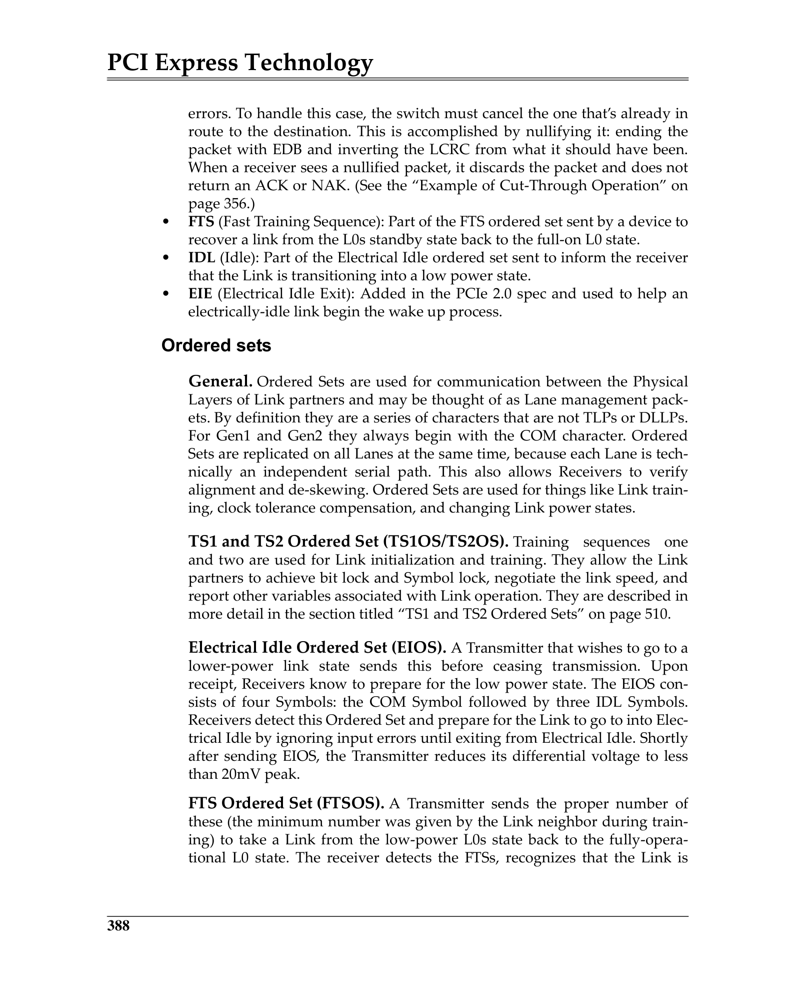
 <em>Figure from ch11 (p.447) / ch11插图 (p.447)</em>

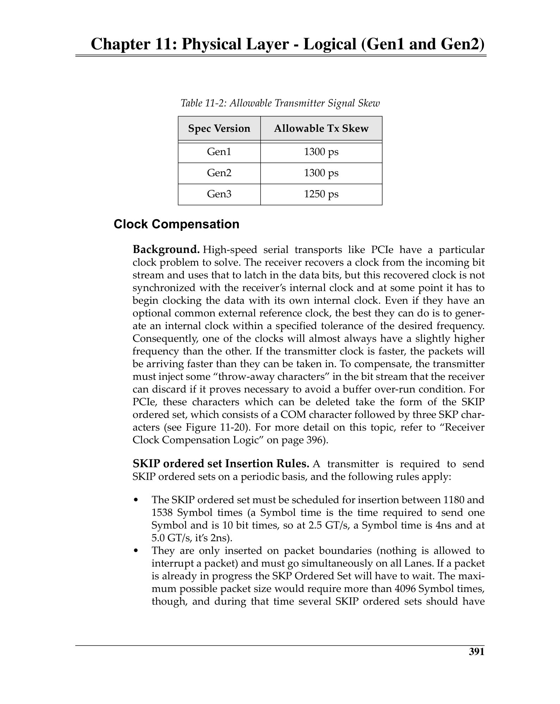
 <em>Figure from ch11 (p.450) / ch11插图 (p.450)</em>

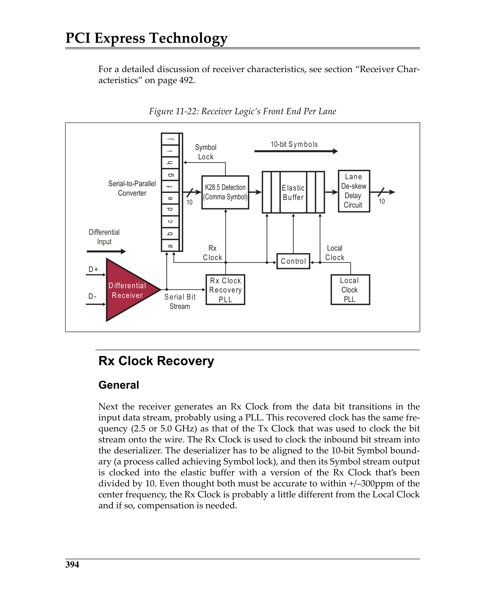
 <em>Figure from ch11 (p.453) / ch11插图 (p.453)</em>

---

## Receiver Functions / 接收端功能

**Lane Polarity Inversion:** Detected from inverted COM character. Automatically corrected.

**Lane-to-Lane De-skew:** COM characters on all Lanes provide reference points. Maximum skew tolerance is implementation-specific but limited by Link geometry.

**Elastic Buffer:** Absorbs clock frequency differences via SKP Ordered Set handling.
