# Chapter 12: Physical Layer — Logical (Gen3)
# 第12章：物理层——逻辑子层（Gen3）

> 中英文对照翻译 | Chinese-English Parallel Translation
> Source: MindShare PCI Express Technology 3.0 — Pages: 466–506 (41 pages)

---

## Gen3 Overview / Gen3概述

The most significant change for Gen3 (8.0 GT/s) is eliminating 8b/10b encoding in favor of **128b/130b encoding** with scrambling. This reduces encoding overhead from 20% to ~1.54%, nearly doubling effective bandwidth to 8.0 Gbps/Lane while increasing the line rate by only 60% (5.0→8.0 GT/s).

> Gen3(8.0 GT/s)最重大变化是消除8b/10b编码改用128b/130b编码加扰码。编码开销从20%降至约1.54%，有效带宽翻倍至8.0 Gbps/通道，线速率仅增60%(5.0→8.0 GT/s)。

**Motivation:** If Gen3 had retained 8b/10b encoding and aimed for the same bandwidth improvement, it would have required 10.0 GT/s line rate — extremely difficult for PCB design. At 8.0 GT/s with 128b/130b, effective bandwidth exceeds what 10 GT/s with 8b/10b would have provided. The scrambler provides statistically DC-balanced output without disparity tracking.

> 若Gen3保留8b/10b编码要达到相同带宽提升，需10.0 GT/s线速率——对PCB设计极难。8.0 GT/s+128b/130b的有效带宽超过10 GT/s+8b/10b。扰码器提供统计DC平衡无需差异跟踪。

---

## 128b/130b Block Structure / 128b/130b块结构

Each transmitted block = 2-bit **Sync Header** + 128-bit **Payload** (130 bits total = 16.25 bytes):

| Sync Header | Block Type | Contents |
|:-----------:|------------|----------|
| **01b** | Data Block | TLP/DLLP data or logical idle, scrambled |
| **10b** | Ordered Set Block | TS1, TS2, SKP, EIOS, EIEOS, SDS — NOT scrambled |
| 00b, 11b | **Illegal** | Indicates framing error |

The Sync Header creates a fundamental difference from Gen1/Gen2 — in Gen1/Gen2, the COM character distinguished Ordered Sets from data at the Symbol level. In Gen3, the Sync Header provides this distinction at the Block level. The receiver first achieves Block Lock (identifying 130-bit block boundaries), then examines the Sync Header to classify each block.

> Sync Header创造与Gen1/Gen2的根本差异——Gen1/Gen2中COM字符在Symbol级区分有序集与数据。Gen3中Sync Header在块级区分。接收端先实现块锁定(识别130位块边界)，然后检查Sync Header分类每块。

**Data Block Framing Tokens:** Within a Data Block (01b), the 128-bit payload contains bit-level framing tokens indicating TLP start, TLP end, DLLP boundaries, and logical idle segments — analogous to STP/SDP/END/IDL Symbols in Gen1/Gen2 but implemented as compact bit tokens within the payload.

---

## Scrambling and Precoding (Gen3) / 扰码与预编码

**Scrambler:** 23-bit LFSR (polynomial X^23+X^21+X^16+X^8+X^5+X^2+1) applied to Data Block payloads only. Sync Headers and Ordered Set Blocks are NOT scrambled. The 23-bit LFSR provides a longer pseudo-random sequence than the Gen1/Gen2 16-bit LFSR, avoiding repetitive patterns with the larger block size.

**Precoder (1/(1+D) filter):** Applied after scrambling at 8.0 GT/s to shape the output spectrum — reduces low-frequency content, improving signal integrity over AC-coupled channels. The receiver applies the inverse filter (1+D) before descrambling.

> 扰码器23位LFSR应用于数据块payload。Sync Header和有序集块不扰码。23位LFSR提供比16位更长的伪随机序列。预编码器(1/(1+D)滤波器)扰码后应用，整形输出频谱减少低频分量。接收端先逆滤波(1+D)再去扰码。

---

## Gen3 Ordered Sets / Gen3有序集

Gen3 Ordered Sets fundamentally differ from Gen1/Gen2:
- **No COM character:** Identified by Sync Header = 10b
- **Block-aligned:** Each Ordered Set is one complete 130-bit block
- The 16-Symbol TS1/TS2 of Gen1/Gen2 are replaced by block-based formats with equivalent fields (Link#, Lane#, N_FTS, Rate ID, Training Control, EQ Info)

**New Ordered Set Types in Gen3:**

**EIEOS (Electrical Idle Exit Ordered Set):** A longer, more distinctive pattern for reliable Electrical Idle exit detection at 8.0 GT/s. The higher data rate means shorter UI (125 ps) — more bits are needed for reliable detection.

**SDS (Start of Data Stream):** Sent at the very end of training (Configuration.Idle → L0 boundary) to signal the transition from Ordered Sets to Data Blocks. Acts as a delimiter: "the next block will be a Data Block."

**SKP Ordered Set:** Clock compensation still needed (±300 ppm) but the block format differs — each SKP OS is a complete 130-bit block identified by Sync Header = 10b.

---

## Receiver Block Lock / 接收端块锁定

Block Lock is the Gen3 equivalent of Symbol Lock. The receiver searches for the 2-bit Sync Header pattern to identify 130-bit block boundaries. Since Sync Headers appear at fixed intervals, the receiver correlates the expected pattern with the incoming stream to achieve lock. Once Block Lock is achieved, each 130-bit block can be reliably identified.

---

## Gen3 Equalization / Gen3均衡

At 8.0 GT/s, simple de-emphasis is insufficient — the channel has significant frequency-dependent loss at 4 GHz Nyquist. Gen3 introduces full transmitter equalization with programmable coefficients exchanged during **Recovery.Equalization**:

- **Presets:** Predefined coefficient sets for common channel types (short, medium, long reach)
- **Coefficients:** Pre-cursor (C−1), main cursor (C0), post-cursor (C+1)
- **4-Phase Process:** Phase 0 exchanges presets → Phase 1 downstream adjusts → Phase 2 upstream adjusts → Phase 3 finalizes
- Coefficients communicated via EQ Info fields in TS1/TS2 blocks

> 8.0 GT/s下去加重不足。Gen3引入全发送端均衡：预定义系数预设(短/中/长距离)、前标(C-1)/主标(C0)/后标(C+1)系数、Phase 0-3四阶段迭代均衡过程。系数通过TS1/TS2块中EQ Info字段通信。

---

## Key Figures / 关键图示

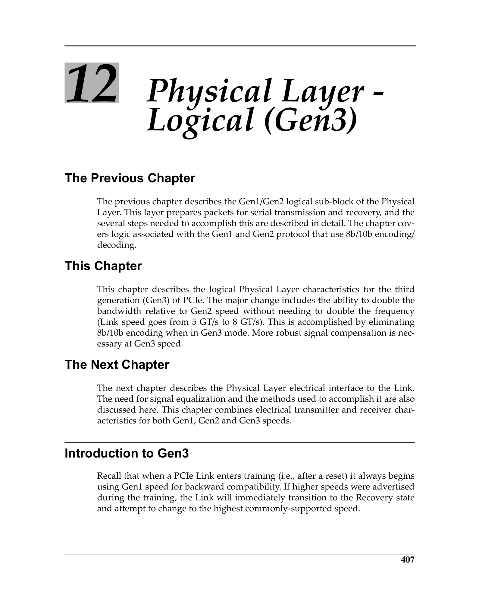
 <em>Figure from ch12 (p.466) / ch12插图 (p.466)</em>

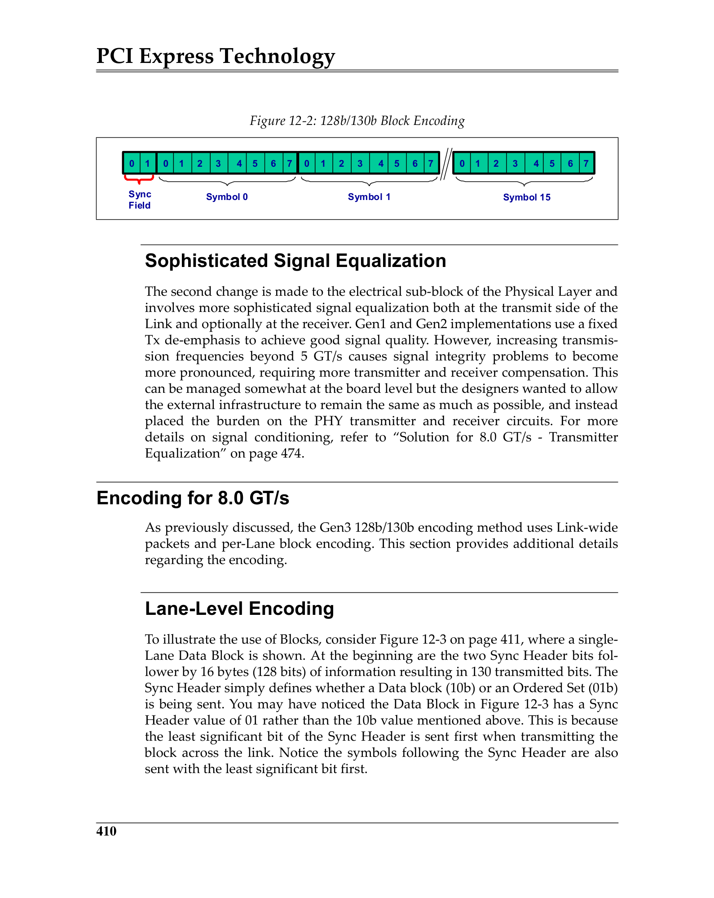
 <em>Figure from ch12 (p.469) / ch12插图 (p.469)</em>

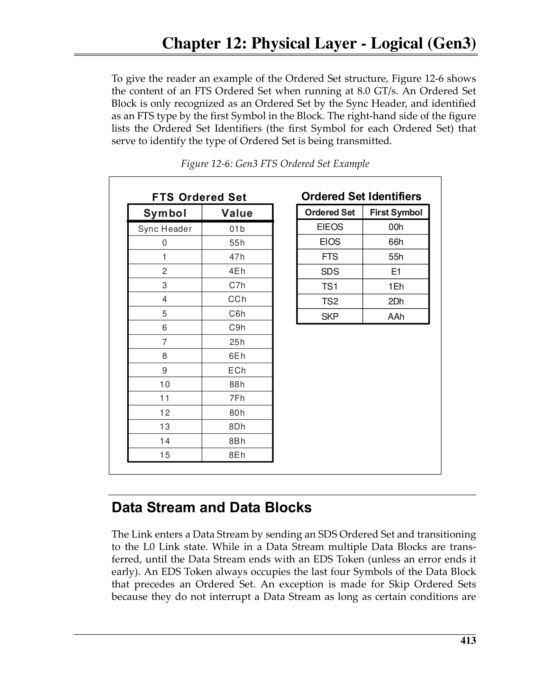
 <em>Figure from ch12 (p.472) / ch12插图 (p.472)</em>

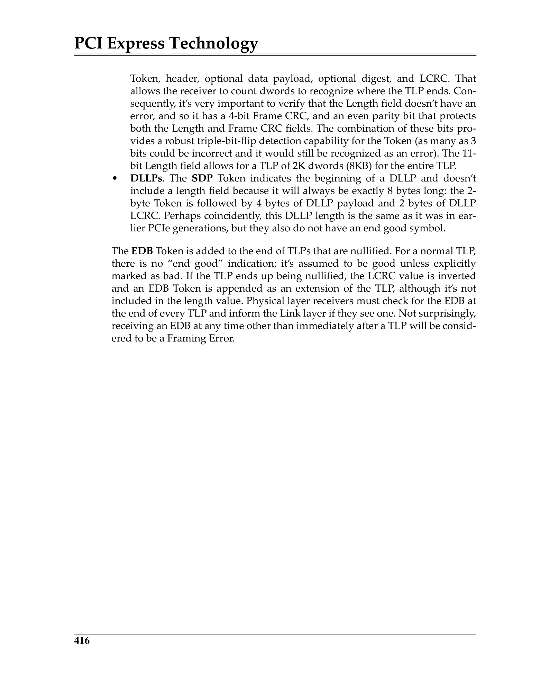
 <em>Figure from ch12 (p.475) / ch12插图 (p.475)</em>

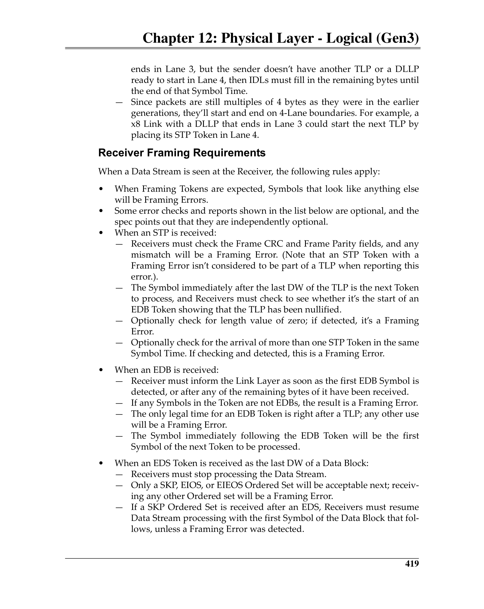
 <em>Figure from ch12 (p.478) / ch12插图 (p.478)</em>

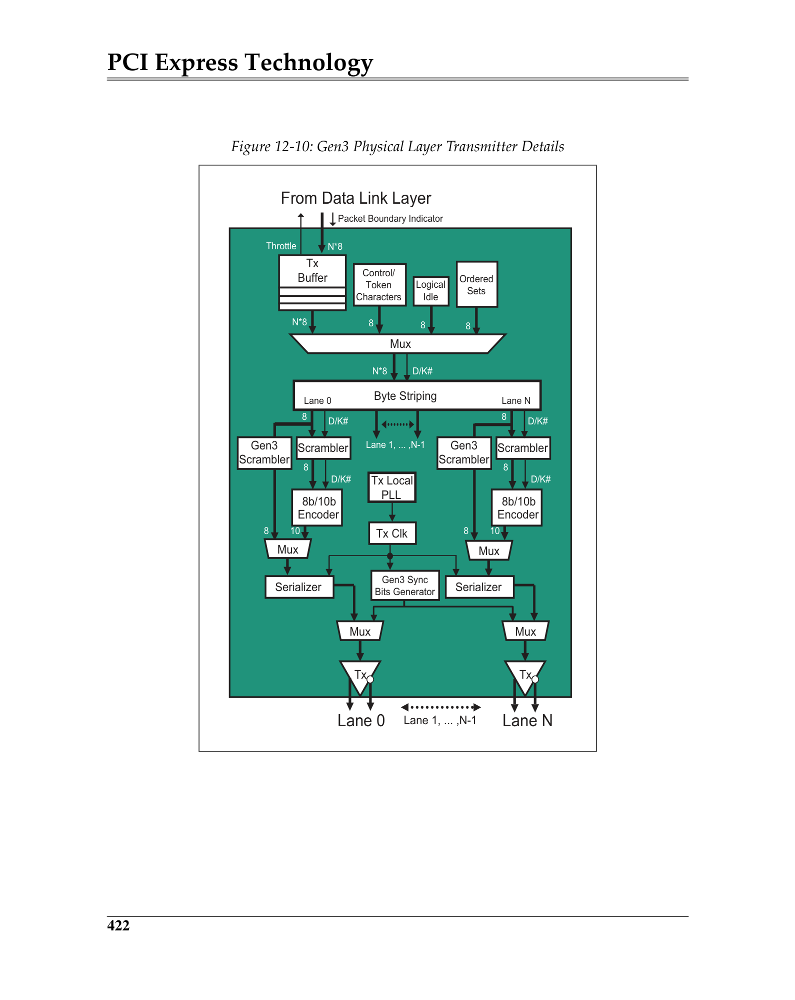
 <em>Figure from ch12 (p.481) / ch12插图 (p.481)</em>

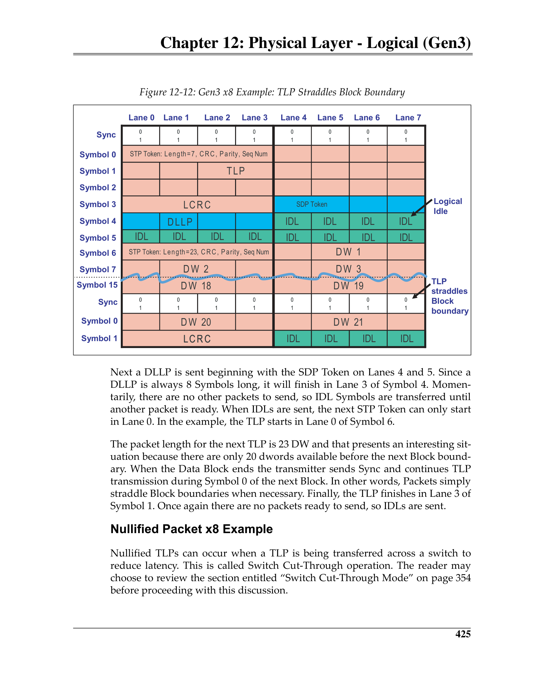
 <em>Figure from ch12 (p.484) / ch12插图 (p.484)</em>

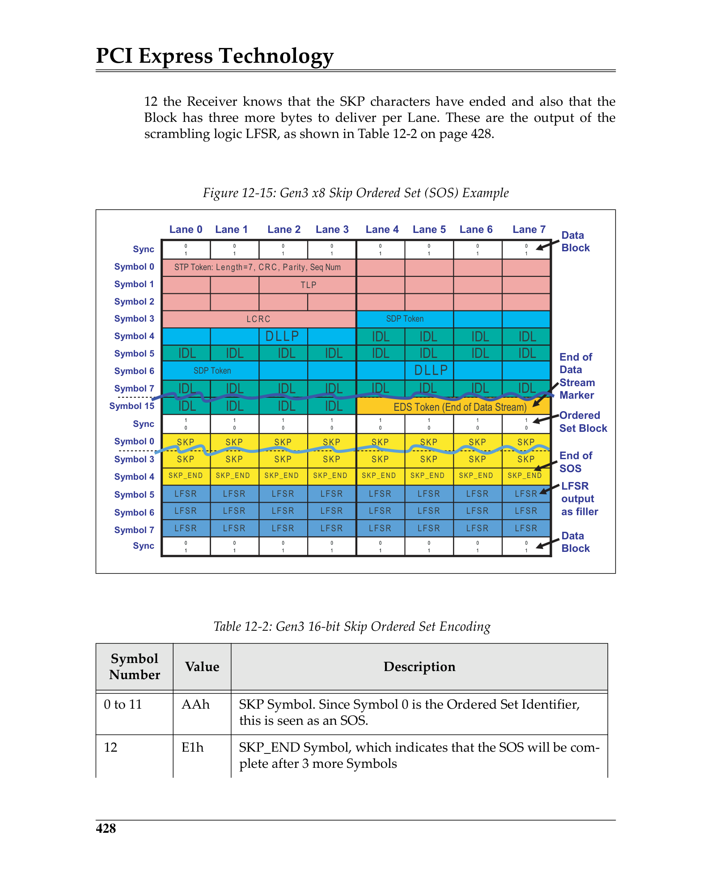
 <em>Figure from ch12 (p.487) / ch12插图 (p.487)</em>

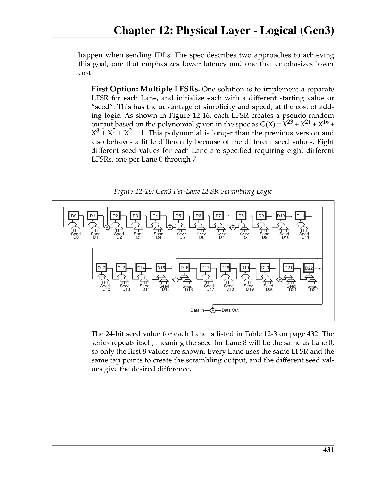
 <em>Figure from ch12 (p.490) / ch12插图 (p.490)</em>

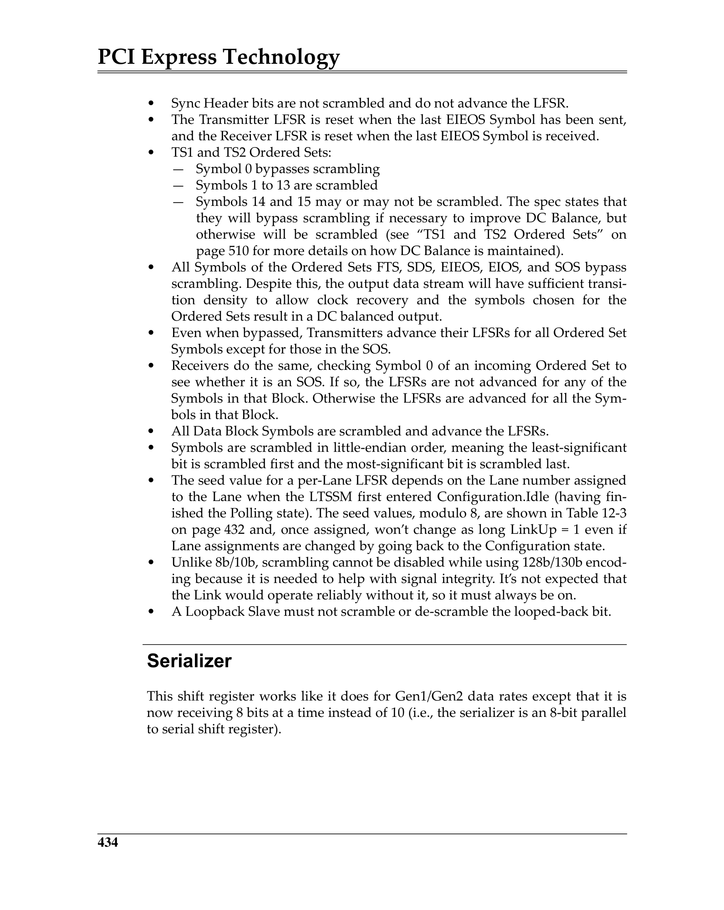
 <em>Figure from ch12 (p.493) / ch12插图 (p.493)</em>

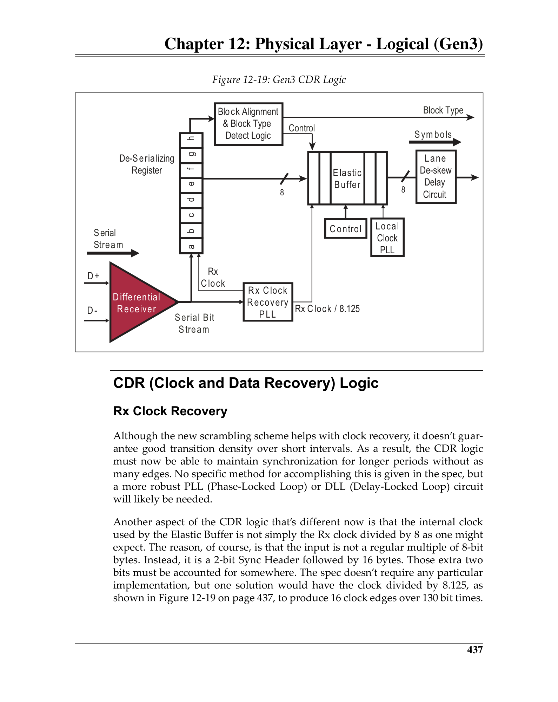
 <em>Figure from ch12 (p.496) / ch12插图 (p.496)</em>

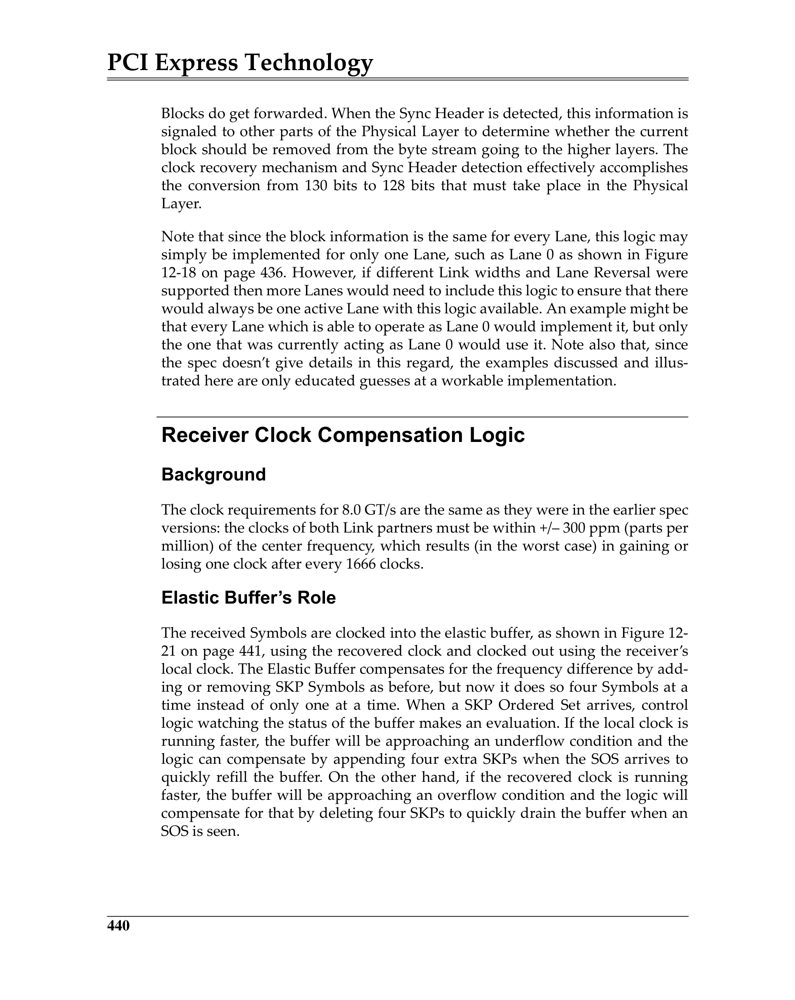
 <em>Figure from ch12 (p.499) / ch12插图 (p.499)</em>

---

## Gen1/Gen2 vs Gen3 Summary / Gen1/Gen2 vs Gen3对比

| Feature | Gen1/Gen2 | Gen3 |
|---------|-----------|------|
| Encoding | 8b/10b | 128b/130b |
| Line Rate | 2.5/5.0 GT/s | 8.0 GT/s |
| Encoding Overhead | 20% | ~1.54% |
| Symbol/Block Size | 10 bits | 130 bits |
| DC Balance | Running Disparity | Scrambler + Precoder |
| Ordered Set ID | COM (K28.5) | Sync Header = 10b |
| Equalization | −3.5 dB De-emphasis | Full TX EQ (presets + coefficients) |
| L0s Support | Yes | No (uses Recovery instead) |
| Electrical Idle Exit | EIOS | EIOS + EIEOS |
