# Chapter 13: Physical Layer — Electrical
# 第13章：物理层——电气子层

> 中英文对照翻译 | Chinese-English Parallel Translation
> Source: MindShare PCI Express Technology 3.0 — Pages: 506–560 (55 pages)

---

## Overview / 概述

The Electrical sub-block of the Physical Layer defines the analog characteristics of PCIe transmitters and receivers — voltage levels, jitter budgets, rise/fall times, return loss, and the physical channel. This chapter covers Gen1 (2.5 GT/s), Gen2 (5.0 GT/s), and Gen3 (8.0 GT/s) electrical parameters.

> 物理层电气子层定义PCIe发送端和接收端的模拟特性——电压水平、抖动预算、上升/下降时间、回波损耗和物理信道。本章涵盖Gen1/2/3电气参数。

---

## Differential Signaling / 差分信令

PCIe uses differential signaling on each Lane — two wires (D+ and D−) carrying equal and opposite signals. Benefits: common-mode noise rejection (interference affects both wires equally and is canceled), reduced EMI (opposite fields cancel), and ability to detect signals at very low amplitudes. The differential peak-to-peak voltage at the transmitter is 800-1200 mV for Gen1/Gen2.

> PCIe使用差分信令——两根线(D+和D−)承载相等且相反的信号。优势：共模噪声抑制(干扰同等地影响两根线并被抵消)、减少EMI(相反场抵消)、极低幅度下也能检测信号。Gen1/Gen2发送端差分峰峰值电压800-1200 mV。

---

## AC Coupling / 交流耦合

PCIe Links are AC-coupled through series capacitors (75-200 nF) on each differential pair. The capacitors block DC, allowing transmitter and receiver to operate at different common-mode voltages — essential when devices from different vendors with different silicon processes are connected. Placement: transmitter side for add-in cards, receiver side for system boards.

> PCIe链路通过差分对上串联电容(75-200nF)交流耦合。电容阻隔直流，允许发送端和接收端以不同共模电压运行。放置：扩展卡发送端侧，系统板接收端侧。

---

## Key Electrical Parameters / 关键电气参数

| Parameter | Gen1 (2.5 GT/s) | Gen2 (5.0 GT/s) | Gen3 (8.0 GT/s) |
|-----------|:---:|:---:|:---:|
| Unit Interval (UI) | 400 ps | 200 ps | 125 ps |
| TX Differential Voltage | 800-1200 mVpp | 800-1200 mVpp | ≤1300 mVpp |
| TX Rise/Fall Time | ≥0.125 UI | ≥0.125 UI | ≥0.15 UI |
| TX Random Jitter (RJ) | ≤0.15 UI | ≤0.15 UI | ≤0.15 UI |
| TX Total Jitter (TJ) | ≤0.25 UI | ≤0.25 UI | ≤0.28 UI |
| Differential Return Loss | ≥10 dB | ≥10 dB | ≥10 dB |
| Common-Mode Return Loss | ≥6 dB | ≥6 dB | ≥6 dB |

---

## De-emphasis (Gen2) / 去加重

At 5.0 GT/s, signal degradation from channel losses becomes significant. **De-emphasis** reduces the amplitude of non-transition bits relative to transition bits by −3.5 dB, pre-compensating for the low-pass filtering effect of the channel. The transition bit is transmitted at full amplitude; subsequent identical bits at reduced amplitude. The receiver's CTLE (Continuous Time Linear Equalizer) is designed to expect this de-emphasis level.

> 5.0 GT/s下信道损耗导致的信号退化显著。去加重将非跳变位幅度相对跳变位降低−3.5 dB，预补偿信道低通滤波效应。跳变位以全幅度发送；后续相同位以降幅发送。接收端CTLE设计为期望此去加重水平。

---

## Equalization (Gen3) / 均衡

At 8.0 GT/s (Nyquist = 4 GHz), simple de-emphasis is insufficient for practical channel lengths. Gen3 introduces full transmitter equalization:

- **Pre-cursor (C−1):** Adjusts signal before main transition to pre-compensate for ISI from previous bits
- **Main cursor (C0):** Normalized to 1.0 — the primary signal level
- **Post-cursor (C+1):** Adjusts signal after transition to compensate for reflections and tail effects

Multiple **presets** define common coefficient sets for short, medium, and long channels. The coefficients are fine-tuned during the **Recovery.Equalization** 4-phase process (Phase 0-3) using EQ Info fields in TS1/TS2 blocks. Each phase allows coefficient requests (±1 increment) and evaluations.

> 8.0 GT/s(Nyquist=4 GHz)下去加重不足。Gen3引入全发送端均衡：前标预补偿先前位ISI、主标归一化1.0、后标补偿反射。多个预设定义常见系数集。系数在Recovery.Equalization四阶段过程中通过TS1/TS2块EQ Info字段微调。

---

## Receiver Characteristics / 接收端特性

**CTLE (Continuous Time Linear Equalizer):** Amplifies high frequencies to compensate for channel low-pass characteristic. Adjustable gain to match channel loss.

**DFE (Decision Feedback Equalizer, optional for Gen3):** Uses previously detected bits to cancel ISI on the current bit via feedback. Non-linear — requires correct prior decisions.

**CDR (Clock and Data Recovery):** Extracts sampling clock from incoming data stream. Uses phase interpolator or PLL-based architecture tracking data edges. Must operate reliably down to minimum signal amplitude.

> CTLE放大高频补偿信道低通特性。DFE(Gen3可选)使用先前检测的位通过反馈消除当前位ISI。CDR从输入数据流提取采样时钟跟踪数据边沿。

---

## Jitter Budget / 抖动预算

Total jitter is divided among transmitter, channel, and receiver. At Gen3 (125 ps UI), jitter margins are tightest.

Jitter components:
- **RJ (Random Jitter):** Gaussian, unbounded, thermal noise origin. Measured as RMS and extrapolated to BER.
- **DJ (Deterministic Jitter):** Bounded — ISI, duty-cycle distortion (DCD), crosstalk.
- **TJ at BER 10^−12:** TJ = DJ + Q_BER × RJ (where Q_BER ≈ 14.069 for 10^−12)

> 总抖动在发送端、信道和接收端间分配。Gen3(125ps UI)下抖动裕量最紧。RJ(高斯无界热噪声)和DJ(有界ISI/DCD/串扰)。TJ=DJ+14.069×RJ(BER 10^−12)。

---

## The Physical Channel / 物理信道

The PCIe channel consists of PCB traces, vias, connectors, and optional cables. Channel reach decreases as data rate increases due to frequency-dependent dielectric and skin-effect losses:

- Gen1 (1.25 GHz Nyquist): 20+ inches FR4 typical
- Gen2 (2.5 GHz Nyquist): ~15 inches typical
- Gen3 (4 GHz Nyquist): ~10 inches typical with equalization

**Key Channel Parameters:**
- **Insertion Loss (S21):** Signal attenuation vs frequency. At Nyquist, Gen3 channels may have 15-25 dB loss
- **Return Loss (S11):** Energy reflected at impedance discontinuities. ≥10 dB required
- **Crosstalk:** Near-end (NEXT) and far-end (FEXT) coupling between adjacent Lanes

> PCIe信道由PCB走线、过孔、连接器和线缆组成。信道延伸随数据速率增加而减少。Gen1 20+英寸FR4、Gen2约15英寸、Gen3约10英寸(需均衡)。关键参数：插入损耗S21、回波损耗S11≥10dB、串扰NEXT/FEXT。

---

## Spread Spectrum Clocking (SSC) / 展频时钟

SSC modulates the reference clock by typically 0.5% down-spread (frequency reduced by 0.5%) at 30-33 kHz modulation rate. Reduces EMI peak amplitude by spreading energy across a wider band. Both Link partners must be configured consistently — either common clock with SSC or separate clocks without SSC. SSC must be disabled during Compliance testing.

> SSC以30-33kHz调制速率、0.5%向下展频调制参考时钟，通过展布能量到更宽频带降低EMI峰值。链路两端必须一致配置。

---

## Key Figures / 关键图示

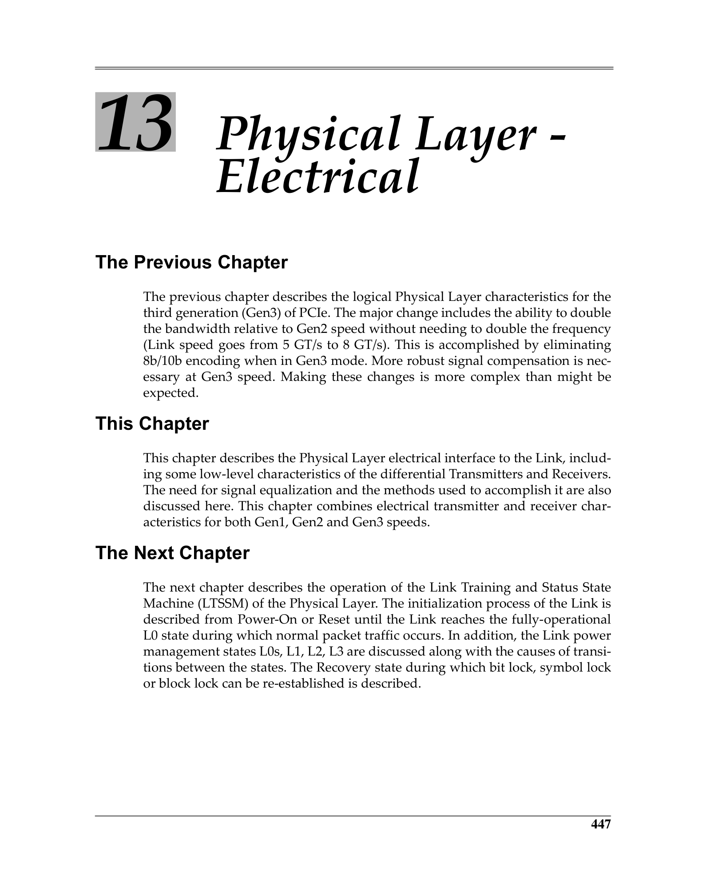
 <em>Figure from ch13 (p.506) / ch13插图 (p.506)</em>

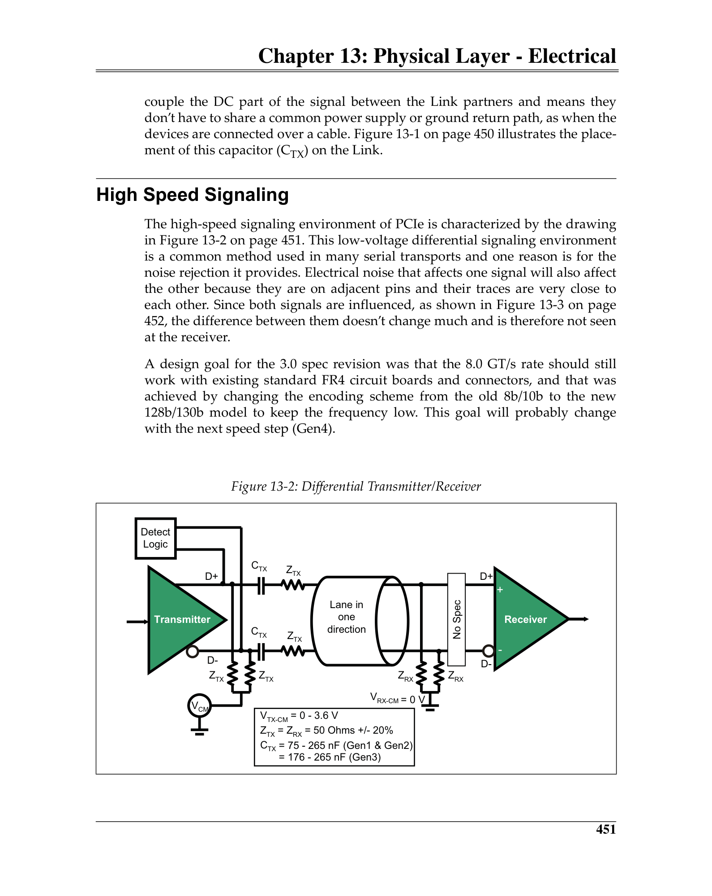
 <em>Figure from ch13 (p.510) / ch13插图 (p.510)</em>

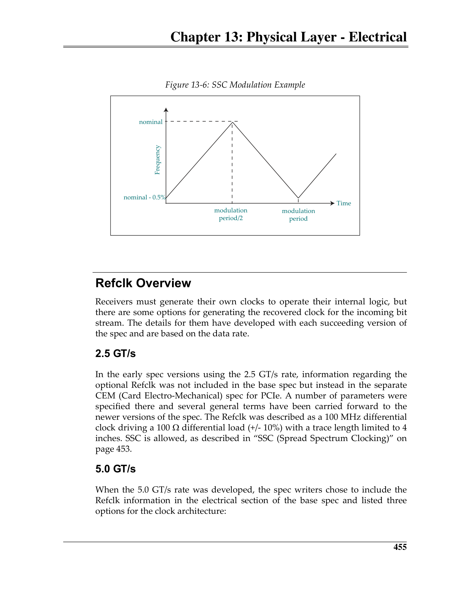
 <em>Figure from ch13 (p.514) / ch13插图 (p.514)</em>

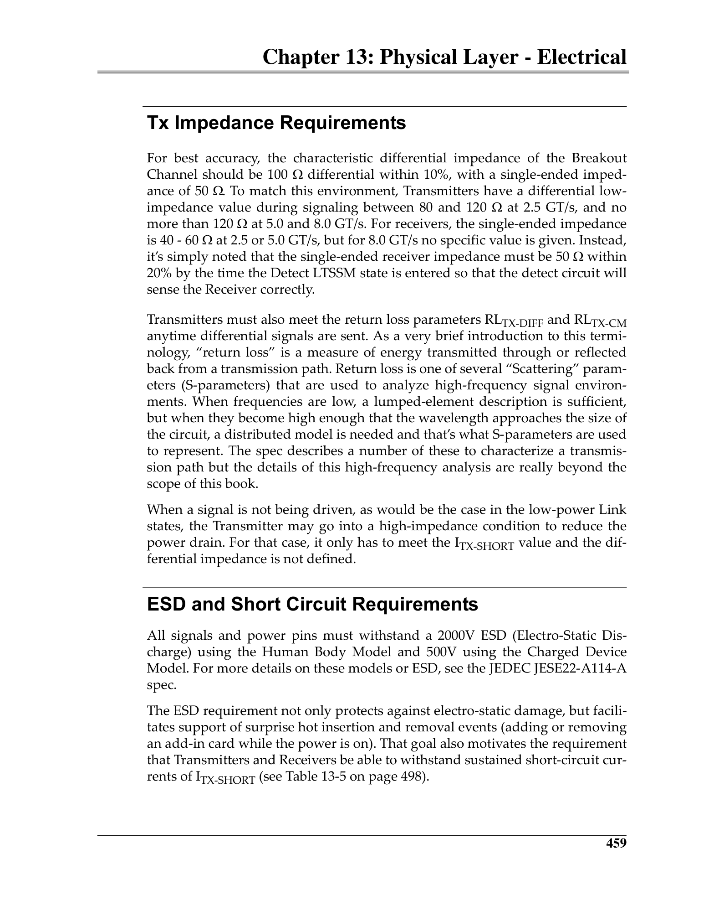
 <em>Figure from ch13 (p.518) / ch13插图 (p.518)</em>

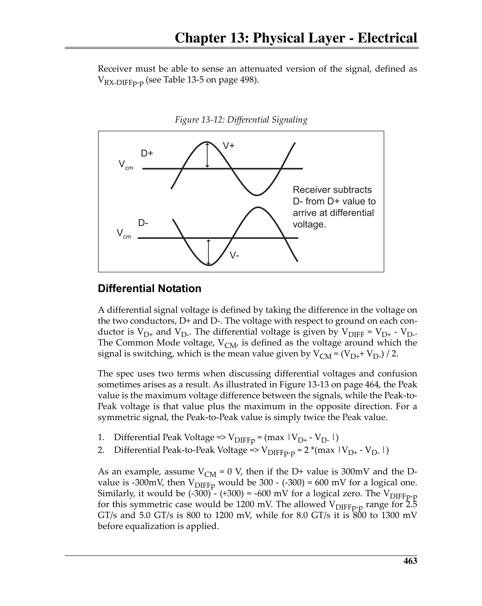
 <em>Figure from ch13 (p.522) / ch13插图 (p.522)</em>

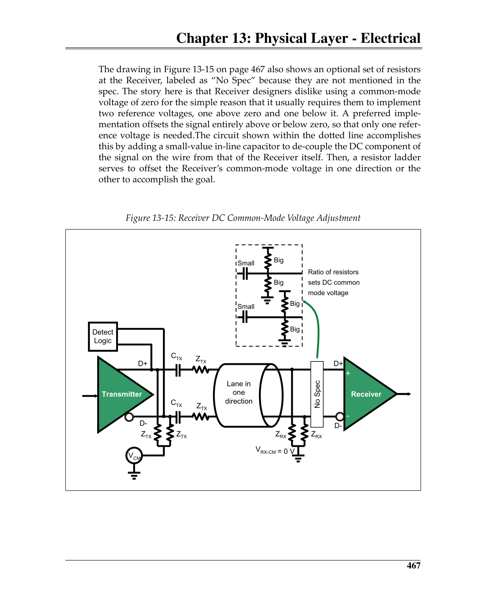
 <em>Figure from ch13 (p.526) / ch13插图 (p.526)</em>

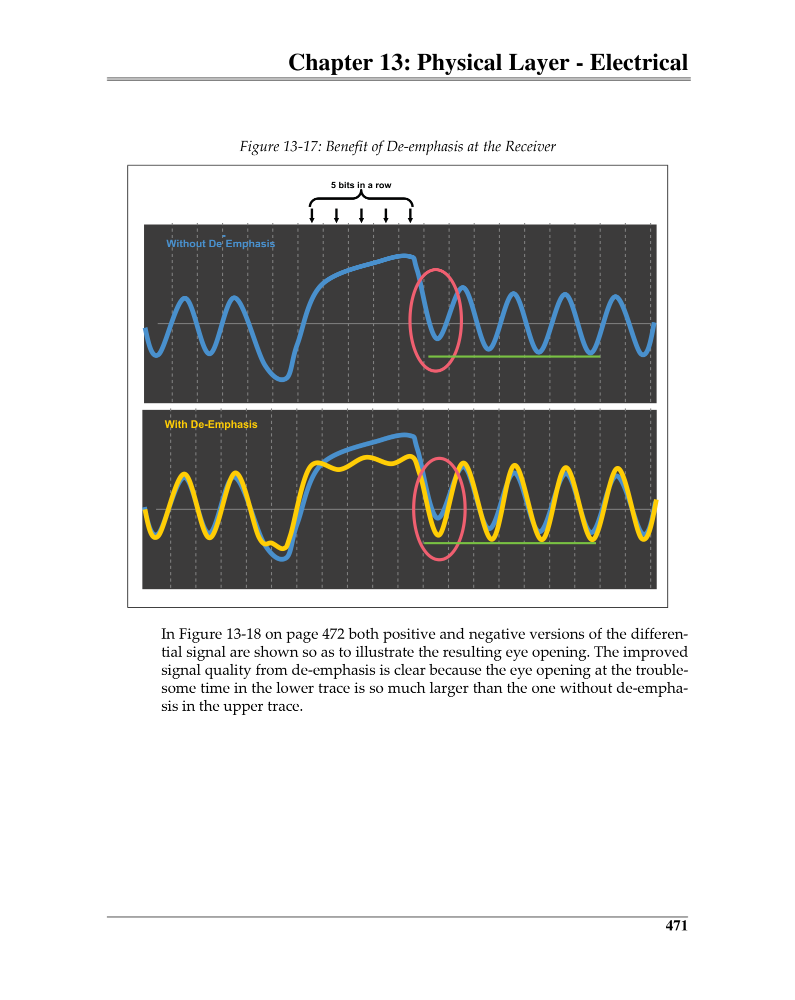
 <em>Figure from ch13 (p.530) / ch13插图 (p.530)</em>

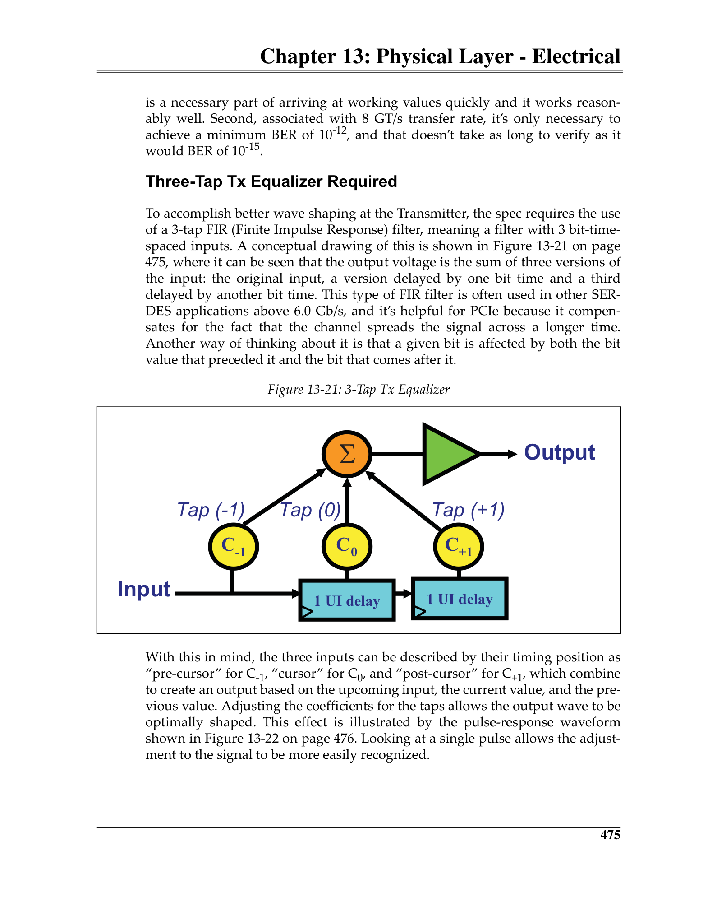
 <em>Figure from ch13 (p.534) / ch13插图 (p.534)</em>

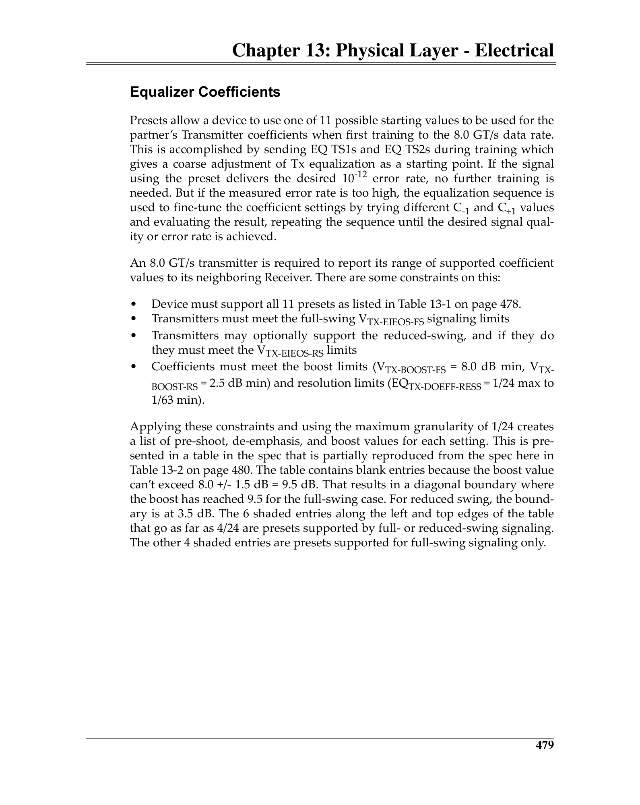
 <em>Figure from ch13 (p.538) / ch13插图 (p.538)</em>

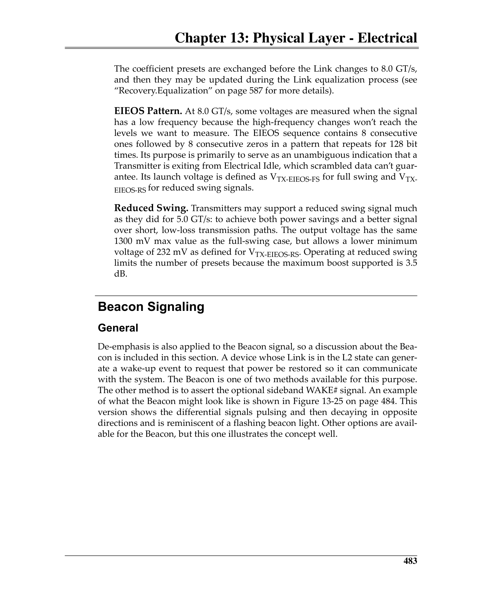
 <em>Figure from ch13 (p.542) / ch13插图 (p.542)</em>

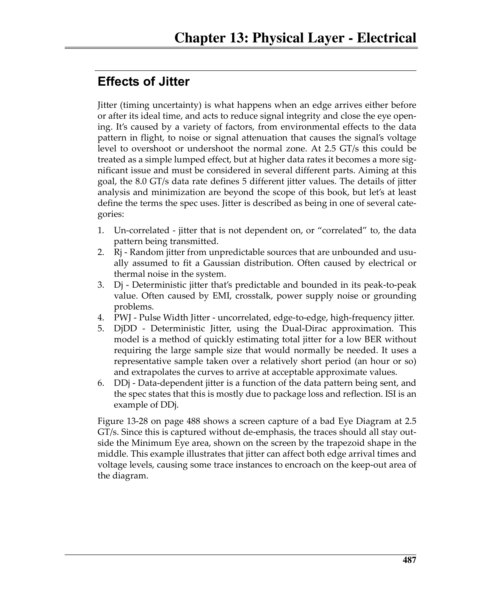
 <em>Figure from ch13 (p.546) / ch13插图 (p.546)</em>

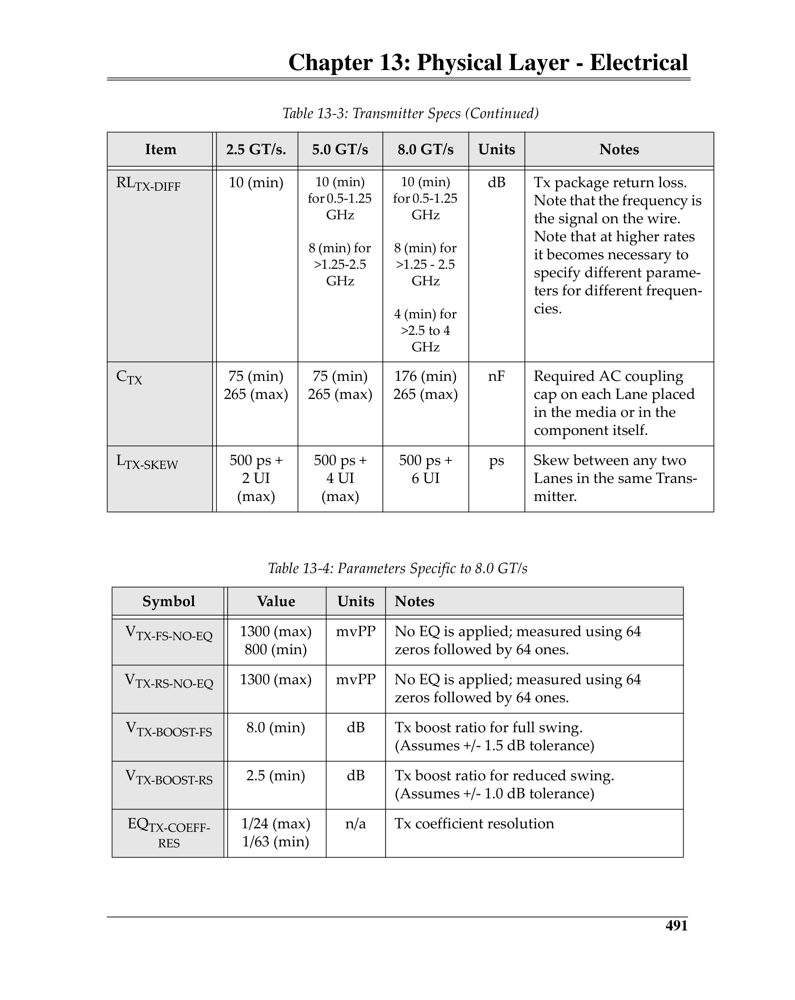
 <em>Figure from ch13 (p.550) / ch13插图 (p.550)</em>

---

## Low-Power Electrical States / 低功耗电气状态

**Electrical Idle:** Differential voltage < 20 mVpp. Transmitter in high-impedance state. Receiver must detect exit (voltage > threshold) reliably.

**L0s/L1:** Transmitter enters Electrical Idle after sending EIOS (Gen1/Gen2) or EIOS+EIEOS (Gen3). PLLs may remain active (L0s) or be disabled (L1).

**Beacon:** Periodic signal on idle Lanes (L2) for wakeup. Must be detectable through significant channel attenuation. Defined as a burst of specific symbols with a defined repetition rate.

> 电气空闲(<20mVpp差分电压发送端高阻态)。L0s/L1发送端在EIOS后进入电气空闲。Beacon(L2唤醒)在空闲通道上周期性信号，必须可在显著信道衰减下检测。
