# Chapter 14: Link Initialization & Training
# 第14章：链路初始化与训练

> 中英文对照翻译 | Chinese-English Parallel Translation
> Source: MindShare PCI Express Technology 3.0 — Pages: 564–702 (139 pages)

---

## Overview / 概述

Link initialization and training is a **hardware-based process** controlled by the Physical Layer — software is not involved in the actual training, though software can trigger certain events (Hot Reset, Link Disable, retraining). The **Link Training and Status State Machine (LTSSM)** orchestrates the entire process from Power-On or Reset until the Link reaches L0 and normal packet traffic flows.

> 链路初始化与训练是由物理层控制的基于硬件的过程——软件不参与实际训练，但可触发某些事件(Hot Reset、Link Disable、重训练)。LTSSM编排从上电或复位直到链路达L0正常包流量流动的整个过程。

The LTSSM has 11 top-level states: **Detect, Polling, Configuration, Recovery, L0, L0s, L1, L2, Hot Reset, Disabled, Loopback**. Each contains multiple substates. The LTSSM operates on main power only — when main power is removed, the LTSSM stops and resets. The two LTSSMs on opposite ends of each Link communicate via Training Sequence Ordered Sets (TS1/TS2) to negotiate all Link parameters.

> LTSSM有11个顶级状态，每个含多个子状态。仅主电源供电。链路两端两个LTSSM通过训练序列有序集(TS1/TS2)通信协商所有链路参数。

---

## Training Sequences: TS1 and TS2 / 训练序列

### Format Differences: Gen1/Gen2 vs Gen3

**Gen1/Gen2 (8b/10b):** TS1/TS2 are 16-Symbol Ordered Sets starting with COM (K28.5). Symbol Lock acquired from COM. The TS Identifier in Symbols 6-9 distinguishes TS1 (4Ah) from TS2 (45h).

**Gen3 (128b/130b):** TS1/TS2 are 130-bit Ordered Set Blocks identified by Sync Header = 10b. First Symbol after Sync Header = 1Eh (TS1) or 2Dh (TS2). All fields are block-aligned.

### Detailed TS1/TS2 Symbol Fields

**Symbol 0 — COM (Gen1/2) / TS ID (Gen3):** Gen1/2 uses K28.5 COM for Symbol Lock + de-skew reference. Gen3 uses 1Eh (TS1) / 2Dh (TS2).

**Symbol 1 — Link Number (0-31):** Assigned during Configuration. Polling uses PAD (F7h). Each Link in hierarchy must have unique Link Number. Components compare received Link Number against expected value to verify correct Link partner.

**Symbol 2 — Lane Number (0-31):** Assigned during Configuration per Lane. Polling uses PAD. Later, each Lane gets unique number within its Link (0 to N−1 for N-Lane width). Used for de-skew and data reassembly.

**Symbol 3 — N_FTS:** Fast Training Sequence count required by receiver for L0s exit. Transmitter sends at least this many FTSs when exiting L0s. Extended Synch bit → 4096 FTSs for external monitoring tools. Timing example at 2.5 GT/s: 200 FTS × 4 Symbols/FTS × 4 ns = 3200 ns.

**Symbol 4 — Rate ID:** Reports supported data rates (2.5 GT/s mandatory). Sub-fields: Autonomous Change (set=power mgmt, cleared=unreliable ops), Selectable De-emphasis (5.0 GT/s), Link Upconfigure Capability.

**Symbol 5 — Training Control:** Hot Reset, Enable Loopback, Disable Link, Disable Scrambling, Compliance Receive bits.

**Symbols 6-9 — TS Identifier:** Distinguishes TS1 from TS2 in Gen1/Gen2.

**Symbols 10-13 — EQ Info (Gen3):** Transmitter preset and coefficient requests for Recovery.Equalization at 8.0 GT/s.

**Symbols 14-15 — DC Balance:** Ensure long-term DC balance.

---

## The LTSSM States in Detail / LTSSM状态详解

### 1. Detect State

Entry point after Fundamental Reset, Hot Reset, or L2 exit. Goal: detect far-end receiver termination on each Lane.

**Detect.Quiet (12 ms minimum):** Transmitter in Electrical Idle. Receiver monitors for Electrical Idle exit. Long dwell time ensures stable power and clock before detection.

**Detect.Active:** Receiver drives common-mode voltage step on each unconfigured Lane and measures RC time constant. A 50Ω termination to ground yields a specific RC response — if detected, receiver is present. At least one Lane must detect a receiver to advance to Polling.

> Detect状态：入口点(基本复位/热复位/L2退出后)。Detect.Quiet(≥12ms)发送端电气空闲。Detect.Active驱动共模电压脉冲测量RC时间常数检测50Ω端接。至少一条通道检测到接收端才能进入Polling。

### 2. Polling State

First state with active transmitter. Establishes Bit Lock and Symbol Lock (or Block Lock), determines Lane polarity.

**Polling.Active:** Transmitter sends TS1s on all detected Lanes at highest common supported data rate. Receiver acquires Bit Lock (locating bit boundaries) from data transitions, then Symbol Lock (Gen1/2, from COM character) or Block Lock (Gen3, from Sync Header pattern). Lane polarity inversion detected and auto-corrected from inverted COM/Sync Header.

**Polling.Configuration:** Bit/Symbol Lock confirmed on all lanes. TS1s continue while transitioning to Configuration. Short substate — signals readiness.

**Polling.Compliance:** Entered for compliance testing. Transmitter sends predefined compliance pattern instead of TS1s. Test equipment measures TX characteristics (voltage, jitter, eye diagram). Compliance pattern includes both stressed and clean sequences.

> Polling状态：首个活跃发送端状态。Polling.Active以最高公共速率发送TS1获取位/符号/块锁定和极性；Polling.Configuration确认锁定；Polling.Compliance发送合规测试模式供测量。

### 3. Configuration State

Fully configures the Link: assigns Link/Lane numbers, negotiates final width, de-skews Lanes. Six ordered substates:

1. **Linkwidth.Start:** Downstream Port proposes Link width (max detected lanes) via TS1s. Upstream echoes.
2. **Linkwidth.Accept:** Final width locked. Unused lanes marked inactive.
3. **Lanenum.Wait:** **Switch from TS1 to TS2** — signals ready to finalize Lane numbering. Each Lane gets unique Lane Number (0…N−1).
4. **Lanenum.Accept:** Upstream confirms Lane numbering by echoing TS2s.
5. **Complete:** All config agreed. TS2s continue. Link/Lane numbers, N_FTS, data rate latched into internal registers. Upconfigure capability recorded.
6. **Idle:** TS2s stop. Idle data instead. After minimum idle period (both sides see valid idle), transition to L0.

**Lane-to-Lane De-skew:** COM/Sync Header provides reference — receiver measures arrival time differences across Lanes, delays earlier arrivals to align with latest Lane.

> Configuration六子状态：Linkwidth.Start(提议宽度)→Accept(锁定)→Lanenum.Wait(TS1→TS2信号)→Accept(确认)→Complete(所有参数锁存)→Idle(空闲后转L0)。通道间去偏斜使用COM/Sync Header对齐。

### 4. L0 State — Fully Operational

Normal operation. TLPs carry read/write/completions; DLLPs carry ACK/NAK/FC updates; SKP Ordered Sets for clock compensation. Transmitter continuously sends packets or logical idle. Electrical Idle signals low-power transition.

### 5. L0s State — Standby (Gen1/Gen2 only)

Per-direction, very short entry/exit latency (~100 ns). No handshake. Idle → EIOS → Electrical Idle. Exit: FTSs (count from N_FTS) + SKP OS → resume.

> L0正常操作连续发送。L0s(仅Gen1/Gen2)按方向独立极短延迟。空闲→EIOS→电气空闲。退出：FTS+SKP→恢复。

### 6. Recovery State

Entered from L0/L0s/L1 when Link must re-sync. All Lanes re-establish Bit/Symbol/Block Lock.

**RcvrLock:** TS1s sent on all configured lanes. Receiver re-acquires lock. All lanes must lock within timeout (24ms Gen1/2) or transition to Detect.

**RcvrCfg:** TS2s exchanged. Confirms Link/Lane config. Communicates speed/width change intent.

**Speed:** Data rate change. Both sides switch to new rate simultaneously. If lock fails → fall back to previous rate (or Detect).

**Equalization (Gen3, 4 phases):** Phase 0: Upstream advertises preset/coefficients, Downstream requests adjustments. Phase 1: Downstream TX equalized. Phase 2: Upstream TX equalized. Phase 3: Final lock confirmation.

**Idle:** Idle data → L0.

> Recovery：链路重同步。RcvrLock(TS1重获锁定，24ms超时)→RcvrCfg(TS2确认配置)→Speed(速率变更)→Equalization(Gen3四阶段均衡)→Idle→L0。

### 7. L1, L2, Hot Reset, Disabled, Loopback

**L1:** Deeper standby, both directions via PM DLLP handshake. PLLs may be off.

**L2:** Deep sleep — main power off, Vaux for wakeup. Exit via Detect (Fundamental Reset).

**Hot Reset:** TS1s with Training Control Hot Reset bit set. In-band, targeted.

**Disabled:** Link Disable bit → Electrical Idle. Software clears bit to retrain.

**Loopback:** Test mode. Master→Slave→Master loop. BERT testing.

---

## Speed and Width Changes

Both occur through Recovery state. Downstream Port proposes; both sides must support target. Directed change (software writes Target Link Speed in Link Control 2). Autonomous change (hardware detects excessive errors → downgrades).

---

## Key Figures / 关键图示

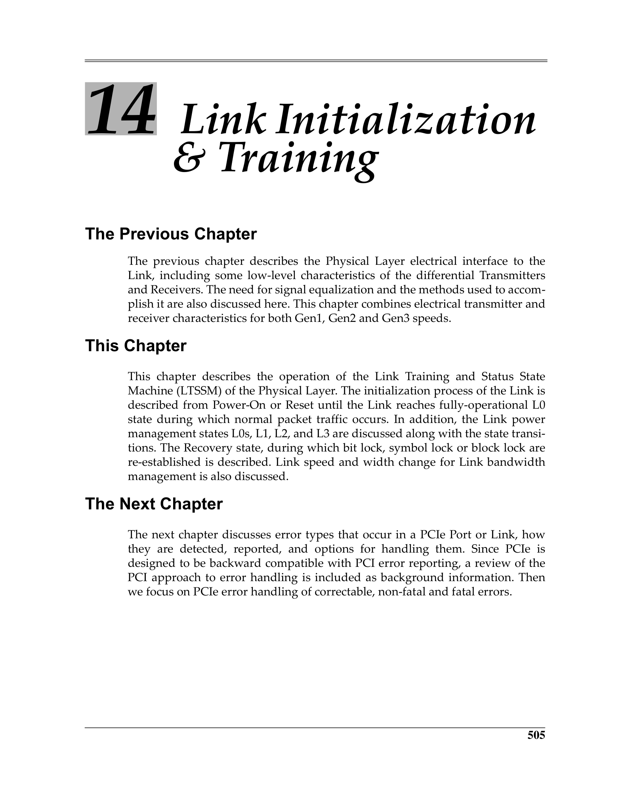
 <em>Figure from ch14 (p.564) / ch14插图 (p.564)</em>

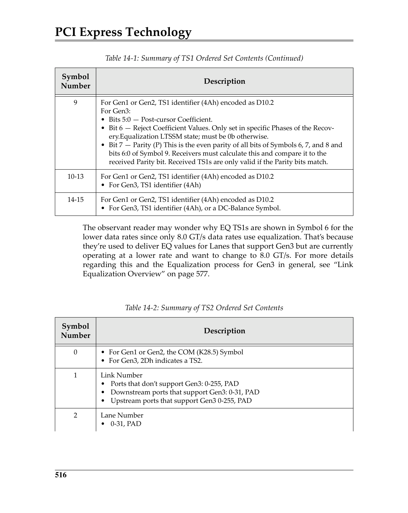
 <em>Figure from ch14 (p.575) / ch14插图 (p.575)</em>

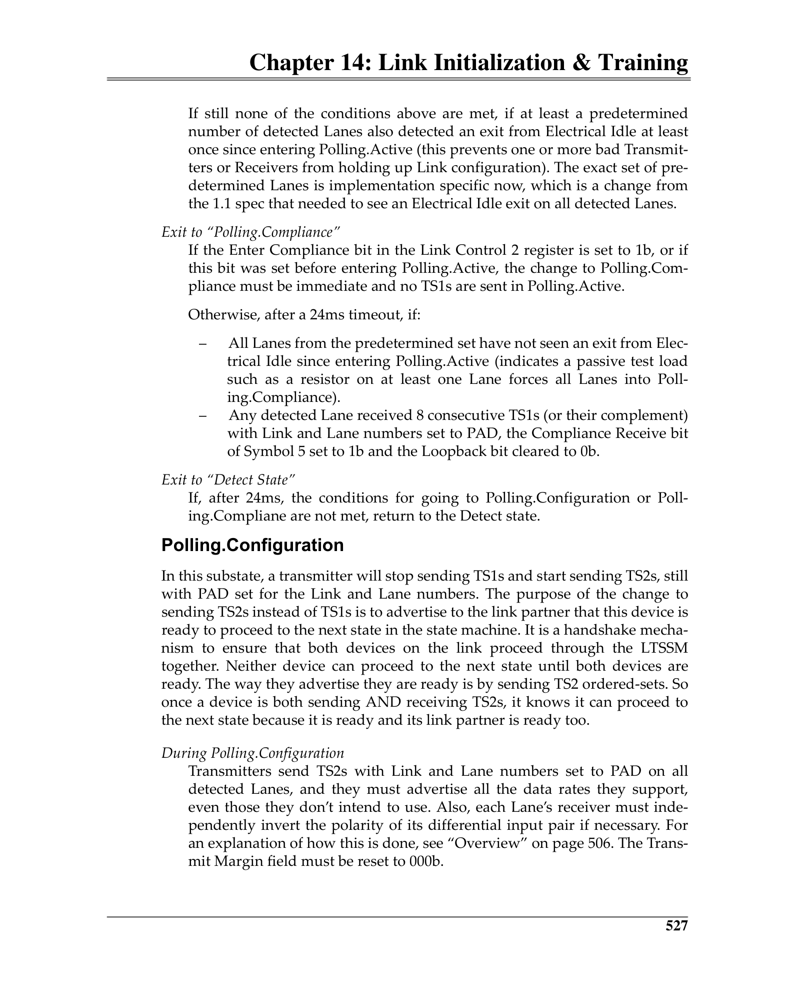
 <em>Figure from ch14 (p.586) / ch14插图 (p.586)</em>

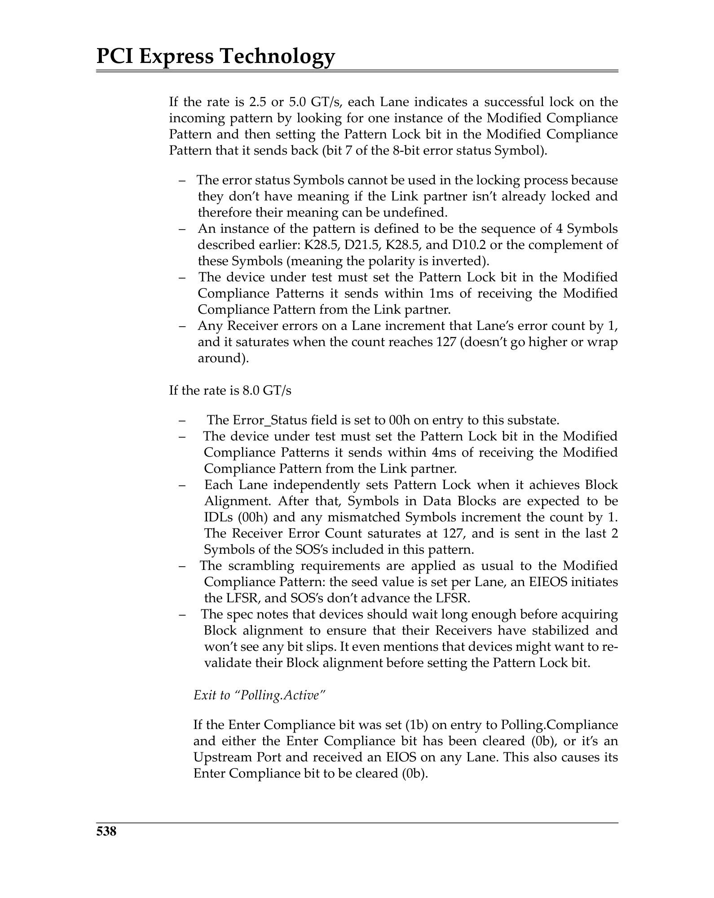
 <em>Figure from ch14 (p.597) / ch14插图 (p.597)</em>

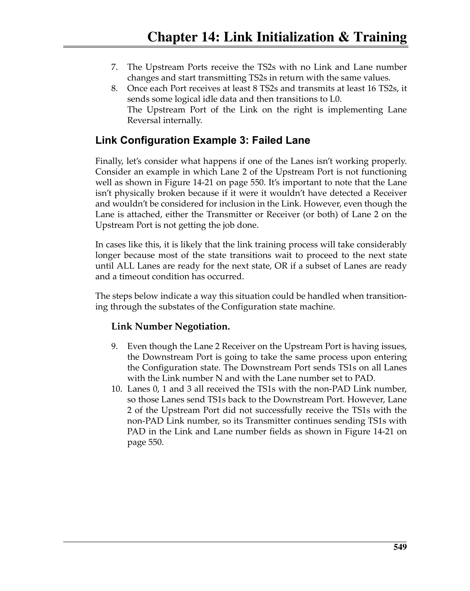
 <em>Figure from ch14 (p.608) / ch14插图 (p.608)</em>

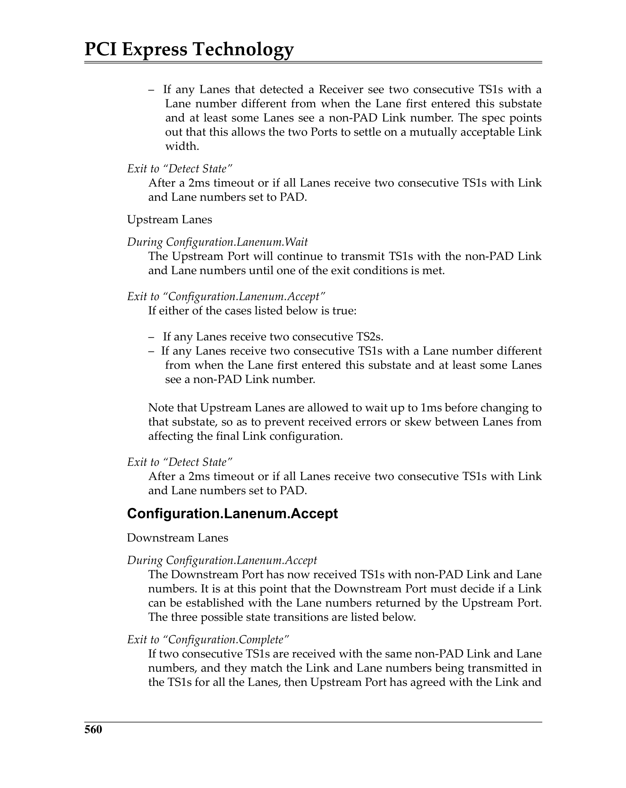
 <em>Figure from ch14 (p.619) / ch14插图 (p.619)</em>

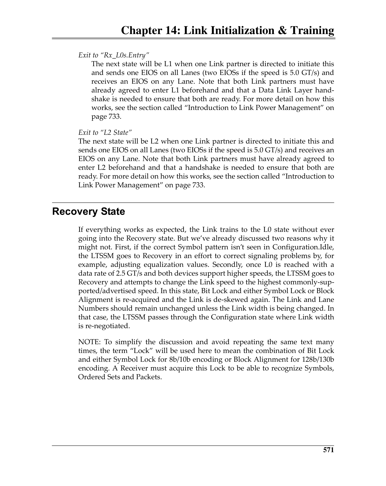
 <em>Figure from ch14 (p.630) / ch14插图 (p.630)</em>

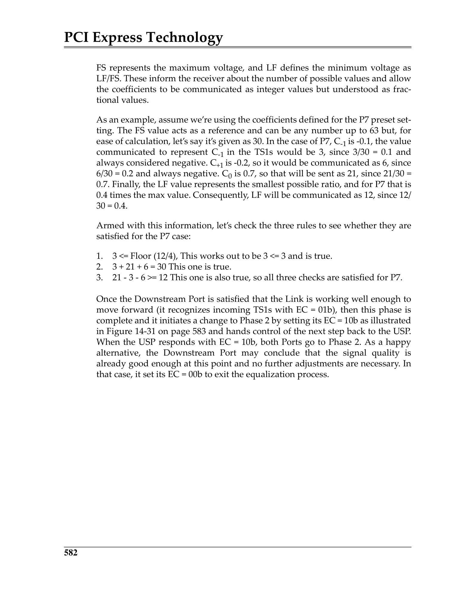
 <em>Figure from ch14 (p.641) / ch14插图 (p.641)</em>

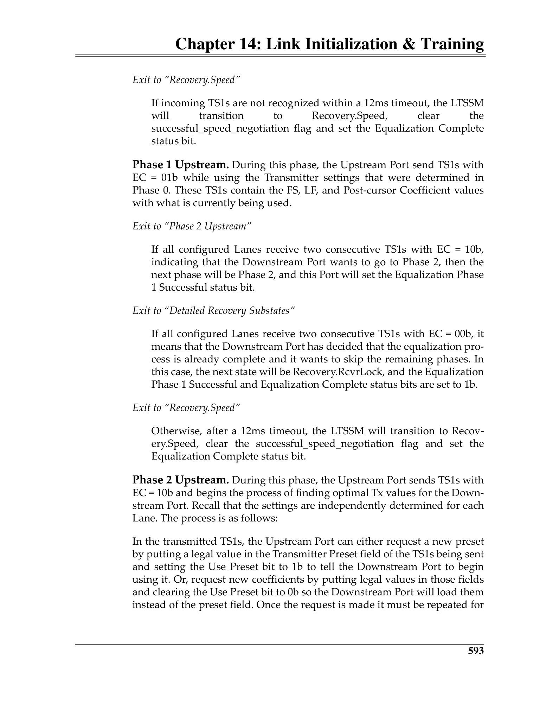
 <em>Figure from ch14 (p.652) / ch14插图 (p.652)</em>

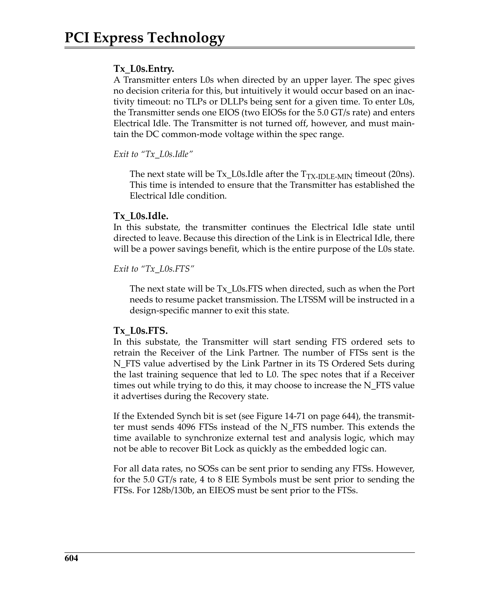
 <em>Figure from ch14 (p.663) / ch14插图 (p.663)</em>

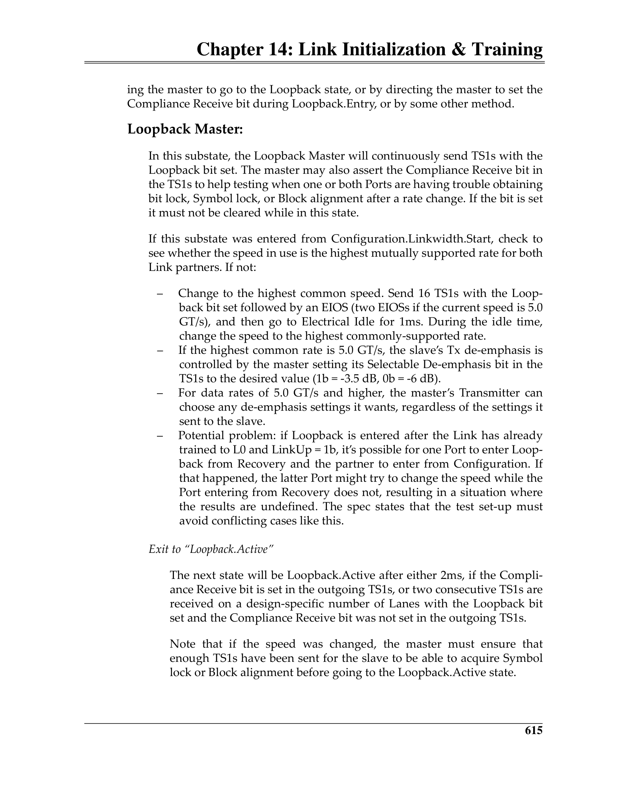
 <em>Figure from ch14 (p.674) / ch14插图 (p.674)</em>

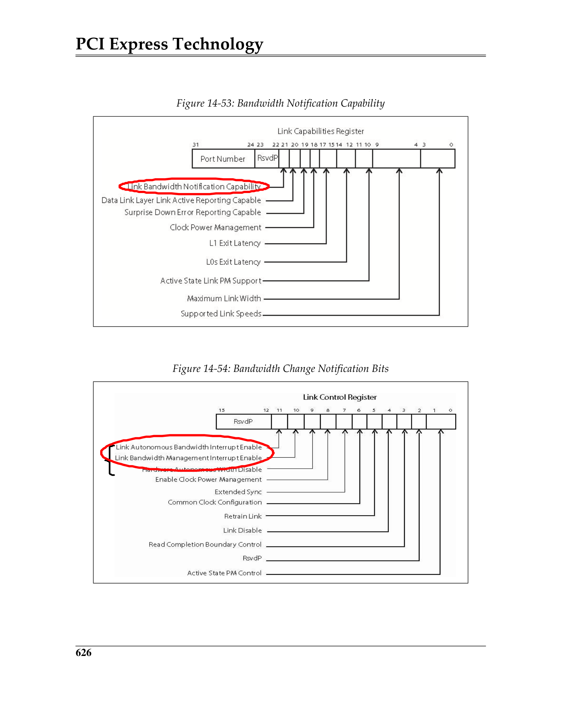
 <em>Figure from ch14 (p.685) / ch14插图 (p.685)</em>

---

## State Transition Summary

| From → To | Trigger |
|------------|---------|
| Detect → Polling | ≥1 lane detects receiver after 12ms |
| Polling → Configuration | All detected lanes achieve lock |
| Configuration → L0 | Link/Lane config complete + idle period |
| L0 → Recovery | Error, retraining request, speed/width change |
| L0 → L0s | Idle, per-direction, unilateral |
| L0 → L1 | PM DLLP handshake |
| L0s/L1 → Recovery | Need to transmit, Electrical Idle exit |
| Recovery → L0 | Lock re-established, config confirmed |
| Recovery → Detect | Timeout (24ms) or config mismatch |
| L2 → Detect | Main power restored + Fundamental Reset |
| Any → Hot Reset | TS1 with Hot Reset bit received |
| Any → Disabled | Link Disable bit set |
