# Chapter 15: Error Detection and Handling
# 第15章：错误检测与处理

> 中英文对照翻译 | Chinese-English Parallel Translation
> Source: MindShare PCI Express Technology 3.0 | Pages: 706–758 (53 pages)

---

## Background: PCI Error Handling / 背景：PCI错误处理

Software backward compatibility with PCI is an important feature of PCIe, and the PCI error handling model forms the baseline. In the PCI model, errors are reported through two bits in the PCI Status Register: **Signaled System Error (SERR#)** for fatal errors and address parity errors, and **Parity Error Detected (PERR#)** for data parity errors. These sideband signals are routed to the system's NMI or SMI handler, which then queries all PCI devices to identify the error source — a slow and imprecise process.

> 与PCI的软件向后兼容是PCIe的重要特性，PCI错误处理模型构成基线。PCI模型中错误通过Status Register中的SERR#（致命错误和地址奇偶校验错误）和PERR#（数据奇偶校验错误）两个位报告。这些边带信号路由到系统NMI或SMI处理程序，后者随后查询所有PCI设备以识别错误源——这是一个缓慢且不精确的过程。

---

## PCIe Error Classification / PCIe错误分类

PCIe enhances error handling significantly with three severity levels, each with distinct reporting and handling mechanisms:

**1. Correctable Errors:** Errors that hardware can correct without software intervention or loss of data integrity. Examples: receiver errors corrected by retransmission (Ack/Nak protocol), correctable ECC errors on internal data paths. These are logged for monitoring but do not disrupt normal operation.

**2. Non-Fatal Errors:** Uncorrectable errors that affect a particular Function but do not corrupt the entire system state. The Link and other Functions may continue operating. Examples: Unsupported Request completion, Completion Timeout, Poisoned TLP received. The device may be reset and recovered.

**3. Fatal Errors:** Uncorrectable errors that corrupt the system state or make the Link unreliable. Examples: Malformed TLP, Receiver Overflow, Flow Control Protocol Error, Data Link Protocol Error. These typically require Link re-training or a full device reset.

> PCIe以三个严重级别显著增强错误处理：
> **1. 可纠正错误：** 硬件可在无需软件干预或不损失数据完整性的情况下纠正。如通过重传纠正的接收端错误、内部数据路径上的可纠正ECC错误。记录供监控但不中断正常运行。
> **2. 非致命错误：** 影响特定Function但不破坏整个系统状态的不可纠正错误。如Unsupported Request completion、Completion Timeout、接收Poisoned TLP。设备可复位和恢复。
> **3. 致命错误：** 破坏系统状态或使链路不可靠的不可纠正错误。如Malformed TLP、Receiver Overflow、流控协议错误、数据链路协议错误。通常需要链路重训练或完全设备复位。

---

## Error Detection Mechanisms / 错误检测机制

PCIe implements multiple layers of error detection:

### Link-Level Errors (Data Link Layer)
- **LCRC Error:** The 32-bit Link CRC appended to every TLP by the Data Link Layer. If the receiver detects LCRC mismatch, the TLP is NAKed and retransmitted. LCRC provides correction by retransmission.
- **Sequence Number Error:** Each TLP carries a sequence number. Missing or duplicate sequence numbers indicate a DLLP loss or replay buffer corruption.
- **FC Protocol Error:** Transmitter sending more TLPs than the receiver has advertised credits for.

> **LCRC错误：** 数据链路层为每个TLP附加32位Link CRC。若接收端检测LCRC不匹配则NAK并重传。LCRC通过重传提供纠正。
> **序列号错误：** 每个TLP携带序列号。缺失或重复序列号指示DLLP丢失或重播缓冲损坏。
> **FC协议错误：** 发送端发送超过接收端广告信用的TLP。

### Transaction-Level Errors (Transaction Layer)
- **Poisoned TLP:** A TLP whose EP bit is set, indicating the data is known to be bad. The receiver can propagate the poison or take corrective action.
- **ECRC Error:** Optional End-to-End CRC check. Unlike LCRC (hop-by-hop), ECRC provides end-to-end integrity from Requester to Completer. Detected but not correctable — reported as a non-fatal error.
- **Malformed TLP:** TLP with invalid header fields (wrong Type field, length mismatch, invalid TC, etc.).
- **Unsupported Request (UR):** A Request that the Completer does not support.
- **Completion Timeout:** Requester does not receive a Completion within the timeout period (typically 10 ms to 50 ms, configuration-dependent).

> **Poisoned TLP：** EP位置位的TLP，指示数据已知损坏。接收端可传播毒药或采取纠正措施。
> **ECRC错误：** 可选的端到端CRC检查。与LCRC(逐跳)不同，ECRC提供从请求者到完成者的端到端完整性。可检测但不可纠正。
> **Malformed TLP：** 包含无效头字段的TLP。
> **Unsupported Request：** 完成者不支持的请求。
> **Completion Timeout：** 请求者未在超时期间内收到Completion(通常10-50ms)。

### Physical Layer Errors
- **8b/10b Decode Error (Gen1/Gen2):** Received Symbol is not in the valid 8b/10b table. Typically indicates a bit error.
- **Framing Error:** Incorrect Sync Header (00b or 11b in Gen3), or missing/extra Symbols in a packet.
- **Elastic Buffer Overflow/Underflow:** Clock compensation mechanism failure.
- **Loss of Symbol Lock / Block Lock:** LTSSM transitions to Recovery.

> **8b/10b解码错误(Gen1/Gen2)：** 接收Symbol不在有效8b/10b表中。
> **定帧错误：** Gen3中非法Sync Header(00b或11b)。
> **弹性缓冲溢出/欠载：** 时钟补偿机制失败。
> **丢失符号锁定/块锁定：** LTSSM转换到Recovery。

---

## Error Reporting: Baseline vs AER / 错误报告：基线 vs 高级错误报告

### Baseline Error Reporting (PCI-Compatible)

The PCI-compatible error registers in the PCI Status Register and the Device Status Register provide basic error reporting:
- **Signaled System Error:** Set when the Function sends an ERR_FATAL or ERR_NONFATAL Message
- **Detected Parity Error:** Set on any uncorrectable error (in PCIe, this is overloaded for all uncorrectable errors)

Baseline reporting does not distinguish among error types — all uncorrectable errors look the same to legacy software.

> PCI兼容的基线错误报告仅通过Status Register中的Signaled System Error和Detected Parity Error位，不区分错误类型——所有不可纠正错误对传统软件看起来相同。

### Advanced Error Reporting (AER)

AER (ECAP ID 0001h) provides significantly richer error reporting:

- **Uncorrectable Error Status Register (Offset 04h):** Individual bits for each error type — Malformed TLP, Receiver Overflow, Unexpected Completion, Completer Abort, Completion Timeout, Flow Control Protocol Error, Poisoned TLP Received, ECRC Error, Unsupported Request, ACS Violation, Uncorrectable Internal Error, MC Blocked TLP, AtomicOp Egress Blocked, TLP Prefix Blocked.

- **Uncorrectable Error Severity Register (Offset 0Ch):** Each bit selects whether the corresponding error is treated as FATAL or NON-FATAL. Software can configure the severity to match system policy.

- **Correctable Error Status Register (Offset 10h):** Receiver Error, Bad TLP, Bad DLLP, REPLAY_NUM Rollover, Replay Timer Timeout, Advisory Non-Fatal Error, Corrected Internal Error, Header Log Overflow.

- **Header Log Register (Offset 1Ch):** Captures the header of the first TLP that caused an uncorrectable error. Essential for error diagnosis.

> AER提供显著更丰富的错误报告：每个错误类型在Uncorrectable Error Status中有独立位；软件可通过Severity Register配置致命/非致命分类；Header Log捕获首个错误TLP头，对诊断至关重要。

---

## Error Signaling: Messages / 错误信令：消息

PCIe uses in-band Messages (not sideband pins) to signal errors:
- **ERR_COR:** Sent when a correctable error is detected and reporting is enabled
- **ERR_NONFATAL:** Sent when a non-fatal uncorrectable error is detected
- **ERR_FATAL:** Sent when a fatal uncorrectable error is detected

These Messages are routed upstream (toward the Root Complex) using implicit routing. The Root Complex logs the error and may signal the OS via SERR#/NMI or an interrupt, depending on the Root Control register settings.

> PCIe使用带内Message信号错误：ERR_COR(可纠正)、ERR_NONFATAL(非致命)、ERR_FATAL(致命)。这些Message使用隐式路由向上游(Root Complex)发送。Root Complex记录错误并可能通过SERR#/NMI或中断信号OS。

---

## Error Handling Flow / 错误处理流程

1. **Detection:** Hardware detects error at any layer
2. **Logging:** Error status bit is set in the appropriate register (Device Status for baseline, AER registers for advanced)
3. **Signaling:** First error triggers an error Message (ERR_COR/ERR_NONFATAL/ERR_FATAL). Subsequent errors of the same severity may be masked until the first is cleared.
4. **Root Complex Processing:** RC receives error Message, sets corresponding Root Error Status bits, may assert NMI/SERR# based on Root Control
5. **Software Handler:** OS error handler (AER driver) scans the hierarchy, reads AER registers for all devices, identifies the error source, records logs, and takes recovery action (Function reset, Link retraining, device removal)

> 检测→记录(状态位置位)→信令(首个错误触发Message，后续同类可被屏蔽)→Root Complex处理(RC设置对应状态位，可能断言NMI/SERR#)→软件处理(OS AER驱动扫描层次结构、读取AER寄存器、识别错误源、记录日志、采取恢复措施)。

---

## Multiple Error Handling / 多错误处理

AER supports recording multiple error sources. If a second error occurs before the first is cleared, the **Multiple Header Recording Capable** bit indicates the device can log multiple headers. The Header Log overflow bit is set when the log capacity is exceeded.

> AER支持记录多个错误源。若首个错误清除前第二个发生，Multiple Header Recording Capable位指示设备可记录多个头部。Header Log溢出位在日志容量超出时置位。

---

## Advisory Non-Fatal Errors / 建议性非致命错误

A special category: errors that are technically uncorrectable but do not necessarily indicate a hardware failure. The Completer may set the Advisory Non-Fatal Error status. Examples: Completer sending a Completion with UR/CA status (software programming error, not hardware fault), intermediate receiver forwarding a poisoned TLP. These are logged for diagnostic purposes but typically do not trigger fatal error handling.

> 特殊类别：技术上不可纠正但不一定指示硬件故障的错误。例如Completer发送UR/CA状态Completion(软件编程错误)、中间接收端转发Poisoned TLP。记录供诊断但通常不触发致命错误处理。

---

## ECRC: End-to-End CRC / 端到端CRC

ECRC is an optional 32-bit CRC appended to TLPs at the Transaction Layer (unlike LCRC which is at the Data Link Layer and is regenerated at each hop). ECRC protects against internal data corruption within Switches or the Root Complex between LCRC check and regeneration. ECRC is generated by the Requester and checked by the ultimate Completer.

ECRC is enabled/disabled through the AER Capabilities and Control register. If an ECRC error is detected, the Completer sets the ECRC Error bit in the Uncorrectable Error Status register and the TLP is treated as poisoned.

> ECRC是事务层的可选32位CRC（不同于每条链路重新生成的LCRC）。它保护Switch或Root Complex内部LCRC校验与重新生成之间的数据完整性。由请求者生成，最终完成者校验。通过AER Capabilities and Control寄存器启用/禁用。

---

## Key Figures / 关键图示

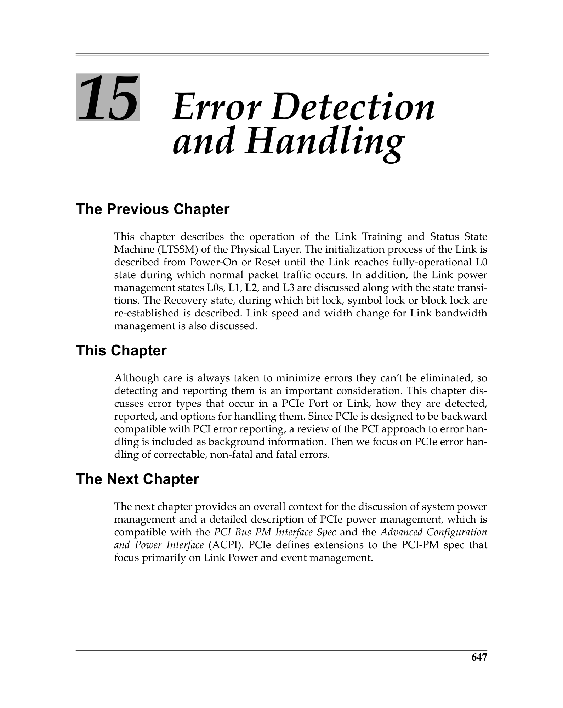
 <em>Figure from ch15 (p.706) / ch15插图 (p.706)</em>

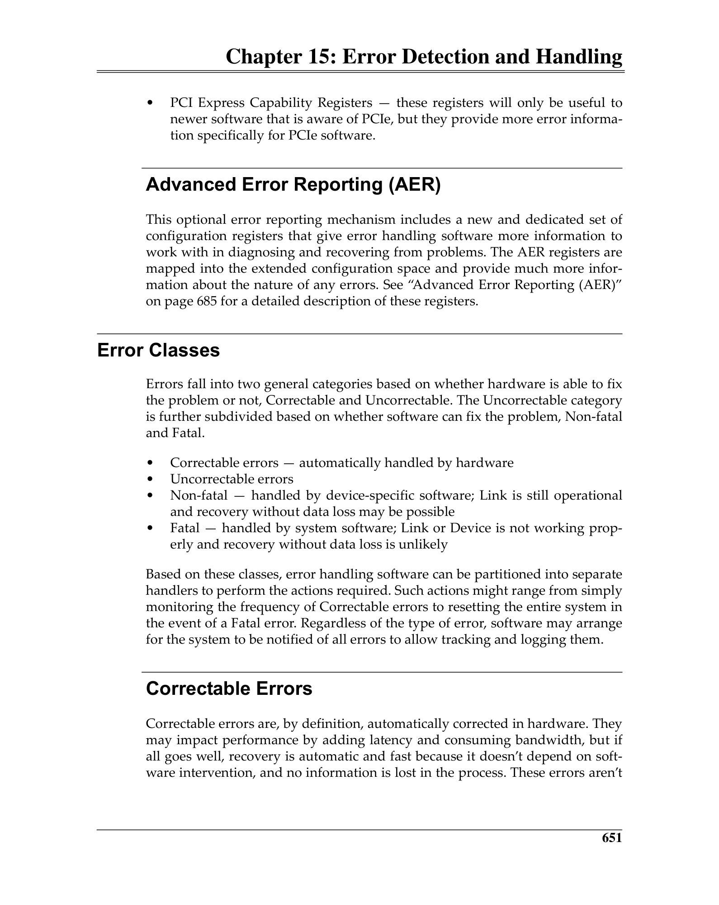
 <em>Figure from ch15 (p.710) / ch15插图 (p.710)</em>

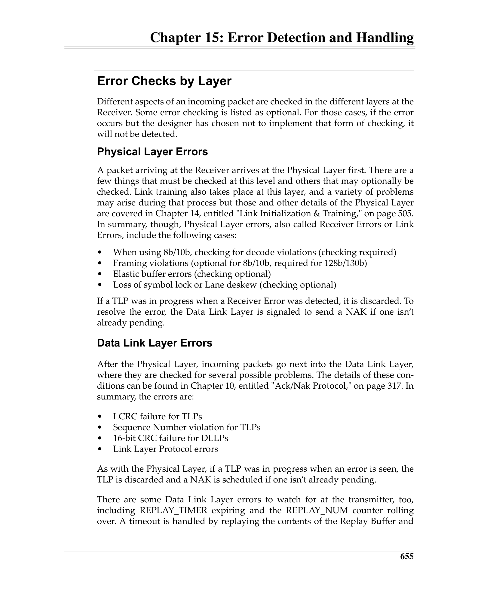
 <em>Figure from ch15 (p.714) / ch15插图 (p.714)</em>

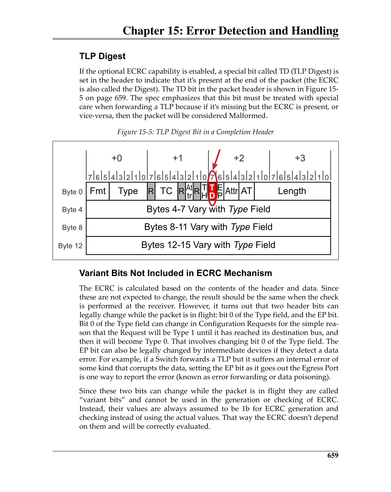
 <em>Figure from ch15 (p.718) / ch15插图 (p.718)</em>

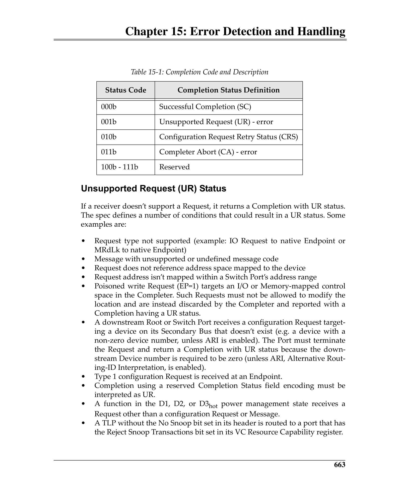
 <em>Figure from ch15 (p.722) / ch15插图 (p.722)</em>

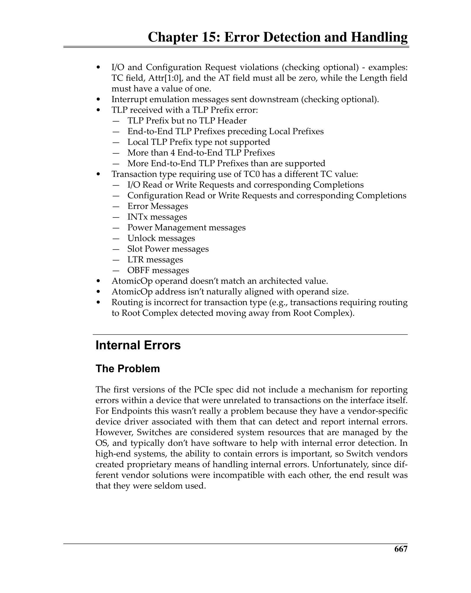
 <em>Figure from ch15 (p.726) / ch15插图 (p.726)</em>

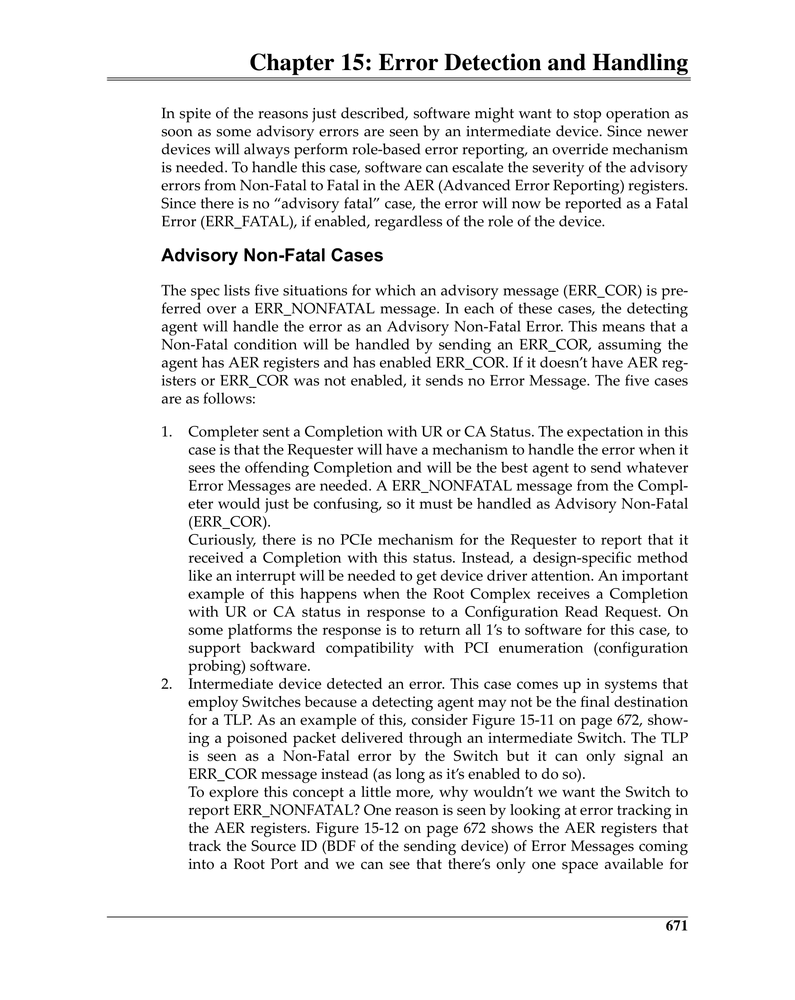
 <em>Figure from ch15 (p.730) / ch15插图 (p.730)</em>

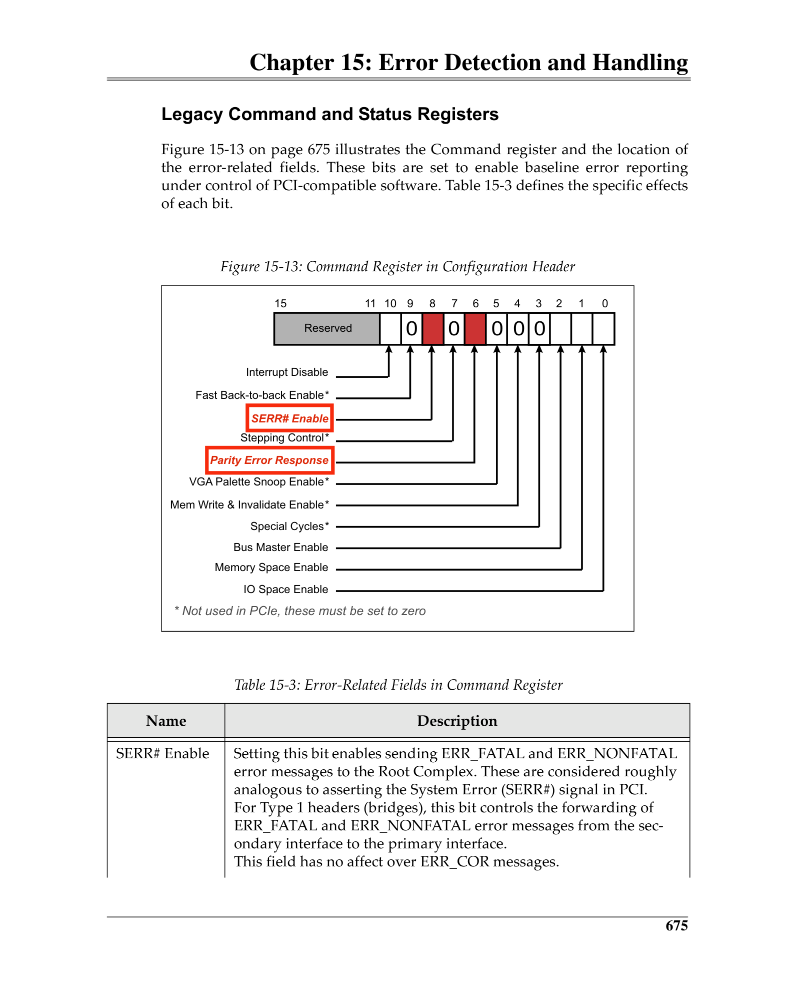
 <em>Figure from ch15 (p.734) / ch15插图 (p.734)</em>

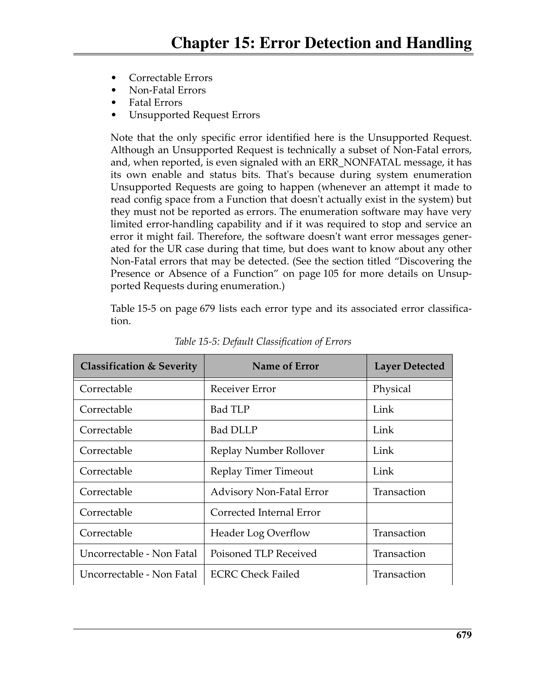
 <em>Figure from ch15 (p.738) / ch15插图 (p.738)</em>

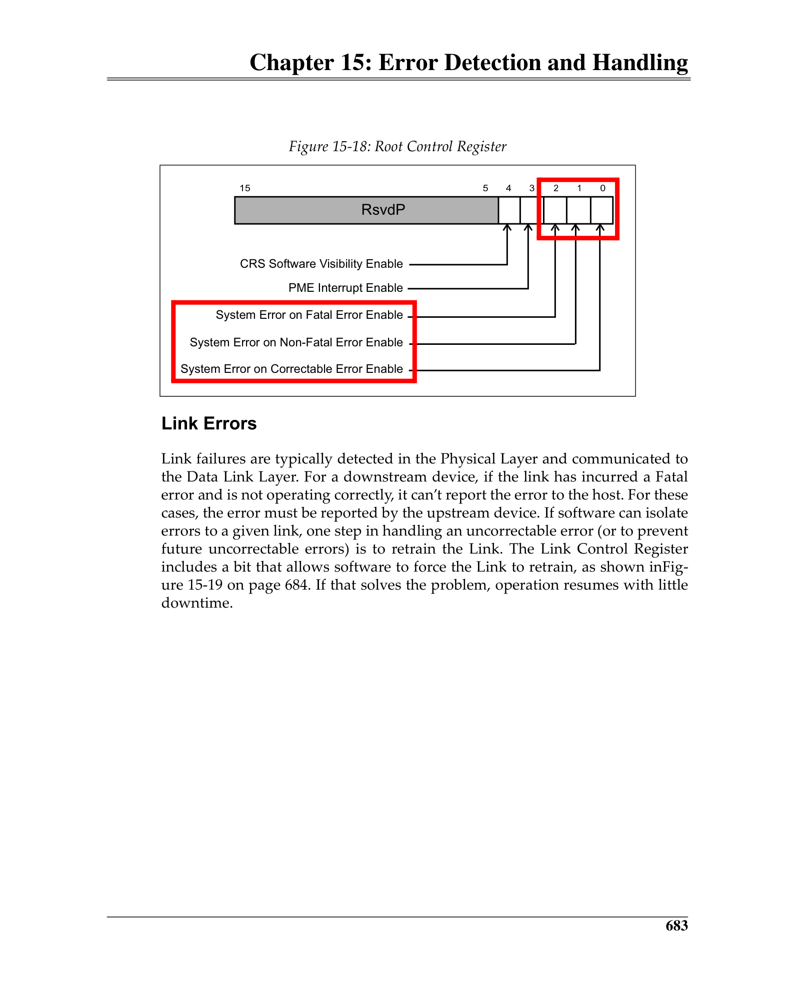
 <em>Figure from ch15 (p.742) / ch15插图 (p.742)</em>

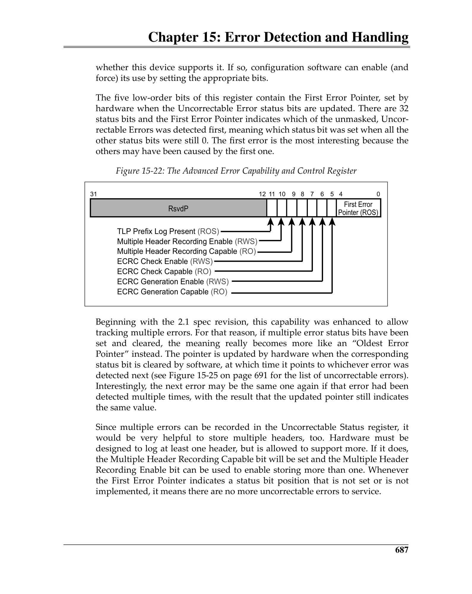
 <em>Figure from ch15 (p.746) / ch15插图 (p.746)</em>

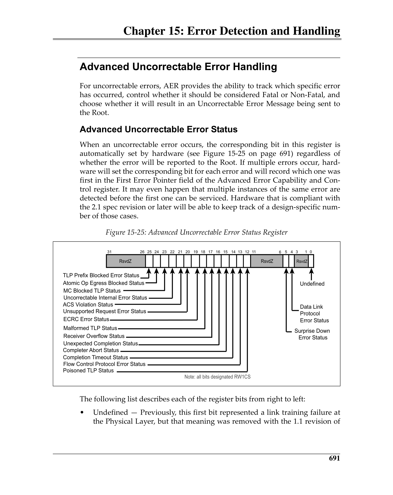
 <em>Figure from ch15 (p.750) / ch15插图 (p.750)</em>

---

## Data Poisoning / 数据毒化

When a TLP's data is known to be bad (but the header is intact), the **EP (Error Poisoned)** bit is set in the TLP header. The receiver may forward the poisoned data or discard it. If the data is used, the error propagates. Poisoning is essential for error forwarding — it marks data that was corrupted at one point so that an endpoint that eventually uses the data knows it is unreliable.

> 当TLP数据已知损坏(但头完好)时，TLP头中**EP位**置位。接收端可转发毒化数据或丢弃。若数据被使用则错误传播。毒化对错误转发至关重要——标记在某点损坏的数据，使最终使用该数据的端点知道其不可靠。
