# Chapter 16: Power Management
# 第16章：电源管理

> 中英文对照翻译 | Chinese-English Parallel Translation
> Source: MindShare PCI Express Technology 3.0 — Pages: 762–852 (91 pages)

---

## Introduction / 引言

PCI Express power management (PM) defines four major areas of support:
1. **PCI-Compatible PM** — Hardware and software compatible with the PCI Bus Power Management Interface Specification. Manages Function D-states (D0-D3) through the PCI Power Management Capability registers.
2. **Native PCIe PM Extensions** — Active State Power Management (ASPM): hardware-autonomous Link power reduction without software involvement. L0s and L1 ASPM states.
3. **L1 PM Substates** — Optional deeper L1 substates (L1.1, L1.2) defined by PCIe for maximum idle power savings using the CLKREQ# mechanism.
4. **Auxiliary Power and Wakeup** — Beacon and WAKE# mechanisms to wake sleeping Links when main power is removed.

> PCIe电源管理定义四大支持领域：PCI兼容PM管理D0-D3；原生ASPM硬件自主链路降功耗；L1.1/L1.2更深子状态通过CLKREQ#省电；辅助电源Beacon/WAKE#唤醒机制。

---

## Background: ACPI, OnNow, and the OS / 背景：ACPI与OnNow

PCIe PM works within the broader system PM framework defined by ACPI (Advanced Configuration and Power Interface). ACPI defines System S-states (S0-S5), Device D-states, and Processor C-states. The **OnNow Initiative** (Microsoft) aimed for "Instant On" — the PC appears off but can wake instantly when needed. PCIe PM contributes by allowing devices and Links to rapidly enter and exit low-power states.

> PCIe PM在ACPI定义的更广泛系统PM框架内工作。OnNow倡议旨在即时启动——PC看似关闭但可即时唤醒。PCIe PM通过允许设备和链路快速进入和退出低功耗状态来贡献。

The Windows OS plays a central role in PM policy decisions. The OS Power Manager receives PM events, queries device capabilities, and decides when to transition devices and the system to lower-power states. Drivers participate by saving/restoring device state and quiescing operations before transitions.

> Windows OS在PM策略决策中起核心作用。OS电源管理器接收PM事件并决定何时转换到低功耗。驱动通过保存恢复设备状态参与。

---

## PCI-Compatible PM: D-States / PCI兼容PM：D状态

### D0 State — Fully Operational
D0 is subdivided into **D0uninitialized** and **D0active**:
- After Conventional Reset or FLR, the Function enters D0uninitialized.
- After configuration (Memory Space Enable, I/O Space Enable, or Bus Master Enable set), it transitions to D0active. A Function remains in D0active even if these enable bits are subsequently cleared.
- In D0active, the Function can initiate and respond to all TLP types.

### D1 and D2 States — Intermediate (Optional)
D1 and D2 are optional intermediate power-saving states with different power/latency tradeoffs. D1 is typically shallower (faster restore); D2 is deeper (more power saved, slower restore).

**Behavior in D1/D2:**
- Must not initiate Request TLPs (except Messages as defined in Section 2.2.8)
- Only Configuration and Message Requests are accepted
- All other Requests → Unsupported Request
- Completions may be handled as Unexpected Completions
- If an error caused by a received TLP is detected and reporting enabled, the Link must return to L0 and send an error Message
- The driver must quiesce all outstanding transactions (terminate Requests with outstanding Completions) before the Function transitions

**Recovery:** System software restores D0active before memory/I/O access. Minimum recovery: 200 μs from D2→D0 before the next Request.

### D3Hot State — Software-Accessible Very Low Power
D3Hot is required for all Functions. Main power is present but the Function is in very low power mode.

**Key PMCSR Fields:**
- **No_Soft_Reset:** If Set → functional context maintained → returns to D0active. If Clear → context may be lost → returns to D0uninitialized.
- **PME_En:** If Set → PME assertion from D3Hot enabled. PME context must be preserved.
- **PowerState field:** Software writes to transition D-states.

**Behavior:** Only Configuration and Message Requests are accepted. Recovery time: 10 ms minimum (unless Immediate_Readiness_on_Return_to_D0 is Set in PM Capabilities Register).

### D3Cold State — Power Removed
Main power completely removed. Return to D0 requires Fundamental Reset (cold or warm) and full re-initialization. Wakeup from D3Cold requires auxiliary power (Vaux) and PME_En set.

**Multi-Function Device Note:** Strongly recommended that every MFD Function sets No_Soft_Reset to avoid disrupting other active Functions during D3Hot→D0 transitions. FLR is also recommended for MFD Endpoint Functions.

> D0分D0uninitialized和D0active。D1/D2可选省电状态，驱动须先停止未完成事务。D3Hot必备，仅接受Config/Message请求，恢复至少10ms。D3Cold主电源移除，需辅助电源唤醒。MFD强烈建议置位No_Soft_Reset避免影响其他活跃Function。

---

## Link Power Management: L-States / 链路电源管理：L状态

The Link PM state is determined by the D-state of the Downstream component connected to that Link. 

**Rules for Link State Transitions:**
- **Single-Function device:** Upstream Port initiates L1 when its Function is programmed to D1/D2/D3Hot.
- **Non-ARI Multi-Function Device:** L1 only when ALL Functions are programmed to non-D0 D-states.
- **ARI Device:** L1 when at least one Function is in non-D0 AND all Functions are either non-D0 or D0uninitialized.
- **SR-IOV:** Link Power State controlled solely by PFs; VF D-states do not affect the Link.

> 链路PM状态由下游组件D状态决定。单Function→D1/D2/D3Hot即触发L1。非ARI MFD→所有Function到非D0。ARI→至少一个非D0且全部在非D0或D0uninitialized。SR-IOV仅PF控制链路。

### L1 Entry Protocol (PCI-PM)

The L1 entry through PCI-PM (software-directed D-state change) follows a precise sequence:
1. PM software sends Configuration Write Request to Downstream Function's PMCSR PowerState field.
2. Downstream component schedules Completion, accumulates minimum credits, suspends TLP scheduling.
3. Waits for acknowledgment of PMCSR Write Completion and all previously sent TLPs (including retransmissions).
4. Once all TLPs acknowledged, starts sending **PM_Enter_L1 DLLPs** repeatedly (max 8 Symbol times between transmissions at 8b/10b, 32 at 128b/130b).
5. Upstream component, upon receiving PM_Enter_L1, blocks all TLP scheduling.
6. Waits for last TLP acknowledgment.
7. Sends **PM_Request_Ack DLLPs** repeatedly until it observes Electrical Idle on receive Lanes.
8. Downstream component captures PM_Request_Ack, disables DLLP transmission, brings Link to Electrical Idle — **L1 entry complete**.

Both components suspend Flow Control Update counters. PLLs may optionally be disabled for greater savings.

### L1 Exit Protocol
L1 exit can be initiated by either component. The exiting component drives EIEOS (Electrical Idle Exit Ordered Set), transitions through Recovery to re-establish Bit/Symbol Lock, and the Link returns to L0. Recommended: Downstream component sends FC Update DLLPs starting within 1 μs of L1 exit.

### L2/L3 Ready Entry
Similar to L1 but uses **PM_Enter_L23 DLLP** and is triggered by the PME_Turn_Off/PME_TO_Ack handshake. L2/L3 Ready is a staging point — the Link signals readiness for power removal. After the power manager removes main power, the Link transitions to L2 (if Vaux) or L3 (no Vaux). PM_Enter_L23 DLLPs are sent continuously until acknowledgment or power removal.

> L1进入通过精确握手序列：PM配置写→PM_Enter_L1 DLLP→PM_Request_Ack→双向电气空闲。L1退出通过EIEOS+Recovery。L2/L3 Ready通过PM_Enter_L23 DLLP+PME_Turn_Off/TO_Ack握手，为断电暂存点。

---

## ASPM: Active State Power Management / 主动状态电源管理

ASPM is hardware-autonomous — devices in D0 can place idle Links into L0s or L1 without software involvement. Software only enables/disables ASPM through the **ASPM Control** field in Link Control Register (00b=Disabled, 01b=L0s only, 10b=L1 only, 11b=both).

### L0s (Standby)

**Entry conditions (per-direction, unilateral):**
- Non-Switch Port: No TLP pending to transmit (or no FC credits available) AND no DLLPs pending.
- Switch Upstream Port: All Downstream Port receive Lanes NOT in L0, Recovery, or Configuration AND no pending TLPs/DLLPs.
- Idle period: implementation-specific, recommended not to exceed 7 μs.

**Exit:** Transmitter sends FTS (number based on N_FTS field exchanged during Configuration) followed by SKP Ordered Set, then resumes normal operation. Exit from L0s does NOT depend on FC credit availability — the Link must reach L0 to exchange credits.

### ASPM L1

**Entry:** Downstream component requests via **PM_Active_State_Request_L1 DLLP**. Upstream may accept (PM_Request_Ack) or reject (PM_Active_State_Nak TLP). Rejection does NOT prevent future attempts.

**Conditions:** Port supports ASPM L1, no TLP scheduled, no Ack/Nak DLLP scheduled. Both Link partners must support ASPM L1.

### ASPM Policy for Multi-Function Devices

For non-ARI MFDs, ASPM policy = most active common denominator among all D0 Functions. Functions in non-D0 ignored. If any D0 Function has ASPM disabled, ASPM is disabled for the entire component. If one D0 Function enables L0s only and another enables L1 only → ASPM disabled.

For ARI Devices, ASPM Control is determined solely by Function 0 regardless of its D-state.

### Software Flow

1. Read ASPM Support field in Link Capabilities Register.
2. Read L0s/L1 Exit Latency and Endpoint Acceptable Latency.
3. Verify both Link partners support the desired level.
4. Enable Upstream component BEFORE Downstream; disable Downstream BEFORE Upstream.

> ASPM硬件自主——D0设备空闲时自动进入L0s/L1。L0s按方向独立进入≤7μs空闲。L1需PM_Active_State_Request_L1 DLLP握手。非ARI MFD策略取所有D0 Function最活跃共同分母。软件先使能上游后下游，先禁用下游后上游。

---

## The PME Mechanism / PME机制

### PME Generation

PME allows a Function to request a wakeup or PM state change. PME is broken into two tasks:
1. **Link Wakeup (if Link is in L2):** Reactivate power and clocks via Beacon (in-band) or WAKE# (sideband).
2. **Send PM_PME Message:** Posted TLP routed Upstream to Root Complex, identifying the request source via Requester ID.

### Link Wakeup: Beacon vs WAKE#

**Beacon:** In-band periodic signal on idle Lanes. Detected by Upstream Port, propagated toward Root Complex. Switches connecting "Beacon domains" and "WAKE# domains" must translate appropriately.

**WAKE#:** Sideband open-drain signal asserted by components requesting wakeup. The asserting Function must continue driving WAKE# low until main power restored AND Fundamental Reset goes inactive.

### PME Synchronization

Before system sleep, the Root Complex broadcasts **PME_Turn_Off Message** Downstream. Each agent:
1. Blocks further PM_PME transmission immediately upon receipt.
2. Responds with **PME_TO_Ack** TLP routed Upstream.
3. Prepares for power removal by initiating L2/L3 Ready transition.

Switches aggregate PME_TO_Ack from all Downstream Ports, then send a single PME_TO_Ack Upstream. Receipt of any TLP at the Upstream Port or removal of main power resets the aggregation.

**Deadlock Avoidance:** Power manager must implement a timeout (1-10 ms recommended). Must wait ≥100 ns after all Links enter L2/L3 Ready before removing power.

### PM_PME Backpressure Deadlock Avoidance

The Root Complex has limited PM_PME buffering. Deadlock scenario: PM_PMEs fill RC buffer → RC issues Configuration Read to PME requester's PMCSR → Completion must push all prior PM_PMEs ahead (ordering rules) but no buffer space → deadlock.

**Solution:** RC must accept PM_PMEs up to FC credit limit and **discard** overflow. **PME Service Timeout** (100 ms +50%/-5%): if PME_Status not cleared, requester re-sends PM_PME.

### PM_PME Delivery State Machine

| State | Behavior |
|-------|----------|
| **Communicating** | Link up. PME_Status set → send PM_PME → PME Sent. PME_Turn_Off received → send PME_TO_Ack → Non-communicating. |
| **Non-communicating** | Power/clock restored + reset → Communicating. PME_Status set → Link Reactivation + wakeup. |
| **PME Sent** | PME_Status cleared → Communicating. Timeout → re-send PM_PME. PME_Turn_Off while PME_Status still set → PME_TO_Ack + wakeup. |
| **Link Reactivation** | Power/clock restored + reset → clear wakeup → send PM_PME → PME Sent. |

> PME生成分两组件：链路唤醒(Beacon/WAKE#)和PM_PME Message。睡眠前PME_Turn_Off/TO_Ack握手。RC缓冲溢出时丢弃PM_PME，100ms超时重发。PME状态机四个状态：通信中→PME已发送→非通信中→链路重激活。

---

## Auxiliary Power (Vaux) / 辅助电源

Vaux powers wakeup logic when main power rails are off (L2, D3Cold). A device may only consume auxiliary power if software has enabled it through:
- **PME_En bit** in PMCSR
- **Aux Power PM Enable bit** in Device Control Register

Software must enable auxiliary power consumption in ALL components participating in Link wakeup, including those propagating Beacon. Legacy platform firmware is responsible for enabling auxiliary power in the absence of ACPI-aware OS support.

For PME from D3Cold, the PME context (PME_Status, Requester ID, and any additional device-specific context) must be preserved using Vaux.

> Vaux在主电源关闭时为唤醒逻辑供电。仅PME_En或Aux Power PM Enable使能后可消耗。必须使能所有参与链路唤醒的组件。PME上下文在D3Cold下需Vaux保存。

---

## Power Management Software Flow / 电源管理软件流程

### Entering System Sleep (S3/S4)

1. OS PM software notifies drivers of impending sleep.
2. Each driver saves device state, quiesces the device, terminates outstanding transactions.
3. System PM software writes each Function's PMCSR to D3Hot.
4. Downstream components initiate L1 entry via PM_Enter_L1 DLLPs.
5. Root Complex broadcasts PME_Turn_Off.
6. Each device responds with PME_TO_Ack, initiates L2/L3 Ready via PM_Enter_L23.
7. When all Root Ports observe their Links in L2/L3 Ready, power manager removes main power and reference clocks (after ≥100 ns wait).

### Resuming from Sleep

1. Wake event (power button, WAKE#, Beacon, RTC alarm) triggers power manager.
2. Main power and reference clocks restored.
3. Fundamental Reset de-asserted (PERST# goes inactive).
4. Link trains through Detect→Polling→Configuration→L0.
5. If waking from L2: PME-capable device sends PM_PME Message to RC.
6. OS PM service routine identifies wake source, clears PME_Status.
7. PM software writes PMCSR to transition Functions to D0.
8. After recovery time (10 ms for D3Hot→D0), drivers restore device state and resume operation.

> 系统睡眠流程：OS通知驱动→保存状态→写D3Hot→L1进入→PME_Turn_Off广播→PME_TO_Ack→L2/L3 Ready→断电。唤醒流程：唤醒事件→电源恢复→基本复位→链路训练→PM_PME→OS识别唤醒源→写D0→恢复时间后驱动恢复。

---

## SR-IOV Power Management / SR-IOV电源管理

- **PF:** Full PM support. PF D-state controls Link Power State.
- **VF:** Must support D0 and D3Hot (D1/D2 optional). VF D-states do NOT affect Link state. VF PM capability is simplified.
- PF driver responsible for quiescing VF transactions before changing PF D-state or Link state.

---

## Key Figures / 关键图示

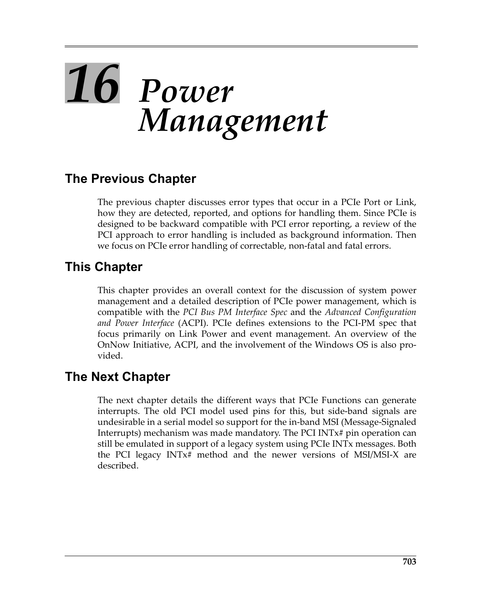
 <em>Figure from ch16 (p.762) / ch16插图 (p.762)</em>

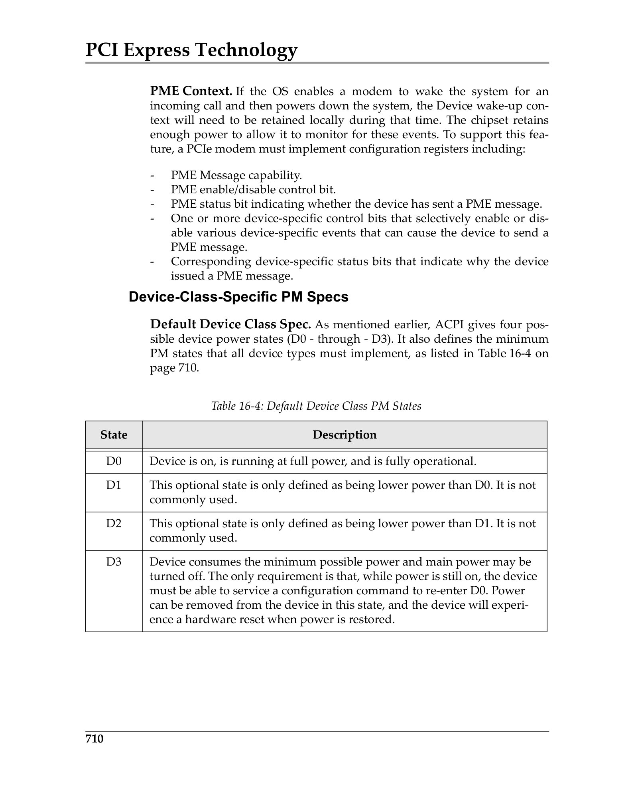
 <em>Figure from ch16 (p.769) / ch16插图 (p.769)</em>

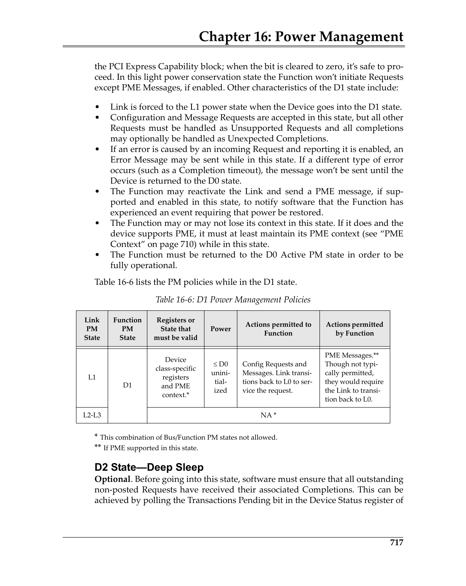
 <em>Figure from ch16 (p.776) / ch16插图 (p.776)</em>

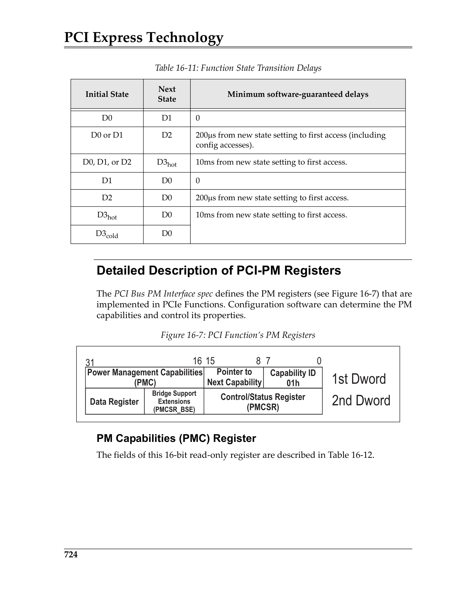
 <em>Figure from ch16 (p.783) / ch16插图 (p.783)</em>

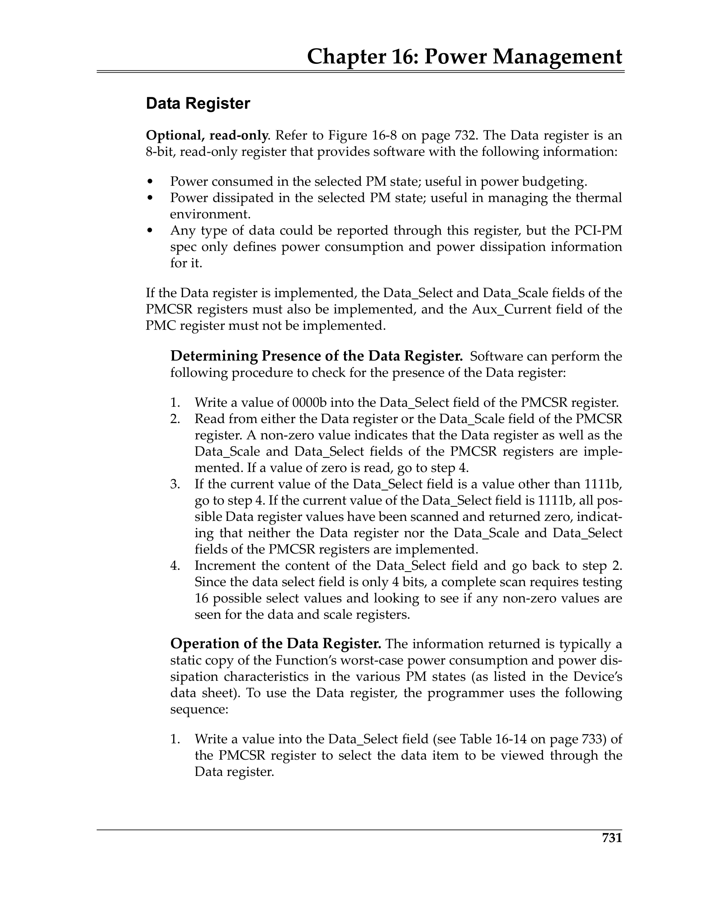
 <em>Figure from ch16 (p.790) / ch16插图 (p.790)</em>

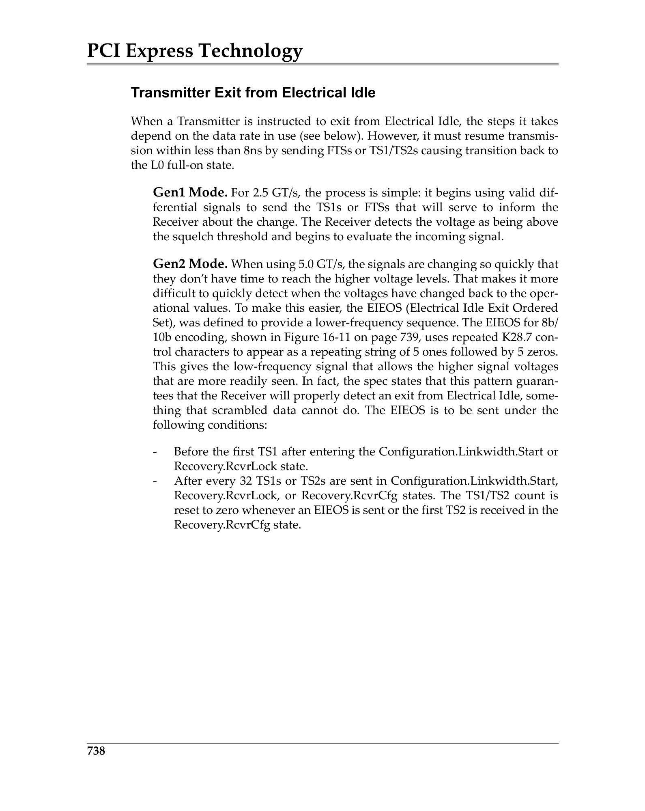
 <em>Figure from ch16 (p.797) / ch16插图 (p.797)</em>

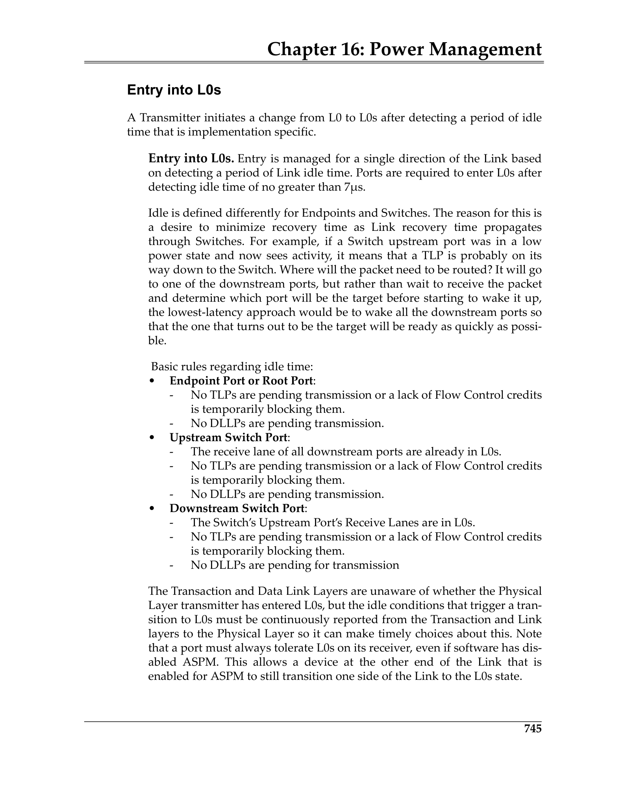
 <em>Figure from ch16 (p.804) / ch16插图 (p.804)</em>

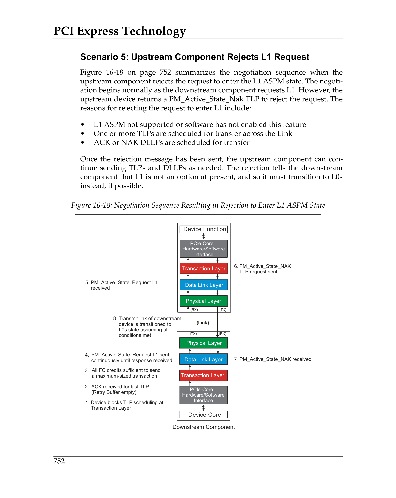
 <em>Figure from ch16 (p.811) / ch16插图 (p.811)</em>

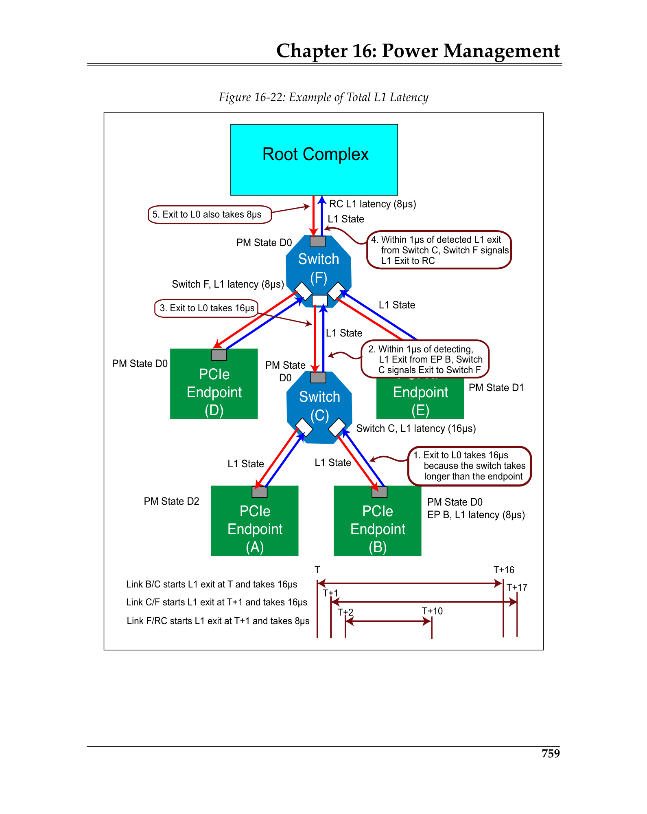
 <em>Figure from ch16 (p.818) / ch16插图 (p.818)</em>

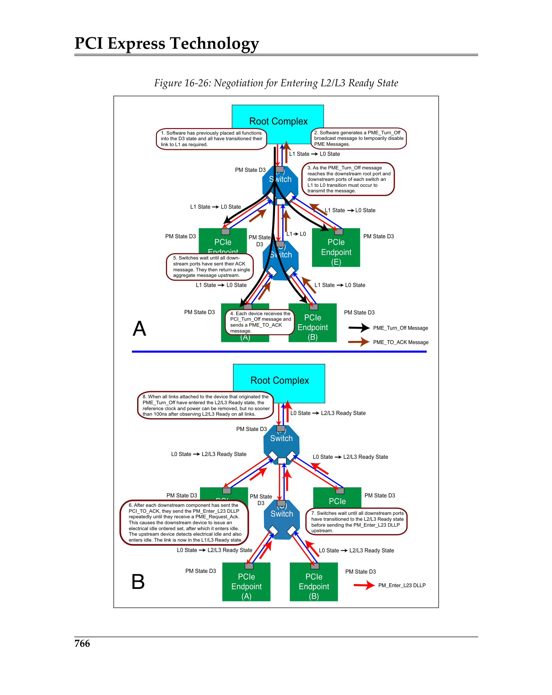
 <em>Figure from ch16 (p.825) / ch16插图 (p.825)</em>

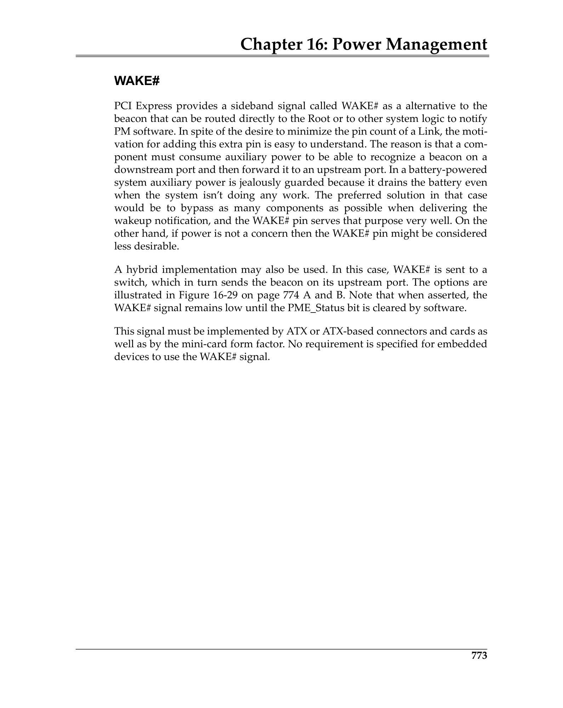
 <em>Figure from ch16 (p.832) / ch16插图 (p.832)</em>

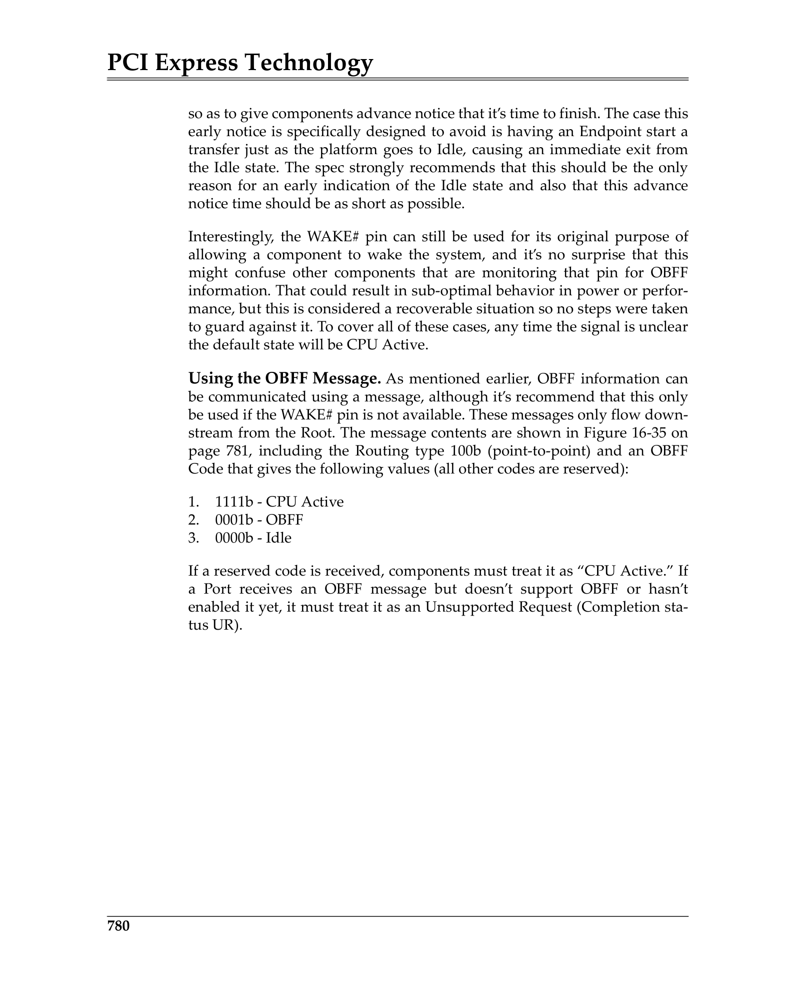
 <em>Figure from ch16 (p.839) / ch16插图 (p.839)</em>

---

## Bridges and Power Management / 桥与电源管理

When a Type 1 Function (virtual bridge) is in a non-D0 state:
- All Memory and I/O Requests flowing Downstream → Unsupported Request.
- Type 1 Configuration Requests → Unsupported Request.
- Type 0 Configuration Requests → unaffected.
- Completions in either direction → unaffected.
- Message handling → unaffected by virtual bridge D-state.

Switches: Upstream Port D-state must be at least as active as the most active Downstream Port.

> SR-IOV：PF控制链路，VF D状态不影响链路。桥在非D0时终止所有Mem/IO和Type 1配置请求，但Completion和Message不受影响。Switch Upstream Port D状态必须不低于最活跃的Downstream Port。
