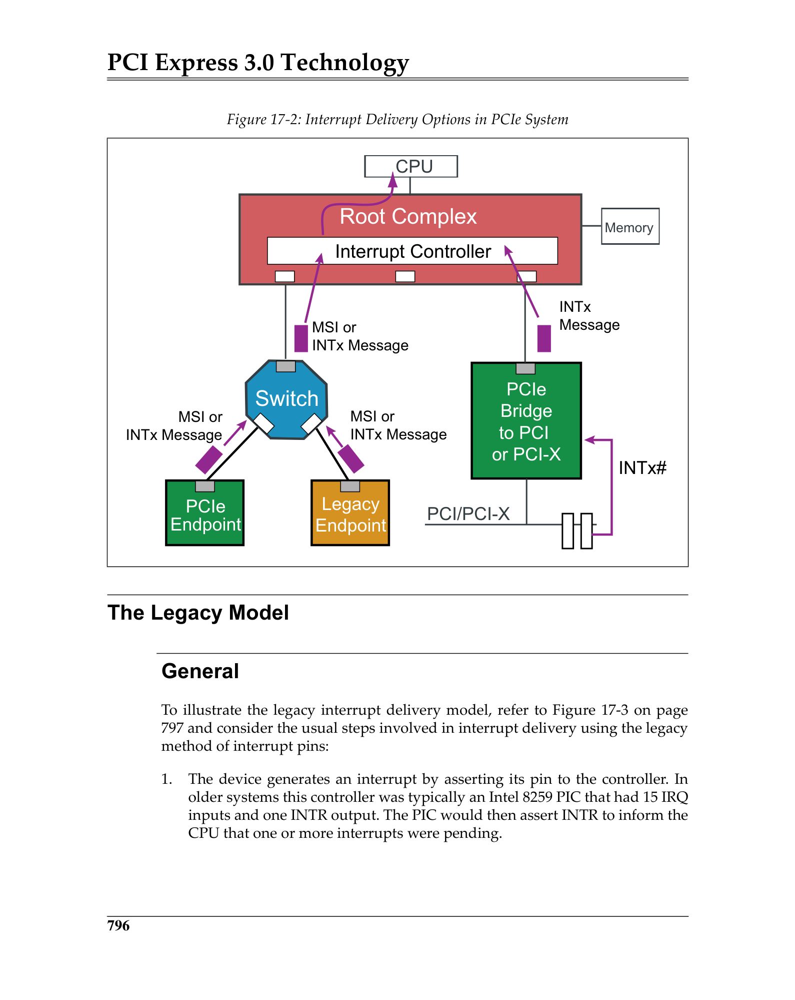
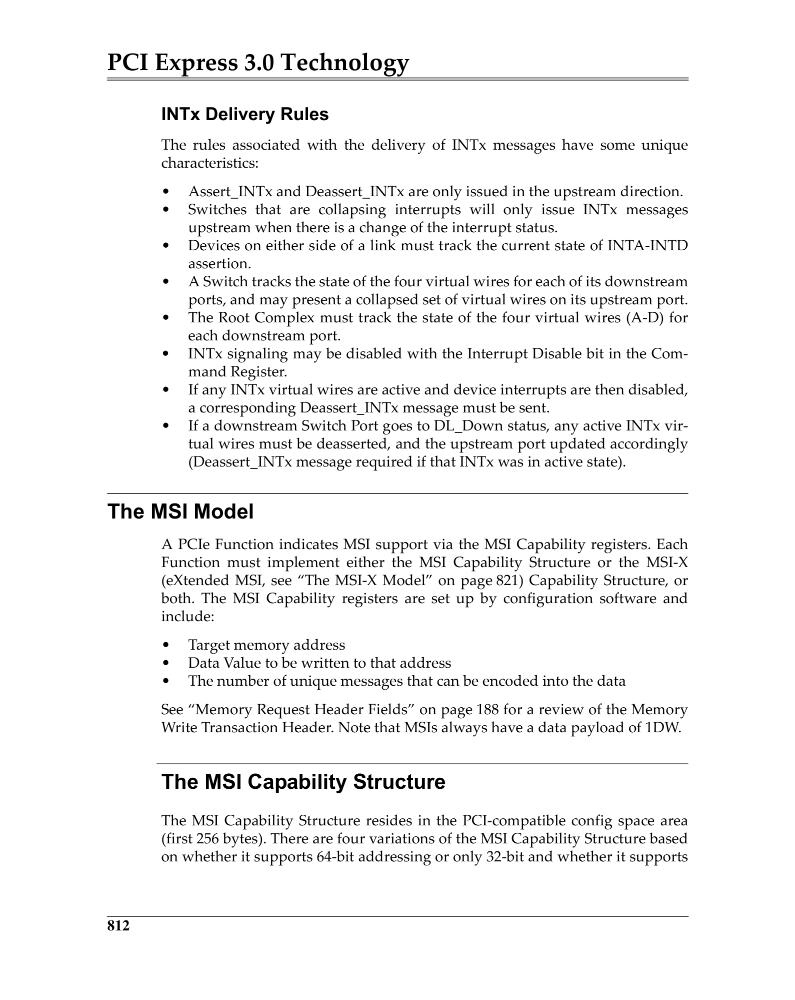

# Chapter 17: Interrupt Support / 第17章：中断支持

> **来源：** MindShare PCI Express Technology 3.0
> **PDF页码：** 852–891 (共40页)
> **格式：** 中英文段落对照 (Chinese-English Parallel)

---

## Interrupt Support Background / 中断支持背景

PCI architecture supported interrupts from peripheral devices as a means of improving their performance and offloading the CPU from the need to poll devices to determine when they require servicing. PCIe inherits this support largely unchanged from PCI, allowing software backwards compatibility to PCI.

> PCI架构支持来自外设的中断，以提高性能并将CPU从轮询设备的需求中解放出来。PCIe从PCI大量继承了这种支持，保持与PCI的软件向后兼容。

PCI used sideband interrupt wires that were routed to a central interrupt controller. This method worked well in simple, single-CPU systems, but had some shortcomings that motivated moving to a newer method called MSI (Message Signaled Interrupts) with an extension called MSI-X (eXtended).

> PCI使用边带中断线，路由到中央中断控制器。这种方法在简单的单CPU系统中工作良好，但存在一些缺陷，这推动了向新方法MSI（消息信号中断）及其扩展MSI-X的迁移。

Two methods of interrupt delivery are supported by PCIe:
1. **Legacy PCI Interrupt Delivery (INTx#)** — original mechanism using up to four signals per device (INTA#, INTB#, INTC#, INTD#), shared by wire-ORing.
2. **MSI/MSI-X Interrupt Delivery** — eliminates sideband signals by using inband Memory Write TLPs to deliver interrupts.

> PCIe支持两种中断传递方式：
> 1. **传统PCI中断传递 (INTx#)** — 原始机制，每设备最多四个信号（INTA#、INTB#、INTC#、INTD#），通过线或共享。
> 2. **MSI/MSI-X中断传递** — 通过使用带内内存写TLP传递中断，消除边带信号。

---

## The Legacy Model / 传统模型

 <em>Figure 17-1: Legacy PCI Interrupt Delivery / 图17-1：传统PCI中断传递</em>

### General

In the legacy model, a device asserts its INTx# pin (active low). The pin is connected to a Programmable Interrupt Controller (PIC, typically 8259). When the PIC receives an interrupt assertion, it asserts its interrupt request pin to the CPU. The CPU then queries the PIC to determine the interrupt vector number.

> 在传统模型中，设备断言其INTx#引脚（低电平有效）。该引脚连接到可编程中断控制器（PIC，通常为8259）。当PIC接收到中断断言时，它向CPU断言中断请求引脚。CPU然后查询PIC以确定中断向量号。

### Changes to Support Multiple Processors

With the introduction of multi-processor systems, the Advanced Programmable Interrupt Controller (APIC) replaced the simple 8259 PIC. The APIC architecture consists of:
- **Local APICs** — one per CPU core, handle local interrupts and inter-processor interrupts
- **I/O APIC** — central controller that routes peripheral interrupts to the appropriate Local APIC

> 随着多处理器系统的引入，高级可编程中断控制器（APIC）取代了简单的8259 PIC。APIC架构包括：
> - **本地APIC** — 每个CPU核心一个，处理本地中断和处理器间中断
> - **I/O APIC** — 中央控制器，将外设中断路由到适当的本地APIC

### Virtual INTx Signaling

PCIe supports the legacy INTx# functionality through **inband messages** rather than physical sideband pins. A Function can generate an INTx interrupt by sending one of eight Message TLPs: Assert_INTA#, Deassert_INTA#, Assert_INTB#, Deassert_INTB#, Assert_INTC#, Deassert_INTC#, Assert_INTD#, Deassert_INTD#.

> PCIe通过**带内消息**而非物理边带引脚支持传统INTx#功能。Function可发送八种Message TLP之一来生成INTx中断：Assert_INTA#、Deassert_INTA#、Assert_INTB#、Deassert_INTB#、Assert_INTC#、Deassert_INTC#、Assert_INTD#、Deassert_INTD#。

INTx messages are routed using **implicit routing** toward the Root Complex. The Requester ID in the TLP identifies the source Function.

> INTx消息使用**隐式路由**向Root Complex传递。TLP中的Requester ID标识源Function。

### INTx Mapping and Collapsing

**Mapping:** The Interrupt Pin register (offset 3Dh) in configuration space indicates which INTx# pin a Function uses (01h=INTA#, 02h=INTB#, etc.). A value of 00h indicates the Function does not use INTx#. The Interrupt Line register (offset 3Ch) is written by system software to indicate the IRQ number to which the INTx# line is connected.

**Collapsing:** When multiple Functions share the same virtual INTx wire, the system must ensure that simultaneous interrupts are properly handled. The PCIe specification defines INTx delivery rules to avoid lost interrupts.

> **映射：** 配置空间中的Interrupt Pin寄存器（偏移3Dh）指示Function使用哪个INTx#引脚（01h=INTA#、02h=INTB#等）。00h表示Function不使用INTx#。Interrupt Line寄存器（偏移3Ch）由系统软件写入，指示INTx#线连接的IRQ号。
> 
> **折叠：** 当多个Function共享同一虚拟INTx线时，系统必须确保正确处理同时中断。PCIe规范定义了INTx传递规则以避免丢失中断。

---

## The MSI Model / MSI模型

 <em>MSI Capability Structure / MSI能力结构</em>

MSI eliminates the need for sideband interrupt wires by using **Memory Write TLPs** to deliver interrupt requests directly to the interrupt controller. Key advantages:
- **No interrupt sharing** — each Function can have its own unique interrupt vector(s)
- **Inband delivery** — no additional pins required
- **Multiple messages** — a Function can request 1, 2, 4, 8, 16, or 32 distinct vectors

> MSI通过使用**内存写TLP**直接向中断控制器传递中断请求，消除了对边带中断线的需求。主要优势：
> - **无中断共享** — 每个Function可拥有其自己的唯一中断向量
> - **带内传递** — 无需额外引脚
> - **多消息** — Function可请求1、2、4、8、16或32个不同向量

### The MSI Capability Structure

The MSI Capability structure (Capability ID = 05h) resides in PCI-compatible configuration space and consists of:

| Offset | Field | Description |
|--------|-------|-------------|
| 00h | Capability ID | 05h = MSI |
| 01h | Next Capability Pointer | Points to next capability |
| 02h | Message Control | MSI Enable, Multiple Message Enable/Capable, 64-bit Address Capable, PVM Capable/Enable |
| 04h | Message Address (32-bit) | Target address of the interrupt write (APIC address) |
| 08h | Message Upper Address (64-bit optional) | Upper 32 bits for 64-bit addressing |
| 0Ch | Message Data | Interrupt vector data |
| 10h | Mask Bits (optional for PVM) | Per-vector mask |
| 14h | Pending Bits (optional for PVM) | Per-vector pending status |

> MSI能力结构（Capability ID = 05h）位于PCI兼容配置空间中，包含：
> 
> | 偏移 | 字段 | 描述 |
> |------|------|------|
> | 00h | Capability ID | 05h = MSI |
> | 01h | Next Capability Pointer | 指向下一个能力 |
> | 02h | Message Control | MSI使能、多消息使能/能力、64位地址能力、PVM能力/使能 |
> | 04h | Message Address (32-bit) | 中断写的目标地址（APIC地址） |
> | 08h | Message Upper Address (64位可选) | 64位寻址的高32位 |
> | 0Ch | Message Data | 中断向量数据 |
> | 10h | Mask Bits (PVM可选) | 每向量掩码 |
> | 14h | Pending Bits (PVM可选) | 每向量待处理状态 |

### Basics of MSI Configuration

System software configures MSI by:
1. Discovering the MSI capability in the Function's configuration space
2. Writing the APIC memory address to the Message Address register
3. Writing the interrupt vector number to the Message Data register
4. Setting the number of requested messages in Multiple Message Enable
5. Setting the MSI Enable bit

> 系统软件配置MSI的步骤：
> 1. 在Function配置空间中发现MSI能力
> 2. 将APIC内存地址写入Message Address寄存器
> 3. 将中断向量号写入Message Data寄存器
> 4. 在Multiple Message Enable中设置请求的消息数量
> 5. 置位MSI Enable位

### Generating an MSI Interrupt Request

When a Function needs to assert an interrupt, it generates a Memory Write TLP targeting the programmed Message Address with the programmed Message Data. The Root Complex recognizes this address as an interrupt delivery and routes it to the appropriate Local APIC.

> 当Function需要断言中断时，它生成一个Memory Write TLP，目标为编程的Message Address，数据为编程的Message Data。Root Complex将此地址识别为中断传递，并将其路由到适当的本地APIC。

---

## The MSI-X Model / MSI-X模型

MSI-X is an enhancement over MSI offering:
- **More vectors** — up to 2048 per Function
- **Independent addressing** — each vector can have its own target address and data
- **Per-vector masking** — mandatory (unlike optional PVM in MSI)
- **Flexible storage** — Table and PBA reside in BAR space (memory), not configuration space

> MSI-X是MSI的增强，提供：
> - **更多向量** — 每Function最多2048个
> - **独立寻址** — 每个向量可有自己的目标地址和数据
> - **每向量掩码** — 强制性（不同于MSI中可选的PVM）
> - **灵活存储** — Table和PBA位于BAR空间（内存），而非配置空间

### MSI-X Capability Structure

| Offset | Field | Description |
|--------|-------|-------------|
| 00h | Capability ID | 11h = MSI-X |
| 01h | Next Capability Pointer | Points to next capability |
| 02h | Message Control | MSI-X Enable, Function Mask, Table Size |
| 04h | Table Offset / Table BIR | BAR Indicator Register + offset to MSI-X Table |
| 08h | PBA Offset / PBA BIR | BAR Indicator Register + offset to Pending Bit Array |

### MSI-X Table Entry Format

Each MSI-X Table entry is 16 bytes (4 DWORDs):
- Bytes 0-3: Message Address (lower 32 bits)
- Bytes 4-7: Message Upper Address
- Bytes 8-11: Message Data
- Bytes 12-15: Vector Control (bit 0 = Mask)

> 每个MSI-X Table条目为16字节（4 DWORD）：
> - 字节0-3：Message Address（低32位）
> - 字节4-7：Message Upper Address
> - 字节8-11：Message Data
> - 字节12-15：Vector Control（位0 = Mask）

---

## Memory Synchronization When Interrupt Handler Entered / 进入中断处理程序时的内存同步

A key consideration with MSI is ensuring that all DMA data written by the device is visible to the CPU before the interrupt handler executes. Since MSI uses a Memory Write TLP, it may bypass previously posted DMA writes under certain ordering rules.

> MSI的一个关键考虑因素是确保设备写入的所有DMA数据在中断处理程序执行之前对CPU可见。由于MSI使用Memory Write TLP，在某些排序规则下它可能绕过之前已Posted的DMA写。

**Solution:** The CPU must issue a read to the device (e.g., reading a device register) before accessing the DMA data, which forces all previously posted writes from the device to be flushed to system memory (producer-consumer ordering model).

> **解决方案：** CPU必须在访问DMA数据之前向设备发出读取（如读取设备寄存器），这强制设备之前的所有Posted写被刷新到系统内存（生产者-消费者排序模型）。

---

## Interrupt Latency / 中断延迟

MSI typically provides lower interrupt latency than legacy INTx because:
- No sharing means the exact source is immediately identified
- No need for the CPU to poll multiple shared devices
- Direct delivery to the target Local APIC
The MSI Memory Write can be posted, reducing CPU stall time.

> MSI通常提供比传统INTx更低的中断延迟，因为：
> - 无共享意味着立即识别确切来源
> - CPU无需轮询多个共享设备
> - 直接传递到目标本地APIC
> MSI内存写可以是Posted的，减少CPU停顿时间。

---

## MSI Rules and Recommendations / MSI规则与建议

- All PCIe Functions that are capable of generating interrupts must support either MSI or MSI-X (or both).
- MSI and MSI-X Messages must use Traffic Class TC0.
- MSI requests should not be sent while a Function is in a non-D0 power state.
- For the most robust interrupt delivery, MSI-X is recommended for Functions requiring many interrupt vectors (e.g., NVMe controllers, high-speed NICs).

> - 所有能产生中断的PCIe Function必须支持MSI或MSI-X（或两者）。
> - MSI和MSI-X消息必须使用Traffic Class TC0。
> - MSI请求不应在Function处于非D0电源状态时发送。
> - 为获得最稳健的中断传递，需要大量中断向量的Function（如NVMe控制器、高速网卡）推荐使用MSI-X。
