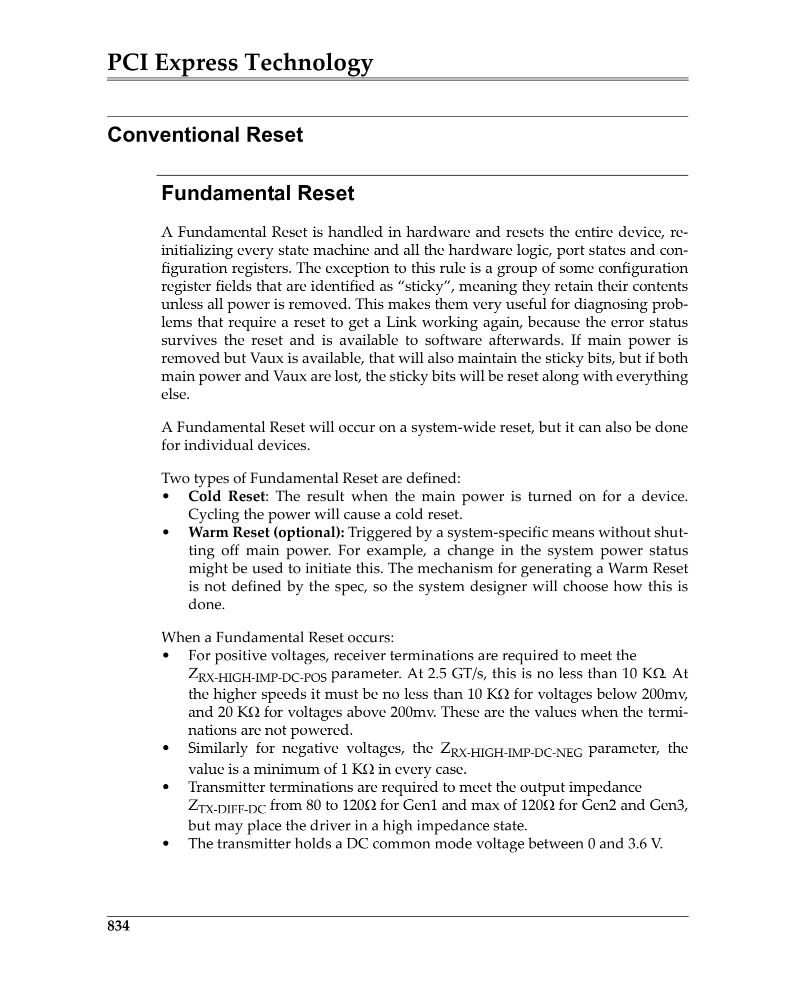
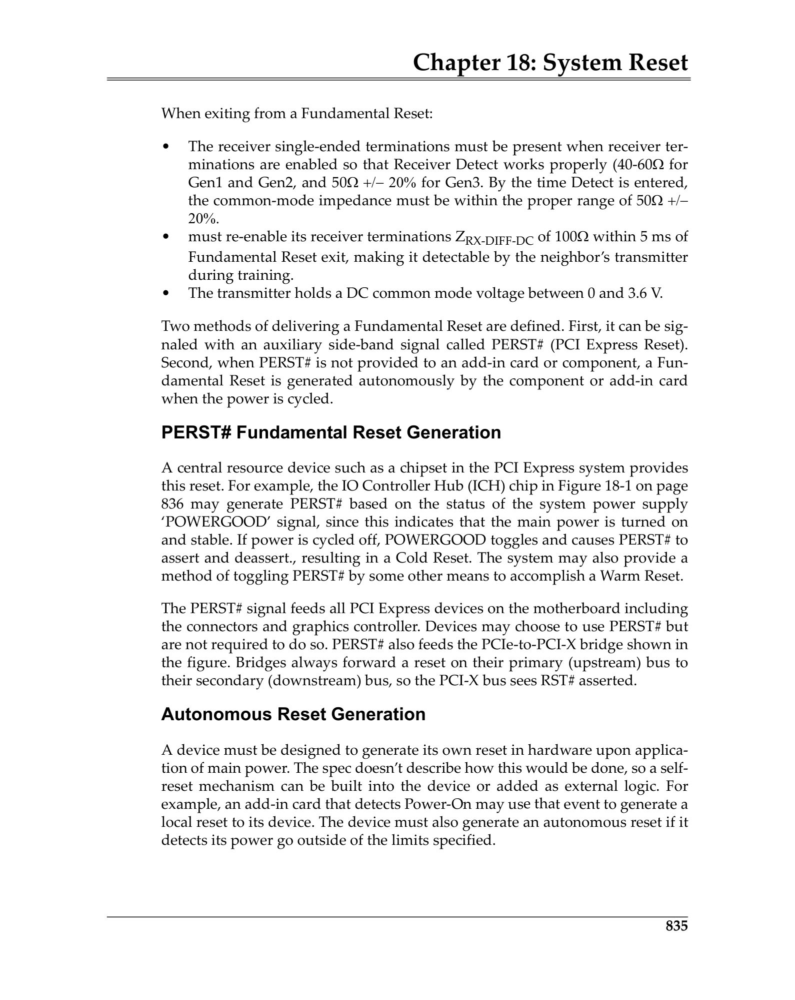
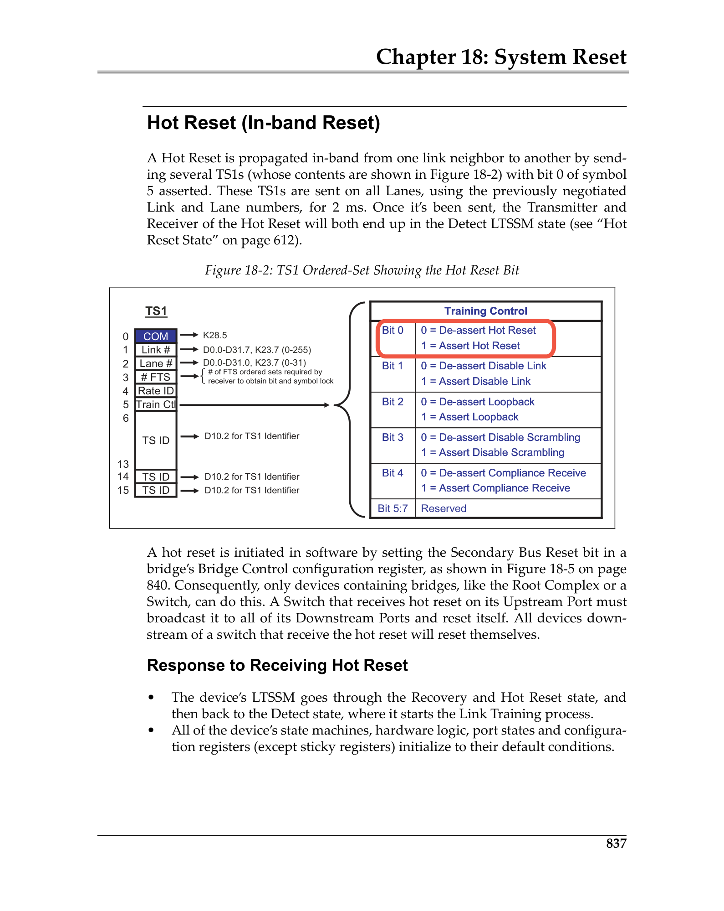

# Chapter 18: System Reset / 第18章：系统复位

> **来源：** MindShare PCI Express Technology 3.0
> **PDF页码：** 892–905 (共14页)
> **格式：** 中英文段落对照 (Chinese-English Parallel)

---

## Two Categories of System Reset / 系统复位的两种类别

PCIe defines three types of resets that fall into two categories:

| Category | Reset Type | Scope |
|----------|-----------|-------|
| **Conventional Reset** | Fundamental Reset (Cold/Warm) | Entire component or system |
| **Conventional Reset** | Hot Reset | Link-level, in-band |
| **Function-Level Reset** | FLR | Single Function only |

> PCIe定义了三种复位，分为两类：
> 
> | 类别 | 复位类型 | 范围 |
> |------|----------|------|
> | **传统复位** | 基本复位（冷/温） | 整个组件或系统 |
> | **传统复位** | 热复位 | 链路级，带内 |
> | **Function级复位** | FLR | 仅单个Function |

---

## Conventional Reset / 传统复位

### Fundamental Reset (Cold and Warm)

**Cold Reset:** Occurs when main power is applied to the component and PERST# is asserted. All registers return to their default values. This is the most thorough reset type.

**Warm Reset:** Occurs when power remains stable but PERST# is asserted without a power cycle. Some sticky registers may retain their values if auxiliary power is available.

> **冷复位：** 在主电源施加到组件且PERST#断言时发生。所有寄存器返回其默认值。这是最彻底的复位类型。
> 
> **温复位：** 在电源保持稳定但PERST#被断言且无电源循环时发生。若有辅助电源可用，某些粘性寄存器可能保留其值。

 <em>Fundamental Reset Generation / 基本复位生成</em>

### PERST# Fundamental Reset Generation

PERST# (PCI Express Reset) is a sideband signal generated by the system or a downstream port. It is defined as an active-low signal. The system must assert PERST# for a minimum of 100 μs after power and reference clocks are stable.

> PERST#（PCI Express Reset）是由系统或下游Port生成的边带信号，定义为低电平有效。系统必须在电源和参考时钟稳定后断言PERST#至少100μs。

 <em>PERST# Reset Architecture / PERST#复位架构</em>

### Autonomous Reset Generation

Some devices can autonomously generate a Fundamental Reset without requiring PERST# assertion. This can occur when the device detects a catastrophic internal error or a watchdog timer expiry.

> 某些设备可在不需要PERST#断言的情况下自主生成基本复位，当设备检测到灾难性内部错误或看门狗定时器到期时可能发生。

### Link Wakeup from L2 Low Power State

When resuming from L2 with auxiliary power, the component can initiate a wakeup mechanism (Beacon or WAKE#) to request restoration of main power and reference clocks, followed by Fundamental Reset.

> 当从具有辅助电源的L2状态恢复时，组件可发起唤醒机制（Beacon或WAKE#）以请求恢复主电源和参考时钟，随后进行基本复位。

---

### Hot Reset (In-band Reset)

Hot Reset is an in-band mechanism that uses **TS1 Ordered Sets** to propagate a reset condition across a Link without requiring a sideband signal. Key differences from Fundamental Reset:
- Propagated in-band via TS1 training sequences
- Only resets the downstream side of a Link
- Does not return sticky registers to their default values

> Hot Reset是一种带内机制，使用**TS1有序集**通过链路传播复位条件，无需边带信号。与基本复位的主要区别：
> - 通过TS1训练序列带内传播
> - 仅复位链路的下游端
> - 不将粘性寄存器返回其默认值

 <em>Hot Reset TS1 Transmission / Hot Reset TS1传输</em>

### Switches Generate Hot Reset on Downstream Ports

When a Switch receives a Hot Reset on its Upstream Port, it must propagate Hot Reset to all of its Downstream Ports. This ensures the reset cascades properly through the hierarchy.

> 当Switch在其Upstream Port接收到Hot Reset时，它必须将Hot Reset传播到所有Downstream Port，确保复位正确级联通过整个层次结构。

### Software Generation of Hot Reset

Software can trigger a Hot Reset by setting the **Secondary Bus Reset** bit in the Bridge Control register (offset 3Eh) of a Type 1 Configuration Space Header (Switch Downstream Port or Root Port).

> 软件可通过置位Type 1配置空间头（Switch Downstream Port或Root Port）中Bridge Control寄存器（偏移3Eh）的**Secondary Bus Reset**位来触发Hot Reset。

### Software Can Disable the Link

As an alternative to Hot Reset, software can set the **Link Disable** bit in the Link Control register to disable a Link. A subsequent clear of this bit causes the Link to be retrained. This approach provides a more graceful way to reset a problematic Link.

> 作为Hot Reset的替代方案，软件可置位Link Control寄存器中的**Link Disable**位来禁用链路。随后清除该位会使链路重新训练。这种方法提供了一种更优雅的复位问题链路的方式。

---

## Function Level Reset (FLR) / Function级复位

FLR allows software to reset a **single Function** within a Multi-Function Device without affecting other Functions. This is critical for virtualization and SR-IOV scenarios.

> FLR允许软件在Multi-Function Device内复位**单个Function**，而不影响其他Function。这对虚拟化和SR-IOV场景至关重要。

### Time Allowed

A Function must complete its FLR within **100 ms**. During this period, the Function must not respond to any Requests. Configuration software must wait the full 100 ms before attempting to access the Function after initiating FLR.

> Function必须在**100ms**内完成其FLR。在此期间，Function不得响应任何请求。配置软件必须在发起FLR后等待完整的100ms，然后才能尝试访问Function。

### Behavior During FLR

After an FLR is initiated (by setting the Initiate FLR bit):
- All Function state is returned to default values (except sticky bits)
- All outstanding transactions from the Function are terminated
- The Function enters the D0uninitialized state
- MSI/MSI-X configuration is preserved

> 在FLR被发起后（通过置位Initiate FLR位）：
> - 所有Function状态返回默认值（粘性位除外）
> - Function的所有未完成事务被终止
> - Function进入D0uninitialized状态
> - MSI/MSI-X配置被保留

---

## Reset Exit / 复位退出

When a reset condition exits, the LTSSM transitions from the **Detect** state and proceeds through **Polling** and **Configuration** as the Link is reinitialized. After the Link reaches L0, the device Functions are ready for configuration by system software.

> 当复位条件退出时，LTSSM从**Detect**状态转换并通过**Polling**和**Configuration**进行链路的重新初始化。链路达到L0后，设备Function准备好供系统软件配置。
