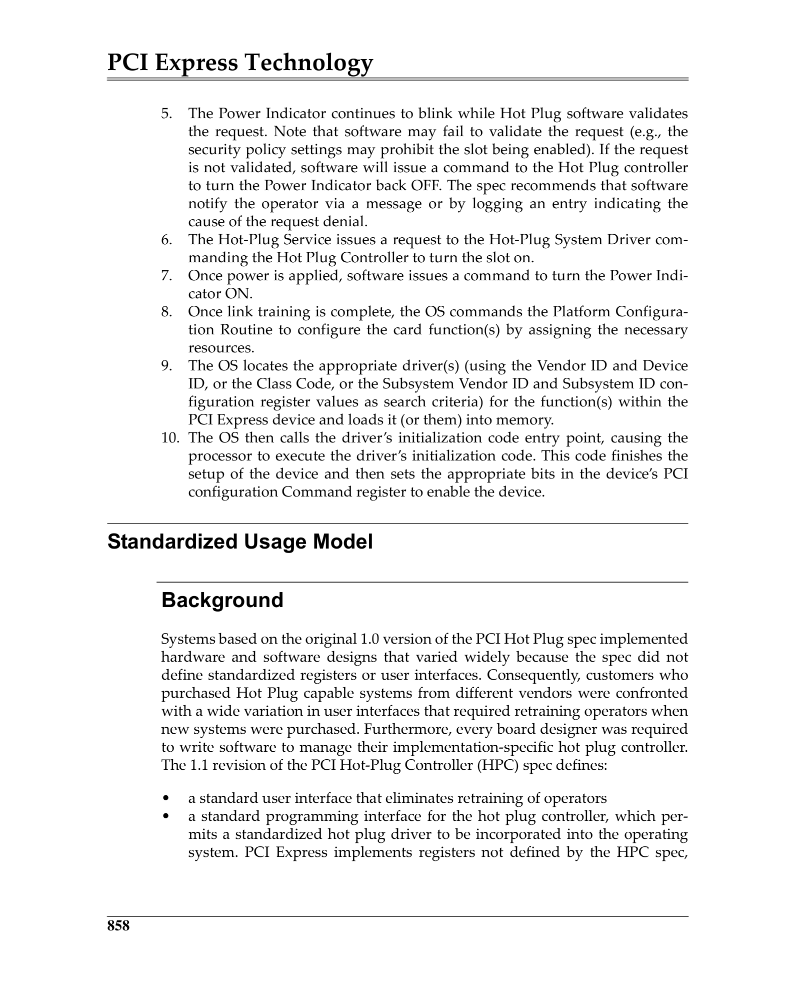

# Chapter 19: Hot Plug and Power Budgeting / 第19章：热插拔与功耗预算

> **来源：** MindShare PCI Express Technology 3.0
> **PDF页码：** 906–945 (共40页)
> **格式：** 中英文段落对照 (Chinese-English Parallel)

---

## Background / 背景

Hot Plug allows add-in cards to be inserted and removed from a running system without powering down. PCIe Hot Plug is modeled after PCI Hot-Plug but with several architectural improvements, including in-band event notification via Messages instead of sideband signals.

> 热插拔允许在不关闭系统电源的情况下插入和移除扩展卡。PCIe热插拔以PCI热插拔为模型，但有几项架构改进，包括通过Message进行带内事件通知，而非使用边带信号。

---

## Hot Plug in the PCI Express Environment / PCIe环境中的热插拔

### Differences between PCI and PCIe Hot Plug

| Feature | PCI Hot Plug | PCIe Hot Plug |
|---------|-------------|---------------|
| Event signaling | Sideband signals | In-band Messages + slot registers |
| Attention Button | Sideband | In-band via Slot registers |
| Power control | Dedicated controller | Integrated in Port logic |
| Presence detect | Sideband pins | In-band via Slot Status register |
| MRL (Manual Retention Latch) | Sideband | In-band via Slot registers |

> | 特性 | PCI热插拔 | PCIe热插拔 |
> |------|----------|-----------|
> | 事件信令 | 边带信号 | 带内Message + 插槽寄存器 |
> | 注意按钮 | 边带 | 带内，通过Slot寄存器 |
> | 电源控制 | 专用控制器 | 集成在Port逻辑中 |
> | 存在检测 | 边带引脚 | 带内，通过Slot Status寄存器 |
> | MRL（手动保持闩锁） | 边带 | 带内，通过Slot寄存器 |

---

## Elements Required to Support Hot Plug / 支持热插拔所需的元素

### Software Elements

- **Hot-Plug Service** — OS component that manages the Hot Plug policy
- **Hot-Plug System Driver** — Platform-specific driver that interfaces with the Standard Hot-Plug Controller
- **Device Driver** — Manages the specific device functionality and quiescing

> - **热插拔服务** — 管理热插拔策略的OS组件
> - **热插拔系统驱动** — 与标准热插拔控制器接口的平台特定驱动
> - **设备驱动** — 管理特定设备功能和静默

### Hardware Elements

- **Downstream Port** with Slot capability registers
- **Power controller** to switch slot power
- **Attention Button** (optional) for user-initiated hot plug
- **Attention Indicator** (LED) for visual status feedback
- **Power Indicator** (LED) for power state indication
- **MRL** (Manual Retention Latch) with sensor

---

## Card Removal and Insertion Procedures / 卡的移除与插入过程

### Turning Slot Off

1. Software writes to Slot Control register to turn off power
2. Power Indicator blinks, then turns off
3. Attention Indicator may signal "safe to remove"

> 1. 软件写入Slot Control寄存器关闭电源
> 2. Power Indicator闪烁后熄灭
> 3. Attention Indicator可信号"安全移除"

### Turning Slot On

1. Card inserted, presence detected
2. MRL closed (if present)
3. Power applied to slot
4. Link training begins
5. After Link reaches L0, device is enumerated

> 1. 卡插入，检测到存在
> 2. MRL关闭（如存在）
> 3. 向插槽供电
> 4. 开始链路训练
> 5. 链路达到L0后，枚举设备

---

## Standardized Usage Model / 标准化使用模型

 <em>Standard Hot Plug Slot Elements / 标准热插拔插槽元素</em>

### Standard User Interface Elements

| Element | Function |
|---------|----------|
| **Attention Indicator** | Amber LED — signals that operator attention is needed |
| **Power Indicator** | Green LED — steady = power on, blinking = transitioning, off = power off |
| **Attention Button** | User-accessible button to request hot plug operation |
| **MRL Sensor** | Detects whether the retention latch is engaged |
| **Electromechanical Interlock** | Optional — prevents card removal during active operation |

> | 元素 | 功能 |
> |------|------|
> | **Attention Indicator** | 琥珀色LED — 信号需要操作员注意 |
> | **Power Indicator** | 绿色LED — 常亮=电源开，闪烁=转换中，灭=电源关 |
> | **Attention Button** | 用户可访问的按钮，请求热插拔操作 |
> | **MRL Sensor** | 检测保持闩锁是否已接合 |
> | **Electromechanical Interlock** | 可选 — 防止在活跃操作期间移除卡 |

---

## The Hot-Plug Controller Programming Interface / 热插拔控制器编程接口

The programming interface is implemented through the PCIe Capability Structure's Slot registers:

### Slot Capabilities Register (Offset 14h)

Indicates physical slot capabilities: Attention Button Present, Power Controller Present, MRL Sensor Present, Hot-Plug Capable, Hot-Plug Surprise, Slot Power Limit.

> 指示物理插槽能力：Attention Button存在、Power Controller存在、MRL Sensor存在、Hot-Plug Capable、Hot-Plug Surprise、Slot Power Limit。

### Slot Control Register (Offset 18h)

Controls: Attention Indicator, Power Indicator, Power Controller, Attention Button Pressed Enable, MRL Sensor Change Enable, Presence Detect Change Enable, Data Link Layer State Change Enable.

> 控制：Attention Indicator、Power Indicator、Power Controller、Attention Button Pressed Enable、MRL Sensor Change Enable、Presence Detect Change Enable、Data Link Layer State Change Enable。

### Slot Status Register (Offset 1Ah)

Reports: Attention Button Pressed, MRL Sensor State, Presence Detect State, Data Link Layer State Changed, Presence Detect Changed, Command Completed.

> 报告：Attention Button Pressed、MRL Sensor State、Presence Detect State、Data Link Layer State Changed、Presence Detect Changed、Command Completed。

---

## Power Budgeting / 功耗预算

### Introduction

Power Budgeting allows the system to manage total available power by having devices report their power consumption needs in various operating conditions. The system can then determine whether sufficient power exists before enabling a device or changing its power state.

> 功耗预算允许系统通过让设备报告其在各种工作条件下的功耗需求来管理总可用功率。系统可在使能设备或更改其电源状态之前确定是否存在足够的功率。

### The Power Budgeting Elements

- **System Firmware** — Discovers and configures power budgeting capabilities
- **Power Budget Manager** — Software component that manages the system power budget
- **Expansion Ports** — Report available power via Slot Power Limit
- **Add-in Devices** — Report consumption needs via Power Budgeting Extended Capability

> - **系统固件** — 发现并配置功耗预算能力
> - **功耗预算管理器** — 管理系统功耗预算的软件组件
> - **扩展端口** — 通过Slot Power Limit报告可用功率
> - **扩展设备** — 通过Power Budgeting Extended Capability报告消耗需求

### Slot Power Limit Control

The **Slot Power Limit** field in the Slot Capabilities register indicates the maximum power available at the slot. The Root Complex or Switch Downstream Port broadcasts the Slot Power Limit to the add-in card via a **Set_Slot_Power_Limit Message** after the Link is established.

The add-in card must limit its total power consumption to be at or below the received Slot Power Limit value. If the card requires more power than the slot provides, it may fail to operate or operate at reduced performance.

> Slot Capabilities寄存器中的**Slot Power Limit**字段指示插槽可用的最大功率。Root Complex或Switch Downstream Port在链路建立后通过**Set_Slot_Power_Limit Message**向扩展卡广播Slot Power Limit。扩展卡必须将其总功耗限制在收到的Slot Power Limit值或以下。若卡需要的功率超过插槽提供的功率，它可能无法运行或以降低的性能运行。

### The Power Budget Capabilities Register Set

The Power Budgeting Extended Capability (ECAP ID 0004h) contains the Data Select register, Data register, Power Budgeting Control register, Capability register, and Sense Detect register. Devices report power data for different power rails and operating conditions through these registers.

> Power Budgeting Extended Capability（ECAP ID 0004h）包含Data Select寄存器、Data寄存器、Power Budgeting Control寄存器、Capability寄存器和Sense Detect寄存器。设备通过这些寄存器报告不同电源轨和工作条件下的功耗数据。
