# Glossary / 术语表

> **来源：** MindShare PCI Express Technology 3.0
> **PDF页码：** 1032–1057 (共26页)
> **格式：** 中英文对照

---

## Key Figures / 关键图示

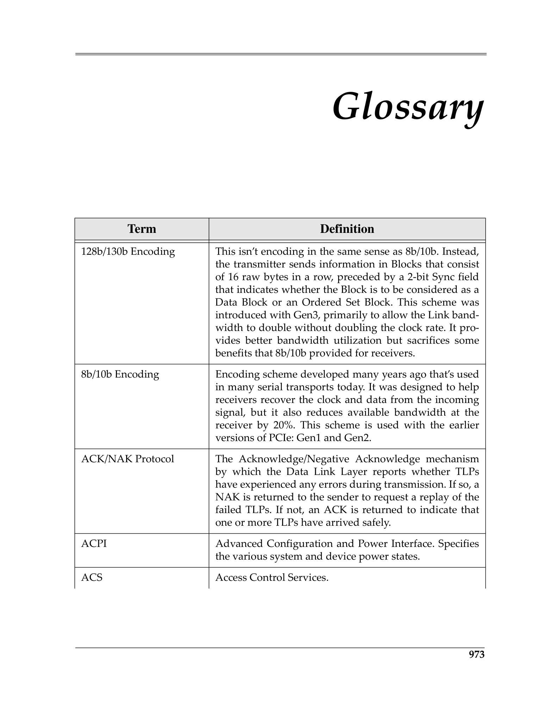
 <em>Figure from glossary (p.1032) / glossary插图 (p.1032)</em>

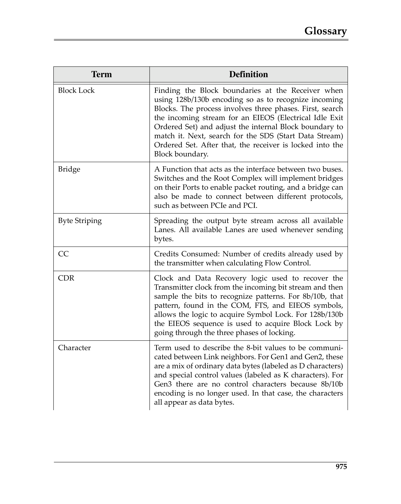
 <em>Figure from glossary (p.1034) / glossary插图 (p.1034)</em>

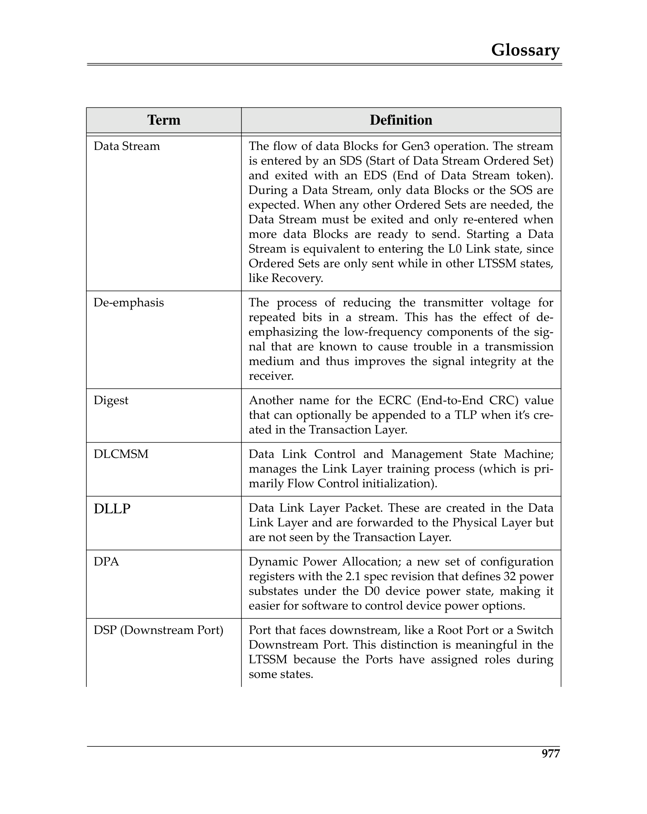
 <em>Figure from glossary (p.1036) / glossary插图 (p.1036)</em>

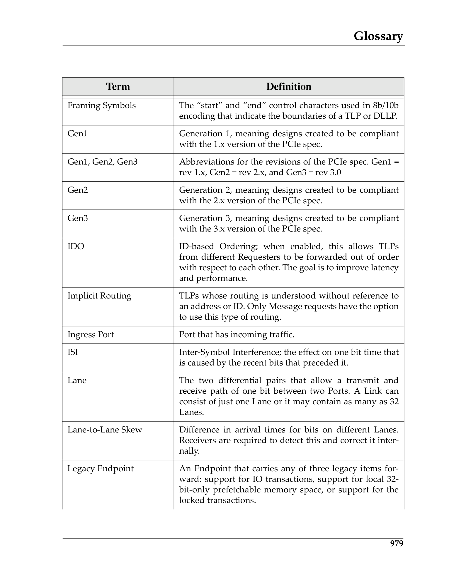
 <em>Figure from glossary (p.1038) / glossary插图 (p.1038)</em>

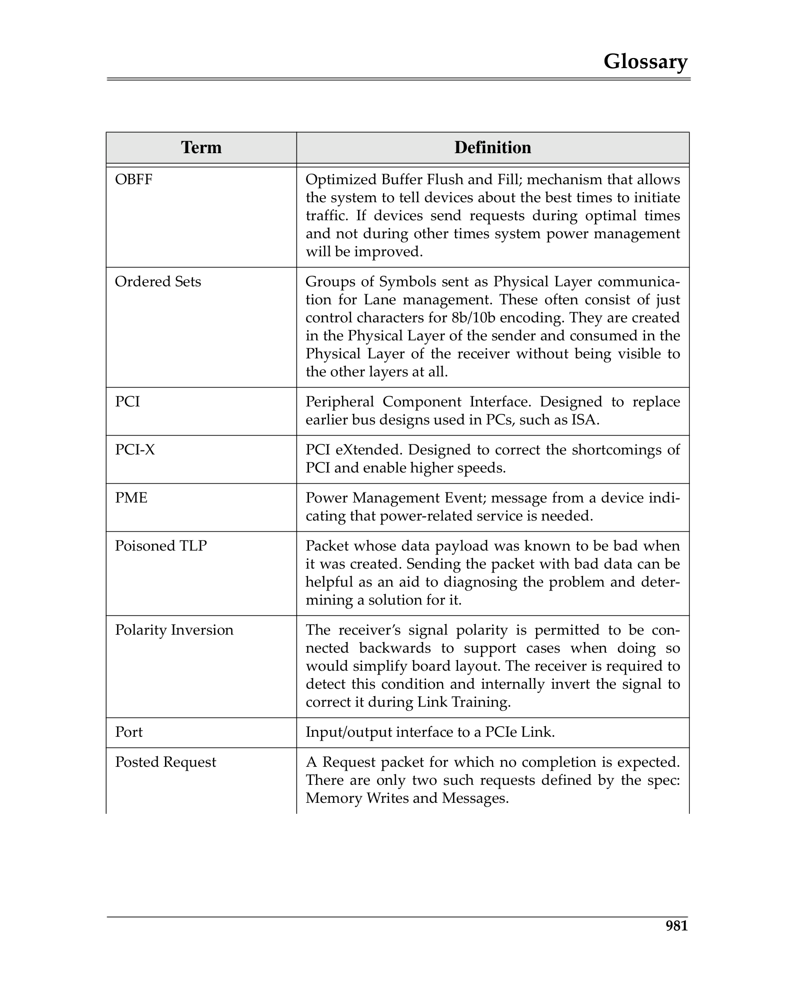
 <em>Figure from glossary (p.1040) / glossary插图 (p.1040)</em>

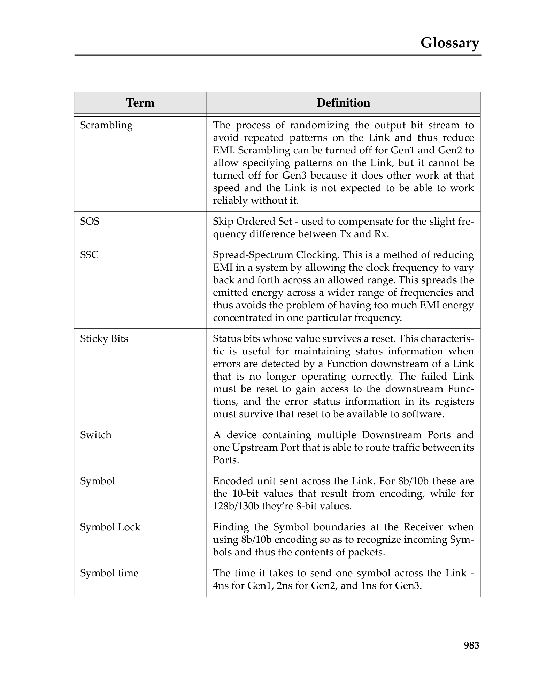
 <em>Figure from glossary (p.1042) / glossary插图 (p.1042)</em>

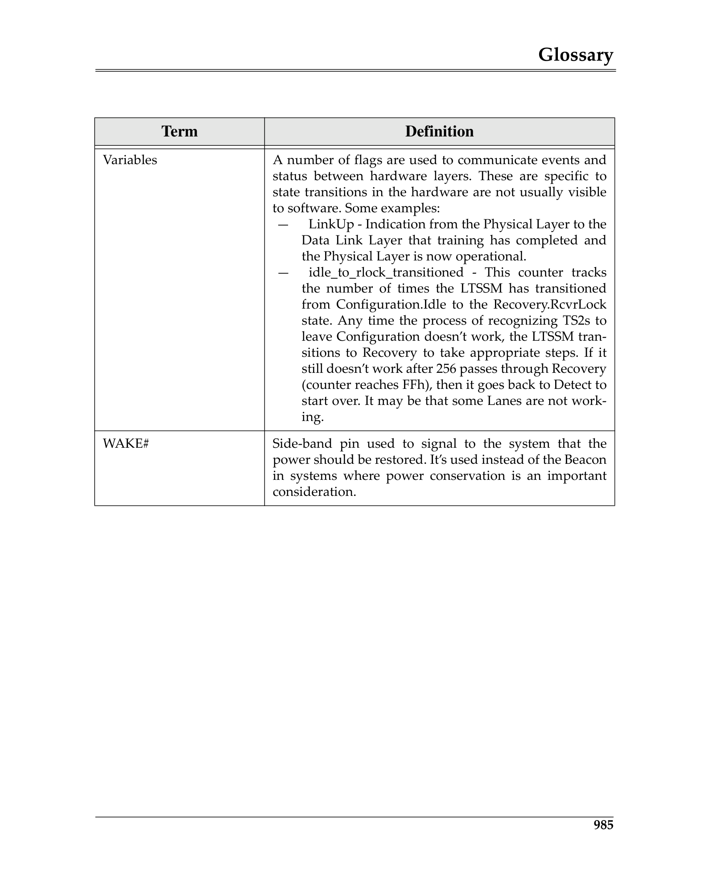
 <em>Figure from glossary (p.1044) / glossary插图 (p.1044)</em>

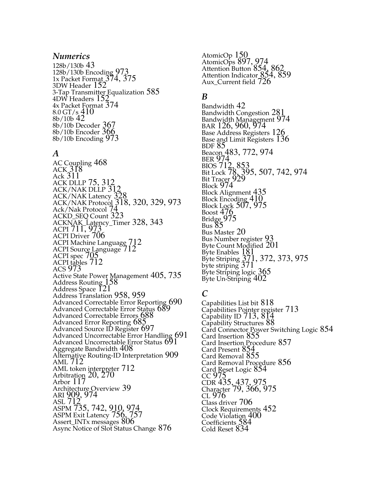
 <em>Figure from glossary (p.1046) / glossary插图 (p.1046)</em>

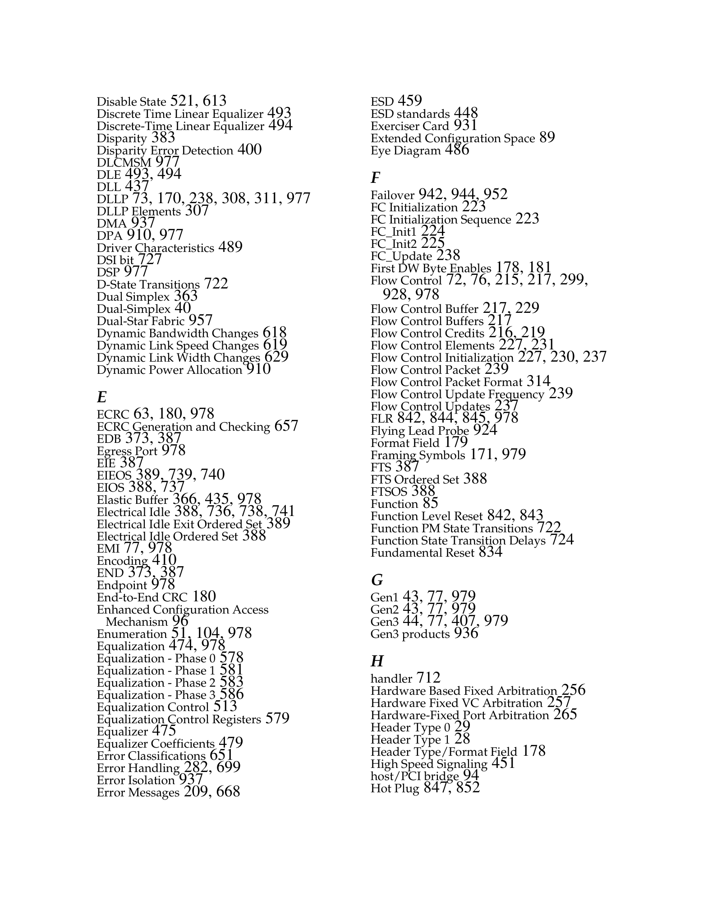
 <em>Figure from glossary (p.1048) / glossary插图 (p.1048)</em>

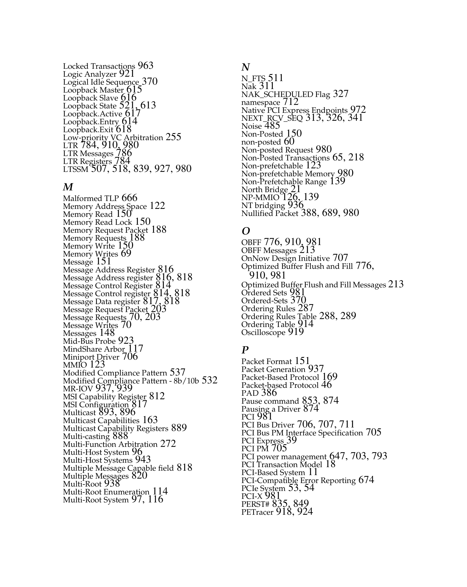
 <em>Figure from glossary (p.1050) / glossary插图 (p.1050)</em>

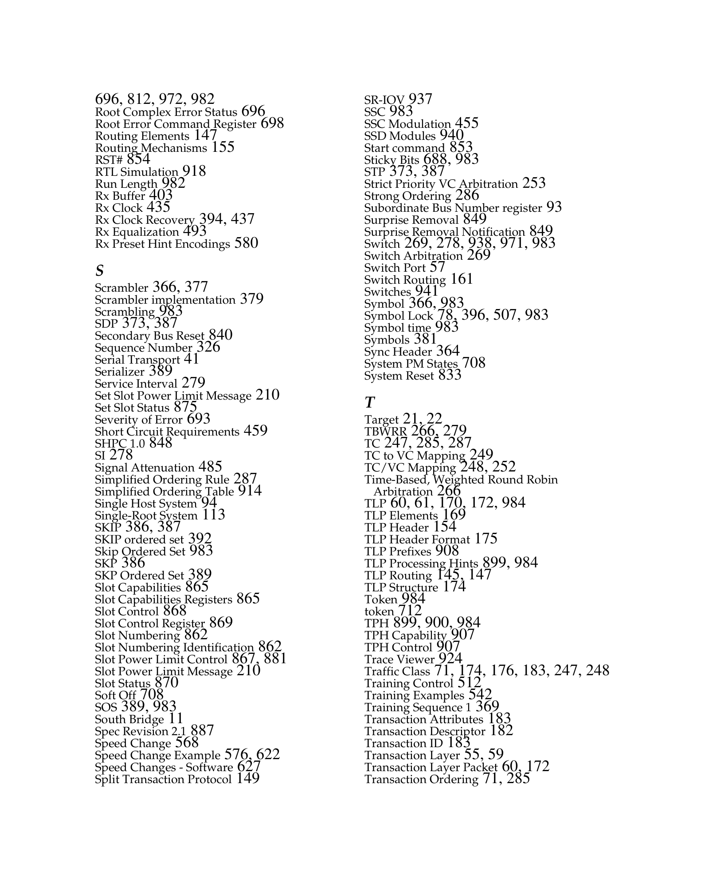
 <em>Figure from glossary (p.1052) / glossary插图 (p.1052)</em>

 <em>Figure from glossary (p.1054) / glossary插图 (p.1054)</em>

---

| English Term | 中文术语 | Description |
|-------------|---------|-------------|
| ACK DLLP | 确认DLLP | Acknowledge — Data Link Layer packet acknowledging successful receipt of TLPs |
| ACS (Access Control Services) | 访问控制服务 | Capability controlling peer-to-peer TLP routing for security and isolation |
| AER (Advanced Error Reporting) | 高级错误报告 | Extended Capability providing detailed error logging and severity classification |
| AF (Advanced Features) | 高级特性 | Capability for conventional PCI advanced features |
| ARI (Alternative Routing-ID Interpretation) | 替代路由ID解释 | Extended Capability enabling 8-bit Function Numbers |
| ASPM (Active State Power Management) | 主动状态电源管理 | Hardware-autonomous mechanism to reduce Link power during idle periods |
| AtomicOps | 原子操作 | Read-modify-write operations (FetchAdd, Swap, CAS) sent as TLPs |
| BAR (Base Address Register) | 基址寄存器 | Register in configuration space requesting memory or I/O space allocation |
| Beacon | 信标 | In-band wakeup mechanism using ordered sets on idle lanes |
| BIST (Built-In Self Test) | 内建自测试 | Optional mechanism for a Function to run self-diagnostics |
| CAM (Configuration Access Mechanism) | 配置访问机制 | PCI-compatible method for accessing configuration space |
| CAS (Compare and Swap) | 比较并交换 | Atomic operation comparing a value and conditionally replacing it |
| CLKREQ# | 时钟请求 | Sideband signal used to request reference clock during L1 PM Substates |
| Cold Reset | 冷复位 | Fundamental Reset occurring when main power is first applied |
| Completer | 完成者 | The PCIe device that responds to a Request TLP with a Completion TLP |
| Completion Timeout | 完成超时 | Error condition when a Requester does not receive a Completion within a defined time |
| Configuration Space | 配置空间 | Per-Function address space (256B PCI-compatible + 3840B extended) for device registers |
| Conventional Reset | 传统复位 | Collective term for Fundamental Reset (Cold/Warm) and Hot Reset |
| Cpl (Completion) | 完成 | TLP type that carries completion status and optional data back to a Requester |
| DLLP (Data Link Layer Packet) | 数据链路层包 | Link-level packet for ACK/NAK, flow control, and power management |
| DPA (Dynamic Power Allocation) | 动态功率分配 | Extended Capability for runtime switching between power allocation states |
| DPC (Downstream Port Containment) | 下游端口隔离 | Extended Capability that disables a Port on uncorrectable errors |
| DRS (Device Readiness Status) | 设备就绪状态 | Message indicating a device Function is ready after reset |
| D-state | D状态 | Device power management state (D0, D1, D2, D3Hot, D3Cold) |
| ECAM (Enhanced Configuration Access Mechanism) | 增强配置访问机制 | Memory-mapped configuration space access supporting extended configuration space |
| ECRC (End-to-End CRC) | 端到端CRC | Optional 32-bit CRC appended to TLPs for end-to-end data integrity |
| Egress Port | 出口端口 | Port that forwards traffic leaving the PCIe fabric |
| Electrical Idle | 电气空闲 | Physical Layer state where differential voltage is near zero |
| Endpoint | 端点 | A PCIe device that is a consumer or requester of PCIe transactions |
| Equalization | 均衡 | Process of tuning transmitter and receiver parameters to optimize signal quality |
| FC (Flow Control) | 流量控制 | Credit-based mechanism preventing receiver buffer overflow |
| FCP (Flow Control Packet) | 流量控制包 | DLLP type that conveys flow control credit updates |
| FCS (Frame Check Sequence) | 帧校验序列 | LCRC (Link CRC) appended to TLPs at the Data Link Layer |
| FLR (Function Level Reset) | Function级复位 | Reset mechanism affecting only a single Function within a device |
| Flit Mode | Flit模式 | Fixed-size packet mode used at 64.0 GT/s and higher data rates |
| FPB (Flattening Portal Bridge) | 扁平化Portal桥 | Capability that simplifies the virtual bridge hierarchy in Switches |
| FRS (Function Readiness Status) | Function就绪状态 | Message sent by a Function to indicate it is ready after being enabled |
| Fundamental Reset | 基本复位 | Hardware reset using PERST# signal or power-on reset |
| Hierarchy | 层次结构 | The tree of PCIe Links rooted at a Root Complex |
| Hot Plug | 热插拔 | Ability to add or remove devices while the system is running |
| Hot Reset | 热复位 | In-band reset propagated via TS1 Ordered Sets |
| IDO (ID-based Ordering) | 基于ID的排序 | Relaxed ordering model allowing reordering between different Requester IDs |
| IDE (Integrity and Data Encryption) | 完整性与数据加密 | Extended Capability providing link-level integrity and optional encryption |
| INTx | INTx中断 | Legacy PCI interrupt mechanism emulated via in-band PCIe Messages |
| IOMMU | I/O内存管理单元 | Hardware unit translating device DMA addresses to host physical addresses |
| Isochronous | 等时 | Traffic class requiring bounded latency and guaranteed bandwidth |
| LCRC (Link CRC) | 链路CRC | 32-bit CRC appended to all TLPs by the Data Link Layer |
| Lane | 通道 | One differential signal pair per direction in a PCIe Link |
| Link | 链路 | The dual-simplex connection between two PCIe Ports, comprising 1-32 Lanes |
| L-state | L状态 | Link power management state (L0, L0s, L1, L2, L3) |
| LTR (Latency Tolerance Reporting) | 延迟容忍报告 | Extended Capability where devices report their maximum tolerable service latency |
| LTSSM (Link Training and Status State Machine) | 链路训练与状态状态机 | Physical Layer state machine controlling Link initialization and management |
| MCTP (Management Component Transport Protocol) | 管理组件传输协议 | Protocol for out-of-band communication over PCIe |
| Message | 消息 | TLP type used for interrupts, errors, power management, and vendor-defined events |
| MFD (Multi-Function Device) | 多功能设备 | A device containing more than one Function |
| MRdLk (Memory Read Lock) | 内存读锁定 | Memory Read Request with Lock bit set for atomic read-modify-write |
| MRL (Manual Retention Latch) | 手动保持闩锁 | Mechanical latch securing add-in cards with sensor reporting state to slot registers |
| MSI (Message Signaled Interrupts) | 消息信号中断 | In-band interrupt mechanism using Memory Write TLPs |
| MSI-X (MSI eXtended) | 扩展MSI | Enhanced MSI supporting up to 2048 vectors with per-vector address/data |
| Multicast | 多播 | Capability enabling a single TLP to be delivered to multiple receivers |
| NAK DLLP | NAK DLLP | Negative Acknowledge — Data Link Layer packet requesting TLP retransmission |
| NPEM (Native PCIe Enclosure Management) | 原生PCIe机箱管理 | Extended Capability for enclosure management functions over PCIe |
| No Snoop | 无窥探 | Attribute indicating that hardware cache coherency is not required |
| NTB (Non-Transparent Bridge) | 非透明桥 | Bridge creating an address domain boundary between two PCIe domains |
| OBFF (Optimized Buffer Flush and Fill) | 优化缓冲刷新与填充 | Mechanism where platform guides device DMA activity for power optimization |
| Ordered Set | 有序集 | Physical Layer packet used for Link training and management |
| PAM4 | 四电平脉冲幅度调制 | Pulse Amplitude Modulation with 4 levels used at 64.0 GT/s |
| PASID (Process Address Space ID) | 进程地址空间ID | TLP Prefix carrying a process address space identifier for shared virtual memory |
| PERST# | PCIe复位 | Sideband fundamental reset signal |
| PF (Physical Function) | 物理Function | A full-featured PCIe Function in an SR-IOV device |
| PM (Power Management) | 电源管理 | Capabilities and protocols for managing device and Link power |
| PME (Power Management Event) | 电源管理事件 | Mechanism for a device to request a power state change |
| PMCSR (Power Management Control/Status Register) | 电源管理控制/状态寄存器 | Register in the PCI Power Management Capability for D-state control |
| PTM (Precision Time Measurement) | 精确时间测量 | Extended Capability for sub-nanosecond clock synchronization |
| PVM (Per-Vector Masking) | 每向量掩码 | Optional MSI capability allowing individual vector masking |
| RCB (Read Completion Boundary) | 读完成边界 | Controls whether read completions may cross 64-byte or 128-byte boundaries |
| RC (Root Complex) | 根复合体 | The root of a PCIe hierarchy, connecting the CPU/memory to the PCIe fabric |
| RCEC (Root Complex Event Collector) | 根复合体事件收集器 | A Function that collects error and PME events from RCiEPs |
| RCiEP (Root Complex Integrated Endpoint) | 根复合体集成端点 | An Endpoint integrated within the Root Complex |
| Relaxed Ordering | 宽松排序 | Attribute allowing TLPs to bypass ordering restrictions for higher performance |
| Requester | 请求者 | The PCIe device that sends a Request TLP |
| Retimer | 重定时器 | A component that retimes PCIe signals to extend channel reach |
| Retry Buffer | 重传缓冲 | Buffer holding transmitted TLPs until acknowledged by the receiver |
| RO (Relaxed Ordering) | 宽松排序 | See Relaxed Ordering |
| Root Port | 根端口 | A Port on the Root Complex that connects to a PCIe Link |
| RP (Root Port) | 根端口 | See Root Port |
| SKP Ordered Set | SKP有序集 | Skip Ordered Set used for clock tolerance compensation |
| Slot | 插槽 | Physical connector for an add-in card |
| Snoop | 窥探 | Hardware cache coherency mechanism |
| SR-IOV (Single Root I/O Virtualization) | 单根I/O虚拟化 | Capability allowing a single device to expose multiple virtual Functions |
| Steering Tag | 导向标签 | TPH field identifying a processing resource in the system cache hierarchy |
| Sticky Register | 粘性寄存器 | Register that retains value across Hot Reset and FLR |
| Switch | 交换机 | A PCIe device that routes traffic between its Ports |
| Tag | 标签 | 5-bit or 8-bit field in a TLP header identifying outstanding transactions |
| TC (Traffic Class) | 流量类别 | 3-bit field in TLP header assigning a traffic class (TC0-TC7) |
| TDISP (TEE Device Interface Security Protocol) | TEE设备接口安全协议 | Protocol for secure communication between a device and a TEE |
| TLP (Transaction Layer Packet) | 事务层包 | Fundamental PCIe transaction unit, created by the Transaction Layer |
| TPH (TLP Processing Hints) | TLP处理提示 | Extension providing steering tags and processing hints for cache optimization |
| TS1/TS2 (Training Sequence 1/2) | 训练序列1/2 | Ordered Sets used during Link training and initialization |
| Unsupported Request (UR) | 不支持的请求 | Completion Status indicating a Request was not supported by the Completer |
| VC (Virtual Channel) | 虚拟通道 | Independent logical flow control and ordering domain within a Link |
| VF (Virtual Function) | 虚拟Function | A lightweight Function in an SR-IOV device, assignable to a VM |
| VPD (Vital Product Data) | 关键产品数据 | Capability providing device-specific information (serial number, part number, etc.) |
| WAKE# | 唤醒信号 | Sideband wakeup signal, open-drain, defined by form factor specifications |
| Warm Reset | 温复位 | Fundamental Reset without removal of main power |
